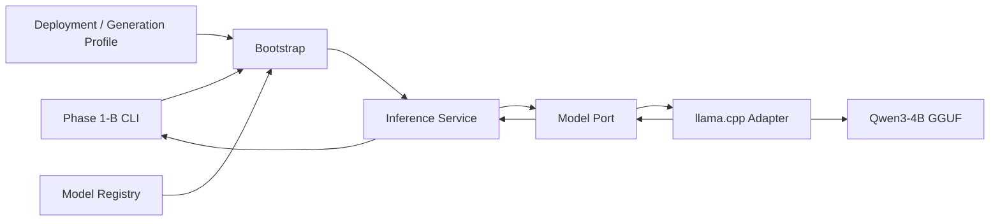
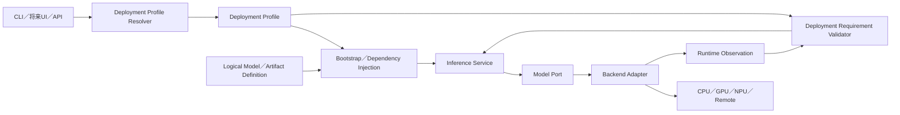
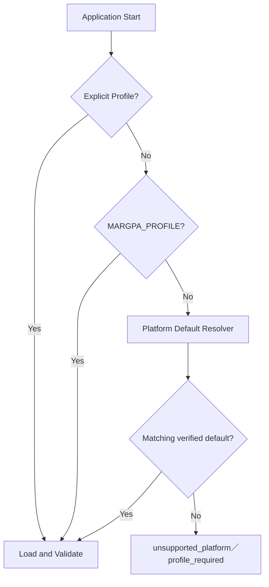
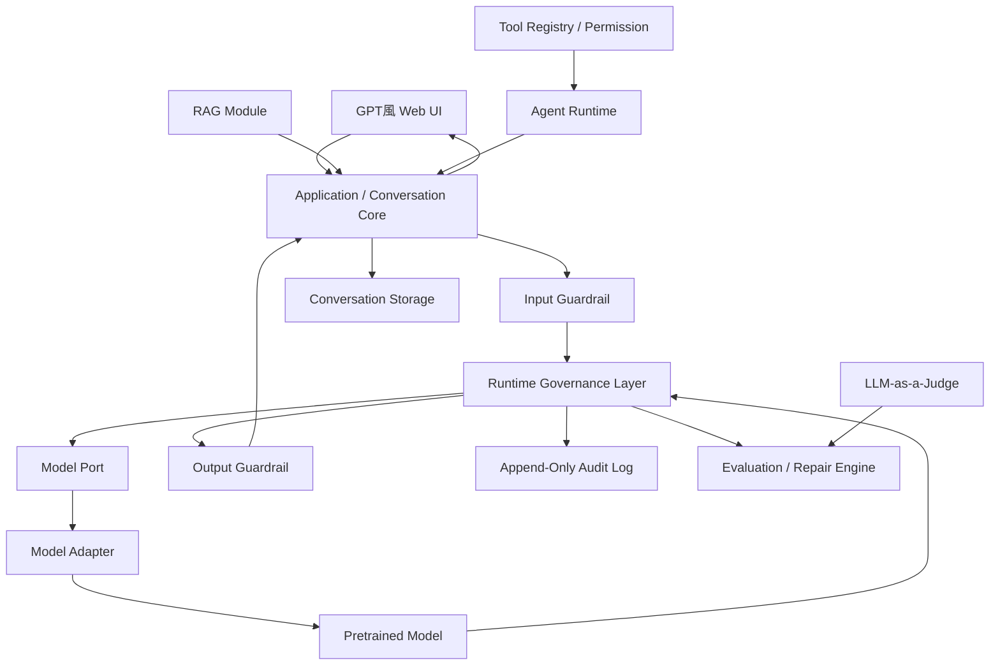

# Phase 1 Architecture Lossless Compilation
```yaml
document_id: phase_1_architecture_lossless_compilation
phase: phase_1
status: frozen
language: ja
created_at: 2026-07-26 15:16:24 JST
frozen_at: 2026-07-26 15:16:24 JST
source_documents: 45
source_manifest: ../../phase_1_ex/operations/source_to_target_documentation_migration_manifest.json
source_hash_algorithm: sha512
supersedes: null
rag_default: true
```

## Compilation Policy

本書はPhase 1中に作成されたSource文書を、省略、要約、意味変更または再解釈せず、Source Path順に再配置したLossless Compilationである。

本文は原文を維持し、Directory Migration後も参照可能にするため、MarkdownのLocal Link Pathだけを機械的に正規化している。原文File、原文SHA-512および移動先はSource Manifestから一意に解決できる。

矛盾、旧判断、未解決事項および後継文書への置換前状態も削除していない。Currentな判断はCurrent Canonical文書とPhase Indexを参照する。

## Source Documents

<!-- SOURCE_BEGIN 1: docs/architecture/configuration_layer_architecture_20260719041847.md -->

### Source 1: `docs/architecture/configuration_layer_architecture_20260719041847.md`

- History Target: `docs/project/phases/phase_1/history/architecture/configuration_layer_architecture_20260719041847.md`
- Source SHA-512: `d70fb4f5914f8c0922535bfe69c8772296b344ef75e2429c3744e16cfae1881bd140d02fea3d6ecf65ef085361c263473a879ffa312b988ed2f54fd15a5f958c`
- Source Size: `13112` bytes

# Configuration Layer Architecture

- 文書ID: `configuration_layer_architecture`
- 状態: `accepted_ready_for_implementation_authorization`
- 作成日時: `2026-07-19 04:18:47 JST`
- 更新日時: `2026-07-19 04:18:47 JST`
- Snapshot: `20260719041847`
- 作成担当: 設計者役担当Task
- 対象: Application Config、Deployment Profile、Model Definition、Typed Composition
- 正本言語: 日本語
- Requirements: [configuration_layer_requirements_20260719041847.md](../history/requirements/configuration_layer_requirements_20260719041847.md)
- Accepted ADR: [adr_0009_application_deployment_configuration_separation_20260719041847.md](../history/adr/adr_0009_application_deployment_configuration_separation_20260719041847.md)
- 関連Architecture: [phase_1c_deployment_platform_acceleration_architecture_20260719013109.md](../history/architecture/phase_1c_deployment_platform_acceleration_architecture_20260719013109.md)
- supersedes: なし（新規Configuration Layer専用Architecture系列）

## 1. Architecture Conclusion

Configurationを「Fileを順番にDeep Mergeする仕組み」ではなく、「責務別の型付き入力をComposition Rootで合成する仕組み」として実装する。

```text
config/application.toml
        │
        ├─ Application Default
        ├─ Selected Model
        ├─ Storage
        ├─ Common Load Default
        ├─ Generation
        └─ Response
        │
        ├──────────────┐
        ↓              ↓
Model Definition   Deployment Profile ← Platform Registry
        │              │
        └──────┬───────┘
               ↓
      Typed Config Composer
               ↓
      EffectivePhase1Config
               ↓
       Phase1Application
```

## 2. Why Current Mixed Profile Is Unsuitable

Current `local_macos_arm64.toml`は次を同時に所有する。

- `selected_model`
- `model_root`
- `load`
- `generation`
- Platform／Compute／Backend／Runtime Requirement

Phase 1-D設計案では、さらに`response.language`を追加する予定だった。

この状態でLinux Profileを追加すると、Platformと無関係な設定が複製される。

```text
local_macos_arm64.toml
  max_new_tokens = 512
  language = ja

local_linux_x86_64_cuda.toml
  max_new_tokens = 512
  language = ja
```

片方だけを変更した場合、同じApplicationでPlatformによって回答Policyが変わるConfiguration Driftが発生する。

## 3. Target Structure

```text
config/
├─ application.toml
├─ models/
│    └─ qwen3_4b_q4_k_m.toml
├─ profiles/
│    └─ local_macos_arm64.toml
└─ platforms/
     └─ platform_registry.toml
```

Directory名`profiles/`は当面維持するが、文書とContract上の意味はDeployment Profileに限定する。

## 4. Domain Objects

### 4.1 `ApplicationConfig`

候補Location：

```text
src/margpa_runtime_llm/bootstrap/config_loader.py
```

概念形：

```python
class ApplicationConfig(BaseModel):
    schema_version: Literal["1"]
    application_key: str
    selected_model: str
    model_root: ModelRootConfig
    load_defaults: CommonLoadDefaults
    generation: GenerationParameters
    response: ResponsePolicyConfig
```

### 4.2 `DeploymentProfile`

Current `Phase1Profile`を責務に合わせて`DeploymentProfile`相当へ整理する。

概念形：

```python
class DeploymentProfile(BaseModel):
    schema_version: Literal["3"]
    profile_key: str
    verification_state: DeploymentVerificationState
    host: HostPlatformDefinition
    compute: ComputeTargetDefinition
    backend_runtime: BackendRuntimeDefinition
    runtime_requirements: DeploymentRequirements
    load_overrides: DeploymentLoadOverrides
```

### 4.3 `DeploymentLoadOverrides`

全Field Optionalの型付きAllowlistとする。

```python
class DeploymentLoadOverrides(ImmutableContract):
    context_size: int | None = None
    batch_size: int | None = None
    micro_batch_size: int | None = None
    threads: int | None = None
    threads_batch: int | None = None
    gpu_layers: int | None = None
    use_mmap: bool | None = None
    use_mlock: bool | None = None
```

次をDeployment Overrideへ含めない。

```text
verbose_backend
verify_artifact_hash
generation
response
selected_model
model_root
```

### 4.4 `EffectivePhase1Config`

既存名称は維持してよい。

```python
class EffectivePhase1Config(ImmutableContract):
    application_key: str
    profile_key: str
    selected_model: str
    ...
    model_root: Path
    load: ModelLoadConfig
    generation: GenerationParameters
    response: ResolvedResponseLanguagePolicy
    profile_resolution_source: ...
    applied_sources: tuple[str, ...]
```

Effective Configは合成結果であり、Source Fileと一対一ではない。

## 5. File Contracts

### 5.1 `config/application.toml`

```toml
schema_version = "1"
application_key = "default"
selected_model = "main.qwen3-4b-q4-k-m"

[model_root]
default = "./models"
environment_variable = "MARGPA_MODEL_ROOT"

[load_defaults]
context_size = 4096
verbose_backend = false
verify_artifact_hash = true

[generation]
max_new_tokens = 512
temperature = 0.7
top_p = 0.8
top_k = 20
min_p = 0.0
presence_penalty = 1.5
frequency_penalty = 0.0
repeat_penalty = 1.0
stop_sequences = []
thinking_mode = "disabled"

[response]
language = "ja"
```

### 5.2 `config/profiles/local_macos_arm64.toml`

```toml
schema_version = "3"
profile_key = "local.macos-arm64"
verification_state = "native_verified"

[host]
operating_system_key = "macos"
architecture_key = "arm64"
execution_environment_key = "native"

[compute]
compute_kind_key = "gpu"
vendor_key = "apple"
acceleration_api_key = "metal"
memory_topology_key = "unified"
device_selector = "auto"
offload_policy_key = "full_or_backend_auto"

[backend_runtime]
backend_key = "llama_cpp"
required_version = "0.3.34"
build_variant_key = "metal"
execution_mode_key = "in_process"

[runtime_requirements]
required_capabilities = ["gpu_offload"]
required_device_kind = "gpu"
required_acceleration_api = "metal"
fallback_policy = "deny"

[load_overrides]
batch_size = 256
micro_batch_size = 256
threads = 6
threads_batch = 6
gpu_layers = -1
use_mmap = true
use_mlock = false
```

## 6. Composition Algorithm

### 6.1 Load Inputs

```text
Application Config
Selected Model Definition
Resolved Deployment Profile
Environment
Explicit Overrides
```

### 6.2 Validate Independently

各Fileを別ContractでValidationする。

```text
Application Config Validation
Model Definition Validation
Deployment Profile Validation
Platform Registry Reference Validation
```

一つの巨大Schemaで全FileをValidationしない。

### 6.3 Compose by Field Owner

```text
selected_model
  Application → Environment → Explicit

model_root
  Application → Environment → Explicit

load
  Built-in → Application Defaults → Deployment Overrides
           → Environment → Explicit

generation
  Built-in → Application Defaults → Environment → Request／CLI

response
  Built-in → Application Defaults → Environment → Request／CLI

deployment
  Resolved Deployment Profile
```

### 6.4 Cross-object Validation

独立Validation後、次を検証する。

- `selected_model`とModel Definition Key一致
- Model BackendとDeployment Backend一致
- Required Version／Build Variant整合
- Effective Context SizeとModel Native Limit
- Deployment Required CapabilityとRuntime Capability
- Detected HostとExpected Host

## 7. No Generic Deep Merge

次の実装を避ける。

```python
effective = deep_merge(
    built_in,
    application_toml,
    model_toml,
    deployment_toml,
    environment,
    cli,
)
```

理由：

- `response.language`をDeploymentが上書きできる
- `required_capabilities`のList規則が不明
- `None`、未指定、削除の意味が曖昧
- Configuration Provenanceを説明できない
- Typoが通りやすい

代わりに、Sectionごとの明示関数を使う。

概念形：

```python
load = resolve_load_config(...)
generation = resolve_generation_config(...)
response = resolve_response_policy(...)
```

## 8. Bootstrap Flow

```text
load_application_config(config/application.toml)
        ↓
resolve_profile_path(Explicit > Environment > Platform Default)
        ↓
load_deployment_profile(resolved path)
        ↓
resolve selected_model(Application > Environment > CLI)
        ↓
load_model_definition(registry path)
        ↓
compose_effective_config(...)
        ↓
validate_preload_deployment(...)
        ↓
Model Load
        ↓
validate_loaded_deployment(...)
```

Platform検出前にApplication Configを読んでも、Application ConfigはPlatform固有値を含まない。

## 9. Existing Override Compatibility

次を維持する。

```text
MARGPA_MODEL_ROOT
MARGPA_MODEL_KEY
MARGPA_CONTEXT_SIZE
MARGPA_MAX_NEW_TOKENS
MARGPA_TEMPERATURE
MARGPA_TOP_P
MARGPA_TOP_K
MARGPA_MIN_P
MARGPA_PRESENCE_PENALTY
MARGPA_FREQUENCY_PENALTY
MARGPA_REPEAT_PENALTY
MARGPA_THINKING_MODE
MARGPA_PROFILE
```

Phase 1-Dで追加：

```text
MARGPA_RESPONSE_LANGUAGE
```

既存CLI Overrideも維持する。

## 10. Config Path

Initial Application Configの正本Path：

```text
config/application.toml
```

Composition RootではPathを引数として注入可能にし、Unit TestでTemporary Configを使用できるようにする。

Phase 1-Dでは`--application-config`またはRemote Config選択UIを必須にしない。

## 11. Observability

`model-info`はEffective Configだけでなく構成要素の識別子を示す。

```json
{
  "effective_config": {
    "application_key": "default",
    "profile_key": "local.macos-arm64",
    "selected_model": "main.qwen3-4b-q4-k-m",
    "load": {},
    "generation": {},
    "response": {},
    "applied_sources": []
  }
}
```

将来Auditでは次のHashを別々に記録する。

- Application Config Hash
- Model Definition Hash
- Deployment Profile Hash
- Platform Registry Hash
- Effective Config Canonical Hash

Phase 1-D実装担当Statusでは、少なくとも変更したTracked ConfigのHashを記録する。

## 12. Model Exchange

Modelを交換する場合、Deployment Profileを編集しない。

```text
Application selected_model変更
  または
MARGPA_MODEL_KEY／--model-key Override
```

選択ModelとDeployment Backend／Capabilityが非互換なら、明示Errorとする。

将来、Cloud用ModelとLocal用Modelを自動選択するRoutingは別機能である。

## 13. Platform Addition

Linux Profile追加時：

```text
追加するもの:
  config/profiles/local_linux_x86_64_cuda.toml
  Platform Registry Entry
  必要なSetup／Test

複製しないもの:
  selected_model
  model_root
  generation
  response.language
```

Hardware Tuningだけを新Profileで指定する。

## 14. Future Preset Hook

Application Configが巨大化した場合、次へ分離可能とする。

```text
config/application.toml
  generation_profile = "balanced"
  response_profile = "default_ja"

config/presets/generation/balanced.toml
config/presets/response/default_ja.toml
```

Phase 1-Dでは実装しない。現在は一つのApplication Configを正本とする。

## 15. Candidate File Changes

```text
config/application.toml                              # New
config/profiles/local_macos_arm64.toml               # Schema 3 Migration
src/margpa_runtime_llm/bootstrap/config_loader.py
src/margpa_runtime_llm/bootstrap/phase1_application.py
src/margpa_runtime_llm/entrypoints/cli/main.py
src/margpa_runtime_llm/modules/inference/contracts/response.py
src/margpa_runtime_llm/orchestration/response_language.py
tests/unit/inference/test_config_and_registry.py
tests/unit/inference/test_response_language.py
tests/unit/inference/test_cli.py
tests/integration/llama_cpp/test_phase1b_runtime.py
```

`config/models/qwen3_4b_q4_k_m.toml`とPlatform Registryは、参照整合Test以外で原則変更不要である。

## 16. Migration Sequence

1. Current Effective ConfigをTest Fixtureで固定する
2. Application Config Contract／Loaderを追加する
3. Deployment Profile ContractをSchema `3`へ追加する
4. Typed Composerを実装する
5. `config/application.toml`を追加する
6. Current Mac ProfileをMigrationする
7. Existing Environment／CLI Overrideを接続する
8. Cross-object Validationを維持する
9. Phase 1-D Response Policyを接続する
10. Static／Default／Native Regressionを実行する

## 17. Acceptance Mapping

| Requirement | Architecture Evidence |
|---|---|
| Common Config | `config/application.toml` |
| Platform分離 | `DeploymentProfile` |
| Hardware Override | `DeploymentLoadOverrides` |
| No Deep Merge | Section Resolver |
| Model独立 | Model Definition別読込 |
| Platform追加 | Generation／Response非複製 |
| Traceability | Application／Profile Key、Hash Hook |
| Regression | Existing Effective Config Fixture＋Native Test |

## 18. Authorization Boundary

本ArchitectureはAccepted Decisionである。

Source／Config／Test変更はPhase 1-D実装許可後に実装担当が行う。

<!-- SOURCE_END 1: docs/architecture/configuration_layer_architecture_20260719041847.md -->

---

<!-- SOURCE_BEGIN 2: docs/architecture/experimental_runtime_ui_status_architecture_20260719112304.md -->

### Source 2: `docs/architecture/experimental_runtime_ui_status_architecture_20260719112304.md`

- History Target: `docs/project/phases/phase_1/history/architecture/experimental_runtime_ui_status_architecture_20260719112304.md`
- Source SHA-512: `d84a592bea5a55e430f75af0c4a0932eb4ad93e97c8159e9821a6a1ea2c153107963317644927286c39a8ab4f127a90c9f1a71b578a3322eeb2303ecc28c6779`
- Source Size: `13208` bytes

# Experimental Runtime・UI・Status Architecture

- 文書ID: `experimental_runtime_ui_status_architecture`
- 状態: `accepted_planning_only`
- 作成日時: `2026-07-19 11:23:04 JST`
- 更新日時: `2026-07-19 11:23:04 JST`
- Snapshot: `20260719112304`
- 作成担当: 設計者役担当Task
- 対象: Phase 2 Component Control／Experiment／Event／Status、Phase 4 UI／Config
- 正本言語: 日本語
- 上位要件: [post_phase_1e_research_platform_requirements_20260719112304.md](../history/requirements/post_phase_1e_research_platform_requirements_20260719112304.md)
- 最新Index: [documentation_index_20260719112304.md](../history/documentation_index_20260719112304.md)
- supersedes: なし（新規Architecture系列）

## 1. Architecture Goal

本Architectureは、次の4つを同じTyped Runtime Modelから駆動する。

1. ComponentとGovernance BindingのON／OFF／Mode
2. 実験Profileと再現可能なRun Record
3. Event-driven Runtime Status／Observability
4. 一般UIと開発・研究設定

UIが独自の設定意味を持たず、CLI、API、Experiment Runner、UIが同一のConfig ContractとEffective Configを使用する。

## 2. High-level Flow

```text
Tracked Defaults              Deployment Profile
config/application.toml       config/profiles/*.toml
          └───────────────┬───────────────┘
                         ↓
                  Typed Config Composer
                         ↑
          Local Runtime Override／Experiment Profile
                         ↓
                   Effective Runtime Config
                         ↓
       Component Registry／Dependency Validator
                         ↓
                   Runtime Execution Plan
                         ↓
        Components + Governance Bindings + Events
                         ↓
      Status Projection／Audit／Experiment Run Record
```

## 3. Component Registry

### 3.1 Component Descriptor

```text
component_id
component_kind
display_name
enabled_by_default
required_for_operations[]
required_capabilities[]
provided_capabilities[]
required_dependencies[]
optional_dependencies[]
conflicts[]
degraded_modes[]
side_effect_level
apply_mode
governance_point_ids[]
```

`component_kind`はUI Groupingに利用できるが、未知Componentを追加できるExtensible Valueとする。

### 3.2 Component Configuration

```toml
[components.main_model]
enabled = true

[components.main_model.governance]
mode = "off"

[components.guard]
enabled = false

[components.guard.governance]
mode = "off"

[components.judge]
enabled = false

[components.judge.governance]
mode = "off"

[components.repair]
enabled = false

[components.agent]
enabled = false

[components.agent.governance]
mode = "off"
```

Boolean `enabled`とGovernance `mode`は別の意味を持つ。Functional Componentを無効化しただけで、そのComponentの統治が別Componentへ横流しない。

### 3.3 Validation Result

```text
valid
valid_with_warnings
degraded
invalid
```

Validation Issueは次を持つ。

```text
issue_id
severity
component_id
binding_id
configuration_path
reason
required_action
apply_mode
```

### 3.4 Invalid Combination例

| 構成 | 判定 |
|---|---|
| Main Model OFFでChat実行 | Invalid／Execution Refusal |
| Agent OFF + Agent Governance Observe／Enforce | Invalid（Pointの対象がない） |
| Judge OFF + JudgeだけをTriggerにするRepair ON | Invalid |
| Judge OFF + Rule Audit Triggerを持つRepair ON | Valid／Configured Degraded可 |
| Tool Permission Resolver OFF + Tool ON | Invalid／Tool Refusal |
| Status Projection OFF | Valid／Lifecycleは維持、表示のみ無効 |
| Audit Sink OFF + High-assurance Experiment | Profile PolicyによりInvalid可 |

## 4. Runtime Apply Mode

Configフィールドごとに次を持つ。

| Apply Mode | 例 |
|---|---|
| `immediate` | Status verbosity、UI表示 |
| `next_request` | Temperature、Max New Tokens、Governance Mode |
| `model_reload` | Context Size、GPU Layers、Model Selection |
| `application_restart` | Provider Plugin、Adapter Plugin、一部Deployment Setting |

UIとCLIは変更の適用時期を事前に表示する。

## 5. Experiment Runtime

### 5.1 Experiment Profile

Experiment Profileは、再利用可能なConfig Overlayと記録Policyを持つ。

```toml
[experiment]
profile = "baseline_empty_governance"
record_inputs = true
record_outputs = true
record_events = true
fixed_seed = 42
```

### 5.2 初期Profile

| Profile | 意味 |
|---|---|
| `baseline_no_governance` | Governance Subsystem自体を使わないBaseline |
| `baseline_empty_governance` | Governance PortはあるがDefinition 0件 |
| `main_governance_observe` | Main Governance判定とLogのみ |
| `main_governance_enforce` | Main Governance介入あり |
| `guard_judge_repair` | 安全・評価・修復構成 |
| `all_implemented_layers` | その時点の全実装Componentを有効化 |

Profile名は実効Configを代替しない。Runごとに必ずEffective Config Snapshot／Hashを保存する。

### 5.3 Run Identity

```text
experiment_id : 論理的な実験単位
run_id        : 1回の実行
request_id    : Inference Request
session_id    : Conversation Session
turn_id       : Conversation Turn
```

これらを同一IDに潰さず、一対多の関係を保持する。

### 5.4 Run Record

```text
identity
  experiment_id, run_id, request_id, session_id, turn_id

artifacts
  model_id, model_file, model_digest, quantization
  definition_refs, definition_digests, adjustment_digest
  compiler_version, plan_digest

configuration
  profile, effective_config, effective_config_digest
  source_map, enabled_components, governance_modes, seed

execution
  input, output, token_counts, latency, stop_reason
  event_refs, tool_calls, retrieval_refs

evaluation
  audit, score, deviations, severity
  judge_result, repair_count, retry_count

terminal
  status, warnings, errors, completed_at
```

## 6. Runtime Event Contract

### 6.1 Event Envelope

```text
event_id
event_schema_version
event_type
timestamp
sequence
experiment_id
run_id
request_id
session_id
turn_id
component_id
point_id
correlation_id
causation_id
payload
severity
```

### 6.2 Event Category

```text
runtime.request_received
runtime.preparing
component.started
component.completed
component.skipped
component.failed
governance.started
governance.observed
governance.enforced
governance.completed
model.loading
model.generating
model.cancelled
guard.completed
judge.completed
repair.started
repair.completed
agent.step
tool.requested
tool.completed
turn.completed
turn.failed
```

Event Typeも拡張可能にする。Unknown EventでProjection全体をCrashさせない。

## 7. Runtime Status Projection

### 7.1 責務

- Event Streamから現在のRuntime StatusをProjectionする。
- CLI、WebSocket／SSE、Web UI、Auditが別々のStatus Logicを持たないようにする。
- Projection FailureはInference Failureに伝播させない。
- 欠落EventやOut-of-orderをWarningとして扱える。

### 7.2 Projection Model

```text
overall_state
current_component
current_point
governance_state
progress_label
attempt
repair_count
warning_count
error_count
started_at
elapsed_ms
last_event_at
```

### 7.3 Lifecycleと表示の分離

Runtime CoreがCancel、Complete、Failureを正しく扱うためのLifecycle Stateは必須である。一方、Status UI、詳細Projection、永続化は任意Componentとする。

### 7.4 DAGD Statusとの区別

- Runtime Status: 全Pipelineの実行状態
- Governance Status: 特定Binding／Point／Definitionの統治状態
- DAGD Status Reporter: DAGD Definitionの意味上のStatus Reporting

三者の名前空間とSchemaを分ける。

## 8. Minimal Audit in Phase 2-C

Phase 2-Cは完全なGovernance Auditの前に、次をJSON／JSONL Append-Onlyで保存する。

- Run／Request Identity
- Effective Config Snapshot／Source／Digest
- Model Identity／Artifact Digest
- Component Switch／Governance Mode
- Runtime Event
- Input／Output
- Token／Latency／Stop／Error
- Canonicalization Version
- SHA-512 Integrity

完全なTurn Audit Schema、Hash Chain／HMAC／Signatureは後続Phaseで強化する。

## 9. Configuration Source Model

### 9.1 Source Layer

```text
Built-in Defaults
  < Tracked Application Config
  < Deployment Profile
  < Experiment Profile
  < Local Runtime Override
  < Environment
  < Explicit Request／CLI
```

ただし、すべてをGeneric Deep Mergeしない。Field Owner、Allowed Override Source、Apply ModeをTyped Schemaで決定する。

### 9.2 Source Map

Effective Fieldごとに次を返す。

```text
field_path
effective_value
source
source_location
apply_mode
validation_state
```

Secret、Credential、個人情報はSource MapにRaw Valueを記録しない。

## 10. Typed Config Service

### 10.1 Public Operations

```text
get_schema()
get_effective_config()
get_source_map()
validate_patch(patch)
preview_patch(patch)
save_local_override(patch, expected_revision)
reset_local_override(scope)
export_profile(scope)
import_profile(document)
```

### 10.2 Preview Result

```text
validity
issues[]
before_digest
after_digest
diff[]
source_changes[]
apply_modes[]
required_actions[]
```

### 10.3 Save

- UIはTracked Defaultを書き換えない。
- Local OverrideはGit Ignore対象とする。
- Temporary File + `fsync`相当 + Atomic Replace等の安全な保存を使う。
- Revision／DigestでLost Updateを防止する。
- Invalid Configを現在のEffective Runtimeへ適用しない。

## 11. UI Information Architecture

### 11.1 Basic UI

```text
Chat
  ├─ New Chat
  ├─ History／Resume
  ├─ Main Model
  ├─ Response Language
  ├─ Input／Generate／Stop／Regenerate
  └─ Simple Runtime Status
```

一般利用者にGovernance Definition Hash、Top-p、Point Binding、Action Resolverを常時表示しない。

### 11.2 開発・研究設定

```text
開発・研究設定
  ├─ Generation
  ├─ Model Runtime
  ├─ Component Structure
  ├─ Governance
  │    ├─ Repository State
  │    ├─ Definition／Package／Digest
  │    ├─ Point／Binding／Mode
  │    └─ Adjustment／Budget
  ├─ Evaluation／Repair
  ├─ Agent／Tool
  ├─ Experiment
  ├─ Status／Audit
  └─ Deployment
```

### 11.3 Governance Editor Boundary

- Immutable Definition SourceをUIから変更しない。
- Package／DefinitionのActive State、Binding、Mode、Adjustment Profileを操作対象にする。
- Unsupported／Invalid／Quarantinedの理由を表示する。
- Definition 0件を「読み込み失敗」と表示しない。

## 12. API Boundary

Phase 4のWeb UIは次のApplication APIのみに依存する。

```text
Conversation Service
Generation Service
Model Catalog Service
Typed Config Service
Component Registry Service
Experiment Service
Runtime Status Service
Audit Query／Export Service
```

UIからFilesystem、Model Adapter、Definition Providerを直接呼ばない。

## 13. Streaming

- Generation Token StreamとRuntime Event Streamは別Channelまたは識別可能なEnvelopeにする。
- Thinking PresentationのRaw／Display分離を崩さない。
- Guard／GovernanceによるStream StopはTerminal EventとStop Reasonを残す。
- Status表示の遅延でToken GenerationをBlockしない。

## 14. Phase Allocation

### Phase 2-A

- Component Registry
- Descriptor／Capability／Dependency
- Governance Mode Contract
- Point／Binding Hook
- Effective Switch Validation

### Phase 2-B

- Experiment Profile
- Experiment／Run Identity
- Effective Config Snapshot／Digest
- Baseline Profiles

### Phase 2-C

- Event Envelope
- Lifecycle Events
- Runtime Status Projection
- Minimal JSON／JSONL Audit
- SHA-512

### Phase 4

- API
- Conversation／History
- Web UI
- Typed Config Service
- Local Override
- 開発・研究設定
- Status／Experiment UI

## 15. Test Strategy

### 15.1 Registry

- Required／Optional Dependency
- Conflict
- Degraded
- Unknown Component
- Custom Component ID
- Apply Mode
- Invalid Combination

### 15.2 Experiment

- Profile名とEffective Configの分離
- Same Input／Seed／Model／ConfigのRecord一致
- Digest変更検出
- Incomplete／Cancelled／Failed Run

### 15.3 Event／Status

- Ordered／Out-of-order／Duplicate Event
- Unknown Event Type
- Projector FailureでInference継続
- Cancel／Repair／Retry
- Multiple Session

### 15.4 Config／UI

- Schema Validation
- Previewと実適用の同値性
- Atomic Save
- Revision Conflict
- Secret Redaction
- Apply Mode表示
- Basic UIからAdvanced Fieldがノイズにならない

## 16. 未決事項

- UI Framework（FastAPI + Vanilla JS／React等）
- Runtime Event Transport（In-process Bus／SSE／WebSocket）
- Local Overrideの正式Path
- Override FileのEncryption必要性
- Experiment RecordとTurn AuditのPhysical Storage分離
- Status Historyの保持期間
- Hot Reload可能なFieldの最終一覧

## 17. Authorization Boundary

本ArchitectureはAcceptedであるが、Phase 2／4のSource、Config、UI、Storageの実装は未解禁である。

<!-- SOURCE_END 2: docs/architecture/experimental_runtime_ui_status_architecture_20260719112304.md -->

---

<!-- SOURCE_BEGIN 3: docs/architecture/future_extensions_20260718174637.md -->

### Source 3: `docs/architecture/future_extensions_20260718174637.md`

- History Target: `docs/project/phases/phase_1/history/architecture/future_extensions_20260718174637.md`
- Source SHA-512: `81e36f00083005769389bbd9d9909bb40b3016240a0b3cd6189bc2c7090d7e9832e47b8b2838dc40b3aef0489a1df482b66a7fc4291d6c4b22f3e288e13864f5`
- Source Size: `4970` bytes

# 将来拡張設計

- 文書ID: `future_extensions`
- 状態: `current`
- 作成日時: `2026-07-18 17:46:37 JST`
- 更新日時: `2026-07-18 17:46:37 JST`
- 対象: RAG、AI Agent、Image、Cloud、複数Model、複数GD
- 正本言語: 日本語
- 上位Architecture: [system_architecture_20260718174637.md](../history/architecture/system_architecture_20260718174637.md)

## 1. 基本方針

将来機能は初期Module BoundaryへHookを用意するが、初期MVPで同時実装しない。

- 基本Chatを先に成立させる
- Runtime GovernanceとAuditを成立させる
- GuardrailとRepairを追加する
- その後にRAGとAgentを追加する
- ModelとGovernance Definitionの交換性を維持する
- 不要なModuleを無効化できるようにする

## 2. RAG

実装Phase：`Phase 5`

候補機能：

- Local Document登録
- File Parsing
- Chunking
- Embedding
- Index
- Retrieval
- Context Injection
- Source表示
- Document更新
- Document削除
- Re-index
- RAG On／Off
- Citation
- Traceability

Audit Logへ記録するもの：

- Query
- Embedding Model
- Retriever
- Index Version
- Document ID
- Chunk ID
- Source
- Score
- Document Hash
- 採用Chunk
- Citation
- Traceability Limit

技術候補：

- LangChainを優先的に検討
- LlamaIndexは初期不採用方向
- Vector Storeは未決
- Embedding Modelは未選定
- Rerankerは将来追加

Model Directory予約：

```text
models/embedding/
models/reranker/
```

## 3. AI Agent

実装Phase：`Phase 6`

候補機能：

- Tool Registry
- Tool Selection
- Multi-Step Execution
- Planning
- Observation
- Replanning
- State
- Memory
- Handoff
- Completion Check
- Human Approval

制御：

- Max Step
- Max Time
- Retry Limit
- Tool Permission
- Input Validation
- Side Effect確認
- Infinite Loop防止
- 全Tool CallのAudit Log
- Cancel
- Resume
- Failure State
- Partial Completion

LangGraphは有力候補だが未確定。

将来的に次と接続する。

- AAGD
- AISGD
- MPGD
- DAAGD

AAGDはAgentの実行過程を統治するが、外部に存在しない実行権限を生成しない。

## 4. Image／Vision

初期版ではImage入力を実装しない。

既存Model：

```text
llava-phi-3-mini-int4.gguf
llava-phi-3-mini-mmproj-f16.gguf
```

将来、Vision Port／Adapterを通して接続する。

Model Directory予約：

```text
models/vision/
```

## 5. Prompt Injection Classifier

初期はRule Basedを中心とする。

将来、専用Classifierを追加できるようにする。

Model Directory予約：

```text
models/classifier/
```

ClassifierはGuardrail Portの一実装とし、Tool Permissionの最終決定権を持たない。

## 6. 複数Model

将来の候補：

- 複数Main Model
- Task別Model
- Remote Model
- Local／Cloud切り替え
- Fallback Model
- Vision Model
- Embedding Model
- Reranker
- Classifier
- 複数Judge

初期版では自動Model Routingを実装しない。

設定でActive Modelを明示的に選択する。

同じModel Artifactを複数Roleで使用する場合、Fileを複製せずRegistryから同じArtifactを参照できるようにする。

## 7. 複数Governance Definition

将来の候補：

- Governance Registry
- 複数Definition
- Lazy Load
- Task別Activation
- Rule別Compile
- Dependency解決
- Conflict解決
- Standard Governance Result
- CDOGDによるOrchestration

初期版ではARGD／DAGDを基盤とし、他GDはHookのみとする。

## 8. Cloud

将来候補：

- GPU Server
- CUDA
- vLLM
- Remote Inference API
- PostgreSQL
- Object Storage
- Cloud Audit
- AWS
- Azure
- Container

Application Coreを共通化し、Deployment ProfileとAdapterを交換する。

## 9. Docker

初期版では使用しない。

将来候補：

- APIのみContainer化
- DBのみContainer化
- RAGのみContainer化
- Cloud Deployment
- CI用Environment

## 10. SQL

初期必須ではない。

SQLite追加を検討する条件：

- 基本機能が完成した
- 履歴検索が必要
- Audit Log UIの検索性能が必要
- RAG Metadata管理が必要
- Event間関係の検索が必要

有力な分担：

```text
JSON / JSONL : Audit原本
SQLite       : Index、検索、管理
PostgreSQL   : 将来Cloud
```

## 11. ContextとMemory

初期段階では長大なContextを最優先しない。

将来候補：

- Conversation Summary
- Retrieval Based Memory
- Long-Term Memory
- User Profile
- Context Budget Manager
- Importance Based Selection
- Context Compression
- External Memory Store

ARGDの無断要約禁止と両立するため、Summaryの作成、承認、参照元、LossをAudit可能にする必要がある。

## 12. 将来機能の導入原則

- Coreの既存境界を壊さない
- 新Moduleを無効化可能にする
- Capabilityを明示する
- Failure時のDegradeを定義する
- Modelへ不要な情報を渡さない
- Audit Eventを追加する
- Security／Permissionを後付けにしない
- User固有Dataを公開Repositoryへ含めない

<!-- SOURCE_END 3: docs/architecture/future_extensions_20260718174637.md -->

---

<!-- SOURCE_BEGIN 4: docs/architecture/governance_control_plane_architecture_20260719112304.md -->

### Source 4: `docs/architecture/governance_control_plane_architecture_20260719112304.md`

- History Target: `docs/project/phases/phase_1/history/architecture/governance_control_plane_architecture_20260719112304.md`
- Source SHA-512: `648f4e7045eddec467118de506b419fe88aa5839782216807f173b973a087aac3bbcf0a4b1f80f0cfcc0e9e7a8b2ae8f3762f7be9abefefde6ef4997f64a53fb`
- Source Size: `11937` bytes

# Governance Control Plane Architecture

- 文書ID: `governance_control_plane_architecture`
- 状態: `accepted_planning_only`
- 作成日時: `2026-07-19 11:23:04 JST`
- 更新日時: `2026-07-19 11:23:04 JST`
- Snapshot: `20260719112304`
- 作成担当: 設計者役担当Task
- 対象: Phase 2～9のGovernance共通基盤
- 正本言語: 日本語
- 上位要件: [post_phase_1e_research_platform_requirements_20260719112304.md](../history/requirements/post_phase_1e_research_platform_requirements_20260719112304.md)
- 関連ADR: [adr_0011_shared_governance_control_plane_and_distributed_points_20260719112304.md](../history/adr/adr_0011_shared_governance_control_plane_and_distributed_points_20260719112304.md)
- 最新Index: [documentation_index_20260719112304.md](../history/documentation_index_20260719112304.md)
- supersedes: なし（新規Architecture系列）

## 1. Decision Summary

Governanceを1つの巨大な直列Layerとして全機能を管理する構成は採用しない。また、Guard、Judge、Agent等の各所に完全なMARGPA一式を複製する構成も採用しない。

採用するのは、次のHybrid Architectureである。

> 共有Governance Control Plane／Kernel + 分散Governance Enforcement Point + 明示Governance Binding

## 2. Logical Architecture

```text
                    ┌── Governance Control Plane ──┐
                    │ Definition Providers／Registry   │
                    │ Descriptor／Adapter／Compiler  │
                    │ Activation／Rule Selection      │
                    │ State Namespace／Evidence       │
                    │ Evaluator Port／Budget          │
                    │ Conflict／Action Resolver       │
                    │ Status Event Publisher            │
                    └────────────────────────────────────┘
                         ↑ Binding／Plan／Result
                         ↓
Input → [Input Point]
      → RAG → [RAG Point]
      → Guard → [Guard Point]
      → Agent → [Agent Point]
      → Tool → [Tool Point]
      → Judge → [Judge Point]
      → Main Model → [Model Point]
      → Output → [Repair Point]
      → Response
```

Pointの実際の配置は常にComponent後とは限らない。`pre`、`post`、`around`、`stream`等のHook KindをDescriptorで表現し、Functional Componentの性質に応じて決める。

## 3. Component Responsibility

### 3.1 Governance Definition Provider

- Filesystem、Empty、将来のRemote／Database等のSource差を隠蔽する。
- Raw Definitionを読み込む前にMetadataとRepository Stateを提供する。
- Definition 0件を正式に表現する。

### 3.2 Governance Registry

- Provider、Package、Definition、Adapter、Compiler、Evaluator、Action Adapter、Point Typeの登録を管理する。
- Startup時はMetadata中心とし、Raw JSON全件を読み込まない。
- Canonical Reference、Version、Digest、Capabilityで解決する。
- GD略称を固定列挙にしない。

### 3.3 Adapter／Normalizer

- SourceごとのSchema差をNormalized Governance IRへ変換する。
- Sourceの意味を無断で補完しない。
- Unsupported、Ambiguous、Invalidを状態とEvidenceで返す。

### 3.4 Governance Compiler

- IR、Binding、Adjustment、Point Context、Runtime CapabilityからCompiled Planを生成する。
- 必要なRuleだけを選択する。
- Hard Constraint、Structural、Soft、Advisoryの区別を保持する。
- Compiler VersionをPlan Identityに含める。

### 3.5 Governance Kernel

- PointからのEvaluate Requestを受ける。
- Mode、Activation、Budget、Capability、Required Flagを検証する。
- Rule Engineと必要なSemantic Evaluatorを呼び分ける。
- Result、Evidence、Recommended Actionを生成する。

### 3.6 Conflict／Action Resolver

- 複数Rule、Definition、PointからのActionを一つの実行決定に整理する。
- System／Host／Tool Permission／Human Approval等の外部Authorityを越えない。
- 未知Actionは実行せずRecommendationとして記録する。
- `refuse > require_approval > stop > repair > regenerate > warn > allow`のような単純固定順位のみで全問題を解決せず、Action Category、Authority、Scope、Severity、Point、Conflict Policyを使う。

### 3.7 Evidence／Audit

- Input Fact、Rule Match、Evaluator Result、Recommended Action、Executed Actionを分離する。
- Source Definition、Package、Adjustment、Plan、Compiler、PointのDigestを関連づける。
- Append-Only EventとしてAudit Sinkへ渡す。

### 3.8 Status Publisher

- `governance_started`、`rule_evaluated`、`semantic_evaluation_requested`、`action_recommended`、`action_executed`、`governance_completed`等のEventを発行する。
- Status ProjectionとGovernance実行を相互依存させない。

## 4. Governance Point Contract

Point Requestの概念形：

```text
GovernancePointRequest
  request_id
  session_id
  turn_id
  point_id
  hook_kind
  component_id
  binding_ref
  input_scope
  shared_context_ref
  local_state_ref
  runtime_capabilities
  deadline
```

Point Resultの概念形：

```text
GovernancePointResult
  execution_state
  repository_state
  selected_definitions
  selected_rules
  observations
  deviations
  severity
  recommended_actions
  executed_actions
  warnings
  errors
  evidence_refs
  state_patch
  cost
```

PointはFunctional ComponentのBusiness Logicを内包しない。例えばGuard PointはGuard Modelの代わりではなく、Guard Componentへの入力と出力を統治する。

## 5. Governance Binding

### 5.1 Bindingの概念形

```toml
[governance.bindings.main_model_pre]
point_id = "main_model.pre"
mode = "observe"
required = false
profile = "foundational"
definition_refs = []
required_capabilities = ["premise_preservation"]
max_semantic_calls = 0
max_repair_attempts = 0
```

### 5.2 Selectionの優先順位

1. Explicit Definition Reference
2. Explicit Package／Profile Selection
3. Capability RequirementによるSelection
4. 設定済みDefault Binding
5. No Binding／Inactive

File名、Directory、略称、Catalog上の推奨はSelectionの根拠にしない。

## 6. Execution Mode

### 6.1 OFF

```text
Rule Selection          : Skip
Plan Load               : Skip
Semantic Model Call     : 0
Intervention            : 0
Minimal Status          : governance_disabled
```

### 6.2 OBSERVE

- 判定、Score、Deviation、Recommendation、Costを記録する。
- Functional ComponentのInput／Outputを変更しない。
- Refuse／Repair／Regenerateを実行しない。
- External Policyによる独立した強制拒否は別責務であり、Observeで無効にはならない。

### 6.3 ENFORCE

- Compile済みRuleと登録済みAction Adapterの範囲内で介入する。
- Definition、Capability、Dependency、Authorityが不足する場合は、Enforcement Successとは扱わない。
- Repair／RegenerationはBudget、Loop Limit、Success Criterionを必須とする。

## 7. State Architecture

### 7.1 Shared Turn／Session Context

次のような複数Pointで共有すべき参照情報を持つ。

- Interpreted Intent
- Fixed Premise
- User Decision
- Active Experiment
- Runtime Capabilities
- External Authority State Reference

### 7.2 Point-local Namespace

```text
governance_state.input.*
governance_state.guard.*
governance_state.agent.*
governance_state.judge.*
governance_state.main_model.*
governance_state.repair.*
```

Custom Point IDを許容するため、上記は例である。

### 7.3 Append-Only Evidence

Stateの現在値と、そこへ至ったEvidence Eventを分離する。ProjectionはEventから再構築可能にする。

## 8. Rule Evaluation Pipeline

```text
Point Request
  ↓ Binding Resolution
  ↓ Repository／Definition State Validation
  ↓ Activation Evaluation
  ↓ Compiled Plan Cache Lookup
  ↓ Deterministic Rule Evaluation
  ↓ Semantic Evaluation（必要な場合のみ）
  ↓ Score／Deviation／Severity
  ↓ Action Recommendation
  ↓ Conflict／Authority Resolution
  ↓ Mode Application
  ↓ Evidence／Event／State Patch
```

## 9. Performance Control

### 9.1 Lazy Strategy

- Registry Startup: Package／Definition Metadataのみ
- Activation時: Raw Definition Load／Validation
- Point実行時: Required RuleのCompileまたはCache Hit
- Semantic Evaluation: Deterministic Ruleで不足する場合のみ

### 9.2 Cache Key

```text
provider_id
package_digest
definition_digest_set
adapter_version_set
adjustment_digest
compiler_id_and_version
point_id
runtime_capability_digest
```

### 9.3 Budget

- Max Rules
- Max Prompt Tokens
- Max Semantic Calls
- Max Evaluator Tokens
- Max Latency
- Max Repair Attempts
- Max Total Turn Calls
- Max Meta-governance Depth

Budget超過は黙って無視せず、`budget_exhausted`とDegraded／Refusal Policyを返す。

## 10. Main Governanceの第一実装

Phase 3の第一実証はMain Modelに最も近いPointとする。

```text
User／Conversation Context
  ↓ Main Model Pre-governance Point
  ↓ Prompt／Context／Generation Configuration
  ↓ Model Adapter
  ↓ Main Model Post-governance Point
  ↓ Optional Repair
```

第一実装では、利用可能な場合にARGD／DAGDを使って汎用基盤を実証する。ただしDefinition 0件Baselineを必ず同時に成立させる。

実行Profile：

| Profile | 内容 |
|---|---|
| `core` | 必須Rule、決定論中心、追加Model Call最小 |
| `standard` | Core + 回答後Audit + 必要時の軽量Repair |
| `full` | 前後Audit、詳細Score、Severity、Repair Loop、Rebind／Enforce／Reinitialize |

Definition内容と実行負荷Profileを分離する。

## 11. Meta-governance Boundary

Governance Pointの出力を別のGovernance Pointが無制限に評価する構造を禁止する。

Phase 3～8：

- Meta-governanceは原則OFF
- 個別に必要なSelf Auditは同一Plan内でBoundedに行う
- Cross-GD Meta Reviewは手動または非同期

Phase 9以降：

- Orchestration Capabilityを持つDefinitionのみ使用
- Max Depth 1をDefault
- 元EvaluationとMeta ReviewのEvidenceを分離
- Meta Reviewが外部Authorityに化けない

## 12. Failure Policy

| Failure | Optional Binding | Required Binding |
|---|---|---|
| Definition Source Missing | Inactive + Warning | Error／Refuse |
| Invalid Optional Definition | Quarantine + Continue | Error if selected |
| Adapter Missing | Quarantine | Error if selected |
| Semantic Evaluator Unavailable | Rule-based Degraded | RefuseまたはConfigured Degraded |
| Status Sink Failure | Continue + Local Warning | Continue（Inferenceを壊さない） |
| Audit Sink Failure | Policyに従う | High-assurance ProfileではRefuse可 |
| Action Adapter Missing | Recommend only | Refuse if action required |

## 13. 実装順序

1. Phase 2-A: Component Registry、Point／Bindingのフック、Mode Contract
2. Phase 2-B: Experiment Profile、Run Identity、Snapshot
3. Phase 2-C: Runtime Event、Status Projection、Minimal Audit
4. Phase 3: Definition Provider、Registry、Adapter、IR、Compiler、Kernel
5. Phase 3: Main Model Pre／Post Point、Basic Repair
6. Phase 5～8: Functional ComponentごとにPoint／Bindingを追加
7. Phase 9: Multiple GD、Conflict、Dynamic Orchestration、Meta Review

## 14. 未決事項

- Normalized Governance IRの詳細Schema
- Action CategoryとConflict Matrix
- Semantic Evaluatorの第一Backend
- Score／Weight／Thresholdの正規化
- Repair Success Criterionの共通部とDomain固有部
- Audit Sink Failure時のProfile別Policy
- Local OverrideによるBinding保存Path
- Runtime中のBinding Reload範囲

## 15. Authorization Boundary

本ArchitectureはAcceptedであるが、Source／Config／Testの実装は未解禁である。

<!-- SOURCE_END 4: docs/architecture/governance_control_plane_architecture_20260719112304.md -->

---

<!-- SOURCE_BEGIN 5: docs/architecture/governance_definition_platform_architecture_20260719112304.md -->

### Source 5: `docs/architecture/governance_definition_platform_architecture_20260719112304.md`

- History Target: `docs/project/phases/phase_1/history/architecture/governance_definition_platform_architecture_20260719112304.md`
- Source SHA-512: `ef9b8d9644d5ba7ce1274844aa66202dfe86be1128e1b0e25151f8137ce8e4f9891c7f7f8de46f498cb8631095a7d4d8abba8a6412fd37f88b311a9bbda9f686`
- Source Size: `13197` bytes

# Generic Governance Definition Platform Architecture

- 文書ID: `governance_definition_platform_architecture`
- 状態: `accepted_planning_only`
- 作成日時: `2026-07-19 11:23:04 JST`
- 更新日時: `2026-07-19 11:23:04 JST`
- Snapshot: `20260719112304`
- 作成担当: 設計者役担当Task
- 対象: Definition 0件を含む汎用GD Plugin基盤
- 正本言語: 日本語
- 上位要件: [generic_governance_definition_platform_requirements_20260719112304.md](../history/requirements/generic_governance_definition_platform_requirements_20260719112304.md)
- 関連Catalog: [governance_definition_catalog_20260719112304.md](../history/governance/governance_definition_catalog_20260719112304.md)
- 関連ADR: [adr_0012_optional_generic_governance_definition_platform_20260719112304.md](../history/adr/adr_0012_optional_generic_governance_definition_platform_20260719112304.md)
- 最新Index: [documentation_index_20260719112304.md](../history/documentation_index_20260719112304.md)
- supersedes: なし（新規Architecture系列）

## 1. Architecture Goal

次の2状態を同一Application Coreで成立させる。

```text
A. definitions = 0
   → GovernanceなしでMain Model Runtimeが完全動作

B. definitions = 1..N
   → 任意Provider／Schema／Adapter／Bindingを通じて統治を追加
```

Coreの変更なしに、将来の未知GD、Custom Point、Custom Orchestratorを追加できることを目標とする。

## 2. Dependency Direction

```text
Entrypoint／UI／CLI
        ↓
Application Orchestration
        ↓
Governance Ports／Contracts
        ↑
Infrastructure Adapters
  ├─ Empty Definition Provider
  ├─ Filesystem Definition Provider
  ├─ Legacy ARGD／DAGD Adapter
  ├─ Standard GD Adapter
  └─ Generic Rule Adapter
```

Domain側はFilesystem Path、JSON Parser、TOML Parser、ARGD／DAGDの個別Schemaに依存しない。

## 3. Core Data Model

### 3.1 Provider Descriptor

```text
provider_id
provider_kind
source_uri
configured
availability
trust_level
capabilities
```

### 3.2 Package Manifest

```text
manifest_schema
package_id
package_version
package_digest
author
license
definitions[]
```

Definition Entry：

```text
namespace
definition_id
definition_version
relative_path
expected_digest
schema_id
adapter_id
required_dependencies[]
optional_dependencies[]
conflicts[]
```

### 3.3 Standard Definition Descriptor

```text
canonical_ref
provider_ref
package_ref
namespace
definition_id
definition_version
source_digest
schema_id
adapter_id
display_name
domain_tags[]
capabilities[]
recommended_points[]
dependencies[]
conflicts[]
author
license
validation_state
activation_metadata
```

`domain_tags`、`capabilities`、`recommended_points`はExtensible Stringである。新しいDomainのたびにCore Enumを修正する設計にしない。

### 3.4 Normalized Governance IR

IRはSource Schemaの差を吸収し、Compilerに対して次を提供する。

- Definition Identity
- Rule Identity
- Rule Class
- Input／Output Scope
- Activation Condition
- Preconditions
- Deterministic Predicate
- Semantic Evaluation Request
- Severity Mapping
- Recommended Action
- Repair Hint
- Evidence Requirement
- Dependency／Conflict Metadata

IRは未知フィールドを無条件に捨てない。Preserved Extension MetadataまたはUnsupported Featureとして表現する。

### 3.5 Compiled Plan

```text
plan_id
plan_digest
compiler_id
compiler_version
point_id
binding_digest
definition_refs[]
definition_digests[]
adjustment_digest
runtime_capability_digest
deterministic_steps[]
semantic_steps[]
action_mappings[]
budgets
warnings[]
```

## 4. Provider Port

Conceptual Interface：

```text
GovernanceDefinitionProvider
  describe() -> ProviderDescriptor
  repository_state() -> GovernanceRepositoryState
  list_packages() -> PackageSummary[]
  list_definitions(package_ref?) -> DefinitionSummary[]
  load_manifest(package_ref) -> RawManifest
  load_definition(definition_ref) -> RawDefinition
```

ProviderがRaw Definitionの意味を解釈しない。解釈はAdapterの責務である。

## 5. Empty Definition Provider

```text
provider_id        : built_in.empty
repository_state   : empty
packages           : []
definitions        : []
external_io        : none
```

### 5.1 必要性

- Definitionなしが異常ではないことを型で表現する。
- Unit Test専用Dummyにしない。
- `baseline_empty_governance`の正式Providerとする。
- FilesystemがないEnvironmentでもGovernance Portを満たす。

## 6. Filesystem Provider

### 6.1 Rootの取得

Root PathはApplication Config／Environment／Explicit OverrideのTyped Precedenceで解決する。Source CodeへAbsolute Pathをハードコードしない。

### 6.2 Layout例

```text
definitions/
  packages/
    margpa_foundational/
      manifest.toml
      argd_v0.3.1_en_dagd_v0.4.4_en.json
    nazuna-research_domain_extensions/
      manifest.toml
      orchestration/
      domain_extensions/
    custom_vendor/
      manifest.toml
      anything.json
```

Directory名は人間の管理用であり、Runtime Semanticsを持たない。

### 6.3 Discovery Order

1. Configured Source Rootの安全性検証
2. Explicit Package Manifestの列挙
3. Manifest SchemaとDigestの検証
4. Definition SummaryのRegistry登録
5. 必要時のRaw Definition Lazy Load
6. 明示設定時のみStandard Envelope Discovery

Directory全体を無制限に再帰し、見つけたJSONをすべてGovernanceとして読む方式は採用しない。

## 7. Adapter Registry

```text
AdapterRegistry
  resolve(schema_id, adapter_id, source_metadata)
  register(adapter_descriptor, factory)
  describe(adapter_id)
```

### 7.1 Legacy ARGD／DAGD Adapter

現行複合JSONを読み、`argd`と`dagd`を個別Descriptor／IRに展開する。

- Source Digestは複合JSON全体で保持する。
- Sub-definition IdentityにTop-level Keyを関連づける。
- 原本Fileは書き換えない。
- 未対応の項目は無断変換せずWarning／Unsupportedとする。

### 7.2 Standard GD Adapter

Projectが公開する将来のStandard Envelope／SchemaをNormalized IRへ変換する。

### 7.3 Generic Declarative Rule Adapter

単純な決定論Rule、Severity、Action Recommendationを持つ安全な汎用Schemaを扱う。任意Expression EvaluationやCode実行を許容しない。

### 7.4 Trusted Custom Adapter

- Python Package等の明示的なInstallを必要とする。
- Adapter ID／Version／Digest／Trust Sourceを記録する。
- Definition JSONの値だけでDynamic Importしない。

## 8. Registry Resolution

Canonical Referenceの概念形：

```text
provider://package_namespace/definition_id@definition_version#source_digest
```

### 8.1 Version

- Same ID + Multiple Versionは共存可能。
- BindingがVersionを固定するか、明示的なVersion Constraintで解決する。
- 単に最新Versionを無条件に選ばない。
- Same Canonical Identity + Different Digestは`duplicate_identity`または`hash_mismatch`とする。

### 8.2 Capability

CapabilityによるSelectionは、次の順で絞り込む。

1. Active Provider
2. Valid Definition State
3. Compatible Adapter／Compiler
4. Required Capability
5. Dependency／Conflict
6. Explicit Priority／Profile

## 9. Repository State Calculation

```text
no configured provider
  → unconfigured

configured providers, valid entries = 0, invalid entries = 0
  → empty

valid entries > 0, invalid entries = 0
  → ready

valid entries > 0, invalid entries > 0
  → degraded

configured source inaccessible or required resolution impossible
  → error
```

Malformed JSONをEmptyと数えない。`invalid_json`のDefinition StateとEvidenceを残す。

## 10. Binding Resolution with Empty State

```text
mode=off
  → Provider/Definitionを実行せずPass-through

mode=observe, required=false, definitions=0
  → inactive_no_definitions + warning + no intervention

mode=observe, required=true, definitions=0
  → binding_resolution_error

mode=enforce, definitions=0
  → required_governance_missing + refuse/error
```

## 11. Source／Adjustment／Binding Separation

### 11.1 Source

- 作者の定義内容
- Immutable
- Version／Digest／Licenseを保持

### 11.2 Adjustment

- Runtimeの運用・実験用Overlay
- Rule Selection、Soft Weight、Threshold、Budget、Action Mapping
- Sourceを変更しない
- Hard Constraintや外部Authorityを弱化しない

### 11.3 Binding

- Definition／CapabilityをPointへ配置
- Mode、Required、Profile、Budgetを指定
- SourceのDomainとPointを同一視しない

## 12. Adjustment Profile Example

```toml
[governance.adjustments.main_standard]
mode = "observe"
include_rules = []
exclude_advisory_rules = []
priority_offset = 0
max_semantic_calls = 1
max_evaluator_tokens = 512
max_latency_ms = 5000
max_repair_attempts = 1
status_verbosity = "standard"
```

`include_rules = []`の意味はAdapter／Profile Schemaで明示する。「すべて」と「0件」の曖昧性を残さない。

## 13. Security Architecture

### 13.1 Data Limits

- Max File Bytes
- Max JSON Depth
- Max Object Keys
- Max Array Length
- Max Definitions per Package
- Max Rules per Definition
- Max Text／Prompt Bytes
- Max Compiled Steps

### 13.2 Path Safety

- ManifestからのRelative PathをCanonicalizeする。
- Configured Package Root外へ出るPathを拒否する。
- Symbolic LinkのResolved PathもRoot境界で検証する。
- Absolute Path、`..`、URLをDefaultで拒否する。

### 13.3 Action Safety

```text
JSON recommendation
  → Normalized Action ID
  → Registered Action Adapter?
  → Runtime Capability?
  → Authority／Permission?
  → Mode=enforce?
  → Execute or Record-only
```

## 14. Caching

### 14.1 Metadata Cache

Provider／Package／Definition Summaryに限定し、Startupを軽量化する。

### 14.2 Raw Source Cache

Source DigestをKeyに不変ObjectとしてCacheできる。

### 14.3 IR／Plan Cache

- IR: Source Digest + Adapter Version
- Plan: IR Digest Set + Adjustment Digest + Compiler Version + Point + Capability Digest

Cache Hitであっても、Binding Mode、Runtime Deadline、Required Flagは毎回検証する。

## 15. ARGD／DAGD Package Example

Manifest概念形：

```toml
manifest_schema = 1
package_id = "nazuna-research.margpa-foundational"
package_version = "1"

[[definitions]]
namespace = "nazuna-research.margpa"
definition_id = "argd"
definition_version = "0.3.1"
path = "argd_v0.3.1_en_dagd_v0.4.4_en.json"
schema_id = "legacy.margpa.combined"
adapter_id = "legacy_margpa_combined"

[[definitions]]
namespace = "nazuna-research.margpa"
definition_id = "dagd"
definition_version = "0.4.4"
path = "argd_v0.3.1_en_dagd_v0.4.4_en.json"
schema_id = "legacy.margpa.combined"
adapter_id = "legacy_margpa_combined"
```

2 Entryが同一Source Path／Digestを参照することを許容する。

## 16. Custom Definition Acceptance Flow

```text
1. Empty ProviderでRuntime起動
2. Custom Package SourceをConfigに追加
3. Manifest／EnvelopeをDiscovery
4. Schema ID／Adapter IDを解決
5. DescriptorとIRを生成
6. Explicit BindingをCustom Pointへ設定
7. ObserveでEvaluationとEvidenceを確認
8. Action Adapter／Authorityを検証後にEnforce
9. Packageを外しEmpty Baselineへ復帰
```

Step 2～8のためにRuntime Coreを変更しないことが受入基準である。Custom Adapterが必要な場合は、Trusted Adapter Pluginの追加は許容するがCore固有分岐は追加しない。

## 17. Test Architecture

### 17.1 Contract Test

すべてのProvider／Adapter／Compilerに共通Contract Testを適用する。

### 17.2 Fixture Category

```text
empty/
invalid_json/
unknown_schema/
adapter_missing/
duplicate/
dependency_conflict/
legacy_margpa_combined/
standard_custom/
custom_orchestrator/
```

### 17.3 Non-regression

- Definition Sourceの有無でModel AdapterのContractが変わらない。
- Governance OFFでPrompt／Token／Model Callが増えない。
- Invalid Optional PackageでValid Packageが不要に無効にならない。
- Required Binding不足でEnforce Successを記録しない。
- Filename変更だけでSemanticsが変わらない。

## 18. 実装モジュール候補

具体Directoryは実装時に現行Source Treeと整合させるが、責務は次のように分ける。

```text
modules/governance/
  contracts/
  domain/
  application/
  ports/
  public.py

adapters/governance/
  providers/
  definition_adapters/
  compilers/
  evaluators/
  actions/
```

Framework固有のFile／JSON／TOML処理はAdapter側に閉じ込める。

## 19. 未決事項

- ManifestにTOMLとJSONのどちらを第一採用するか
- Standard GD EnvelopeのSchema Version 1
- Canonical Referenceの厳密表記
- Signature／Trust StoreのPhase
- Remote Providerの信頼境界
- Adapter PluginのInstall／Allowlist方式
- Definition PackageのLicense表示／再配布Policy
- Custom Rule Expressionを導入するか（初期は導入しない）

## 20. Authorization Boundary

本ArchitectureはAcceptedであるが、Directory、Source、Config、Schema、Test、ARGD／DAGD Snapshotの作成は未解禁である。

<!-- SOURCE_END 5: docs/architecture/governance_definition_platform_architecture_20260719112304.md -->

---

<!-- SOURCE_BEGIN 6: docs/architecture/implementation_roadmap_20260718174637.md -->

### Source 6: `docs/architecture/implementation_roadmap_20260718174637.md`

- History Target: `docs/project/phases/phase_1/history/architecture/implementation_roadmap_20260718174637.md`
- Source SHA-512: `003daf9d2bac922dd174a795aca8dedc69b818762bb61100f42c1e28047bb4ea7ccffb42207bd00deefa94507bb6ef4f7a9e2d8a8d61f916b81e22d4df488ab1`
- Source Size: `4823` bytes

# 実装ロードマップと現在地点

- 文書ID: `implementation_roadmap`
- 状態: `current`
- 作成日時: `2026-07-18 17:46:37 JST`
- 更新日時: `2026-07-18 17:46:37 JST`
- 対象: Phase、順序、現在地点、未決事項
- 正本言語: 日本語
- 上位要件: [project_requirements_20260718174637.md](../history/requirements/project_requirements_20260718174637.md)

## 1. 現在地点

現在は`Phase 0`。

```text
要件定義
技術選定
Architecture設計
Directory構成設計
```

Model選定とModel物理配置の基本判断は完了した。

Source Code、Config、Dependency、Gitは未着手。

## 2. Phase 0：要件定義・技術選定

対象：

- 要件定義
- Model選定
- Inference Backend選定
- UI選定
- Storage選定
- Governance実行方式
- Project Directory構成
- Docs設計
- MVP境界
- ADR

完了済み：

- Project目的の統合
- M2 Pro・16GB制約の確認
- Main Model選定
- Guard Model選定
- Judge候補選定
- Quantization選定
- External Model Root決定
- Model Directory作成はユーザー側で完了
- POSIX Symbolic Link作成
- Docs分類Directory作成はユーザー側で完了
- 初期基準Docs作成

未完了：

- Project全体Directory構成
- Python Package構成
- Local Backend最終決定
- UI最終決定
- Storage Schema
- Config方式
- Dependency管理
- Test方針
- Governance Compiler詳細
- MVP Acceptance Criteria

## 3. Phase 1：最小推論

- Model Load
- Model Unload
- 一問一答
- Chat Template
- Streaming
- Generation Config
- Stop
- Error Handling
- Model Adapter
- Model Registry
- Model Capability
- Token Count
- Latency

Acceptance候補：

- Qwen3-4B GGUFをLocalでLoadできる
- User Inputに対してStreaming回答できる
- Stopできる
- Generation Configを変更できる
- Model Metadataを取得できる
- Model固有処理がAdapter内に閉じている

## 4. Phase 2：対話Application

- FastAPI等
- Web UI
- Multi-Turn
- New Chat
- History
- Resume
- Stop
- Regenerate
- Session管理
- Error表示

## 5. Phase 3：AuditとCore Governance

- Audit Log Directory
- Turn Log
- JSON／JSONL
- SHA-512
- Definition Loader
- Definition Validator
- ARGD／DAGD Snapshot
- Governance Compiler初期版
- Core Governance Profile
- High-Level Explanation
- Governance State
- Status表示

## 6. Phase 4：Evaluation、Repair、Guardrail

- Evaluation
- Deviation
- Severity
- Repair
- Re-fix
- Rebind
- Status Reporting
- User Rating
- Audit Log UI
- Guardrail
- Qwen3Guard
- Rule Based Prompt Injection対策
- Output Guard

## 7. Phase 5：RAG

- Document登録
- Chunking
- Embedding
- Retrieval
- Context Injection
- Source
- Citation
- RAG Audit
- RAG On／Off

## 8. Phase 6：AI Agent

- Tool Registry
- Multi-Step Execution
- Planning
- Observation
- Tool Permission
- Human Approval
- Side Effect確認
- Agent Audit
- Loop制限

## 9. Phase 7：拡張

- SQLite
- Lightweight ARGD／DAGD
- 複数Model
- 複数GD
- Image
- Docker
- AWS／Azure
- vLLM
- Routing
- LLM-as-a-Judge本格統合
- CDOGD
- 他Domain GD

## 10. 現在の禁止事項

ユーザーから明示的な実装解禁があるまで、次を行わない。

- 実装
- Source／Config作成
- Dependency Install
- 追加Model Download
- Git初期化
- 外部Service変更

このDocs作成許可は、Source実装の解禁を意味しない。

## 11. 次の設計議題

次にProject全体のDirectory構成を設計する。

検討対象：

- `src/`のPackage名
- Domain
- Application
- Ports
- Adapters
- Model Runtime
- Governance Runtime
- Guardrail
- Audit
- Storage
- API
- UI
- RAG
- Agent
- Config
- Tests
- Local Runtime Data
- Git管理対象／非対象
- Cloud移行境界

概念候補：

```text
margpa-runtime-llm/
├─ docs/
├─ models -> External Model Root
├─ src/
├─ tests/
├─ config/
├─ data/
├─ logs/
└─ scripts/
```

この構成はまだ確定していない。

## 12. 主要未決事項一覧

### Model／Backend

- llama.cppとllama-cpp-pythonの選択
- Thinking Mode
- Initial Context Size
- Default Generation Config
- Load／Unload戦略
- Guard Prompt／Parser
- Judge日本語性能

### Governance

- Compiler仕様
- Rule表現
- State Machine
- Score／Weight
- Action Resolver
- Repair Loop
- Context Overflow Policy

### Audit

- JSON Schema
- Canonicalization
- ID体系
- Timestamp形式
- Hash Chain導入時期
- PII／Secret保存方針

### UI／Application

- StreamlitまたはFastAPI系
- Frontend分離
- Streaming方式
- Cancel方式
- Conversation Data Model

### Security

- Fail Open／Fail Closed
- Prompt Injection Rule
- Secret検出
- User Override
- Tool Approval
- Policy優先順位

### Public Release

- Repository License
- Public／Private
- ARGD／DAGD同梱方式
- Sample Log匿名化
- Third-Party Notice

<!-- SOURCE_END 6: docs/architecture/implementation_roadmap_20260718174637.md -->

---

<!-- SOURCE_BEGIN 7: docs/architecture/implementation_roadmap_20260718193435.md -->

### Source 7: `docs/architecture/implementation_roadmap_20260718193435.md`

- History Target: `docs/project/phases/phase_1/history/architecture/implementation_roadmap_20260718193435.md`
- Source SHA-512: `ffbfc8506ab17cdafeaa91dc5e10f3f1eed05c0b53d42e62c0757c5aec325b4eefd7b623b28adf95292a4ae5fca6a179b4c195b94a136a405736a8826749df18`
- Source Size: `4913` bytes

# 実装ロードマップと現在地点

- 文書ID: `implementation_roadmap`
- 状態: `current`
- 作成日時: `2026-07-18 19:34:35 JST`
- 更新日時: `2026-07-18 19:34:35 JST`
- 対象: Phase、順序、現在地点、未決事項
- 正本言語: 日本語
- supersedes: `implementation_roadmap_20260718174637.md`
- 上位要件: [project_requirements_20260718193435.md](../history/requirements/project_requirements_20260718193435.md)

## 1. 現在地点

現在は`Phase 0`。

```text
要件定義
技術選定
Architecture設計
Directory構成設計
```

Model選定、Model物理配置、Project Directory構成の基本判断は完了した。

Phase 1最小Directoryだけ作成済み。Source Code、Config、Dependency、Gitは未着手。

## 2. Phase 0：要件定義・技術選定

対象：

- 要件定義
- Model選定
- Inference Backend選定
- UI選定
- Storage選定
- Governance実行方式
- Project Directory構成
- Docs設計
- MVP境界
- ADR

完了済み：

- Project目的の統合
- M2 Pro・16GB制約の確認
- Main Model選定
- Guard Model選定
- Judge候補選定
- Quantization選定
- External Model Root決定
- Model Directory作成はユーザー側で完了
- POSIX Symbolic Link作成
- Docs分類Directory作成はユーザー側で完了
- 初期基準Docs作成
- Project Directory構成決定
- Python Package名`margpa_runtime_llm`決定
- Phase 1最小Directory作成

未完了：

- Local Backend最終決定
- UI最終決定
- Storage Schema
- Config方式
- Dependency管理
- Test方針
- Governance Compiler詳細
- MVP Acceptance Criteria

## 3. Phase 1：最小推論

- Model Load
- Model Unload
- 一問一答
- Chat Template
- Streaming
- Generation Config
- Stop
- Error Handling
- Model Adapter
- Model Registry
- Model Capability
- Token Count
- Latency

Acceptance候補：

- Qwen3-4B GGUFをLocalでLoadできる
- User Inputに対してStreaming回答できる
- Stopできる
- Generation Configを変更できる
- Model Metadataを取得できる
- Model固有処理がAdapter内に閉じている

## 4. Phase 2：対話Application

- FastAPI等
- Web UI
- Multi-Turn
- New Chat
- History
- Resume
- Stop
- Regenerate
- Session管理
- Error表示

## 5. Phase 3：AuditとCore Governance

- Audit Log Directory
- Turn Log
- JSON／JSONL
- SHA-512
- Definition Loader
- Definition Validator
- ARGD／DAGD Snapshot
- Governance Compiler初期版
- Core Governance Profile
- High-Level Explanation
- Governance State
- Status表示

## 6. Phase 4：Evaluation、Repair、Guardrail

- Evaluation
- Deviation
- Severity
- Repair
- Re-fix
- Rebind
- Status Reporting
- User Rating
- Audit Log UI
- Guardrail
- Qwen3Guard
- Rule Based Prompt Injection対策
- Output Guard

## 7. Phase 5：RAG

- Document登録
- Chunking
- Embedding
- Retrieval
- Context Injection
- Source
- Citation
- RAG Audit
- RAG On／Off

## 8. Phase 6：AI Agent

- Tool Registry
- Multi-Step Execution
- Planning
- Observation
- Tool Permission
- Human Approval
- Side Effect確認
- Agent Audit
- Loop制限

## 9. Phase 7：拡張

- SQLite
- Lightweight ARGD／DAGD
- 複数Model
- 複数GD
- Image
- Docker
- AWS／Azure
- vLLM
- Routing
- LLM-as-a-Judge本格統合
- CDOGD
- 他Domain GD

## 10. 現在の禁止事項

ユーザーから明示的な実装解禁があるまで、次を行わない。

- 実装
- Source／Config作成
- Dependency Install
- 追加Model Download
- Git初期化
- 外部Service変更

このDocs作成許可は、Source実装の解禁を意味しない。

## 11. 次の設計議題

Project全体のDirectory構成は決定済み。

詳細：

- [project_directory_structure_20260718192110.md](../history/architecture/project_directory_structure_20260718192110.md)

次に、Phase 1実装前の技術選定とContractを設計する。

- Local Backend最終決定
- llama.cppとllama-cpp-pythonの役割
- Python Version
- Dependency管理方式
- `pyproject.toml`方針
- Config形式
- Model Registry Schema
- Phase 1 Acceptance Criteria
- Test Strategy詳細

## 12. 主要未決事項一覧

### Model／Backend

- llama.cppとllama-cpp-pythonの選択
- Thinking Mode
- Initial Context Size
- Default Generation Config
- Load／Unload戦略
- Guard Prompt／Parser
- Judge日本語性能

### Governance

- Compiler仕様
- Rule表現
- State Machine
- Score／Weight
- Action Resolver
- Repair Loop
- Context Overflow Policy

### Audit

- JSON Schema
- Canonicalization
- ID体系
- Timestamp形式
- Hash Chain導入時期
- PII／Secret保存方針

### UI／Application

- StreamlitまたはFastAPI系
- Frontend分離
- Streaming方式
- Cancel方式
- Conversation Data Model

### Security

- Fail Open／Fail Closed
- Prompt Injection Rule
- Secret検出
- User Override
- Tool Approval
- Policy優先順位

### Public Release

- Repository License
- Public／Private
- ARGD／DAGD同梱方式
- Sample Log匿名化
- Third-Party Notice

<!-- SOURCE_END 7: docs/architecture/implementation_roadmap_20260718193435.md -->

---

<!-- SOURCE_BEGIN 8: docs/architecture/implementation_roadmap_20260719013109.md -->

### Source 8: `docs/architecture/implementation_roadmap_20260719013109.md`

- History Target: `docs/project/phases/phase_1/history/architecture/implementation_roadmap_20260719013109.md`
- Source SHA-512: `f21c18847fb06f9643c0d52326e0d884ef40209d758c35d5b69963c20844e7eaf5b2262ee124eb5970d6aa746972cb77464182e47e8f25cffcf6648ef0e6a0b0`
- Source Size: `5479` bytes

# 実装ロードマップと現在地点

- 文書ID: `implementation_roadmap`
- 状態: `current`
- 作成日時: `2026-07-19 01:31:09 JST`
- 更新日時: `2026-07-19 01:31:09 JST`
- Snapshot: `20260719013109`
- 対象: Phase、順序、現在地点、未決事項
- 正本言語: 日本語
- supersedes: `implementation_roadmap_20260718193435.md`
- 上位要件: [project_requirements_20260718193435.md](../history/requirements/project_requirements_20260718193435.md)

## 1. 現在地点

```text
Phase 0                      : Complete for Phase 1 Scope
Phase 1-A Environment        : Complete
Phase 1-B Model Runtime      : Complete／Accepted
Phase 1 Mac User Verification: Pass
Phase 1-C Platform Hook      : Approved Design／Awaiting Implementation Authorization
```

Current Macで、Qwen3-4B GGUF、llama-cpp-python、Metal、Model Port、Streaming、Cancel、Thinking Control、SHA-512検証およびCLI一問一答が成立している。

## 2. Phase 1-C：Deployment／Platform／Acceleration Abstraction Hook

目的：

Current Mac固定条件をApplication Coreから分離し、将来のWindows、Linux、Home Server、Cloud、CPU、GPU、NPUおよびRemote Runtimeを追加可能にする。

実装候補：

- Deployment Requirement Contract
- Host／Compute／Backend Runtime表現
- Model CapabilityとDeployment Requirementの分離
- `gpu_offload`のmacOS Profileへの移動
- Profile Resolver Hook
- Runtime Observation Hook
- Mac Profile Migration
- Unit／Contract Test
- Current Mac Regression

実装しない：

- Windows／Linux Native Profile
- PowerShell Setup
- CUDA／ROCm／Vulkan等のNative Build
- Docker
- Remote Adapter
- 全Platform検証

詳細：

- [phase_1c_deployment_platform_acceleration_requirements_20260719013109.md](../history/requirements/phase_1c_deployment_platform_acceleration_requirements_20260719013109.md)
- [phase_1c_deployment_platform_acceleration_architecture_20260719013109.md](../history/architecture/phase_1c_deployment_platform_acceleration_architecture_20260719013109.md)
- [adr_0007_deployment_platform_acceleration_abstraction_20260719013109.md](../history/adr/adr_0007_deployment_platform_acceleration_abstraction_20260719013109.md)

## 3. Phase 1-D候補：Response／Presentation Policy

Phase番号は未確定である。

候補：

- Default Response Language `ja／en／auto`
- User／Session／Profile／CLIのLanguage優先順位
- Thinking実行とThinking表示の分離
- Thinking表示／非表示
- Thinking Display Label
- Model Protocol Parser
- Streaming Thinking Filter
- Raw Thinking非保存
- High-Level Explanationへの接続
- Thinking／Non-Thinking Sampling Profile

Phase 1-Cへ混在させない。

設計整理：

- [response_language_and_thinking_output_policy_20260719013109.md](../history/architecture/response_language_and_thinking_output_policy_20260719013109.md)

## 4. Phase 2：対話Application

- FastAPI等
- Web UI
- Multi-Turn
- New Chat
- History
- Resume
- Stop
- Regenerate
- Session管理
- Error表示
- Streaming CancelのHTTP／UI接続

Response／Presentation PolicyをPhase 2前に実装するか、Phase 2内へ含めるかはPhase 1-C後に決定する。

## 5. Phase 3：AuditとCore Governance

- Audit Log Directory
- Turn Log
- JSON／JSONL
- SHA-512
- Definition Loader
- Definition Validator
- ARGD／DAGD Snapshot
- Governance Compiler初期版
- Core Governance Profile
- High-Level Explanation
- Governance State
- Status表示
- Required／Detected／Executed Runtime State記録

## 6. Phase 4：Evaluation、Repair、Guardrail

- Evaluation
- Deviation
- Severity
- Repair
- Re-fix
- Rebind
- Status Reporting
- User Rating
- Audit Log UI
- Guardrail
- Qwen3Guard
- Rule Based Prompt Injection対策
- Output Guard

今回観測したSoftware Scopeから物理Hardware Scopeへの逸脱は、Governance評価Sample候補とする。

## 7. Phase 5：RAG

- Document登録
- Chunking
- Embedding
- Retrieval
- Context Injection
- Source
- Citation
- RAG Audit
- RAG On／Off

## 8. Phase 6：AI Agent

- Tool Registry
- Multi-Step Execution
- Planning
- Observation
- Tool Permission
- Human Approval
- Side Effect確認
- Agent Audit
- Loop制限

## 9. Phase 7：拡張

- SQLite
- Lightweight ARGD／DAGD
- 複数Model
- 複数GD
- Image
- Docker
- Home Server Profile
- Windows／Linux Profile
- CUDA／ROCm／Vulkan／SYCL／MLX
- AWS／Azure／Google Cloud
- vLLM
- Remote Adapter
- Routing
- LLM-as-a-Judge本格統合
- CDOGD
- 他Domain GD

## 10. Platform追加の原則

実Hardware、OS、DriverおよびBackendが決まった時点で必要なProfileだけ追加する。

```text
全Platformを今実装しない
全Platformを後から表現できるContractを今作る
未検証PlatformをVerifiedと表示しない
```

## 11. Current Known Issues／Deferred Items

- 同一ModelのIdempotent Load判定はModel Key中心
- Native Packageを通常同期でも再BuildするSetup Recipeは重い
- Response Language Default未実装
- Thinking表示／非表示未実装
- Thinking時もNon-Thinking Sampling Defaultを使用する
- Raw Output／Display Output未分離
- Runtime Device判定がMetal／CPU中心
- Logical Model／Artifact Variant全面分離は未実装
- Windows／Linux Native Verification未実施
- `.DS_Store`再生成はRepository Hygiene課題

## 12. Authorization Boundary

Phase 1-C設計とADRはAcceptedである。

Source、Config、Test、Script、DependencyまたはRoot Fileの実装変更は、ユーザーの明示的な実装許可後に行う。


<!-- SOURCE_END 8: docs/architecture/implementation_roadmap_20260719013109.md -->

---

<!-- SOURCE_BEGIN 9: docs/architecture/implementation_roadmap_20260719040237.md -->

### Source 9: `docs/architecture/implementation_roadmap_20260719040237.md`

- History Target: `docs/project/phases/phase_1/history/architecture/implementation_roadmap_20260719040237.md`
- Source SHA-512: `29de9cb1516c7ade9cbfc4a7aeb9c6fac3d18ebdb7f482900de8a9b7d3b2d29068c3726b8f496baceccf5ae4e1a50865e8411361da1788bfdc9935ca45cd0217`
- Source Size: `6301` bytes

# MARGPA Runtime LLM 実装Roadmap

- 文書ID: `implementation_roadmap`
- 状態: `current`
- 作成日時: `2026-07-19 04:02:37 JST`
- 更新日時: `2026-07-19 04:02:37 JST`
- Snapshot: `20260719040237`
- 作成担当: 設計者役担当Task
- 対象: Phase構成、現在地点、次段階、Deferred Scope
- 正本言語: 日本語
- 最新Index: [documentation_index_20260719040237.md](../history/documentation_index_20260719040237.md)
- supersedes: `implementation_roadmap_20260719013109.md`

## 1. Current Position

```text
Phase 1-A Environment                         : Complete／Accepted
Phase 1-B Model Runtime                       : Complete／Accepted
Phase 1-C Deployment／Platform／Acceleration  : Complete／Accepted
Phase 1-D Response Language Policy            : Designed／Accepted／Implementation Not Authorized
Phase 1-E Thinking Presentation Policy        : Planned／Not Designed／Not Authorized
Phase 2 Conversation Application              : Not Started
```

Current Native Verification：

```text
macOS／Apple Silicon arm64／Metal
Qwen3-4B-GGUF Q4_K_M
llama-cpp-python 0.3.34
Python 3.13.14
```

## 2. Phase 1の最終構成

Phase 1は`1-A`から`1-E`までとする。

### Phase 1-A：Environment

状態：Complete／Accepted

- `.venv`
- Python 3.13.14
- uv Lock／Setup Recipe
- llama-cpp-python Metal Build
- Environment Verification
- Native Metal Smoke

### Phase 1-B：Model Runtime

状態：Complete／Accepted

- Model Port
- llama.cpp Adapter
- Model Registry
- Profile Config
- Load／Unload
- Generate／Streaming／Cancel
- Generation Config
- Thinking実行On／Off
- CLI一問一答
- SHA-512 Model Artifact Verification

### Phase 1-C：Deployment／Platform／Acceleration

状態：Complete／Accepted

- Deployment Contract
- Platform Registry
- Profile Resolver
- Platform Normalization
- Model Capability／Deployment Requirement分離
- Pre-load／Post-load Validation
- Runtime Observation
- Current Mac／Metal Regression
- 将来Windows／Linux／Home Server／Cloud Hook

### Phase 1-D：Response Language Policy

状態：Designed／Accepted／Implementation Not Authorized

- `ja／en／auto`
- Default `ja`
- Profile／Environment／CLI Override
- Explicit > Environment > Profile > Built-in
- Response Language Source
- System Message Composition
- User Prompt／System Message保持
- Streaming／Non-streaming共通Policy
- Config／`model-info`表示

正本：

- [phase_1d_response_language_requirements_20260719040237.md](../history/requirements/phase_1d_response_language_requirements_20260719040237.md)
- [phase_1d_response_language_architecture_20260719040237.md](../history/architecture/phase_1d_response_language_architecture_20260719040237.md)
- [adr_0008_response_language_policy_20260719040237.md](../history/adr/adr_0008_response_language_policy_20260719040237.md)
- [designer_handoff_phase_1d_response_language_20260719040237.md](../history/handoffs/designer_handoff_phase_1d_response_language_20260719040237.md)

### Phase 1-E：Thinking Presentation Policy

状態：Planned／Not Designed／Not Authorized

候補Scope：

- Thinking実行と表示の分離
- Thinking表示／非表示
- Thinking Display Label
- Model Protocol Parser
- Streaming Thinking Filter
- Raw Output／Display Output分離
- Malformed Thinking Tag Policy
- Raw Thinking保存方針
- Thinking／Non-Thinking Sampling Profile
- High-Level Explanationへの将来Hook

Phase 1-Dへ混在させない。

設計元：

- [response_language_and_thinking_output_policy_20260719013109.md](../history/architecture/response_language_and_thinking_output_policy_20260719013109.md)

## 3. Phase 2：Conversation Application

Phase 1-E完了後に開始する。

- FastAPI等のApplication API
- GPT風Web UI
- Multi-turn Conversation
- New Chat
- History
- Resume
- Stop
- Regenerate
- Generation Config UI
- Model／Deployment／Governance State表示Hook

UI技術はPhase 2開始前に最終選定する。

## 4. Phase 3：Audit／Core Governance

- Audit Log Directory
- Turn Log
- JSON／JSONL
- Canonicalization
- SHA-512
- Definition Loader
- ARGD／DAGD Snapshot
- Core Governance
- High-Level Explanation

## 5. Phase 4：Evaluation／Repair／Guardrail

- User Rating
- Problem Tag
- Deviation
- Severity
- Repair／Regeneration
- Re-fix
- Rebind／Enforce
- Audit Log UI
- Guard Model
- Rule Based Prompt Injection Guard
- Deterministic Tool Permission Hook

## 6. Phase 5：RAG

- Document Registration
- Chunking
- Embedding
- Index
- Retrieval
- Context Injection
- Source／Citation
- Retrieval Audit

## 7. Phase 6：Agent

- Tool Registry
- Tool Selection
- Multi-step Execution
- Planning／Observation／Replanning
- State／Memory／Handoff
- Completion Check
- Human Approval
- Side Effect確認
- Agent Audit
- Loop制限

## 8. Phase 7：Extensions

- SQLite／PostgreSQL
- Lightweight ARGD／DAGD
- Multiple Models
- Multiple GDs
- Image
- Docker
- Home Server Profile
- Windows／Linux Native Profile
- CUDA／ROCm／Vulkan／SYCL／MLX
- AWS／Azure／Google Cloud
- vLLM／Remote Adapter
- Routing
- LLM-as-a-Judge本格統合
- AISGD／AAGD／MPGD／DAAGD
- CDOGD

## 9. Current Deferred Items

- Native Packageを通常同期でも再BuildするSetup Recipeは重い
- Response Languageは設計済みだが未実装
- Thinking表示／非表示はPhase 1-E
- Thinking時もNon-Thinking Sampling Defaultを使用する
- Raw Output／Display Output未分離
- Runtime Device判定がMetal／CPU中心
- Logical Model／Artifact Variant全面分離は未実装
- Windows／Linux Native Verification未実施
- `.DS_Store`再生成はRepository Hygiene課題

## 10. Phase Gate原則

各Phaseは次の順で進める。

```text
Requirements
  ↓
Architecture
  ↓
Accepted ADR
  ↓
Designer Handoff
  ↓
User Implementation Authorization
  ↓
Implementation
  ↓
Implementer Status
  ↓
Designer Review＋Documentation Index
```

次Phaseの設計開始または実装開始を、前Phase完了だけから自動的に推定しない。

## 11. Authorization Boundary

Phase 1-DのRequirements、ArchitectureおよびADRはAcceptedである。

Phase 1-DのSource／Config／Test実装は未解禁である。ユーザーが実装開始を明示した後に着手する。

Phase 1-EはPhase名と大分類だけが決まっており、RequirementsとArchitectureは未確定である。

<!-- SOURCE_END 9: docs/architecture/implementation_roadmap_20260719040237.md -->

---

<!-- SOURCE_BEGIN 10: docs/architecture/implementation_roadmap_20260719041847.md -->

### Source 10: `docs/architecture/implementation_roadmap_20260719041847.md`

- History Target: `docs/project/phases/phase_1/history/architecture/implementation_roadmap_20260719041847.md`
- Source SHA-512: `791e5ea3ff3635fce3be035daae234c73ce6c46eec5a78be62d968700655aeb8a847962d59eac3b4e27c8049d28b20b4c3391cf39be3cfb22281a33e7be2070c`
- Source Size: `5680` bytes

# MARGPA Runtime LLM 実装Roadmap

- 文書ID: `implementation_roadmap`
- 状態: `current`
- 作成日時: `2026-07-19 04:18:47 JST`
- 更新日時: `2026-07-19 04:18:47 JST`
- Snapshot: `20260719041847`
- 作成担当: 設計者役担当Task
- 対象: Phase構成、Configuration Layer、現在地点、次段階
- 正本言語: 日本語
- 最新Index: [documentation_index_20260719041847.md](../history/documentation_index_20260719041847.md)
- supersedes: `implementation_roadmap_20260719040237.md`

## 1. Current Position

```text
Phase 1-A Environment                         : Complete／Accepted
Phase 1-B Model Runtime                       : Complete／Accepted
Phase 1-C Deployment／Platform／Acceleration  : Complete／Accepted
Phase 1-D Configuration／Response Language    : Designed／Accepted／Implementation Not Authorized
Phase 1-E Thinking Presentation Policy        : Planned／Not Designed／Not Authorized
Phase 2 Conversation Application              : Not Started
```

## 2. Phase 1-D Scope Update

Phase 1-D実装前に、Current Deployment ProfileがApplication共通設定を含む問題を発見した。

Phase 1-Dを次の二段階とする。

```text
Phase 1-D Step A
  Application Config／Deployment Profile分離

Phase 1-D Step B
  Response Language Policy
```

新規共通Config：

```text
config/application.toml
```

共通Owner：

- Selected Model
- Model Root
- Common Load Default
- Generation
- Response Language

Deployment Owner：

- Host／Compute／Backend
- Runtime Requirements
- Hardware Load Override

## 3. Phase 1-A：Environment

状態：Complete／Accepted

- Python 3.13.14／`.venv`／uv
- llama-cpp-python Metal Build
- Environment Verification
- Native Metal Smoke

## 4. Phase 1-B：Model Runtime

状態：Complete／Accepted

- Model Port／llama.cpp Adapter
- Model Registry／Profile Config
- Load／Generate／Streaming／Cancel
- Generation Config／Thinking実行制御
- CLI／Artifact SHA-512

## 5. Phase 1-C：Deployment／Platform／Acceleration

状態：Complete／Accepted

- Deployment Contract
- Platform Registry／Profile Resolver
- Platform Normalization
- Capability／Requirement分離
- Pre-load／Post-load Validation
- Runtime Observation
- Cross-platform Hook

## 6. Phase 1-D：Configuration／Response Language

状態：Designed／Accepted／Implementation Not Authorized

### Step A

- `config/application.toml`
- Application Config Schema `1`
- Deployment Profile Schema `3`
- Typed Config Composer
- Generic Deep Merge禁止
- Common Field／Hardware Field分離

### Step B

- `ja／en／auto`
- Default `ja`
- Environment／CLI Override
- Effective Policy／Source
- System Message Composer
- `model-info`

正本：

- [configuration_layer_requirements_20260719041847.md](../history/requirements/configuration_layer_requirements_20260719041847.md)
- [configuration_layer_architecture_20260719041847.md](../history/architecture/configuration_layer_architecture_20260719041847.md)
- [phase_1d_response_language_requirements_20260719041847.md](../history/requirements/phase_1d_response_language_requirements_20260719041847.md)
- [phase_1d_response_language_architecture_20260719041847.md](../history/architecture/phase_1d_response_language_architecture_20260719041847.md)
- [adr_0009_application_deployment_configuration_separation_20260719041847.md](../history/adr/adr_0009_application_deployment_configuration_separation_20260719041847.md)
- [designer_handoff_phase_1d_response_language_20260719041847.md](../history/handoffs/designer_handoff_phase_1d_response_language_20260719041847.md)

## 7. Phase 1-E：Thinking Presentation

状態：Planned／Not Designed／Not Authorized

- Thinking実行と表示の分離
- 表示／非表示
- Display Label
- Model Protocol Parser
- Streaming Filter
- Raw／Display Output分離
- Raw Thinking保存方針
- Thinking Sampling Profile

## 8. Phase 2以降

### Phase 2 Conversation Application

- API／Web UI
- Multi-turn／History／Resume
- Stop／Regenerate
- Model／Config／Governance State表示

### Phase 3 Audit／Core Governance

- JSON／JSONL Turn Log
- Canonicalization／SHA-512
- Definition Loader
- ARGD／DAGD Core
- High-Level Explanation

### Phase 4 Evaluation／Repair／Guard

- Rating／Deviation／Severity
- Repair／Re-fix／Rebind
- Guard Model
- Rule Based Injection Guard
- Deterministic Tool Permission

### Phase 5 RAG

- Document／Chunk／Embedding／Index／Retrieval／Citation

### Phase 6 Agent

- Tool／Planning／State／Memory／Handoff／Approval／Audit

### Phase 7 Extensions

- Database／Multiple Model／Multiple GD
- Image／Docker／Home Server
- Windows／Linux／CUDA／ROCm／Vulkan／MLX
- Cloud／vLLM／Remote
- LLM-as-a-Judge
- AISGD／AAGD／MPGD／DAAGD／CDOGD

## 9. Future Config Hook

複数Presetが必要になった場合のみ次を追加する。

```text
config/presets/generation/
config/presets/response/
```

Phase 1-Dでは`config/application.toml`一つを共通正本とする。

## 10. Current Deferred Items

- Response Languageは設計済み、未実装
- Configuration Layer分離は設計済み、未実装
- Thinking PresentationはPhase 1-E
- Native Package通常再Buildは重い
- Runtime Device判定はMetal／CPU中心
- Windows／Linux Native Verification未実施
- `.DS_Store`再生成はRepository Hygiene課題

## 11. Phase Gate

```text
Requirements
  ↓
Architecture
  ↓
Accepted ADR
  ↓
Designer Handoff
  ↓
User Implementation Authorization
  ↓
Implementation
  ↓
Implementer Status
  ↓
Designer Review＋Documentation Index
```

## 12. Authorization Boundary

Phase 1-Dの改訂Requirements、Architecture、ADRおよびHandoffはAcceptedである。

Source／Config／Test実装は未解禁である。

<!-- SOURCE_END 10: docs/architecture/implementation_roadmap_20260719041847.md -->

---

<!-- SOURCE_BEGIN 11: docs/architecture/implementation_roadmap_20260719112304.md -->

### Source 11: `docs/architecture/implementation_roadmap_20260719112304.md`

- History Target: `docs/project/phases/phase_1/history/architecture/implementation_roadmap_20260719112304.md`
- Source SHA-512: `40213d78546f303caa9b35ac78223d82aadd7b97325805ef0d1f82eaae93c9b3d00cc4174760b9f40125ea519bec55aa0cfed9be852c9e24217a07a15502a80e`
- Source Size: `14076` bytes

# MARGPA Runtime LLM 実装Roadmap

- 文書ID: `implementation_roadmap`
- 状態: `current`
- 作成日時: `2026-07-19 11:23:04 JST`
- 更新日時: `2026-07-19 11:23:04 JST`
- Snapshot: `20260719112304`
- 作成担当: 設計者役担当Task
- 対象: Project全体Phase、Milestone、Phase Gate、現在地点
- 正本言語: 日本語
- 最新Index: [documentation_index_20260719112304.md](../history/documentation_index_20260719112304.md)
- 関連ADR: [adr_0010_research_runtime_phase_reorganization_20260719112304.md](../history/adr/adr_0010_research_runtime_phase_reorganization_20260719112304.md)
- supersedes: `implementation_roadmap_20260719041847.md`

## 1. Roadmap再編の要旨

`margpa-runtime-llm`は、単一のLocal LLM Runtimeから、疎結合なAI実験・Runtime Governance Platformへ拡張する。

そのため、旧Roadmapの「Conversation UI → Audit／Governance」の順を改め、UIの前に次を置く。

- Component Registry／Switchboard
- Experiment Runtime
- Runtime Event／Status／Minimal Audit
- Lightning AI StudioでのLinux／CUDA検証
- Generic Governance Definition Platform
- MARGPA Main Governance

## 2. Current Position

```text
Phase 0   Project Definition／Technology Selection : Complete

Phase 1-A Environment                               : Complete／Accepted
Phase 1-B Model Runtime                             : Complete／Accepted
Phase 1-C Deployment／Platform／Acceleration      : Complete／Accepted
Phase 1-D Configuration／Response Language         : Implemented／Review Requested／Not Yet Accepted
Phase 1-E Thinking Presentation                     : Planned／Not Designed／Not Authorized

Phase 2+                                              : Requirements／Architecture Accepted／Implementation Not Authorized
```

Phase 1-Dについては、実装担当から次の報告がある。本Snapshotでは索引に取り込むが、今回はReview依頼ではないため受入判定は行わない。

- [implementer_status_phase_1d_configuration_and_response_language_20260719095111.md](../history/handoffs/implementer_status_phase_1d_configuration_and_response_language_20260719095111.md)

## 3. Phase 0: Project Definition／Technology Selection

状態: Complete

- Project目的、Scope、優先順位
- M2 Pro／16GBの制約
- Model・Backend候補
- Main／Guard／Judge Modelの初期選定
- Modular Monolith／Port／Adapter
- Python／Dependency Strategy
- Docs／Handoff／Append-Only Rule

## 4. Phase 1: Portable Model Runtime Foundation

### 4.1 Phase 1-A: Environment

状態: Complete／Accepted

- Python 3.13.14
- `.venv`
- uv
- llama-cpp-python Metal Build
- Environment Verification
- Native Metal Smoke
- 再現性Recipe

### 4.2 Phase 1-B: Model Runtime

状態: Complete／Accepted

- Model Port／llama.cpp Adapter
- Model Registry／Profile Config
- Load／Generate／Streaming／Cancel／Unload
- Generation Config
- Thinking実行制御
- CLI
- Model Artifact SHA-512

### 4.3 Phase 1-C: Deployment／Platform／Acceleration

状態: Complete／Accepted

- Deployment Contract
- Platform Registry／Profile Resolver
- Capability／Requirement／Observation
- Pre-load／Post-load Validation
- Cross-platform Hook
- macOS／MetalのNative Verification

### 4.4 Phase 1-D: Configuration／Response Language

状態: Implemented／Review Requested／Not Yet Accepted

- `config/application.toml`
- Application Config Schema 1
- Deployment Profile Schema 3
- Application／Deploymentの責務分離
- Typed Section Composition
- `ja／en／auto`
- Default `ja`
- Explicit／Environment／Application／Built-in Precedence
- System Message Composer
- Effective Source表示

正本設計：

- [configuration_layer_requirements_20260719041847.md](../history/requirements/configuration_layer_requirements_20260719041847.md)
- [configuration_layer_architecture_20260719041847.md](../history/architecture/configuration_layer_architecture_20260719041847.md)
- [phase_1d_response_language_requirements_20260719041847.md](../history/requirements/phase_1d_response_language_requirements_20260719041847.md)
- [phase_1d_response_language_architecture_20260719041847.md](../history/architecture/phase_1d_response_language_architecture_20260719041847.md)

### 4.5 Phase 1-E: Thinking Presentation

状態: Planned／Not Designed／Not Authorized

- Thinking実行と表示の分離
- Thinking表示／非表示
- User-defined Display Label
- Model Protocol Parser
- Streaming Filter
- Raw Output／Display Output分離
- Thinking Sampling Profile
- 保存／非公開Policy

Phase 1-E完了時のMilestone：

> Portable Runtime MVP

## 5. Phase 2: Experimental Runtime Control Plane

状態: Requirements／Architecture Accepted、Implementation Not Authorized

### 5.1 Phase 2-A: Component Registry／Switchboard

- Functional Component Descriptor
- Componentごとの`enabled`
- Governance Bindingの`off／observe／enforce`
- Required／Optional Dependency
- Conflict／Invalid Combination
- Capability
- Degraded Mode
- Side Effect Level
- Immediate／Next Request／Model Reload／Restart
- Point／Binding Hook

Phase 2-AではGuard、Judge、Agent本体を実装しない。将来Componentを登録・検証できる汎用基盤を作る。

### 5.2 Phase 2-B: Experiment Runtime

- Experiment Profile
- Experiment ID／Run ID
- Effective Config Snapshot／Hash／Source
- Model／Artifact／Definition Digest Hook
- Component Switch／Governance Mode
- Seed／Input／Output
- Token／Latency／Stop／Warning／Error
- Baseline Profile

初期Baseline：

```text
baseline_no_governance
baseline_empty_governance
main_governance_observe
main_governance_enforce
```

### 5.3 Phase 2-C: Runtime Event／Status／Minimal Audit

- Runtime Event Contract
- Component／Governance Lifecycle Event
- Runtime Status Projection
- CLI／将来UI用Status
- JSON／JSONL Append-Only
- Canonicalization Version
- SHA-512
- Minimal Run／Turn Record

Status ReportingはPipeline直列Layerではなく、EventのProjectionとする。Reporting FailureでInferenceを壊さない。

### 5.4 Phase 2-D: Lightning AI Studio

- Linux x86_64／CUDA Platform Entry
- Deployment Profile
- llama.cpp CUDA Build Recipe
- Environment Verification
- Native CUDA Smoke
- Mac Metal／Lightning CUDAのCommon Contract Test
- Persistent Model Placement／SHA-512
- SSH／VS Code／Port Hook

Phase 2完了時のMilestone：

> Cross-environment Experimental Runtime

## 6. Phase 3: Generic Governance Definition Platform + MARGPA Main Governance

状態: Requirements／Architecture Accepted、Implementation Not Authorized

### 6.1 Generic Definition Platform

- Empty Definition Provider
- Filesystem Definition Provider
- Repository State
- Package Manifest
- Standard Descriptor
- Adapter Registry
- Legacy ARGD／DAGD Adapter
- Standard GD Adapter
- Generic Declarative Rule Adapter
- Normalized Governance IR
- Compiler Port／Compiled Plan
- Definition／Package／Adjustment／Plan Digest
- Lazy Load／Plan Cache
- Quarantine／Unsupported／Invalid State

Definition 0件を正式Baselineとする。ARGD／DAGD／CDOGDを含め、どのGDもCoreの必須Dependencyにしない。

### 6.2 Governance Control Plane／Kernel

- Definition Registry
- Rule Selection
- Namespaced State
- Evidence／Audit
- Evaluator Port
- Conflict／Action Resolver
- Budget
- `off／observe／enforce`

### 6.3 MARGPA Main Governance

- Main Model Pre／Post Governance Point
- ARGD／DAGDの第一実証（利用可能時）
- Prompt／Context／Generation Constraint
- Output Audit
- Core／Standard／Full Profile
- Basic Repair／Regenerate
- Status／Evidence

### 6.4 Adjustment

- Immutable Definition Source
- Include／Exclude
- Priority／Soft Weight
- Threshold／Severity
- Evaluator Selection
- Token／Call／Latency／Repair Budget
- Action Mapping
- Status Verbosity

Phase 3完了時のMilestone：

> MARGPA Governance MVP

## 7. Phase 4: Conversation Application／Web UI

状態: Planned

- Application API
- Session／Turn／Multi-turn
- New Chat／History／Resume
- Stop／Regenerate
- Web UI
- Typed Config Service
- Local Runtime Override
- Effective Config／Source／Diff／Apply Mode
- Basic UI: Model／Response Language／Chat Action／Simple Status
- `開発・研究設定`
- Component／Governance／Experiment／Status UI

Phase 4完了時のMilestone：

> Usable Governance Chat Prototype

## 8. Phase 5: Guardrail／Security／Policy

状態: Planned

- Rule-based Input／Output Guard
- Prompt Injection／Jailbreak
- Secret／PII対応
- Qwen3Guard-Gen-0.6B Adapter
- Deterministic Tool Permission
- Guard Governance Point／Binding
- Policy Governance Point／Binding
- AISGD／MPGD／DAAGD Hook
- Human Approval Hook

注意：

- Qwen3GuardはPhase 5まで常駐必須にしない。
- Tool PermissionはModelではなく決定論的Policyを正本とする。
- GuardのOFFをSystem／Host Policyの無効化にしない。

## 9. Phase 6: Judge／Evaluation／Repair

状態: Planned

- Rule-based Evaluation
- LLM-as-a-Judge
- Selene-1-Mini-Llama-3.1-8B Adapter
- Judge Governance Point／Binding
- Judge Independence／Confidence／Conflict
- Repair Component
- Repair Governance Point／Binding
- Repair Budget／Success Criterion／Loop Prevention
- User Rating／Comment／Problem Tag
- Before／After Comparison

Phase 6完了時のMilestone：

> Safety／Evaluation／Repair Research Prototype

## 10. Phase 7: RAG／Data Governance

状態: Planned

- Document Registration
- Chunking
- Embedding
- Index／Retriever
- Context Injection
- Source／Citation
- Document／Chunk Digest
- RAG ON／OFF
- RAG Governance Point／Binding
- DSGD／AISGD／ARGD Hook
- Retrieval／Source／Score Audit

## 11. Phase 8: Agent／Tool／Memory

状態: Planned

- Tool Registry
- Planning／Multi-step Execution
- Observation／Replanning
- State／Memory／Handoff
- Completion Check
- Max Step／Time／Retry
- Tool Permission／Human Approval
- Side Effect Control
- Agent／Tool Governance Point
- AAGD／AISGD／DAAGD Hook
- Tool Call／State／Handoff Audit

Phase 8完了時のMilestone：

> Full Original-scope Prototype

## 12. Phase 9: Multi-Governance Orchestration

状態: Future

- Multiple Active Definition
- Definition／Rule Conflict
- Cross-point Handoff
- Suppression／Weakening／Repair Propagation
- Task／Capability-based Dynamic Routing
- CDOGDまたはCustom Orchestrator Capability
- Meta Review
- Bounded Governance-on-governance
- Manual／Static／Dynamic Routing比較

CDOGDは必須ではない。不在時はManual／Static Routingを使い、Custom Orchestrator Definitionと交換できる。

Phase 9完了時のMilestone：

> Multi-Governance Research Platform

## 13. Phase 10: Hardening／Public Release／Expansion

状態: Future

### 13.1 Audit／Storage／Operations

- Hash Chain／HMAC／Signature
- Append-only Hardening／WORM／Merkle候補
- SQLite／PostgreSQL Index
- Backup／Recovery／Retention
- OMRGD Hook
- Performance／Reliability／Security Hardening

### 13.2 Platform／Backend

- Home Server
- Windows
- Linux CPU／CUDA／ROCm／Vulkan
- MLX
- vLLM
- Remote Inference API
- AWS／Azure
- Docker

### 13.3 Model／Modality

- Multiple Main Model
- Larger Model
- Image／LLaVA
- Multiple Guard／Judge
- Model Router

### 13.4 Public Release

- README／Architecture Diagram
- Setup／Model Download
- Governance／Audit／SHA-512仕様
- Anonymous Sample Log
- License／Model License／CC-BY-SA-4.0表記
- GitHub Release

### 13.5 ZeroGPU

- Gradio Adapter
- Transformers／PyTorch Model Adapter
- Safetensors Model
- `@spaces.GPU` Lifecycle
- Public Demo
- Backend交換性実証

Phase 10完了時のMilestone：

> Public／Hardened／Expanded Platform

## 14. Milestone Summary

| Milestone | Phase | 成果 |
|---|---:|---|
| Portable Runtime MVP | 1-E | Model Runtime、Platform Hook、Language、Thinking Presentation |
| Cross-environment Experimental Runtime | 2 | Switchboard、Experiment、Event／Status、Lightning |
| MARGPA Governance MVP | 3 | Generic GD Platform、Main Governance、Empty Baseline |
| Usable Governance Chat Prototype | 4 | API、Conversation、Web UI、Typed Settings |
| Safety／Evaluation／Repair Prototype | 6 | Guard、Judge、Repair |
| Full Original-scope Prototype | 8 | RAG、Agentまで統合 |
| Multi-Governance Research Platform | 9 | 複数GD、Routing、Conflict、Meta Review |
| Public／Expanded Platform | 10 | Hardening、Cloud、ZeroGPU、GitHub |

## 15. Governance Definition Implementation Boundary

- Phase 3で「入れ物」と0 Definition Baselineを作る。
- ARGD／DAGDを第一実証に使うが、必須にしない。
- Catalogの16 GDをPhase 3で一括実装しない。
- Functional Layerの実装Phaseで必要なBinding／Adapterを追加する。
- Dynamic RoutingはPhase 9まで延期する。

## 16. Phase Gate

```text
Requirements
  ↓
Architecture
  ↓
Accepted ADR
  ↓
Designer Handoff
  ↓
User Implementation Authorization
  ↓
Implementation
  ↓
Implementer Status
  ↓
Designer Review + Documentation Index
```

### 16.1 ReviewとIndex

- 実装担当のStatusは、設計者Review後にReview文書と同時に新Indexへ取り込む。
- 今回のPhase 1-D Statusは未Reviewのまま索引に取り込み、Acceptedとは表記しない。

## 17. Current Next Actions

1. Phase 1-Dの設計者Review（ユーザーからReview指示があった場合）
2. Phase 1-E Requirements／Architecture／ADR／Handoff
3. Phase 1-E実装・Review
4. Portable Runtime MVPのGate
5. Phase 2-Aの詳細Schema／Handoff

## 18. Current Deferred Items

- Phase 1-E Thinking Presentation
- Phase 2～10のSource／Config／Test実装
- Lightning Account／GPU操作
- ARGD／DAGD SnapshotのProject内取込み
- Manifest／Standard Envelopeの最終Schema
- UI Frameworkの最終選定
- ZeroGPU
- CDOGD Dynamic Routing
- Guard／Judge／Agent／RAG本体

## 19. Authorization Boundary

本RoadmapはAcceptedされた実装順序の正本である。本Roadmapの存在だけで個別Phaseの実装、Dependency Install、Model Download、Lightning操作、Config変更を解禁しない。

<!-- SOURCE_END 11: docs/architecture/implementation_roadmap_20260719112304.md -->

---

<!-- SOURCE_BEGIN 12: docs/architecture/implementation_roadmap_20260719122035.md -->

### Source 12: `docs/architecture/implementation_roadmap_20260719122035.md`

- History Target: `docs/project/phases/phase_1/history/architecture/implementation_roadmap_20260719122035.md`
- Source SHA-512: `87c6d26597a31b6054b00539d6dce6cc1f6ef5f56cad30cc64164aab03c305dd25a249a2715ce79c1fe80d50cb1bfc40ce00838d4f0588f81c5c65951b343b66`
- Source Size: `9877` bytes

# MARGPA Runtime LLM 実装Roadmap

- 文書ID: `implementation_roadmap`
- 状態: `current`
- 作成日時: `2026-07-19 12:20:35 JST`
- 更新日時: `2026-07-19 12:20:35 JST`
- Snapshot: `20260719122035`
- 作成担当: 設計者役担当Task
- 対象: Project全体Phase、Milestone、Phase Gate、現在地点
- 正本言語: 日本語
- Phase 1-D Review: [designer_review_phase_1d_final_20260719122035.md](../history/handoffs/designer_review_phase_1d_final_20260719122035.md)
- 最新Index: [documentation_index_20260719122035.md](../history/documentation_index_20260719122035.md)
- supersedes: `implementation_roadmap_20260719112304.md`

## 1. 今回の更新

Phase 1-Dの実装Reviewを完了し、`Complete／Accepted`へ更新した。

Phase 0～10の再編済みScope、Governance Architecture、Lightning AI Studio選定、Definition 0件Baselineは前Roadmapから変更しない。

## 2. Current Position

```text
Phase 0   Project Definition／Technology Selection : Complete

Phase 1-A Environment                               : Complete／Accepted
Phase 1-B Model Runtime                             : Complete／Accepted
Phase 1-C Deployment／Platform／Acceleration      : Complete／Accepted
Phase 1-D Configuration／Response Language         : Complete／Accepted
Phase 1-E Thinking Presentation                     : Planned／Not Designed／Not Authorized

Phase 2+                                              : Requirements／Architecture Accepted／Implementation Not Authorized
```

Current Native Verification：

```text
OS           : macOS
Architecture : Apple Silicon arm64
Acceleration : Metal
Python       : 3.13.14
Backend      : llama-cpp-python 0.3.34
Model        : Qwen3-4B-Q4_K_M.gguf
```

## 3. Phase 0: Project Definition／Technology Selection

状態: Complete

- Project目的、Scope、優先順位
- M2 Pro／16GBの制約
- Main／Guard／Judge Model選定
- Modular Monolith／Port／Adapter
- Python／Dependency Strategy
- Docs／Handoff／Append-Only Rule

## 4. Phase 1: Portable Model Runtime Foundation

### 4.1 Phase 1-A: Environment

状態: Complete／Accepted

- Python 3.13.14／`.venv`／uv
- llama-cpp-python Metal Build
- Environment Verification
- Native Metal Smoke
- 再現性Recipe

### 4.2 Phase 1-B: Model Runtime

状態: Complete／Accepted

- Model Port／llama.cpp Adapter
- Model Registry
- Load／Generate／Streaming／Cancel／Unload
- Generation Config／Thinking実行制御
- CLI／Artifact SHA-512

### 4.3 Phase 1-C: Deployment／Platform／Acceleration

状態: Complete／Accepted

- Deployment Contract
- Platform Registry／Profile Resolver
- Capability／Requirement／Observation
- Pre-load／Post-load Validation
- Cross-platform Hook

### 4.4 Phase 1-D: Configuration／Response Language

状態: Complete／Accepted

- `config/application.toml`
- Application Config Schema `1`
- Deployment Profile Schema `3`
- Application／Deployment責務分離
- Typed Section Composition
- `ja／en／auto`
- Default `ja`
- Explicit > Environment > Application > Built-in
- Backend非依存Message Composer
- Effective Source／`model-info`
- Mac／Metal Native Verification

最終Review：

- [designer_review_phase_1d_final_20260719122035.md](../history/handoffs/designer_review_phase_1d_final_20260719122035.md)

### 4.5 Phase 1-E: Thinking Presentation

状態: Planned／Not Designed／Not Authorized

- Thinking実行と表示の分離
- 表示／非表示
- User-defined Display Label
- Model Protocol Parser
- Streaming Filter
- Raw／Display Output分離
- Raw Thinking保存Policy
- Thinking Sampling Profile

Phase 1-E完了時のMilestone：

> Portable Runtime MVP

## 5. Phase 2: Experimental Runtime Control Plane

状態: Requirements／Architecture Accepted、Implementation Not Authorized

### 5.1 Phase 2-A: Component Registry／Switchboard

- Functional Component Descriptor
- Component `enabled`
- Governance `off／observe／enforce`
- Required／Optional Dependency
- Conflict／Capability／Degraded／Invalid Combination
- Apply Mode／Side Effect Level
- Governance Point／Binding Hook

### 5.2 Phase 2-B: Experiment Runtime

- Experiment Profile
- Experiment ID／Run ID
- Effective Config Snapshot／Hash／Source
- Model／Artifact／Definition／Adjustment／Plan Digest Hook
- Seed／Input／Output／Token／Latency／Stop
- Baseline Profile

```text
baseline_no_governance
baseline_empty_governance
main_governance_observe
main_governance_enforce
```

### 5.3 Phase 2-C: Runtime Event／Status／Minimal Audit

- Runtime Event Contract
- Component／Governance Lifecycle
- Runtime Status Projection
- JSON／JSONL Append-Only
- Canonicalization／SHA-512
- Reporting FailureとInferenceの分離

### 5.4 Phase 2-D: Lightning AI Studio

- Linux x86_64／CUDA Platform Entry
- Deployment Profile
- llama.cpp CUDA Build Recipe
- Native CUDA Verification
- Mac Metal／Lightning CUDA Common Contract
- Persistent Model Placement／Digest

Phase 2完了時のMilestone：

> Cross-environment Experimental Runtime

## 6. Phase 3: Generic Governance Definition Platform + Main Governance

状態: Requirements／Architecture Accepted、Implementation Not Authorized

### 6.1 Generic Definition Platform

- Empty／Filesystem Definition Provider
- Repository State
- Package Manifest／Standard Descriptor
- Adapter Registry
- Legacy ARGD／DAGD Adapter
- Standard GD／Generic Declarative Rule Adapter
- Normalized Governance IR
- Compiler Port／Compiled Plan
- Lazy Load／Cache／Quarantine／Digest

ARGD／DAGD／CDOGDを含むすべてのGDは任意であり、Definition 0件を正式Baselineとする。

### 6.2 Governance Control Plane

- Definition Registry／Rule Selection
- Namespaced State／Evidence／Audit
- Evaluator Port／Budget
- Conflict／Action Resolver
- Shared Control Plane + Distributed Point + Explicit Binding

### 6.3 MARGPA Main Governance

- Main Model Pre／Post Governance Point
- ARGD／DAGDの第一実証（利用可能時）
- Core／Standard／Full Profile
- Basic Audit／Repair／Regenerate
- Immutable Source + Adjustment + Binding

Phase 3完了時のMilestone：

> MARGPA Governance MVP

## 7. Phase 4: Conversation Application／Web UI

状態: Planned

- API／Session／Turn／Multi-turn
- New Chat／History／Resume／Stop／Regenerate
- Web UI
- Typed Config Service／Local Runtime Override
- Effective Config／Source／Diff／Apply Mode
- Basic UI
- `開発・研究設定`
- Status／Experiment UI

Milestone: Usable Governance Chat Prototype

## 8. Phase 5: Guardrail／Security／Policy

状態: Planned

- Rule-based Injection／Jailbreak／Secret／PII Guard
- Qwen3Guard-Gen-0.6B
- Deterministic Tool Permission
- Guard／Policy Governance Point
- AISGD／MPGD／DAAGD Hook
- Human Approval Hook

## 9. Phase 6: Judge／Evaluation／Repair

状態: Planned

- Rule-based Evaluation
- LLM-as-a-Judge／Selene-1-Mini-Llama-3.1-8B
- Judge／Repair Governance Point
- Repair Budget／Success Criterion／Loop Prevention
- User Rating／Problem Tag／Before／After

Milestone: Safety／Evaluation／Repair Research Prototype

## 10. Phase 7: RAG／Data Governance

状態: Planned

- Document／Chunk／Embedding／Index／Retriever
- Context Injection／Source／Citation／Digest
- RAG ON／OFF
- RAG／Data Governance Point
- DSGD／AISGD／ARGD Hook

## 11. Phase 8: Agent／Tool／Memory

状態: Planned

- Tool Registry／Planning／Multi-step
- Observation／Replanning／State／Memory／Handoff
- Completion Check／Max Step／Time／Retry
- Tool Permission／Human Approval／Side Effect
- Agent／Tool Governance Point
- AAGD／AISGD／DAAGD Hook

Milestone: Full Original-scope Prototype

## 12. Phase 9: Multi-Governance Orchestration

状態: Future

- Multiple Definition／Conflict
- Cross-point Handoff／Suppression／Weakening／Repair Propagation
- Task／Capability-based Dynamic Routing
- CDOGDまたはCustom Orchestrator Capability
- Bounded Meta Review

CDOGDは必須ではない。

Milestone: Multi-Governance Research Platform

## 13. Phase 10: Hardening／Public Release／Expansion

状態: Future

- Hash Chain／HMAC／Signature／Storage Hardening
- SQLite／PostgreSQL／Backup／Recovery
- Windows／Linux CPU／CUDA／ROCm／Vulkan／MLX
- Home Server／vLLM／Remote／AWS／Azure／Docker
- Multiple Model／Image
- GitHub Release／License／Public Docs
- ZeroGPU／Gradio／Transformers／PyTorch Public Demo

Milestone: Public／Hardened／Expanded Platform

## 14. Milestone Summary

| Milestone | Phase | 成果 |
|---|---:|---|
| Portable Runtime MVP | 1-E | Platform Hook、Language、Thinking Presentation |
| Cross-environment Experimental Runtime | 2 | Switchboard、Experiment、Status、Lightning |
| MARGPA Governance MVP | 3 | Generic GD Platform、Main Governance、Empty Baseline |
| Usable Governance Chat Prototype | 4 | API、Conversation、Web UI |
| Safety／Evaluation／Repair Prototype | 6 | Guard、Judge、Repair |
| Full Original-scope Prototype | 8 | RAG、Agentまで統合 |
| Multi-Governance Research Platform | 9 | 複数GD、Routing、Conflict |
| Public／Expanded Platform | 10 | Hardening、Cloud、ZeroGPU、GitHub |

## 15. Current Next Actions

1. Phase 1-E Requirements／Architectureの詳細化
2. Phase 1-E ADR／Designer Handoff
3. ユーザーによるPhase 1-E実装解禁
4. Phase 1-E Implementation／Status／Review
5. Portable Runtime MVP Gate
6. Phase 2-Aの詳細Schema／Handoff

## 16. Phase Gate

```text
Requirements
  ↓
Architecture
  ↓
Accepted ADR
  ↓
Designer Handoff
  ↓
User Implementation Authorization
  ↓
Implementation
  ↓
Implementer Status
  ↓
Designer Review + Documentation Index
```

## 17. Authorization Boundary

Phase 1-DはAcceptedである。この受入は、Phase 1-EまたはPhase 2以降のSource、Config、Test、Dependency、Model Download、Lightning操作を自動的に解禁しない。

<!-- SOURCE_END 12: docs/architecture/implementation_roadmap_20260719122035.md -->

---

<!-- SOURCE_BEGIN 13: docs/architecture/implementation_roadmap_20260719123547.md -->

### Source 13: `docs/architecture/implementation_roadmap_20260719123547.md`

- History Target: `docs/project/phases/phase_1/history/architecture/implementation_roadmap_20260719123547.md`
- Source SHA-512: `929a6d005978e66b2e8e0dca9ab6fe23c2759c0157ec55231f6bdbd6a91a06a337377fecff39e19c1555af7d3ae18e03eb613987aa62b32a661331fc1a4c59dc`
- Source Size: `11703` bytes

# MARGPA Runtime LLM 実装Roadmap

- 文書ID: `implementation_roadmap`
- 状態: `current`
- 作成日時: `2026-07-19 12:35:47 JST`
- 更新日時: `2026-07-19 12:35:47 JST`
- Snapshot: `20260719123547`
- 作成担当: 設計者役担当Task
- 対象: Project全体Phase、Milestone、Phase Gate、現在地点
- 正本言語: 日本語
- Phase 1-E Requirements: [phase_1e_thinking_presentation_requirements_20260719123547.md](../history/requirements/phase_1e_thinking_presentation_requirements_20260719123547.md)
- Phase 1-E Architecture: [phase_1e_thinking_presentation_architecture_20260719123547.md](../history/architecture/phase_1e_thinking_presentation_architecture_20260719123547.md)
- Proposed ADR: [adr_0014_thinking_execution_presentation_and_persistence_separation_20260719123547.md](../history/adr/adr_0014_thinking_execution_presentation_and_persistence_separation_20260719123547.md)
- 最新Index: [documentation_index_20260719123547.md](../history/documentation_index_20260719123547.md)
- supersedes: `implementation_roadmap_20260719122035.md`

## 1. 今回の更新

Phase 1-E Thinking PresentationのRequirements、Architecture、Proposed ADRおよびDraft Implementer Handoffを作成した。

Current Positionを`Planned／Not Designed`から`Designed／Proposed Decision／Not Authorized`へ更新した。

Phase 0～10の再編Scope、Governance Architecture、Lightning AI Studio選定、Definition 0件Baselineは前Roadmapから変更しない。

## 2. Current Position

```text
Phase 0   Project Definition／Technology Selection : Complete

Phase 1-A Environment                               : Complete／Accepted
Phase 1-B Model Runtime                             : Complete／Accepted
Phase 1-C Deployment／Platform／Acceleration      : Complete／Accepted
Phase 1-D Configuration／Response Language         : Complete／Accepted
Phase 1-E Thinking Presentation                     : Designed／Proposed Decision／Not Authorized

Phase 2+                                            : Requirements／Architecture Accepted／Implementation Not Authorized
```

Current Native Verification：

```text
OS           : macOS
Architecture : Apple Silicon arm64
Acceleration : Metal
Python       : 3.13.14
Backend      : llama-cpp-python 0.3.34
Model        : Qwen3-4B-Q4_K_M.gguf
```

## 3. Phase 0: Project Definition／Technology Selection

状態: Complete

- Project目的、Scope、優先順位
- M2 Pro／16GBの制約
- Main／Guard／Judge Model選定
- Modular Monolith／Port／Adapter
- Python／Dependency Strategy
- Docs／Handoff／Append-Only Rule

## 4. Phase 1: Portable Model Runtime Foundation

### 4.1 Phase 1-A: Environment

状態: Complete／Accepted

- Python 3.13.14／`.venv`／uv
- llama-cpp-python Metal Build
- Environment Verification
- Native Metal Smoke
- 再現性Recipe

### 4.2 Phase 1-B: Model Runtime

状態: Complete／Accepted

- Model Port／llama.cpp Adapter
- Model Registry
- Load／Generate／Streaming／Cancel／Unload
- Generation Config／Thinking実行制御
- CLI／Artifact SHA-512

### 4.3 Phase 1-C: Deployment／Platform／Acceleration

状態: Complete／Accepted

- Deployment Contract
- Platform Registry／Profile Resolver
- Capability／Requirement／Observation
- Pre-load／Post-load Validation
- Cross-platform Hook

### 4.4 Phase 1-D: Configuration／Response Language

状態: Complete／Accepted

- `config/application.toml`
- Application Config Schema `1`
- Deployment Profile Schema `3`
- Application／Deployment責務分離
- Typed Section Composition
- `ja／en／auto`
- Default `ja`
- Explicit > Environment > Application > Built-in
- Backend非依存Message Composer
- Effective Source／`model-info`
- Mac／Metal Native Verification

最終Review：

- [designer_review_phase_1d_final_20260719122035.md](../history/handoffs/designer_review_phase_1d_final_20260719122035.md)

### 4.5 Phase 1-E: Thinking Presentation

状態: Designed／Proposed Decision／Not Authorized

#### Proposed Scope

- Thinking Execution／Parsing／Presentation／Persistence分離
- Default `disabled／hidden／推論／disabled`
- Application Config Schema `2`
- Model Definition Schema `2`
- `[presentation.thinking]`
- Model-declared Parser Key／Canonical Delimiter
- Model Key非依存Parser Registry
- Plain Text／Tagged Thinking Parser
- Stateful Streaming Parser
- Hidden No-flash
- Visible Custom Label
- Raw／Normalized／Display Output分離
- Malformed Status／Warning
- Raw Reasoning Persistenceなし
- ThinkingによるSampling自動切替なし
- CLI／`model-info`
- Mac／Metal Regression Gate

#### Proposed CLI

```text
Execution:
  --thinking
  --no-thinking

Presentation:
  --show-thinking
  --hide-thinking
  --thinking-label
```

#### Decision Gate

1. Proposed ADR-0014のユーザーReview
2. Accepted後継ADR／Handoff作成
3. 明示的なPhase 1-E実装解禁
4. Implementation／Status
5. Independent Review

Phase 1-E完了時のMilestone：

> Portable Runtime MVP

## 5. Phase 2: Experimental Runtime Control Plane

状態: Requirements／Architecture Accepted、Implementation Not Authorized

### 5.1 Phase 2-A: Component Registry／Switchboard

- Functional Component Descriptor
- Component `enabled`
- Governance `off／observe／enforce`
- Required／Optional Dependency
- Conflict／Capability／Degraded／Invalid Combination
- Apply Mode／Side Effect Level
- Governance Point／Binding Hook

### 5.2 Phase 2-B: Experiment Runtime

- Experiment Profile
- Experiment ID／Run ID
- Effective Config Snapshot／Hash／Source
- Model／Artifact／Definition／Adjustment／Plan Digest Hook
- Seed／Input／Output／Token／Latency／Stop
- Baseline Profile

```text
baseline_no_governance
baseline_empty_governance
main_governance_observe
main_governance_enforce
```

Thinking VisibilityはExperiment Configurationが将来参照可能とするが、Raw Reasoning Persistenceを暗黙有効化しない。

### 5.3 Phase 2-C: Runtime Event／Status／Minimal Audit

- Runtime Event Contract
- Component／Governance Lifecycle
- Runtime Status Projection
- JSON／JSONL Append-Only
- Canonicalization／SHA-512
- Reporting FailureとInferenceの分離
- Thinking Parse Status／WarningのMetadata Hook
- Raw Reasoning本文をDefault Auditへ含めない

### 5.4 Phase 2-D: Lightning AI Studio

- Linux x86_64／CUDA Platform Entry
- Deployment Profile
- llama.cpp CUDA Build Recipe
- Native CUDA Verification
- Mac Metal／Lightning CUDA Common Contract
- Persistent Model Placement／Digest

Phase 2完了時のMilestone：

> Cross-environment Experimental Runtime

## 6. Phase 3: Generic Governance Definition Platform + Main Governance

状態: Requirements／Architecture Accepted、Implementation Not Authorized

### 6.1 Generic Definition Platform

- Empty／Filesystem Definition Provider
- Repository State
- Package Manifest／Standard Descriptor
- Adapter Registry
- Legacy ARGD／DAGD Adapter
- Standard GD／Generic Declarative Rule Adapter
- Normalized Governance IR
- Compiler Port／Compiled Plan
- Lazy Load／Cache／Quarantine／Digest

ARGD／DAGD／CDOGDを含むすべてのGDは任意であり、Definition 0件を正式Baselineとする。

### 6.2 Governance Control Plane

- Definition Registry／Rule Selection
- Namespaced State／Evidence／Audit
- Evaluator Port／Budget
- Conflict／Action Resolver
- Shared Control Plane + Distributed Point + Explicit Binding

### 6.3 MARGPA Main Governance

- Main Model Pre／Post Governance Point
- ARGD／DAGDの第一実証（利用可能時）
- Core／Standard／Full Profile
- Basic Audit／Repair／Regenerate
- Immutable Source + Adjustment + Binding
- Presentation済みTextとRaw Model Outputの境界識別

Phase 3完了時のMilestone：

> MARGPA Governance MVP

## 7. Phase 4: Conversation Application／Web UI

状態: Planned

- API／Session／Turn／Multi-turn
- New Chat／History／Resume／Stop／Regenerate
- Web UI
- Typed Config Service／Local Runtime Override
- Effective Config／Source／Diff／Apply Mode
- Basic UI
- `開発・研究設定`
- Thinking Visibility／Display Label UI
- Status／Experiment UI

Milestone: Usable Governance Chat Prototype

## 8. Phase 5: Guardrail／Security／Policy

状態: Planned

- Rule-based Injection／Jailbreak／Secret／PII Guard
- Qwen3Guard-Gen-0.6B
- Deterministic Tool Permission
- Guard／Policy Governance Point
- AISGD／MPGD／DAAGD Hook
- Human Approval Hook

## 9. Phase 6: Judge／Evaluation／Repair

状態: Planned

- Rule-based Evaluation
- LLM-as-a-Judge／Selene-1-Mini-Llama-3.1-8B
- Judge／Repair Governance Point
- Repair Budget／Success Criterion／Loop Prevention
- User Rating／Problem Tag／Before／After

Milestone: Safety／Evaluation／Repair Research Prototype

## 10. Phase 7: RAG／Data Governance

状態: Planned

- Document／Chunk／Embedding／Index／Retriever
- Context Injection／Source／Citation／Digest
- RAG ON／OFF
- RAG／Data Governance Point
- DSGD／AISGD／ARGD Hook

## 11. Phase 8: Agent／Tool／Memory

状態: Planned

- Tool Registry／Planning／Multi-step
- Observation／Replanning／State／Memory／Handoff
- Completion Check／Max Step／Time／Retry
- Tool Permission／Human Approval／Side Effect
- Agent／Tool Governance Point
- AAGD／AISGD／DAAGD Hook

Milestone: Full Original-scope Prototype

## 12. Phase 9: Multi-Governance Orchestration

状態: Future

- Multiple Definition／Conflict
- Cross-point Handoff／Suppression／Weakening／Repair Propagation
- Task／Capability-based Dynamic Routing
- CDOGDまたはCustom Orchestrator Capability
- Bounded Meta Review

CDOGDは必須ではない。

Milestone: Multi-Governance Research Platform

## 13. Phase 10: Hardening／Public Release／Expansion

状態: Future

- Hash Chain／HMAC／Signature／Storage Hardening
- SQLite／PostgreSQL／Backup／Recovery
- Windows／Linux CPU／CUDA／ROCm／Vulkan／MLX
- Home Server／vLLM／Remote／AWS／Azure／Docker
- Multiple Model／Image
- GitHub Release／License／Public Docs
- ZeroGPU／Gradio／Transformers／PyTorch Public Demo

Milestone: Public／Hardened／Expanded Platform

## 14. Milestone Summary

| Milestone | Phase | 成果 |
|---|---:|---|
| Portable Runtime MVP | 1-E | Platform Hook、Language、Thinking Presentation |
| Cross-environment Experimental Runtime | 2 | Switchboard、Experiment、Status、Lightning |
| MARGPA Governance MVP | 3 | Generic GD Platform、Main Governance、Empty Baseline |
| Usable Governance Chat Prototype | 4 | API、Conversation、Web UI |
| Safety／Evaluation／Repair Prototype | 6 | Guard、Judge、Repair |
| Full Original-scope Prototype | 8 | RAG、Agentまで統合 |
| Multi-Governance Research Platform | 9 | 複数GD、Routing、Conflict |
| Public／Expanded Platform | 10 | Hardening、Cloud、ZeroGPU、GitHub |

## 15. Current Next Actions

1. Phase 1-E Proposed Requirements／Architecture／ADRのユーザーReview
2. Decision確定後のAccepted ADR／Implementer Handoff後継版作成
3. ユーザーによるPhase 1-E実装解禁
4. Phase 1-E Implementation／Status／Review
5. Portable Runtime MVP Gate
6. Phase 2-Aの詳細Schema／Handoff

## 16. Phase Gate

```text
Requirements
  ↓
Architecture
  ↓
Proposed ADR
  ↓ User Review
Accepted ADR
  ↓
Accepted Designer Handoff
  ↓ User Implementation Authorization
Implementation
  ↓
Implementer Status
  ↓
Designer Review + Documentation Index
```

## 17. Authorization Boundary

Phase 1-Eは設計済みだがProposed Decisionである。現時点で次は未解禁である。

- Phase 1-E Source／Config／Test実装
- Existing Runtime Fileの変更
- Dependency Install／Update
- Model Download
- Phase 2以降の実装
- Lightning Studio／ZeroGPU操作


<!-- SOURCE_END 13: docs/architecture/implementation_roadmap_20260719123547.md -->

---

<!-- SOURCE_BEGIN 14: docs/architecture/implementation_roadmap_20260719130303.md -->

### Source 14: `docs/architecture/implementation_roadmap_20260719130303.md`

- History Target: `docs/project/phases/phase_1/history/architecture/implementation_roadmap_20260719130303.md`
- Source SHA-512: `cd021b69eb8330d64cb1e3dac99f1a4f585337fd4d00f282c91d93685ddcb6b4fa7860380a1558279f324feced17495ceeb7020ae015bcfbe94b417b01a3aef9`
- Source Size: `11793` bytes

# MARGPA Runtime LLM 実装Roadmap

- 文書ID: `implementation_roadmap`
- 状態: `current`
- 作成日時: `2026-07-19 13:03:03 JST`
- 更新日時: `2026-07-19 13:03:03 JST`
- Snapshot: `20260719130303`
- 作成担当: 設計者役担当Task
- 対象: Project全体Phase、Milestone、Phase Gate、現在地点
- 正本言語: 日本語
- Phase 1-E Requirements: [phase_1e_thinking_presentation_requirements_20260719130303.md](../history/requirements/phase_1e_thinking_presentation_requirements_20260719130303.md)
- Phase 1-E Architecture: [phase_1e_thinking_presentation_architecture_20260719130303.md](../history/architecture/phase_1e_thinking_presentation_architecture_20260719130303.md)
- Accepted ADR: [adr_0014_thinking_execution_presentation_and_persistence_separation_20260719130303.md](../history/adr/adr_0014_thinking_execution_presentation_and_persistence_separation_20260719130303.md)
- Accepted Handoff: [designer_handoff_phase_1e_thinking_presentation_20260719130303.md](../history/handoffs/designer_handoff_phase_1e_thinking_presentation_20260719130303.md)
- 最新Index: [documentation_index_20260719130303.md](../history/documentation_index_20260719130303.md)
- supersedes: `implementation_roadmap_20260719123547.md`

## 1. 今回の更新

- Phase 1-E Requirements／Architecture／ADRをAcceptedへ更新した。
- Draft Handoffを実装担当向け正式Handoffへ更新した。
- Default Display Labelを`推論`から`高度推論`へ変更した。
- Phase 1-EのCurrent Positionを`Design Accepted／Ready for Implementation Authorization`とした。

Phase 0～10の再編Scope、Governance Architecture、Lightning AI Studio選定、Definition 0件Baselineは変更しない。

## 2. Current Position

```text
Phase 0   Project Definition／Technology Selection : Complete

Phase 1-A Environment                               : Complete／Accepted
Phase 1-B Model Runtime                             : Complete／Accepted
Phase 1-C Deployment／Platform／Acceleration      : Complete／Accepted
Phase 1-D Configuration／Response Language         : Complete／Accepted
Phase 1-E Thinking Presentation                     : Design Accepted／Ready for Implementation Authorization

Phase 2+                                            : Requirements／Architecture Accepted／Implementation Not Authorized
```

Current Native Verification：

```text
OS           : macOS
Architecture : Apple Silicon arm64
Acceleration : Metal
Python       : 3.13.14
Backend      : llama-cpp-python 0.3.34
Model        : Qwen3-4B-Q4_K_M.gguf
```

## 3. Phase 0: Project Definition／Technology Selection

状態: Complete

- Project目的、Scope、優先順位
- M2 Pro／16GBの制約
- Main／Guard／Judge Model選定
- Modular Monolith／Port／Adapter
- Python／Dependency Strategy
- Docs／Handoff／Append-Only Rule

## 4. Phase 1: Portable Model Runtime Foundation

### 4.1 Phase 1-A: Environment

状態: Complete／Accepted

- Python 3.13.14／`.venv`／uv
- llama-cpp-python Metal Build
- Environment Verification
- Native Metal Smoke
- 再現性Recipe

### 4.2 Phase 1-B: Model Runtime

状態: Complete／Accepted

- Model Port／llama.cpp Adapter
- Model Registry
- Load／Generate／Streaming／Cancel／Unload
- Generation Config／Thinking実行制御
- CLI／Artifact SHA-512

### 4.3 Phase 1-C: Deployment／Platform／Acceleration

状態: Complete／Accepted

- Deployment Contract
- Platform Registry／Profile Resolver
- Capability／Requirement／Observation
- Pre-load／Post-load Validation
- Cross-platform Hook

### 4.4 Phase 1-D: Configuration／Response Language

状態: Complete／Accepted

- `config/application.toml`
- Application Config Schema `1`
- Deployment Profile Schema `3`
- Application／Deployment責務分離
- Typed Section Composition
- `ja／en／auto`／Default `ja`
- Backend非依存Message Composer
- Effective Source／`model-info`
- Mac／Metal Native Verification

最終Review：

- [designer_review_phase_1d_final_20260719122035.md](../history/handoffs/designer_review_phase_1d_final_20260719122035.md)

### 4.5 Phase 1-E: Thinking Presentation

状態: Design Accepted／Ready for Implementation Authorization

Accepted Scope：

- Thinking Execution／Parsing／Presentation／Persistence分離
- Default `disabled／hidden／高度推論／disabled`
- Application Config Schema `2`
- Model Definition Schema `2`
- `[presentation.thinking]`
- Model-declared Parser Key／Canonical Delimiter
- Model Key非依存Parser Registry
- Plain Text／Tagged Thinking Parser
- Stateful Streaming Parser
- Hidden No-flash
- Visible Default／Custom Label
- Raw／Normalized／Display Output分離
- Malformed Status／Warning
- Raw Reasoning Persistenceなし
- ThinkingによるSampling自動切替なし
- CLI／`model-info`
- Mac／Metal Regression Gate

Accepted CLI：

```text
Execution:
  --thinking
  --no-thinking

Presentation:
  --show-thinking
  --hide-thinking
  --thinking-label
```

Default Visible Tag：

```text
<高度推論>...</高度推論>
```

Remaining Gate：

```text
ユーザーによるPhase 1-E実装開始の明示許可
```

Phase 1-E完了時のMilestone：

> Portable Runtime MVP

## 5. Phase 2: Experimental Runtime Control Plane

状態: Requirements／Architecture Accepted、Implementation Not Authorized

### 5.1 Phase 2-A: Component Registry／Switchboard

- Functional Component Descriptor
- Component `enabled`
- Governance `off／observe／enforce`
- Required／Optional Dependency
- Conflict／Capability／Degraded／Invalid Combination
- Apply Mode／Side Effect Level
- Governance Point／Binding Hook

### 5.2 Phase 2-B: Experiment Runtime

- Experiment Profile
- Experiment ID／Run ID
- Effective Config Snapshot／Hash／Source
- Model／Artifact／Definition／Adjustment／Plan Digest Hook
- Seed／Input／Output／Token／Latency／Stop
- Baseline Profile

```text
baseline_no_governance
baseline_empty_governance
main_governance_observe
main_governance_enforce
```

Thinking Visibilityは将来Experiment Configurationが参照できるようにするが、Raw Reasoning Persistenceを暗黙有効化しない。

### 5.3 Phase 2-C: Runtime Event／Status／Minimal Audit

- Runtime Event Contract
- Component／Governance Lifecycle
- Runtime Status Projection
- JSON／JSONL Append-Only
- Canonicalization／SHA-512
- Reporting FailureとInferenceの分離
- Thinking Parse Status／Warning Metadata Hook
- Raw ReasoningをDefault Auditへ含めない

### 5.4 Phase 2-D: Lightning AI Studio

- Linux x86_64／CUDA Platform Entry
- Deployment Profile
- llama.cpp CUDA Build Recipe
- Native CUDA Verification
- Mac Metal／Lightning CUDA Common Contract
- Persistent Model Placement／Digest

Milestone: Cross-environment Experimental Runtime

## 6. Phase 3: Generic Governance Definition Platform + Main Governance

状態: Requirements／Architecture Accepted、Implementation Not Authorized

### 6.1 Generic Definition Platform

- Empty／Filesystem Definition Provider
- Repository State
- Package Manifest／Standard Descriptor
- Adapter Registry
- Legacy ARGD／DAGD Adapter
- Standard GD／Generic Declarative Rule Adapter
- Normalized Governance IR
- Compiler Port／Compiled Plan
- Lazy Load／Cache／Quarantine／Digest

ARGD／DAGD／CDOGDを含むすべてのGDは任意であり、Definition 0件を正式Baselineとする。

### 6.2 Governance Control Plane

- Definition Registry／Rule Selection
- Namespaced State／Evidence／Audit
- Evaluator Port／Budget
- Conflict／Action Resolver
- Shared Control Plane + Distributed Point + Explicit Binding

### 6.3 MARGPA Main Governance

- Main Model Pre／Post Governance Point
- ARGD／DAGDの第一実証（利用可能時）
- Core／Standard／Full Profile
- Basic Audit／Repair／Regenerate
- Immutable Source + Adjustment + Binding
- Presentation済みText／Raw Model Outputの境界識別

Milestone: MARGPA Governance MVP

## 7. Phase 4: Conversation Application／Web UI

状態: Planned

- API／Session／Turn／Multi-turn
- New Chat／History／Resume／Stop／Regenerate
- Web UI
- Typed Config Service／Local Runtime Override
- Effective Config／Source／Diff／Apply Mode
- Basic UI／`開発・研究設定`
- Thinking Visibility／Display Label UI
- Status／Experiment UI

Milestone: Usable Governance Chat Prototype

## 8. Phase 5: Guardrail／Security／Policy

状態: Planned

- Rule-based Injection／Jailbreak／Secret／PII Guard
- Qwen3Guard-Gen-0.6B
- Deterministic Tool Permission
- Guard／Policy Governance Point
- AISGD／MPGD／DAAGD Hook
- Human Approval Hook

## 9. Phase 6: Judge／Evaluation／Repair

状態: Planned

- Rule-based Evaluation
- LLM-as-a-Judge／Selene-1-Mini-Llama-3.1-8B
- Judge／Repair Governance Point
- Repair Budget／Success Criterion／Loop Prevention
- User Rating／Problem Tag／Before／After

Milestone: Safety／Evaluation／Repair Research Prototype

## 10. Phase 7: RAG／Data Governance

状態: Planned

- Document／Chunk／Embedding／Index／Retriever
- Context Injection／Source／Citation／Digest
- RAG ON／OFF
- RAG／Data Governance Point
- DSGD／AISGD／ARGD Hook

## 11. Phase 8: Agent／Tool／Memory

状態: Planned

- Tool Registry／Planning／Multi-step
- Observation／Replanning／State／Memory／Handoff
- Completion Check／Max Step／Time／Retry
- Tool Permission／Human Approval／Side Effect
- Agent／Tool Governance Point
- AAGD／AISGD／DAAGD Hook

Milestone: Full Original-scope Prototype

## 12. Phase 9: Multi-Governance Orchestration

状態: Future

- Multiple Definition／Conflict
- Cross-point Handoff／Suppression／Weakening／Repair Propagation
- Task／Capability-based Dynamic Routing
- CDOGDまたはCustom Orchestrator Capability
- Bounded Meta Review

CDOGDは必須ではない。

Milestone: Multi-Governance Research Platform

## 13. Phase 10: Hardening／Public Release／Expansion

状態: Future

- Hash Chain／HMAC／Signature／Storage Hardening
- SQLite／PostgreSQL／Backup／Recovery
- Windows／Linux CPU／CUDA／ROCm／Vulkan／MLX
- Home Server／vLLM／Remote／AWS／Azure／Docker
- Multiple Model／Image
- GitHub Release／License／Public Docs
- ZeroGPU／Gradio／Transformers／PyTorch Public Demo

Milestone: Public／Hardened／Expanded Platform

## 14. Milestone Summary

| Milestone | Phase | 成果 |
|---|---:|---|
| Portable Runtime MVP | 1-E | Platform Hook、Language、Thinking Presentation |
| Cross-environment Experimental Runtime | 2 | Switchboard、Experiment、Status、Lightning |
| MARGPA Governance MVP | 3 | Generic GD Platform、Main Governance、Empty Baseline |
| Usable Governance Chat Prototype | 4 | API、Conversation、Web UI |
| Safety／Evaluation／Repair Prototype | 6 | Guard、Judge、Repair |
| Full Original-scope Prototype | 8 | RAG、Agentまで統合 |
| Multi-Governance Research Platform | 9 | 複数GD、Routing、Conflict |
| Public／Expanded Platform | 10 | Hardening、Cloud、ZeroGPU、GitHub |

## 15. Current Next Actions

1. ユーザーによるPhase 1-E実装開始許可
2. Phase 1-E Implementation
3. Implementer Status
4. Designer Independent Review + Index
5. Portable Runtime MVP Gate
6. Phase 2-A詳細Schema／Handoff

## 16. Phase Gate

```text
Requirements                 : Accepted
Architecture                 : Accepted
ADR                          : Accepted
Designer Handoff             : Accepted
User Implementation Approval : Waiting
Implementation               : Not Started
Implementer Status           : Not Created
Designer Review              : Not Started
```

## 17. Authorization Boundary

Phase 1-Eは設計確定・引き渡し完了である。

現時点で次は未解禁である。

- Phase 1-E Source／Config／Test実装
- Dependency Install／Update
- Model Download
- Phase 2以降の実装
- Lightning Studio／ZeroGPU操作


<!-- SOURCE_END 14: docs/architecture/implementation_roadmap_20260719130303.md -->

---

<!-- SOURCE_BEGIN 15: docs/architecture/implementation_roadmap_20260719142558.md -->

### Source 15: `docs/architecture/implementation_roadmap_20260719142558.md`

- History Target: `docs/project/phases/phase_1/history/architecture/implementation_roadmap_20260719142558.md`
- Source SHA-512: `73fc4dfb930eb505388609ff9f1af540d921848aa69099d8346d20432678da96faa3e8598bb6a36b100b16aa66305f0493e5dab61e67b66cede6312e2b9355c1`
- Source Size: `8687` bytes

# MARGPA Runtime LLM 実装Roadmap

```yaml
document_state: current
created_at: 2026-07-19 14:25:58 JST
supersedes: implementation_roadmap_20260719130303.md
```

## 1. 目的

本書は、MARGPA Runtime LLMを、交換可能な単体推論Runtimeから、疎結合なAI実験・Runtime Governance Platformへ段階的に拡張するための現在有効な実装Roadmapである。

各Phaseは、機能の完成だけでなく、独立レビュー、再現性、文書、User Manual、監査可能性を含めて完了判定する。

## 2. 最上位方針

- Application CoreをModel、Backend、OS、GPU、UI、Storage、Governance Definitionから分離する。
- Model本体以外の各Layerと各Governance Pointを個別に無効化、観測、強制できる構造を目指す。
- Governance Definitionが0件でも起動可能とする。
- `ARGD`、`DAGD`を含め、特定のGD名やSchemaをCoreへハードコードしない。
- 共通Governance Control Planeと、各Execution Layer直前の軽量Governance Pointを分離する。
- Runtimeの状態通知は処理経路へ密結合せず、Eventを購読するObservability／Status Reportingとして構成する。
- Local macOSとLightning AI Studio上のLinuxを主要な開発・検証環境とする。
- UIは一般利用者向け設定と研究開発者向け設定を分離する。
- 各構成差の効果とCostを再現可能に比較できるExperiment Profileを将来導入する。

## 3. Phase構成

### Phase 0: Requirements and Foundation Design

- 要件定義
- ModelとBackendの分離選定
- Directory、Configuration、Documentationの基本設計
- Runtime Governanceの基本方針
- Role分離とAppend-Only Docs運用

状態: `Complete`

### Phase 1: Portable Local Inference Runtime

目的は、交換可能なGGUF Model Adapterを備えた、CLI中心のPortable Runtime骨格を成立させることである。

#### Phase 1-A: Environment and Metal Smoke

- Python 3.13系を本命とするEnvironment
- `.venv/`
- `uv`によるDependency再現
- `llama-cpp-python` Metal Build
- Model Loadと最小Generation Smoke Test

状態: `Accepted／Complete`

#### Phase 1-B: Model Adapter and CLI Generation

- Model Port／Adapter
- GGUF Model Load
- Chat Template
- Streaming可能なGeneration境界
- CLI `model-info`／`generate`
- Generation Config
- Error Handling

状態: `Accepted／Complete`

#### Phase 1-C: Cross-platform Hook

- Platform Profile
- macOS Apple Silicon以外の拡張Hook
- Windows、Linux、CPU、CUDA、ROCm、MetalなどをCoreから分離
- Unsupported Capabilityを黙って無視しない

状態: `Accepted／Complete`

#### Phase 1-D: Configuration Layer Separation

- 共通設定、Platform Profile、Model Registry、Runtime Overrideの分離
- Source PriorityとEffective Config
- 同じ共通設定をPlatformごとに重複させない
- 設定のValidationとSource Traceability

状態: `Accepted／Complete`

#### Phase 1-E: Thinking Presentation

- Response Language Default
- Thinkingの生成要求と表示を分離
- Thinking表示／非表示
- 表示Labelの設定化
- 初期表示Labelは`高度推論`
- Raw Model OutputとPresentation Outputの境界

状態: `Design Accepted／Implementation Reported／Independent Review Pending`

Phase 1全体の状態: `Final Review Pending`

### Phase 2: Conversation Application and Web UI

- FastAPI等によるApplication Boundary
- GPT風Chat UI
- Multi-turn Conversation
- Streaming、Stop、Regenerate
- New Chat、History、Resume
- 一般設定: Model、Response Language、New Chat等
- 研究開発者向け設定: Generation、Layer、Governance、Backend、Logging等
- UI入力からConfig Schema Validation、Effective Config、Diff、保存への安全な経路

状態: `Planned／Implementation Not Authorized`

### Phase 3: Audit and Definition Infrastructure

- Append-Only Turn／Event Log
- JSON／JSONL
- CanonicalizationとSHA-512
- Model、Backend、Config、Definitionの識別情報
- Definition Repository／Loader／Validator
- Definition 0件での正常起動
- High-Level Explanation

状態: `Planned`

### Phase 4: Main Runtime Governance

- `ARGD`／`DAGD`を含む任意Definitionの登録とCompile
- Governance Registry
- Governance Compiler
- Shared Governance State
- Rule Selection
- Main Model直前のGovernance Point
- `off`／`observe`／`enforce`
- Deviation、Severity、Action Resolution
- Repair、Rebind、Enforce、Reinitialize
- Profile調整機能

状態: `Planned／Priority Raised`

### Phase 5: Guardrail, Judge, Repair, and Observability

- Guardrail LayerとGuardrail Governance Point
- Judge LayerとJudge Governance Point
- LLM-as-a-Judge
- Repair LayerとRepair Governance Point
- Prompt InjectionはRule Based中心から開始
- Tool Permissionは決定論的Policy
- Event Bus
- Status Reporting／Observability
- Layer単位の`off`／`observe`／`enforce`

状態: `Planned／Priority Raised`

### Phase 6: External Linux Development Profile

- Lightning AI Studio
- Repositoryを通常のLinux環境として実行
- GPU／CPU Profile
- SSH、VS Code、永続化、Port公開を前提にした検証手順
- Local macOSとのConfig、Adapter、Test共有
- Hugging Face ZeroGPUは将来の別Backend／Demo Adapter候補

状態: `Planned／Priority Raised`

### Phase 7: RAG

- Document Registration
- Chunking、Embedding、Index、Retrieval
- Context Injection
- Source、Document Hash、Chunk、ScoreのTraceability
- RAG LayerとRAG Governance Point

状態: `Planned`

### Phase 8: Agent and Tool Execution

- Tool Registry
- Planning、Observation、Replanning
- Multi-step State
- Memory、Handoff、Completion Check
- Tool Permission、Human Approval、Side Effect確認
- Agent Layer、Tool Layerと各Governance Point
- AAGD、AISGD、MPGD、DAAGD等との接続候補

状態: `Planned`

### Phase 9: Experiment and Research Platform

- 全LayerとGovernance Pointの個別切替
- Dependency、Conflict、Degraded ModeのValidation
- Experiment Profile
- `experiment_id`、`run_id`、Model／Definition／Config Digest
- Seed、Input、Output、Latency、Token、Audit、Repair回数
- BaselineとGovernance構成差の比較

状態: `Planned`

### Phase 10: Expansion and Cloud Scale

- 複数Model、複数GD、Dynamic Routing
- CDOGD等による将来Orchestration
- vLLM、Remote Inference API
- PostgreSQL、Object Storage
- Docker、AWS、Azure
- Image／Multimodal
- 公開Demoと本格運用Profile

状態: `Future`

## 4. Phase完了Gate

Top-Level Phaseは、実装者役が完了を報告しただけでは完了しない。原則として次を満たす必要がある。

1. Phaseの受入条件を満たす。
2. 最新の実装者Statusと関連成果物を設計者役が独立レビューする。
3. Test、回帰、再現性、Error Handlingを確認する。
4. 発見事項がある場合はFollow-upと再レビューを完了する。
5. 必要なUser Manual、Architecture、ADR、Review、Indexを揃える。
6. 設計者役がユーザーへ明示的に「Phase Nは完了です。次はPhase N+1です」と宣言する。

この宣言により、そのPhaseのBackup取得条件が成立する。

## 5. Phase間Backup Gate

すべてのTop-Level Phaseで、完了宣言の直後かつ次Phaseの実質的な変更開始前に、Source Archive、Evidence Manifest、外部Receiptを作成・検証する。

Subphaseの完了や実装報告だけではBackupを発火させない。詳細は`docs/operations/phase_completion_backup_policy_20260719142558.md`を正本とする。

現時点ではPhase 1完了宣言前であるため、Phase 1 Backupはまだ取得しない。

## 6. 役割とRoadmap運用

役割別の書込権限は`docs/requirements/task_role_write_authority_policy_20260719142558.md`を正本とする。

設計者役と実装者役の分離はPhase 1で有効に機能している。設計者役は受入条件とHandoffを管理し、実装者役は許可範囲の実装とStatus作成を行い、設計者役が独立レビューする。

対外向けDocs作成者役は権限境界を定義済みだが、運用評価は今後行う。

## 7. 現在の次作業

1. Phase 1-Eの最新実装者Statusを読む。
2. 関連するSource、Config、Testsを独立レビューする。
3. 必要なFollow-upを完了する。
4. Phase 1全体の最終受入、User Manual、Review、Indexを確認する。
5. Phase 1完了を宣言する。
6. 宣言直後にPhase 1 Backupを作成・検証する。
7. その後、Phase 2へ進む。

Phase 2の実装、Phase 1 Backup作成、Phase 1完了宣言は、いずれも現時点では未実施である。


<!-- SOURCE_END 15: docs/architecture/implementation_roadmap_20260719142558.md -->

---

<!-- SOURCE_BEGIN 16: docs/architecture/implementation_roadmap_20260719164641.md -->

### Source 16: `docs/architecture/implementation_roadmap_20260719164641.md`

- History Target: `docs/project/phases/phase_1/history/architecture/implementation_roadmap_20260719164641.md`
- Source SHA-512: `1cc9dde1c5204a56fa0bdb21a3abf54c92856d46b503785e07e627dd7ab67863000b1cc06128a65537cba142a69b7524ff2444a28356bd8fbc77f301d1657355`
- Source Size: `10227` bytes

# MARGPA Runtime LLM 実装Roadmap

```yaml
document_state: current
created_at: 2026-07-19 16:46:41 JST
supersedes: implementation_roadmap_20260719142558.md
```

## 1. 目的

本書は、MARGPA Runtime LLMを、交換可能な単体推論Runtimeから、疎結合なAI実験・Runtime Governance Platformへ段階的に拡張するための現在有効な実装Roadmapである。

各Phaseは、機能の完成だけでなく、独立レビュー、再現性、文書、User Manual、監査可能性を含めて完了判定する。

## 2. 最上位方針

- Application CoreをModel、Backend、OS、GPU、UI、Storage、Governance Definitionから分離する。
- Model本体以外の各Layerと各Governance Pointを個別に無効化、観測、強制できる構造を目指す。
- Governance Definitionが0件でも起動可能とする。
- `ARGD`、`DAGD`を含め、特定のGD名やSchemaをCoreへハードコードしない。
- 共通Governance Control Planeと、各Execution Layer直前の軽量Governance Pointを分離する。
- Runtimeの状態通知は処理経路へ密結合せず、Eventを購読するObservability／Status Reportingとして構成する。
- Local macOSとLightning AI Studio上のLinuxを主要な開発・検証環境とする。
- UIは一般利用者向け設定と研究開発者向け設定を分離する。
- 各構成差の効果とCostを再現可能に比較できるExperiment Profileを将来導入する。

## 3. Phase構成

### Phase 0: Requirements and Foundation Design

- 要件定義
- ModelとBackendの分離選定
- Directory、Configuration、Documentationの基本設計
- Runtime Governanceの基本方針
- Role分離とAppend-Only Docs運用

状態: `Complete`

### Phase 1: Portable Local Inference Runtime

目的は、交換可能なGGUF Model Adapterを備えた、CLI中心のPortable Runtime骨格を成立させることである。

#### Phase 1-A: Environment and Metal Smoke

- Python 3.13系を本命とするEnvironment
- `.venv/`
- `uv`によるDependency再現
- `llama-cpp-python` Metal Build
- Model Loadと最小Generation Smoke Test

状態: `Complete／Accepted`

#### Phase 1-B: Model Adapter and CLI Generation

- Model Port／Adapter
- GGUF Model Load
- Chat Template
- Streaming可能なGeneration境界
- CLI `model-info`／`generate`
- Generation Config
- Error Handling

状態: `Complete／Accepted`

#### Phase 1-C: Cross-platform Hook

- Platform Profile
- macOS Apple Silicon以外の拡張Hook
- Windows、Linux、CPU、CUDA、ROCm、MetalなどをCoreから分離
- Unsupported Capabilityを黙って無視しない

状態: `Complete／Accepted`

#### Phase 1-D: Configuration Layer Separation

- 共通設定、Platform Profile、Model Registry、Runtime Overrideの分離
- Source PriorityとEffective Config
- 同じ共通設定をPlatformごとに重複させない
- 設定のValidationとSource Traceability
- `ja／en／auto` Response Language

状態: `Complete／Accepted`

#### Phase 1-E: Thinking Presentation

- Response Language Defaultとの共存
- Thinkingの生成要求と表示を分離
- Thinking表示／非表示
- 表示Labelの設定化
- 初期表示Labelは`高度推論`
- Model-declared Output Protocol
- Stateful Streaming Parser／Hidden No-flash
- Raw Model OutputとPresentation Outputの境界
- Raw Reasoning Persistence disabled

状態: `Complete／Accepted`

Phase 1実装Subphaseの状態: `1-A～1-E Complete／Accepted`

Phase 1全体の状態: `Documentation／Cross-phase Finalization Pending`

### Phase 2: Conversation Application and Web UI

- FastAPI等によるApplication Boundary
- GPT風Chat UI
- Multi-turn Conversation
- Streaming、Stop、Regenerate
- New Chat、History、Resume
- 一般設定: Model、Response Language、New Chat等
- 研究開発者向け設定: Generation、Layer、Governance、Backend、Logging等
- UI入力からConfig Schema Validation、Effective Config、Diff、保存への安全な経路

状態: `Planned／Implementation Not Authorized`

### Phase 3: Audit and Definition Infrastructure

- Append-Only Turn／Event Log
- JSON／JSONL
- CanonicalizationとSHA-512
- Model、Backend、Config、Definitionの識別情報
- Definition Repository／Loader／Validator
- Definition 0件での正常起動
- High-Level Explanation

状態: `Planned`

### Phase 4: Main Runtime Governance

- `ARGD`／`DAGD`を含む任意Definitionの登録とCompile
- Governance Registry
- Governance Compiler
- Shared Governance State
- Rule Selection
- Main Model直前のGovernance Point
- `off`／`observe`／`enforce`
- Deviation、Severity、Action Resolution
- Repair、Rebind、Enforce、Reinitialize
- Profile調整機能

状態: `Planned／Priority Raised`

### Phase 5: Guardrail, Judge, Repair, and Observability

- Guardrail LayerとGuardrail Governance Point
- Judge LayerとJudge Governance Point
- LLM-as-a-Judge
- Repair LayerとRepair Governance Point
- Prompt InjectionはRule Based中心から開始
- Tool Permissionは決定論的Policy
- Event Bus
- Status Reporting／Observability
- Layer単位の`off`／`observe`／`enforce`

状態: `Planned／Priority Raised`

### Phase 6: External Linux Development Profile

- Lightning AI Studio
- Repositoryを通常のLinux環境として実行
- GPU／CPU Profile
- SSH、VS Code、永続化、Port公開を前提にした検証手順
- Local macOSとのConfig、Adapter、Test共有
- Hugging Face ZeroGPUは将来の別Backend／Demo Adapter候補

状態: `Planned／Priority Raised`

### Phase 7: RAG

- Document Registration
- Chunking、Embedding、Index、Retrieval
- Context Injection
- Source、Document Hash、Chunk、ScoreのTraceability
- RAG LayerとRAG Governance Point

状態: `Planned`

### Phase 8: Agent and Tool Execution

- Tool Registry
- Planning、Observation、Replanning
- Multi-step State
- Memory、Handoff、Completion Check
- Tool Permission、Human Approval、Side Effect確認
- Agent Layer、Tool Layerと各Governance Point
- AAGD、AISGD、MPGD、DAAGD等との接続候補

状態: `Planned`

### Phase 9: Experiment and Research Platform

- 全LayerとGovernance Pointの個別切替
- Dependency、Conflict、Degraded ModeのValidation
- Experiment Profile
- `experiment_id`、`run_id`、Model／Definition／Config Digest
- Seed、Input、Output、Latency、Token、Audit、Repair回数
- BaselineとGovernance構成差の比較

状態: `Planned`

### Phase 10: Expansion and Cloud Scale

- 複数Model、複数GD、Dynamic Routing
- CDOGD等による将来Orchestration
- vLLM、Remote Inference API
- PostgreSQL、Object Storage
- Docker、AWS、Azure
- Image／Multimodal
- 公開Demoと本格運用Profile

状態: `Future`

## 4. Phase 1-E Review結果

Phase 1-Eは、設計者役の独立レビューにより`Complete／Accepted`となった。

```text
Blocking／High／Medium Finding : 0
Low Diagnostic Observation    : 1
Required Follow-up             : 0
Acceptance Criteria            : 22／22 Pass
Default Test                   : 161 passed, 2 deselected
Native Metal Test              : 2 passed, 161 deselected
uv Lock／Offline               : Pass／No changes
```

Low Observationは、複数Sourceに跨る不正Config時のError Code分類精度に関するものであり、不正値拒否、表示、Persistence、Raw境界には影響しない。

詳細は`docs/handoffs/designer_review_phase_1e_final_20260719164641.md`を正本とする。

## 5. Top-Level Phase完了Gate

Top-Level Phaseは、実装者役が完了を報告しただけでは完了しない。原則として次を満たす必要がある。

1. Phaseの受入条件を満たす。
2. 最新の実装者Statusと関連成果物を設計者役が独立レビューする。
3. Test、回帰、再現性、Error Handlingを確認する。
4. 発見事項がある場合はFollow-upと再レビューを完了する。
5. 必要なUser Manual、Architecture、ADR、Review、Indexを揃える。
6. 設計者役がユーザーへ明示的に「Phase Nは完了です。次はPhase N+1です」と宣言する。

この宣言により、そのPhaseのBackup取得条件が成立する。

## 6. Phase 1 Finalization Gate

Phase 1-A～1-Eの実装と個別Reviewは完了したが、Top-Level Phase 1はまだ完了宣言前である。

残作業：

1. `phase_1_macos_user_manual_20260719004209.md`の後継版を作り、Phase 1-C／1-D／1-Eを反映する。
2. Windows／LinuxはHookであり、Native Verifiedではないことを明記する。
3. Phase 1-A～1-EのCross-phase受入状態を最終確認する。
4. Review、Roadmap、Common Handoff、Indexの整合性を確認する。
5. 設計者役が「Phase 1は完了です。次はPhase 2です」と明示する。
6. 宣言直後にPhase 1 Backupを作成・検証する。
7. Backup後にPhase 2へ進む。

## 7. Phase間Backup Gate

すべてのTop-Level Phaseで、完了宣言の直後かつ次Phaseの実質的な変更開始前に、Source Archive、Evidence Manifest、外部Receiptを作成・検証する。

Subphaseの完了や実装報告だけではBackupを発火させない。詳細は`docs/operations/phase_completion_backup_policy_20260719142558.md`を正本とする。

現時点ではTop-Level Phase 1完了宣言前であるため、Phase 1 Backupはまだ取得しない。

## 8. 役割とRoadmap運用

役割別の書込権限は`docs/requirements/task_role_write_authority_policy_20260719142558.md`を正本とする。

設計者役と実装者役の分離はPhase 1-A～1-Eで有効に機能した。設計者役は受入条件とHandoffを管理し、実装者役は許可範囲の実装とStatus作成を行い、設計者役が独立レビューした。

対外向けDocs作成者役は権限境界を定義済みだが、運用評価は今後行う。

## 9. 現在の次作業

1. Phase 1 User ManualをCurrent Phase 1全体へ更新する。
2. Phase 1 Cross-phase Final Reviewを行う。
3. Top-Level Phase 1完了を明示する。
4. Phase 1 Backupを作成・検証する。
5. その後、Phase 2へ進む。

Phase 2の実装、Phase 1 Backup作成、Top-Level Phase 1完了宣言は、いずれも現時点では未実施である。


<!-- SOURCE_END 16: docs/architecture/implementation_roadmap_20260719164641.md -->

---

<!-- SOURCE_BEGIN 17: docs/architecture/implementation_roadmap_20260719171836.md -->

### Source 17: `docs/architecture/implementation_roadmap_20260719171836.md`

- History Target: `docs/project/phases/phase_1/history/architecture/implementation_roadmap_20260719171836.md`
- Source SHA-512: `90e95c160e0ffa3381686e7b155768498473577fc46a6555b88259ce2c23265716235bb0228e2d993a35344215638703a279334280cfb46e678004734645e23d`
- Source Size: `5629` bytes

# MARGPA Runtime LLM 実装Roadmap

```yaml
document_state: current
created_at: 2026-07-19 17:18:36 JST
supersedes: implementation_roadmap_20260719164641.md
```

## 1. 目的

本書は、MARGPA Runtime LLMを、交換可能な単体推論Runtimeから、疎結合なAI実験・Runtime Governance Platformへ段階的に拡張するための現在有効な実装Roadmapである。

各Top-Level Phaseは、機能、独立Review、再現性、User Manual、User Acceptance Test、Designer Completion Declaration、Backupを分離して管理する。

## 2. 最上位方針

- Application CoreをModel、Backend、OS、GPU、UI、Storage、Governance Definitionから分離する。
- Model本体以外の各Layerと各Governance Pointを個別に無効化、観測、強制できる構造を目指す。
- Governance Definitionが0件でも起動可能とする。
- `ARGD`、`DAGD`を含め、特定のGD名やSchemaをCoreへハードコードしない。
- 共通Governance Control Planeと分散Governance Pointを分離する。
- Local macOSとLightning AI Studio上のLinuxを主要な開発・検証環境とする。
- UIは一般利用者向け設定と研究開発者向け設定を分離する。

## 3. Phase状態

### Phase 0: Requirements and Foundation Design

状態: `Complete`

### Phase 1: Portable Local Inference Runtime

```text
Phase 1-A Environment                          : Complete／Accepted
Phase 1-B Model Adapter／CLI                   : Complete／Accepted
Phase 1-C Platform／Acceleration Hook          : Complete／Accepted
Phase 1-D Configuration／Response Language     : Complete／Accepted
Phase 1-E Thinking Presentation                : Complete／Accepted
Phase 1 Cross-phase Readiness                  : Pass
Phase 1 Current User Manual                    : Ready
Phase 1 User Acceptance Test                   : Waiting
Designer Completion／Phase 2 Eligible Gate     : Waiting
Phase 1 Backup                                 : Not Triggered
```

Top-Level Phase 1状態: `Ready for User Acceptance Test`

### Phase 2: Conversation Application and Web UI

- FastAPI等によるApplication Boundary
- GPT風Chat UI
- Multi-turn Conversation
- Streaming、Stop、Regenerate
- New Chat、History、Resume
- 一般設定: Model、Response Language、New Chat等
- 研究開発者向け設定: Generation、Layer、Governance、Backend、Logging等
- Config Schema Validation、Effective Config、Diff、保存

状態: `Planned／Implementation Not Authorized`

### Phase 3: Audit and Definition Infrastructure

- Append-Only Turn／Event Log
- JSON／JSONL、Canonicalization、SHA-512
- Definition Repository／Loader／Validator
- Definition 0件での正常起動
- High-Level Explanation

状態: `Planned`

### Phase 4: Main Runtime Governance

- 任意GD Definitionの登録とCompile
- Governance Registry／Compiler／Shared State
- Main Model Governance Point
- `off`／`observe`／`enforce`
- Deviation、Action、Repair、Rebind、Enforce、Reinitialize

状態: `Planned／Priority Raised`

### Phase 5: Guardrail, Judge, Repair, and Observability

- Guardrail／Judge／Repair Layerと専用Governance Point
- LLM-as-a-Judge
- Rule Based Prompt Injection
- Deterministic Tool Permission
- Event Bus／Status Reporting

状態: `Planned／Priority Raised`

### Phase 6: External Linux Development Profile

- Lightning AI Studio
- Linux GPU／CPU Profile
- SSH、VS Code、永続化、Port公開
- MacとのConfig、Adapter、Test共有

状態: `Planned／Priority Raised`

### Phase 7: RAG

状態: `Planned`

### Phase 8: Agent and Tool Execution

状態: `Planned`

### Phase 9: Experiment and Research Platform

状態: `Planned`

### Phase 10: Expansion and Cloud Scale

状態: `Future`

## 4. Phase 1 Finalization Evidence

- Individual Reviews: Phase 1-A～1-E Accepted
- Cross-phase Review: [designer_review_phase_1_final_readiness_20260719171836.md](../history/handoffs/designer_review_phase_1_final_readiness_20260719171836.md)
- User Manual: [phase_1_macos_user_manual_20260719171836.md](../history/user_manual/phase_1_macos_user_manual_20260719171836.md)
- Known Issues: [known_issues_and_observations_20260719171836.md](../history/operations/known_issues_and_observations_20260719171836.md)
- Backup Policy: [phase_completion_backup_policy_20260719171836.md](../history/operations/phase_completion_backup_policy_20260719171836.md)

Static／Default／Native Evidence：

```text
Ruff／Mypy／Compileall／Bash : Pass
Default Pytest              : 161 passed, 2 deselected
Native Metal                : 2 passed, 161 deselected
uv Lock                     : 117 packages
uv Offline                  : 115 packages／No changes
```

## 5. Dual Approval／Backup Gate

Phase Backupは次の二重条件で発火する。

```text
Gate A: Designer Phase Completion + Next Phase Eligible Declaration
Gate B: User Acceptance Test Pass Declaration
```

両Gateは同じProject状態を参照する。片方だけではBackupしない。Gate成立後にMaterial Changeがあれば、影響範囲に応じて再Review／再Testする。

## 6. Current Next Action

1. ユーザーが`phase_1_macos_user_manual_20260719171836.md`のSection 22を実行する。
2. 全項目合格なら、対象Manualを明示して合格宣言する。
3. 設計者役がMaterial Changeなしを確認する。
4. 設計者役がPhase 1完了・Phase 2移行可能を宣言する。
5. Dual Gate成立後にPhase 1 Backupを作成・検証する。
6. Backup後にPhase 2へ進む。

現時点でPhase 2実装、Designer Completion Declaration、User Test Pass Declaration、Phase 1 Backupは未実施である。


<!-- SOURCE_END 17: docs/architecture/implementation_roadmap_20260719171836.md -->

---

<!-- SOURCE_BEGIN 18: docs/architecture/implementation_roadmap_20260719202333.md -->

### Source 18: `docs/architecture/implementation_roadmap_20260719202333.md`

- History Target: `docs/project/phases/phase_1/history/architecture/implementation_roadmap_20260719202333.md`
- Source SHA-512: `aefc28992bc30b3c187606cab262ae372e4355a4e83f59574f4caeff74ffc643911b917851bdac25f2c210f65d9e3de835fec87d17ab39f73ddd770027cf1a50`
- Source Size: `3681` bytes

# MARGPA Runtime LLM 実装Roadmap

```yaml
document_state: current
created_at: 2026-07-19 20:23:33 JST
supersedes: implementation_roadmap_20260719171836.md
```

## 1. Current Decision

Phase 1完了状態で一度公開する。公開前にLightning AI Studioを第二Runtime Environmentとして成立させ、以後の各PhaseをMac／Lightningの両方で検証可能にする。

## 2. Phase 1 State

```text
Phase 1-A Environment／Metal                 : Complete／Accepted
Phase 1-B Model Adapter／CLI                 : Complete／Accepted
Phase 1-C Platform／Acceleration Hook        : Complete／Accepted
Phase 1-D Configuration／Response Language   : Complete／Accepted
Phase 1-E Thinking Presentation              : Complete／Accepted
Phase 1 Acceptance Follow-up                 : Ready／Implementation Pending
Phase 1-F Lightning Cross-environment        : Accepted／Implementation Pending
Phase 1 Cross-environment Final Review       : Waiting
Phase 1 User Acceptance                      : Waiting
Phase 1 Backup                               : Not Triggered
Phase 1 Publication                          : Not Started
```

Top-Level Phase 1状態：`Implementation Reopened for Acceptance Follow-up and Phase 1-F`

## 3. Phase 1-F

### Mandatory

- Python 3.12／3.13 Support Range
- Mac 3.13.14 Regression
- Lightning 3.12.11 Setup
- Linux x86_64 Container Detection
- llama.cpp CUDA Detection
- Lightning CUDA Profile
- CUDA Native Build／Model Smoke
- Mac／Lightning Environment Evidence

### Preferred／Conditional

- Lightning CPU Profile
- CUDA Buildを利用したGPU未割当CPU実行
- 必要時のCPU Build Recipe

CPUが期限を大きく圧迫する場合、Evidence、Known Limitation、User Approvalを条件にCUDA必須Gateを先に完了できる。

## 4. Phase 1 Publication Sequence

```text
Acceptance Follow-up
  → Phase 1-F実装
  → Mac Regression
  → Lightning CUDA Native Verification
  → CPU Verificationまたは明示Disposition
  → User Manual／Public Docs
  → User Acceptance
  → Designer Completion Declaration
  → Phase 1 Backup
  → Secret／Model／Log除外確認
  → Git／GitHub公開（ユーザー別途許可）
```

## 5. Later Phases

Phase 2以降の機能順は前Roadmapを継承する。

- Phase 2: Conversation Application and Web UI
- Phase 3: Audit and Definition Infrastructure
- Phase 4: Main Runtime Governance
- Phase 5: Guardrail, Judge, Repair, Observability
- Phase 6: 旧External Linux Phaseを廃止し、Phase 1-F後のCross-environment強化枠へ変更予定
- Phase 7: RAG
- Phase 8: Agent and Tool Execution
- Phase 9: Experiment and Research Platform
- Phase 10: Expansion and Cloud Scale

正式な番号再整理はPhase 1公開後に行ってよい。現在はPhase 1-F完了を優先する。

## 6. Backup Gate

既存Dual Approval Gateを維持する。ただし対象Project StateへPhase 1-FとAcceptance Follow-upを含める。Macだけの旧User Test結果で、新しいCross-environment SnapshotのBackup Gateを成立させない。

## 7. Publication Boundary

- GitHub Source公開とLive Web URLを分離する。
- Model Binary、Secret、実会話Log、RAG資料を公開しない。
- Phase 1の公開主張はCLI Runtimeと検証済みPlatformへ限定する。
- CPUが未完了なら、CUDAのみNative Verifiedであることを明記する。

## 8. Current Next Action

1. 実装担当へAcceptance Follow-upとPhase 1-Fの開始許可を出す。
2. 実装担当がMac側の共有変更とTestを完了する。
3. Lightning側でSetup／CUDA Build／Native Testを行う。
4. 実装Status後、設計者がReviewとIndexを作成する。

<!-- SOURCE_END 18: docs/architecture/implementation_roadmap_20260719202333.md -->

---

<!-- SOURCE_BEGIN 19: docs/architecture/implementation_roadmap_20260721093952.md -->

### Source 19: `docs/architecture/implementation_roadmap_20260721093952.md`

- History Target: `docs/project/phases/phase_1/history/architecture/implementation_roadmap_20260721093952.md`
- Source SHA-512: `9661519e754660a61ce5703419b2919934512c5dcc1b089f6017ce800d01a61eb7a3663f78cc33a654c97b61619c19ae9ecbd77a70b8690ffeed4d41aab40942`
- Source Size: `5489` bytes

# MARGPA Runtime LLM 実装Roadmap

- 文書ID: `implementation_roadmap`
- 状態: `current`
- 作成日時: `2026-07-21 09:39:52 JST`
- 更新日時: `2026-07-21 09:39:52 JST`
- Snapshot: `20260721093952`
- 作成担当: 設計者役担当Task
- 正本言語: 日本語
- ADR: [adr_0016_batch_lightning_upload_after_phase_1h_20260721093952.md](../history/adr/adr_0016_batch_lightning_upload_after_phase_1h_20260721093952.md)
- supersedes: `implementation_roadmap_20260719202333.md`

## 1. Current Decision

Phase 1-GとPhase 1-HをMacで完成・Acceptedにした後、Project／ModelをLightningへ一括搬入する。

Phase 1-FのRead-only PreflightはAcceptedであるが、Lightning Native Runtime Gateは保留中であり、Phase 1-F全体は未完了である。

## 2. Current State

```text
Phase 1-A Environment／Metal                    : Complete／Accepted
Phase 1-B Model Adapter／CLI                    : Complete／Accepted
Phase 1-C Platform／Acceleration Hook           : Complete／Accepted
Phase 1-D Configuration／Response Language      : Complete／Accepted
Phase 1-E Thinking Presentation                 : Complete／Accepted
Phase 1 Acceptance Follow-up                    : Complete／Accepted
Phase 1-F Repository／Mac／Preflight             : Accepted
Phase 1-F Lightning Native Runtime              : Deferred／Not Run
Phase 1-G Minimal Web Surface                   : Accepted Design／Ready to Implement
Phase 1-H Post-generation Summary Mode          : Accepted Reservation／Waiting 1-G
Phase 1 Cross-environment Final Review          : Waiting
Phase 1 User Acceptance                         : Waiting
Phase 1 Backup                                  : Not Triggered
Phase 1-ex Operations Reorganization            : Accepted Reservation／Not Started
Initial GitHub Publication                      : Deferred until Phase 1-ex completion
```

## 3. Phase 1-G: Minimal Web Surface

目的：

- Macで動く最小FastAPI／Web UIを成立させる。
- Lightningへ最終的にPort公開できるApplication Surfaceを作る。
- UI Frameworkを将来React等へ交換可能にする。

Scope：

```text
FastAPI Application Boundary
Minimal Vanilla HTML／CSS／JavaScript
Ephemeral Multi-turn Chat
Streaming
Stop／Cancel
New Chat
Response Language ja／en／auto
Max New Tokens／Default 2048
Thinking Visibility OFF／ON
Thinking Label／説明改善
Minimal Preview Access Control
Runtime／Error Status
Mac User Test
```

Scope外：

```text
History Persistence／Resume
Multiple Saved Chats
Regenerate
TOML直接編集／保存
Summary Mode本実装
Governance／Guard／Judge／Agent
Markdown HTML Rendering
React／Node Toolchain
Lightning Full Upload
```

## 4. Phase 1-H: Post-generation Summary Mode

Phase 1-G Accepted後に別Handoffで開始する。

```text
要約モード OFF／ON
Default OFF
Normal Generation max 2048
Summary Generation max 1024
Summary Thinking disabled
Same Main ModelをSequential再利用
Original Final Answer Preserve
Summary Failure時はOriginalへWarning付きFallback
UI Status: 回答生成中 → 要約中
```

正本予約：

- [post_generation_summary_mode_requirements_reservation_20260721090725.md](../history/requirements/post_generation_summary_mode_requirements_reservation_20260721090725.md)

## 5. Batch Lightning Gate

1-G／1-HのMac Accepted後に、専用Handoffを作成する。

```text
Final Candidate Freeze
  → Transfer Manifest／Exclude確認
  → Project Source／Static／Lock Upload
  → GGUF Persistent Placement
  → Studio-local uv 0.11.29
  → Python 3.12.11 Dependency Sync
  → llama-cpp-python CUDA Build／Reuse
  → CLI Acceptance
  → GPU Native Acceptance
  → CPU Candidate Acceptance
  → Web UI／Access／Streaming／Cancel
  → Summary Mode
  → Final Cross-environment Review
```

## 6. Phase 1 Completion Gate

Top-Level Phase 1完了には次を必要とする。

- Phase 1-A～1-Hの対象ScopeがAcceptedである。
- Mac User Testが合格している。
- Lightning Mandatory CUDA Gateが合格している。
- CPU Candidateが合格、またはEvidence付きKnown Limitationとしてユーザー承認されている。
- Web Access ControlとLive URL Testが合格している。
- User ManualがCurrent Featureを反映している。
- 設計者役が「Phase 1完了、次Phaseへ移行可能」と宣言する。
- ユーザーが最終Test合格を宣言する。

このDual Gate成立後にBackupを取得する。

## 7. Phase 1-ex／Publication

既存予約を維持する。

- Task RoleとDocs Ownership再整理
- Git移行
- Docs Directory再編
- Phase単位のLossless Compilation
- Public README／LICENSE／overview_ja／concept_ja／roadmap_ja
- Initial GitHub Publication

最初のGitHub公開はPhase 1-ex完了後である。

## 8. Later Phases

Phase 2以降の大分類は既存Roadmapを継承する。Phase 1公開後に正式番号を再整理してよい。

- Conversation Persistence／History／Resume
- Audit／Definition Infrastructure
- Main Runtime Governance
- Guardrail／Judge／Repair／Observability
- RAG
- Agent／Tool／Memory
- Experiment／Research Platform
- Cloud Scale／vLLM／PostgreSQL／Multi Model／Multi GD

## 9. Immediate Next Action

```text
実装担当がPhase 1-G Handoffを読む
  → Phase 1-Gだけを実装
  → Mac Static／ASGI／Native Test
  → Implementer Status
  → Designer Review
```

Phase 1-HとLightning Uploadを同じ実装Change Setへ混在させない。

<!-- SOURCE_END 19: docs/architecture/implementation_roadmap_20260721093952.md -->

---

<!-- SOURCE_BEGIN 20: docs/architecture/implementation_roadmap_20260721155020.md -->

### Source 20: `docs/architecture/implementation_roadmap_20260721155020.md`

- History Target: `docs/project/phases/phase_1/history/architecture/implementation_roadmap_20260721155020.md`
- Source SHA-512: `81b63898a35c58ec9638498099bdd0f63632beae293d2b48e039a0ec08a34c782527e9da23e7469b100cfa8509e6f7fd8b01e8ee658ab1bda50a5bea1644f09a`
- Source Size: `5448` bytes

# MARGPA Runtime LLM 実装Roadmap

- 文書ID: `implementation_roadmap`
- 状態: `current`
- 作成日時: `2026-07-21 15:50:20 JST`
- 更新日時: `2026-07-21 15:50:20 JST`
- Snapshot: `20260721155020`
- 作成担当: 設計者役担当Task
- 正本言語: 日本語
- Phase 1-ex Requirements: [phase_1_ex_complete_operating_model_and_documentation_requirements_20260721155020.md](../history/requirements/phase_1_ex_complete_operating_model_and_documentation_requirements_20260721155020.md)
- Phase 10 R&D Hooks: [phase_10_original_r_and_d_governance_extension_hooks_20260721155020.md](../history/governance/phase_10_original_r_and_d_governance_extension_hooks_20260721155020.md)
- supersedes: `implementation_roadmap_20260721093952.md`

## 1. Current State

```text
Phase 1-A Environment／Metal                    : Complete／Accepted
Phase 1-B Model Adapter／CLI                    : Complete／Accepted
Phase 1-C Platform／Acceleration Hook           : Complete／Accepted
Phase 1-D Configuration／Response Language      : Complete／Accepted
Phase 1-E Thinking Presentation                 : Complete／Accepted
Phase 1 Acceptance Follow-up                    : Complete／Accepted
Phase 1-F Repository／Mac／Preflight             : Accepted
Phase 1-F Lightning Native Runtime              : Deferred／Not Run
Phase 1-G Minimal Web Surface                   : Cross-thread Follow-up Report Received／Review Pending
Phase 1-H Post-generation Summary Mode          : Waiting Phase 1-G Acceptance
Phase 1 Cross-environment Final Review          : Waiting
Phase 1 User Acceptance                         : Waiting
Phase 1 Backup                                  : Not Triggered
Phase 1-ex Operations Reorganization            : Accepted Reservation／Not Started
Initial GitHub Publication                      : Deferred until Phase 1-ex completion
```

本SnapshotではPhase 1-G Cross-thread Follow-up実装報告を受領済みだが、設計者Final Review前であるためAcceptedとしない。

## 2. Phase 1 Remaining Sequence

```text
Phase 1-G Final Review
  → Phase 1-H Summary Mode
  → Mac Acceptance
  → Batch Lightning Upload／Native／Web Gate
  → Cross-environment Final Review
  → User Manual Finalization
  → Designer Phase 1 Completion Declaration
  → User Final Acceptance
  → Phase 1 Backup
  → Phase 1-ex
```

## 3. Phase 1-H

```text
要約モード OFF／ON
Default OFF
Normal Generation max 2048
Summary Generation max 1024
Summary Thinking disabled
Same Main Model Sequential Reuse
Original Final Answer Preserve
Summary Failure時OriginalへWarning付きFallback
UI Status: 回答生成中 → 要約中
```

Phase 1-G Accepted後に専用Handoffで開始する。

## 4. Batch Lightning Gate

Phase 1-G／1-HのMac Accepted後に一括搬入する。

```text
Final Candidate Freeze
  → Transfer Manifest／Exclude確認
  → Source／Static／Lock Upload
  → GGUF Persistent Placement
  → Studio-local uv
  → Python 3.12.11 Dependency Sync
  → llama-cpp-python CUDA Build／Reuse
  → CLI／GPU／CPU Candidate Acceptance
  → Web UI／Access／Streaming／Cancel／Summary
  → Final Cross-environment Review
```

## 5. Phase 1-ex

Phase 1完了後、初回GitHub公開前に実施する。

- 設計統括者役／Phase別設計者役／実装者役／対外Docs役の再編
- Git移行
- Docs Directory Migration
- Stable Canonical Docs 5件
- Public README／LICENSE／CITATION／NOTICE／Overview／Concept／Roadmap
- Project Continuity Master
- Lossless Phase Compilation
- Public Identity／Privacy／License／Access整備
- Backup／Commit／Tag／GitHub公開対応
- 全担当Taskへの新構造通知

## 6. Phase 2以降の大分類

Phase 1公開後に正式なPhase番号と境界を再確認する。

- Conversation Persistence／History／Resume
- Audit Log／Definition Infrastructure
- Main Runtime Governance
- Guardrail／Judge／Repair／Observability
- RAG
- Agent／Tool／Memory／Handoff
- Experiment／Research Platform
- Cloud Scale／vLLM／PostgreSQL／Multi Model／Multi GD

## 7. Phase 10：本体完成後の独立R&D統合

MARGPA Runtime LLMが一通り完成した後、別Project／別Taskの独立R&D成果を疎結合統合する。

### 7.1 例外認識型安全統治機構

```text
研究領域：AI Safety Governance
```

内部安全傾向、周辺安全制御、入力文脈、生成過程等の相互作用を対象とし、例外を含む複合的な安全挙動を統治する独立R&D機構。

### 7.2 分散証跡型例外認識エージェント統治安全機構

```text
研究領域：Multi-Agent Governance,
          Distributed Accountability,
          and Safety Assurance
```

複数の判断・実行・検証主体間における責任、委譲、例外、改竄耐性付き証跡、全体整合および異常時の安全側制御を扱う独立R&D機構。

### 7.3 Integration Principle

- Generic External Governance Provider Port経由
- Core非依存
- Optional／交換可能
- `off／observe／enforce`
- Providerなしでも本体動作
- Algorithm／核心は現在非掲載

## 8. Immediate Next Action

Phase 1-exまたはPhase 10へ移らず、最新のPhase 1-G Cross-thread Follow-up Statusを設計者役がReviewする。

## 9. Authorization Boundary

本Roadmapは順序と予約を更新する。Phase 1-ex、Phase 1-H、Lightning Upload、Phase 10 R&D実装、Git、公開を自動許可しない。

<!-- SOURCE_END 20: docs/architecture/implementation_roadmap_20260721155020.md -->

---

<!-- SOURCE_BEGIN 21: docs/architecture/implementation_roadmap_20260721162242.md -->

### Source 21: `docs/architecture/implementation_roadmap_20260721162242.md`

- History Target: `docs/project/phases/phase_1/history/architecture/implementation_roadmap_20260721162242.md`
- Source SHA-512: `7245971487f9969e501152bf34c6446fa0352a95c36432152593a9f0a12ad5b71a119b498e67b91d44fe049c317ac4221766cf5adaa121c2d729113ef574299b`
- Source Size: `5168` bytes

# MARGPA Runtime LLM 実装Roadmap

- 文書ID: `implementation_roadmap`
- 状態: `current`
- 作成日時: `2026-07-21 16:22:42 JST`
- 更新日時: `2026-07-21 16:22:42 JST`
- Snapshot: `20260721162242`
- 作成担当: 設計者役担当Task
- 正本言語: 日本語
- Phase 1-ex Requirements: [phase_1_ex_complete_operating_model_and_documentation_requirements_20260721155020.md](../history/requirements/phase_1_ex_complete_operating_model_and_documentation_requirements_20260721155020.md)
- External R&D Requirements: [phase_1_ex_external_r_and_d_publication_and_integration_requirements_20260721162242.md](../history/requirements/phase_1_ex_external_r_and_d_publication_and_integration_requirements_20260721162242.md)
- Phase 10 Catalog: [phase_10_original_r_and_d_system_catalog_20260721162242.md](../history/governance/phase_10_original_r_and_d_system_catalog_20260721162242.md)
- supersedes: `implementation_roadmap_20260721155020.md`

## 1. Current State

```text
Phase 1-A～1-F Repository／Mac                : Accepted
Phase 1-F Lightning Native                   : Deferred／Not Run
Phase 1-G Cross-thread Follow-up             : Implementer Report Received／Review Pending
Phase 1-H Summary Mode                       : Waiting Phase 1-G Acceptance
Phase 1 Cross-environment Final Review       : Waiting
Phase 1 User Acceptance／Backup              : Waiting
Phase 1-ex Operations Reorganization        : Accepted Reservation／Not Started
Initial GitHub Publication                  : Deferred until Phase 1-ex completion
Phase 10 External Original R&D Integration  : Accepted Future Reservation
```

## 2. Phase 1 Remaining Sequence

```text
Phase 1-G Final Review
  → Phase 1-H Summary Mode
  → Mac Acceptance
  → Batch Lightning Upload／Native／Web Gate
  → Cross-environment Final Review
  → User Manual Finalization
  → Designer Phase 1 Completion Declaration
  → User Final Acceptance
  → Phase 1 Backup
  → Phase 1-ex
```

## 3. Phase 1-H

```text
要約モード OFF／ON
Default OFF
Normal Generation max 2048
Summary Generation max 1024
Summary Thinking disabled
Same Main Model Sequential Reuse
Original Final Answer Preserve
Summary Failure時OriginalへWarning付きFallback
```

## 4. Batch Lightning Gate

Phase 1-G／1-HのMac Accepted後に、Source、Model、Dependency、CUDA／CPU、CLI、Web、Access、Summaryを一括検証する。

## 5. Phase 1-ex

- Role／Authority再編
- Git移行
- Docs Directory Migration
- Stable Canonical Docs 5件
- Project Continuity Master
- Lossless Phase Compilation
- README／LICENSE／CITATION／NOTICE／Public Docs
- Public Identity／Privacy／License／Access
- Backup／Commit／Tag／GitHub対応
- Phase 10の3 Original R&Dを公開RoadmapとArchitectureへ記載

## 6. Phase 2以降の大分類

- Conversation Persistence／History／Resume
- Audit／Definition Infrastructure
- Main Runtime Governance
- Guardrail／Judge／Repair／Observability
- RAG
- Agent／Tool／Memory
- Experiment／Research Platform
- Cloud Scale／Multi Model／Multi GD

正式番号と境界はPhase 1公開後に再確認できる。

## 7. Phase 10：External Original R&D Integration

MARGPA Runtime LLMが一通り完成した後、別Project／別Taskの3 Systemを疎結合統合する。

### 7.1 EASA

```text
Exception Aware Safety Architecture
例外認識型安全統治機構
Research Area: AI Safety Governance
```

内部安全傾向、周辺安全制御、入力文脈、生成過程等の相互作用を対象とし、例外を含む複合的な安全挙動を統治する独立R&D Architecture。

### 7.2 DLAGSA

```text
Distributed LEA Agentic Governance & Safety Architecture
分散証跡型例外認識エージェント統治安全機構
Research Area: Multi-Agent Governance,
               Distributed Accountability,
               and Safety Assurance
```

複数の判断・実行・検証主体間における責任、委譲、例外、改竄耐性付き証跡、全体整合および異常時の安全側制御を扱う独立R&D Architecture。

### 7.3 OCILNS

```text
Open Cognitive Interaction Ledger Network System
認知対話証跡台帳網
Research Area: Cognitive Interaction Provenance,
               Verifiable AI Systems,
               and Distributed Auditability
```

人、AI、Tool、外部System間の認知的対話出来事を、検証、参照、継承、監査できる改竄耐性付き証跡として扱い、長期、分岐、多Model、多Thread環境で再接続可能性を維持する独立R&D System。

### 7.4 Common Integration Principle

```text
EASA   : OFF／ON
DLAGSA : OFF／ON
OCILNS : OFF／ON
Default: All OFF
```

- EASA／DLAGSAはGeneric Governance Provider Port
- OCILNSはGeneric Evidence Ledger Port
- Optional／Core非依存
- 3 Systemなしで本体動作
- Algorithm／核心は現在非掲載

## 8. Immediate Next Action

Phase 1-exまたはPhase 10へ移らず、Phase 1-G Cross-thread Follow-upの設計者Final Reviewを行う。

## 9. Authorization Boundary

本Roadmapは順序と将来予約を更新する。Phase 1-ex、Phase 1-H、Lightning Upload、Phase 10実装、Git、公開を自動許可しない。

<!-- SOURCE_END 21: docs/architecture/implementation_roadmap_20260721162242.md -->

---

<!-- SOURCE_BEGIN 22: docs/architecture/implementation_roadmap_20260721174346.md -->

### Source 22: `docs/architecture/implementation_roadmap_20260721174346.md`

- History Target: `docs/project/phases/phase_1/history/architecture/implementation_roadmap_20260721174346.md`
- Source SHA-512: `76669b1ba08724114a22dcdc3888deab8606a199b079524916bd4f58325d509f6a528ee3e5ec4407d3d209500b1d0662894a20921c716713362f68cd0dfe2eb5`
- Source Size: `4128` bytes

# MARGPA Runtime LLM 実装Roadmap

- 文書ID: `implementation_roadmap`
- 状態: `current`
- 作成日時: `2026-07-21 17:43:46 JST`
- 更新日時: `2026-07-21 17:43:46 JST`
- Snapshot: `20260721174346`
- 作成担当: 設計者役担当Task
- 正本言語: 日本語
- Phase 1-H Requirements: [phase_1h_summary_mode_and_ui_language_requirements_20260721174346.md](../history/requirements/phase_1h_summary_mode_and_ui_language_requirements_20260721174346.md)
- Phase 1-H Architecture: [phase_1h_summary_mode_and_ui_language_architecture_20260721174346.md](../history/architecture/phase_1h_summary_mode_and_ui_language_architecture_20260721174346.md)
- Phase 1-ex Requirements: [phase_1_ex_complete_operating_model_and_documentation_requirements_20260721155020.md](../history/requirements/phase_1_ex_complete_operating_model_and_documentation_requirements_20260721155020.md)
- supersedes: `implementation_roadmap_20260721162242.md`

## 1. Current State

```text
Phase 1-A～1-G Repository／Mac        : Accepted
Phase 1-F Lightning Native           : Deferred／Not Run
Phase 1-H Requirements／Architecture : Accepted／Implementation Waiting Authorization
Phase 1 Cross-environment Final      : Waiting
Phase 1 User Acceptance／Backup      : Waiting
Phase 1-ex                           : Accepted Reservation／Not Started
Initial GitHub Publication           : Deferred until Phase 1-ex completion
Phase 10 External R&D Integration    : Accepted Future Reservation
```

## 2. Phase 1 Remaining Sequence

```text
User authorizes Phase 1-H Implementation
  → Summary Mode／UI Language実装
  → Implementer Status
  → Designer Review
  → User Mac Acceptance
  → Batch Lightning Upload／Native／Web Gate
  → Cross-environment Final Review
  → User Manual Finalization
  → Designer Phase 1 Completion／Next Phase Ready Declaration
  → User Final Acceptance
  → Phase 1 Backup
  → Phase 1-ex
```

## 3. Phase 1-H Fixed Scope

### Summary Mode

```text
OFF／ON
Default OFF
Normal Generation max 2048
Summary Generation max 1024
Summary Thinking disabled
Same Main Model Sequential Reuse
Original／Summary Artifact Separation
Failure／Empty／Context／Length → Original Fallback
Cancel → No Fallback／Cancelled
```

### UI Language

```text
Top-right 日本語／English
Default 日本語
Browser-only Preference
Response Language ja／en／autoとは独立
localStorageはUI Languageだけ
External i18n Dependencyなし
```

## 4. Batch Lightning Gate

Phase 1-HをMacでAccepted後、Phase 1-F～1-HをまとめてLightningへUploadする。

- Python 3.12.11
- CUDA／Tesla T4 Profile
- CPU Profile
- Project-local uv 0.11.29
- Dependency／llama.cpp Build
- CLI／Web／Access Control
- Summary OFF／ON
- UI Language ja／en
- Cancel／Shutdown

Upload時間を抑えるため、Phase 1-H以前に小刻みなFull Uploadを行わない。

## 5. Phase 1-ex

- Role／Authority再編
- Git移行
- Docs Directory Migration
- Stable Canonical Docs 5件
- Project Continuity Master
- Lossless Phase Compilation
- README／LICENSE／CITATION／NOTICE／Public Docs
- Public Identity／Privacy／License／Access
- Backup／Commit／Tag／GitHub対応
- Phase 10 Original R&Dを公開RoadmapとArchitectureへ記載

## 6. Phase 2以降

- Conversation Persistence／History／Resume
- Audit／Definition Infrastructure
- Main Runtime Governance
- Guardrail／Judge／Repair／Observability
- RAG
- Agent／Tool／Memory
- Experiment／Research Platform
- Cloud Scale／Multi Model／Multi GD

正式番号と境界はPhase 1公開後に再確認する。

## 7. Phase 10 Reservation

EASA、DLAGSA、OCILNSをOptional／Core非依存、個別OFF／ON、疎結合Portとして将来統合する予約は継続する。詳細は前RoadmapおよびPhase 10 Catalogから継承する。

## 8. Immediate Next Action

Phase 1-ex、Lightning Full Upload、Phase 10へ移らず、ユーザー承認後にPhase 1-H実装を開始する。

## 9. Authorization Boundary

本RoadmapはPhase 1-H設計完了後の順序を記録する。Phase 1-H実装、Lightning操作、Backup、Phase 1-ex、Git、GitHub公開を自動許可しない。

<!-- SOURCE_END 22: docs/architecture/implementation_roadmap_20260721174346.md -->

---

<!-- SOURCE_BEGIN 23: docs/architecture/lightning_ai_studio_cross_environment_architecture_20260719112304.md -->

### Source 23: `docs/architecture/lightning_ai_studio_cross_environment_architecture_20260719112304.md`

- History Target: `docs/project/phases/phase_1/history/architecture/lightning_ai_studio_cross_environment_architecture_20260719112304.md`
- Source SHA-512: `15465726bb5c9883bdb004188bd9d221b9692d8d778d88d60ba15010f690ee48d4012a18a126ce484a0a43a90ed303adc9d834126a66c17f8077df1272ed9d14`
- Source Size: `10890` bytes

# Lightning AI Studio Cross-environment Architecture

- 文書ID: `lightning_ai_studio_cross_environment_architecture`
- 状態: `accepted_planning_only`
- 作成日時: `2026-07-19 11:23:04 JST`
- 更新日時: `2026-07-19 11:23:04 JST`
- Snapshot: `20260719112304`
- 作成担当: 設計者役担当Task
- 対象: Phase 2-D External Linux／CUDA Development and Verification
- 正本言語: 日本語
- 上位要件: [post_phase_1e_research_platform_requirements_20260719112304.md](../history/requirements/post_phase_1e_research_platform_requirements_20260719112304.md)
- 関連ADR: [adr_0013_lightning_ai_studio_external_development_20260719112304.md](../history/adr/adr_0013_lightning_ai_studio_external_development_20260719112304.md)
- 最新Index: [documentation_index_20260719112304.md](../history/documentation_index_20260719112304.md)
- supersedes: なし（新規Architecture系列）

## 1. Decision

Macと並行して開発／検証する第一外部環境として`Lightning AI Studio`を採用する。

Hugging Face ZeroGPUは却下しないが、現行GGUF／llama.cpp Runtimeの第一移植先にはせず、Phase 10の公開Demo／Backend交換性検証へ延期する。

## 2. 利用目的

- macOS／Apple Silicon／Metal以外の第二Native Environmentを持つ。
- Linux x86_64／NVIDIA CUDAで現行Repositoryを実行する。
- Model Port／Deployment Profile／Capability抽象の交換性を実証する。
- MacとGPU Serverの開発・検証を並行で行う。
- 将来のHome Server、AWS、Azure、vLLMへの移行リスクを下げる。

## 3. Deployment Topology

```text
Shared Repository／Application Core
  ├─ Local Mac Profile
  │    ├─ macOS arm64
  │    ├─ Apple M2 Pro／16GB
  │    ├─ llama.cpp／Metal
  │    └─ External Model Symlink
  │
  └─ Lightning AI Studio Profile
       ├─ Linux x86_64
       ├─ NVIDIA GPU／CUDA
       ├─ llama.cpp／CUDA
       ├─ Persistent Workspace
       ├─ SSH／VS Code
       └─ Port Exposure
```

Application Core、Model Contract、Config Composer、Experiment Contract、Audit Contractを共有し、差分をDeployment／Platform／Acceleration Adapterに閉じ込める。

## 4. Shared and Environment-specific Responsibilities

| 項目 | Shared | Mac | Lightning |
|---|---|---|---|
| Application Config | Yes | - | - |
| Model Registry | Yes | - | - |
| Model Port | Yes | - | - |
| GGUF Model Family | Yes | Local Path | Studio Path |
| Platform Registry Contract | Yes | macOS arm64 Entry | Linux x86_64 Entry |
| Deployment Profile Contract | Yes | Metal Profile | CUDA Profile |
| llama-cpp-python Version Policy | Yes | Metal Build | CUDA Build |
| Test Contract | Yes | Native Metal Gate | Native CUDA Gate |
| Model Artifact | Git対象外 | External Root | Persistent Storage |
| Secret | Git対象外 | Local Env | Studio Secret／Env |

## 5. Deployment Profile Candidate

実装時の正式KeyはPhase 2-Dで現行Schemaと整合させる。概念上は次を表現する。

```toml
schema_version = 3
profile_key = "external.lightning-linux-x86_64-cuda"

[platform]
os = "linux"
architecture = "x86_64"

[backend]
adapter = "llama_cpp"
acceleration = "cuda"

[runtime_requirements]
gpu_required = true
cuda_required = true

[load_overrides]
gpu_layers = -1
```

Model、Response Language、Generation Default、Common Context SizeはApplication ConfigのOwnerであり、Lightning Profileに重複記載しない。

## 6. Platform Registry Candidate

```text
platform_id          : linux-x86_64-nvidia-cuda
operating_system     : linux
architecture         : x86_64
accelerator_family   : nvidia_cuda
backend_capabilities : llama_cpp, gguf, cuda_offload
verification_state   : unverified → native_verified
default_profile      : external.lightning-linux-x86_64-cuda
```

GPU Model、VRAM、CUDA Runtime、DriverはRuntime Observationで記録し、Platform IDをGPU SKUごとに無制限増殖させない。必要なCapability／LimitとObserved Hardwareを分離する。

## 7. Environment Setup Strategy

### 7.1 Repository

- 同一Git RepositoryをClone／Pullする。
- Lightning専用Forkを通常運用の正本にしない。
- Platform固有修正はAdapter、Profile、Setup Recipeへ限定する。

### 7.2 Python

- 第一候補はProject正本のPython 3.13.14とする。
- Native Build／CUDA Dependencyに問題がある場合のFallbackはPython 3.12とする。
- Python Version差を黙って許容せず、Experiment RunとEnvironment Reportに記録する。

### 7.3 Dependency

- `uv.lock`を第一の再現性Sourceとする。
- `llama-cpp-python`のCUDA BuildはMetal Buildと別のSetup Recipeにする。
- 通常SyncとNative Package再Buildを分離する。
- CUDA Toolkit／DriverはEnvironment-owned DependencyとしてVersionを記録する。

## 8. Model Artifact Strategy

- GGUF ModelをGit RepositoryにCommitしない。
- LightningのPersistent Storageまたは明示的Download Recipeで配置する。
- Local Macと同じLogical Model IDを使う。
- EnvironmentごとのPhysical PathはModel Root／Artifact Resolverで解決する。
- Model File名は現行の原名称を使い、Registry Aliasで整理する。
- SHA-512でArtifact Identityを確認する。

初期Main Model：

```text
Logical Role : main
Model        : Qwen3 4B GGUF
Artifact     : Qwen3-4B-Q4_K_M.gguf
```

Guard／Judge ModelはそのPhaseまで常駐・Downloadを必須にしない。

## 9. Native Verification Gate

### 9.1 Common Gate

- Static Format／Lint／Type
- Unit Test
- Config／Registry Contract
- Model Artifact Hash
- Model Load／Generate／Stream／Cancel／Unload
- Response Language
- Thinking Contract（Phase 1-E後）
- Effective Config／Source表示

### 9.2 Lightning-specific Gate

- OS = Linux／Architecture = x86_64
- NVIDIA GPU Observation
- CUDA Runtime／Driver Observation
- llama.cpp CUDA Capability
- GPU Offload Observation
- Pre-load／Post-load Validation
- GPU Memory不足時のSafe Failure
- Port Exposure（API／UI実装後）

### 9.3 Comparison Record

```text
same repository revision
same model digest
same application config digest
deployment profile digest
platform observation
backend build metadata
seed
input
output
tokens
latency
tokens_per_second
stop_reason
warnings
```

浮動小数点差やBackend差によりOutputのByte-for-byte一致が保証できない場合は、Contract一致、Determinism Level、メタデータ一致を分けて評価する。

## 10. Development Workflow

```text
Design／Docs
  → Shared Repository
  → Mac Unit／Native Metal Verification
  → Lightning Unit／Native CUDA Verification
  → Cross-environment Comparison Record
  → Implementer Status
  → Designer Review
```

MacとLightningで別々に未管理の修正を進めない。環境固有の発見は共通Test／Contract／Profileへ戻す。

## 11. Port Exposure

API／UI実装後のPort公開はDeployment Adapterの責務とする。

- Application CoreはLightning固有URLを知らない。
- Bind Host／Port／Public VisibilityはDeployment Configで管理する。
- Public Access時はAuthentication、Secret、Logの個人情報、Rate Limitを別途要件化する。
- Phase 2-DではCLI中心でもよく、UI公開を受入必須にしない。

## 12. ZeroGPUとの工数比較

### 12.1 Lightning AI Studio

現行Architectureと共通化できるもの：

- Python Repository
- GGUF Model
- llama.cpp Backend
- CLI／将来のFastAPI
- Config／Deployment Profile
- Unit／Integration Test
- SSH／VS Codeによる通常開発

主な追加工事：

- Linux／CUDA Profile
- CUDA Native Build Recipe
- Artifact Placement
- Environment Verification

### 12.2 Hugging Face ZeroGPU

現行GGUF／llama.cpp Runtimeとの間に追加で必要になる可能性が高いもの：

- Gradio Application Adapter
- PyTorch／Transformers／Safetensors Model Adapter
- `@spaces.GPU`を使うGPU Lifecycle適応
- ZeroGPUのPython Version／Runtime制約対応
- GPU Allocation時間・Quota・Queueへの対応
- GGUFとは別のModel Artifact／Tokenizer／Chat Template

この工事はBackend交換性の実証としては価値があるが、「Macと外部Serverで同じRepositoryをすぐ検証する」目的に対してはLightningより大きい。

## 13. Official References

- [Hugging Face ZeroGPU documentation](https://huggingface.co/docs/hub/main/en/spaces-zerogpu)
- [Lightning AI Studio overview](https://lightning.ai/docs/overview/ai-studio/)
- [Connect a local IDE to Lightning Studio](https://lightning.ai/docs/platform/build/ai-studio/connect-local-ide)
- [Lightning SDK Studio documentation](https://lightning.ai/docs/overview/sdk/studio)

外部Serviceの仕様、料金、Quota、Python Version、GPUは変更され得る。Phase 2-D実装開始時に公式情報を再確認する。

## 14. Secret／Data Boundary

- Lightning Credential、Token、SSH KeyをRepositoryへ保存しない。
- 実会話Log、個人情報、RAG資料を自動Uploadしない。
- 公開PortへAudit Log／Config Source／Filesystem Pathを無制限に露出しない。
- Model LicenseとDefinition LicenseのCloud利用／再配布条件を確認する。

## 15. Failure／Degraded Scenario

| Scenario | Expected Behavior |
|---|---|
| GPUが割り当てられない | Capability Mismatch、Load前にSafe Failure |
| CUDA Buildでないllama-cpp-python | Post-install／Pre-load Validationで検出 |
| Model未配置 | Artifact Missing、Downloadを自動実行しない |
| Model Digest不一致 | Load Refusal |
| VRAM不足 | Errorを構造化、CPU FallbackはProfileが許可する場合のみ |
| Studio Restart | Persistent Storageから再開、Environment Verification再実行 |
| Port公開失敗 | CLI／Testは継続可能 |

## 16. Acceptance Criteria

1. 同一Repository RevisionがMacとLightningで動作する。
2. Application CoreにLightning／CUDA固有分岐を入れない。
3. Linux x86_64／CUDAがPlatform Registry／Deployment Profileで解決される。
4. llama.cppのCUDA CapabilityとGPU OffloadをObservationで確認できる。
5. 同一Model Digest／Application ConfigでCommon Contract TestがPassする。
6. Environment DifferenceをRun Recordで追跡できる。
7. Model／Secret／実LogがGitに入らない。
8. Lightning固有障害がMac Runtimeの設計を壊さない。

## 17. 未決事項

- 第一GPU SKU／VRAM
- StudioのPersistenceとCostの運用方針
- Python 3.13.14のNative Build検証結果
- CUDA Toolkit／Driverの正本Version Range
- LightningでのModel Root正本Path
- Setup Recipeの完全自動化範囲
- Phase 4後のPort／Authentication

## 18. Authorization Boundary

本ArchitectureはAcceptedであるが、Lightning Account操作、Studio作成、GPU課金、Model Upload／Download、Source／Config／Script実装は未解禁である。

<!-- SOURCE_END 23: docs/architecture/lightning_ai_studio_cross_environment_architecture_20260719112304.md -->

---

<!-- SOURCE_BEGIN 24: docs/architecture/lightning_ai_studio_cross_environment_architecture_20260719200711.md -->

### Source 24: `docs/architecture/lightning_ai_studio_cross_environment_architecture_20260719200711.md`

- History Target: `docs/project/phases/phase_1/history/architecture/lightning_ai_studio_cross_environment_architecture_20260719200711.md`
- Source SHA-512: `9edb588a7241b469648a48ebae59fe10ae2fcbfdcbf97058f9e9dac9bd60a0139a2a645dd6f36cedbe5794de7daf7b71028174814b3f36c10be897a1754c61ab`
- Source Size: `5826` bytes

# Lightning AI Studio Cross-environment Architecture

- 文書ID: `lightning_ai_studio_cross_environment_architecture`
- 状態: `accepted_planning_only`
- 作成日時: `2026-07-19 20:07:11 JST`
- 更新日時: `2026-07-19 20:07:11 JST`
- Snapshot: `20260719200711`
- 作成担当: 設計者役担当Task
- 対象: Lightning AI Studio Linux x86_64 Container、CUDA／CPU Dual Runtime
- 正本言語: 日本語
- 要件: [lightning_ai_studio_dual_runtime_profile_requirements_20260719200711.md](../history/requirements/lightning_ai_studio_dual_runtime_profile_requirements_20260719200711.md)
- ADR: [adr_0013_lightning_ai_studio_external_development_20260719112304.md](../history/adr/adr_0013_lightning_ai_studio_external_development_20260719112304.md)
- supersedes: `lightning_ai_studio_cross_environment_architecture_20260719112304.md`

## 1. Decision

第一外部開発／検証環境はLightning AI Studioのままとする。実Environment Observationに基づき、単一CUDA ProfileではなくCUDA／CPU Dual Profile Architectureへ具体化する。

```text
Shared Application Core
  ├─ Local Mac
  │    └─ macOS arm64／Metal Profile
  └─ Lightning AI Studio Container
       ├─ Linux x86_64／NVIDIA CUDA Profile
       └─ Linux x86_64／CPU Profile
```

GPU利用上限、未割当、Maintenance等を考慮してCPU Profileを用意する。ただし初期版では自動Fallbackせず、明示Profileで切り替える。

## 2. Stable Profile Identity

```text
lightning_linux_x86_64_cuda.toml
  external.lightning-linux-x86_64.cuda

lightning_linux_x86_64_cpu.toml
  external.lightning-linux-x86_64.cpu
```

Tesla T4、Xeon 8488C、Driver 580.159.03等はObserved Hardwareであり、Profile Identityではない。Lightningが別SKUを割り当てても、Contractを満たせば同じProfileを使用できる。

## 3. Current Gaps

### 3.1 Execution Environment

Current Platform Registryは`execution_environment_key = native`を単一値として持ち、`detect_host_platform`はOSとArchitectureだけをHost APIから検出する。

LightningはDocker Containerであるため、次が必要である。

```text
Execution Environment Detector
  ├─ native
  ├─ container
  ├─ wsl
  └─ future environment
```

ContainerをProfile上`native`として通す方法は採用しない。Audit／Experiment Evidenceの正確性を優先する。

### 3.2 CUDA Device Detection

Current `llama_cpp` Runtime Detectorは次のPhase 1規則である。

```text
Metal marker + GPU layers != 0 → metal／gpu
otherwise                      → cpu_native／cpu
```

CUDA BuildでGPU OffloadしてもMetal markerがないため、現状ではCPUとして誤分類される。Backend System Infoと実Load条件に基づくCUDA DetectionをAdapter内へ追加する。

### 3.3 Multiple Profiles for One Host

Current Registryは`OS + Architecture + Execution Environment`ごとにDefault Profileを1つだけ許す。Lightning CUDA／CPUは同じHost Keyを共有するため、Profile Fileを2つ作るだけでは自動選択できない。

初期解決：

```text
Explicit --profile
```

将来解決：

```text
Host Detection
  → Accelerator Observation
  → Eligible Profile Set
  → Explicit Policy／Fallback Chain
  → Selected Profile + Selection Evidence
```

## 4. Runtime Flow

```text
CLI／将来UI
  → Explicit Lightning CUDA／CPU Profile
  → Host + Container Detection
  → Pre-load Validation
  → llama.cpp Adapter
  → CUDA／CPU Runtime Detection
  → Post-load Capability Validation
  → Generation
  → Runtime Observation／Experiment Evidence
```

## 5. CPU Fallback Build Strategy

ProfileとNative Package Buildを別概念として扱う。

### Candidate A: One CUDA-enabled Environment

- CUDA Buildを保持する。
- CPU Profileは`gpu_layers = 0`を指定する。
- GPU Device未割当でもImport／CPU Load可能か実機確認する。

利点：再Buildなしで切替可能。

未確定点：CUDA Library／Driver／Deviceがない状態のImportとCPU実行。

### Candidate B: Separate Native Build Environment

- CUDA Build Environment
- CPU Build Environment

利点：各Backendの成立条件が明確。

欠点：Environment切替またはNative Package再Buildが必要。

初回検証ではCandidate Aを先に試し、成立しない場合だけCandidate Bへ進む。未検証の自動Package入替をRuntimeへ組み込まない。

## 6. Environment Evidence

Native Verificationは最低限次を保存する。

```text
Python Version
OS／Kernel／Distribution
Container State
CPU／RAM／Swap
GPU Name／VRAM
NVIDIA Driver
CUDA Runtime／Toolkit
llama-cpp-python Version
llama.cpp System Info
Backend Build Variant
Model Digest
Profile Digest
Detected／Executed Device
Latency／Token Usage／Stop Reason
```

## 7. Phase Placement

Dual Profileは将来のGovernance／UI／Audit Coreを作り直す変更ではない。Deployment／Adapter境界へ閉じ込める。

Phase 1はMac Native Runtime Snapshotとして先に確定する。Lightning Profile実装は外部環境対応Phaseで、Setup、Build、Native Smoke、Comparison Evidenceまでまとめて行う。

## 8. ZeroGPU

Hugging Face ZeroGPUを第一移植先にしないDecisionは維持する。GGUF／llama.cppのMacとLightning間の交換性を先に実証し、ZeroGPUはPyTorch／Transformers／Gradio Adapter追加の後続候補とする。

## 9. Security／External Boundary

- Lightning Credential、SSH Key、TokenをRepositoryへ保存しない。
- ModelをGitへCommitしない。
- 実会話Log、RAG資料、個人情報を自動Uploadしない。
- Public Port公開はUI／API Security要件成立後に行う。
- GPU利用、Package Install、Model Downloadは外部状態変更として個別許可を必要とする。

<!-- SOURCE_END 24: docs/architecture/lightning_ai_studio_cross_environment_architecture_20260719200711.md -->

---

<!-- SOURCE_BEGIN 25: docs/architecture/lightning_ai_studio_cross_environment_architecture_20260719202333.md -->

### Source 25: `docs/architecture/lightning_ai_studio_cross_environment_architecture_20260719202333.md`

- History Target: `docs/project/phases/phase_1/history/architecture/lightning_ai_studio_cross_environment_architecture_20260719202333.md`
- Source SHA-512: `8c84aab71d4a765e935220c86520e0be0aa19cef7a2040bde093ed8abfdf6e8c4528ea1eff0ac3fd2db788744a4f8243fd9fe2c9c5b75aeadcdd4f9fb20e11e4`
- Source Size: `4657` bytes

# Lightning AI Studio Cross-environment Architecture

- 文書ID: `lightning_ai_studio_cross_environment_architecture`
- 状態: `current_approved_phase_1f`
- 作成日時: `2026-07-19 20:23:33 JST`
- 更新日時: `2026-07-19 20:23:33 JST`
- Snapshot: `20260719202333`
- 作成担当: 設計者役担当Task
- 対象: Phase 1-F、Mac Metal／Lightning CUDA／CPU
- 正本言語: 日本語
- 要件: [phase_1f_lightning_cross_environment_runtime_requirements_20260719202333.md](../history/requirements/phase_1f_lightning_cross_environment_runtime_requirements_20260719202333.md)
- ADR: [adr_0015_phase_1f_lightning_and_python_312_support_20260719202333.md](../history/adr/adr_0015_phase_1f_lightning_and_python_312_support_20260719202333.md)
- supersedes: `lightning_ai_studio_cross_environment_architecture_20260719200711.md`

## 1. Phase 1-F Architecture

```text
Shared Repository
├─ Application Core                    Python >=3.12,<3.14
├─ Shared Model Definition             Qwen3-4B GGUF／SHA-512
├─ Shared llama.cpp Model Port
├─ Shared Config／Language／Thinking
│
├─ Mac Deployment
│  ├─ Python 3.13.14
│  ├─ macOS arm64 Native
│  ├─ llama.cpp Metal Build
│  └─ local_macos_arm64.toml
│
└─ Lightning Deployment
   ├─ Python 3.12.11
   ├─ Ubuntu 24.04 x86_64 Container
   ├─ llama.cpp CUDA Build
   ├─ lightning_linux_x86_64_cuda.toml
   └─ lightning_linux_x86_64_cpu.toml
```

Python Minor、OS、Architecture、Execution Environment、Build Variant、Compute Targetを独立したEvidenceとして扱う。

## 2. Compatibility Strategy

- `requires-python`はSupport Rangeを表す。
- `.python-version`はLocal Defaultを表し、Support Rangeそのものではない。
- Lockは両Python Versionを解決する。
- Static Toolは最小Support 3.12を基準にし、3.13専用Syntaxの混入を防ぐ。
- Native Dependency BuildはPlatform Recipeへ分離する。
- Environment VerifierはCommon ContractとPlatform固有Contractへ分ける。

## 3. Deployment Selection

```text
Mac:
  Platform Default Resolver
    → local_macos_arm64.toml

Lightning:
  Explicit --profile
    → lightning_linux_x86_64_cuda.toml
    or lightning_linux_x86_64_cpu.toml
```

同一Linux Host上のCUDA／CPU自動選択はPhase 1-Fで行わない。利用ProfileをExperiment／Logへ明示できる方式を優先する。

## 4. Detection Changes

### Execution Environment

OS／Architectureに加えてContainerを検出し、Lightningを`container`としてPre-load Validationする。

### Acceleration

Metal専用規則を次へ拡張する。

```text
Observed Metal execution → gpu／metal
Observed CUDA execution  → gpu／cuda
gpu_layers = 0           → cpu／cpu_native
Unknown／Conflicting      → Safe Failureまたは明示Warning
```

System Info文字列だけへ過剰依存せず、Backend Capability、Load Config、利用可能なObserved Evidenceを組み合わせる。推測値をObserved値として記録しない。

## 5. Native Package Strategy

```text
Mac        : llama-cpp-python 0.3.34 Metal Build
Lightning  : llama-cpp-python 0.3.34 CUDA Build
```

CPU ProfileはまずCUDA Build＋`gpu_layers=0`を試す。GPU未割当時にCUDA Buildが成立しない場合、CPU Buildを別Environment／Recipeへ分離する。

通常Dependency SyncとNative Package Buildを分け、毎回CUDA Source Buildを強制しない。

## 6. Evidence Matrix

| Contract | Mac | Lightning CUDA | Lightning CPU |
|---|---|---|---|
| Python | 3.13.14 | 3.12.11 | 3.12.11 |
| OS／Arch | macOS arm64 | Linux x86_64 | Linux x86_64 |
| Execution Env | native | container | container |
| API | metal | cuda | cpu_native |
| GPU Offload | true | true | false |
| Required for Phase 1-F | yes | yes | preferred／conditional |

## 7. Publication Meaning

Phase 1公開物はPortable CLI Runtime Source、Config、Docs、Tests、Setup手順である。Model Binaryと実会話Logを含めない。

GitHub URLによるSource公開と、Lightning PortによるLive Web Application公開を分離する。Current Phase 1-Fは前者を対象とし、後者はWeb UI／API／Security成立後とする。

## 8. Failure Policy

- GPU未割当時のCUDA Profile: Safe Failure
- Explicit CPU Profile: CPU実行を試行
- CUDAからCPUへの暗黙Fallback: 禁止
- Python Version不一致: Install／Sync前に明示Error
- Model Hash不一致: Load拒否
- Profile／Detected Host不一致: Pre-load拒否

## 9. Phase Boundary

Phase 1-FはPortable RuntimeのCross-environment実証であり、Phase 2 UI、Phase 3 Audit、Phase 4 Governanceの責務を先取りしない。

<!-- SOURCE_END 25: docs/architecture/lightning_ai_studio_cross_environment_architecture_20260719202333.md -->

---

<!-- SOURCE_BEGIN 26: docs/architecture/model_strategy_20260718174637.md -->

### Source 26: `docs/architecture/model_strategy_20260718174637.md`

- History Target: `docs/project/phases/phase_1/history/architecture/model_strategy_20260718174637.md`
- Source SHA-512: `bb0519e4a9062847db48752286386d87dc119218aa522b12c5c86c2866c6bd859107ccfa9b7d4fbb4eefe9a15eb719e1d525db33390e22b50638f05d33206190`
- Source Size: `9021` bytes

# Model選定・配置・交換戦略

- 文書ID: `model_strategy`
- 状態: `current`
- 作成日時: `2026-07-18 17:46:37 JST`
- 更新日時: `2026-07-18 17:46:37 JST`
- 対象: Main Model、Guard Model、Judge Model、Model Storage
- 正本言語: 日本語
- 上位要件: [project_requirements_20260718174637.md](../history/requirements/project_requirements_20260718174637.md)

## 1. Model戦略の目的

現在のApple M2 Pro・16GBで全体骨格を成立させつつ、将来の機材更新またはCloud移行時にModelだけを交換できるようにする。

Model性能を初期MVPの最上位目的にしない。

## 2. 基本方針

- ModelとBackendを分けて選定する
- ModelをApplication Coreへハードコードしない
- すべてModel Port経由で利用する
- Model ArtifactをRegistryで管理する
- Model File名からMetadataを推測しない
- Model ID、Revision、Hash、Licenseを記録する
- 初期版ではFine-tuningを行わない
- 大型Modelを複数常駐させない
- Modelごとに適切なQuantizationを選ぶ
- GGUF、MLX、Transformersを将来共存可能にする

## 3. 検討したModel系列

- DeepSeek
- Llama
- Qwen
- Mistral
- Qwen3 0.6B／1.7B／4B／8B級
- SmolLM系
- その他Hugging Face Model

DeepSeekは開発と雑談の双方で高評価の候補として検討した。ただし初期環境では、Model性能より軽さ、日本語、導入容易性、全体骨格を優先し、Qwen 4B級を選択した。

将来、DeepSeek、Llama、Qwen大型版、Mistral等へ交換可能にする。

## 4. 初期採用構成

| Role | Distribution | Upstream | File | Quantization | Status |
|---|---|---|---|---|---|
| Main | `Qwen/Qwen3-4B-GGUF` | 同左 | `Qwen3-4B-Q4_K_M.gguf` | `Q4_K_M` | 初期採用 |
| Guard | `DevQuasar/Qwen.Qwen3Guard-Gen-0.6B-GGUF` | `Qwen/Qwen3Guard-Gen-0.6B` | `Qwen.Qwen3Guard-Gen-0.6B.Q8_0.gguf` | `Q8_0` | Phase 4 |
| Judge | `bartowski/Selene-1-Mini-Llama-3.1-8B-GGUF` | `AtlaAI/Selene-1-Mini-Llama-3.1-8B` | `Selene-1-Mini-Llama-3.1-8B-Q5_K_M.gguf` | `Q5_K_M` | 将来On-Demand |

## 5. Main Model

```text
Distribution : Qwen/Qwen3-4B-GGUF
File         : Qwen3-4B-Q4_K_M.gguf
Quantization : Q4_K_M
Format       : GGUF
Size         : 約2.5GB
```

用途：

- 通常対話
- AI研究相談
- AI設計
- AI実装
- コード支援
- 技術相談
- 雑談
- Runtime Governanceの初期対象

採用理由：

- M2 Pro・16GBで扱いやすい
- 4B級として軽量
- 日本語を含む対話用途に適する
- llama.cpp系で利用しやすい
- 品質とMemoryのBalanceがよい
- 全体骨格の構築目的に合う

未決事項：

- Thinking Modeの扱い
- Default Context Size
- Chat Templateの固定方法
- Generation Default
- Tool Calling Capability
- 実測MemoryとToken速度

## 6. Guard Model

```text
Distribution : DevQuasar/Qwen.Qwen3Guard-Gen-0.6B-GGUF
Upstream     : Qwen/Qwen3Guard-Gen-0.6B
File         : Qwen.Qwen3Guard-Gen-0.6B.Q8_0.gguf
Quantization : Q8_0
Format       : GGUF
Size         : 約805MB
```

Q8_0採用理由：

- Model自体が小さい
- Q4_K_Mとの差が比較的小さい
- Guardでは分類境界とSeverity判定を重視する
- 低Bit量子化による分類劣化を抑えたい

重要事項：

- 第三者GGUF変換として扱う
- Upstreamとの対応関係を記録する
- Distribution RevisionとFile Hashを記録する
- Official Prompt形式を維持する
- 普通のChat Modelとして呼び出さない
- 専用Prompt BuilderとOutput Parserを用意する
- 日本語のInput／Output Test Setで検証する
- 将来、公式通常版と判定を比較する

必要性が出た場合の交換候補：

```text
Qwen/Qwen3Guard-Gen-0.6B
```

## 7. LLM-as-a-Judge

```text
Distribution : bartowski/Selene-1-Mini-Llama-3.1-8B-GGUF
Upstream     : AtlaAI/Selene-1-Mini-Llama-3.1-8B
File         : Selene-1-Mini-Llama-3.1-8B-Q5_K_M.gguf
Quantization : Q5_K_M
Format       : GGUF
Size         : 約5.73GB
```

Q5_K_M採用理由：

- Judgeでは速度より評価品質を優先する
- 常時ロードしない
- On-Demandの順次実行なら16GBで試せる可能性がある

注意事項：

- Llama 3.1由来のLicense条件を引き継ぐ
- bartowski版は第三者GGUF変換
- 日本語評価性能を保証前提にしない
- 日本語評価Datasetで検証する
- Judge出力を絶対的な真実として扱わない
- Rule Based評価とUser評価を併用する
- Judgeは最終権限を持たない

必要性が出た場合の交換候補：

```text
AtlaAI/Selene-1-Mini-Llama-3.1-8B
```

その他の将来候補：

- Prometheus 2 7B
- Skywork Reward Model系
- その他の評価・Ranking Model

## 8. 既存LLaVA

ユーザーが以前から保有しているModel：

```text
llava-phi-3-mini-int4.gguf
llava-phi-3-mini-mmproj-f16.gguf
```

画像処理用として使用していた。

初期版ではImage入力を実装せず、Main Modelとしても使用しない。将来の`vision` Moduleから利用できる余地だけ残す。

## 9. 常駐方針

### 通常対話

```text
Main  : Qwen3-4B Q4_K_M
Guard : Qwen3Guard-Gen-0.6B Q8_0
Judge : 非ロード
```

MainとGuardのWeight概算は約3.3GB。ただしKV Cache、Backend、OS、UI、Context等のMemoryを別途考慮する。

### Judge実行時

```text
Mainを一時停止またはUnload
    ↓
Selene Q5_K_MをOn-Demand Load
    ↓
Evaluation
    ↓
JudgeをUnload
    ↓
必要に応じてMainをReload
```

3Modelの常時同時Loadは前提にしない。

## 10. 物理Model Root

```text
/path/to/margpa-models/
```

現在の配置：

```text
models/
├─ main/
│  └─ qwen3-4b/
│     └─ gguf/
│        └─ Qwen3-4B-Q4_K_M.gguf
├─ guard/
│  └─ qwen3guard-gen-0.6b/
│     └─ gguf/
│        └─ Qwen.Qwen3Guard-Gen-0.6B.Q8_0.gguf
├─ judge/
│  └─ selene-1-mini-llama-3.1-8b/
│     └─ gguf/
│        └─ Selene-1-Mini-Llama-3.1-8B-Q5_K_M.gguf
├─ classifier/
├─ embedding/
├─ reranker/
├─ shared/
└─ vision/
```

## 11. Project側Symbolic Link

```text
margpa-runtime-llm/models
  → /path/to/margpa-models
```

これはPOSIX Symbolic Linkであり、Finder Aliasではない。

Project相対Path：

```text
models/main/qwen3-4b/gguf/Qwen3-4B-Q4_K_M.gguf
models/guard/qwen3guard-gen-0.6b/gguf/Qwen.Qwen3Guard-Gen-0.6B.Q8_0.gguf
models/judge/selene-1-mini-llama-3.1-8b/gguf/Selene-1-Mini-Llama-3.1-8B-Q5_K_M.gguf
```

Symbolic LinkはLocalの便利用とし、Application Coreは設定可能なModel Rootを正本とする。

## 12. Model Root設定

概念的な優先順位：

```text
Deployment Profile
    ↓
Environment Variable
    ↓
Local Config
    ↓
Default ./models
```

Local例：

```text
/path/to/margpa-models
```

Cloud例：

```text
/opt/margpa/models
```

GitHubのSample Configでは`./models`または`MODEL_ROOT`を使用し、ユーザー固有絶対Pathを記載しない。

## 13. File名方針

Download時のFile名を変更しない。

```text
Qwen3-4B-Q4_K_M.gguf
Qwen.Qwen3Guard-Gen-0.6B.Q8_0.gguf
Selene-1-Mini-Llama-3.1-8B-Q5_K_M.gguf
```

命名規則の違いは許容する。

- File名からModel IDを推測しない
- File名からQuantizationを推測しない
- Registryで明示的に対応付ける
- 大文字・小文字を正確に保持する
- Linux移行時のCase Sensitivityに注意する

## 14. Model Registry要件

記録候補：

- Internal Model Key
- Logical Role
- Provider
- Distribution Repository
- Upstream Model
- Model ID
- Revision／Commit
- Model File Name
- Relative Path
- File Size
- File Hash
- Quantization
- Format
- Backend
- Backend Version
- Tokenizer
- Chat Template
- Context Limit
- License
- Download Source
- Download Date
- Verification State
- Enabled／Disabled
- Capability
- Notes

HashはSHA-512を記録可能にする。Hugging Face LFS等のSHA-256がある場合は併記できる。

## 15. GitHub方針

Model本体はGitHubへ含めない。

GitHubへ掲載するもの：

- 対応Model一覧
- Hugging Face配布元
- Upstream Model
- 推奨File名
- 推奨Quantization
- 配置手順
- Model Root設定方法
- Hash検証方法
- License
- Revision／Commit
- Sample Config

Git管理対象外候補：

```gitignore
.DS_Store
models
*.gguf
```

`.gitignore`はまだ作成していない。

## 16. Local Backend

GGUF採用により、初期Local Backendとして次が有力。

- llama.cpp
- llama-cpp-python

ただし最終決定はまだしていない。

比較軸：

- Apple Silicon／Metal
- Streaming
- Cancel
- Chat Template
- Grammar／JSON Schema
- Token Count
- Context Control
- Memory
- Python統合
- Model Load／Unload
- Guard専用形式への対応
- Cloud Adapterへの交換性

## 17. 関連ADR

- [adr_0001_initial_model_selection_20260718174637.md](../history/adr/adr_0001_initial_model_selection_20260718174637.md)
- [adr_0002_external_model_storage_20260718174637.md](../history/adr/adr_0002_external_model_storage_20260718174637.md)

<!-- SOURCE_END 26: docs/architecture/model_strategy_20260718174637.md -->

---

<!-- SOURCE_BEGIN 27: docs/architecture/model_strategy_20260720231036.md -->

### Source 27: `docs/architecture/model_strategy_20260720231036.md`

- History Target: `docs/project/phases/phase_1/history/architecture/model_strategy_20260720231036.md`
- Source SHA-512: `9a08604a0271546d20cd6bf57e5eb3260d8f2ac3620fb87cfc3bbe2fc42fe694497ee5c8ee68728a3fe386b0927c5b4c5015fcd04b4bd3b58a2fb33cae0b2564`
- Source Size: `4688` bytes

# Model選定・Canonical Source・Deployment Artifact戦略

- 文書ID: `model_strategy`
- 状態: `current`
- 作成日時: `2026-07-20 23:10:36 JST`
- 更新日時: `2026-07-20 23:10:36 JST`
- Snapshot: `20260720231036`
- 作成担当: 設計者役担当Task
- 正本言語: 日本語
- ADR: [ADR-0016](../history/adr/adr_0016_canonical_model_and_deployment_artifact_separation_20260720231036.md)
- supersedes: `model_strategy_20260718174637.md`

## 1. 目的

Apple M2 Pro／16GBで現在のRuntime骨格を維持しつつ、将来のCloud、GPU Server、別BackendでModel Weightだけを交換できる構造を持つ。

## 2. Current Model Matrix

| Role | Canonical Source | Current Distribution | Current Artifact | Format | State |
|---|---|---|---|---|---|
| Main | `Qwen/Qwen3-4B-GGUF` | 同左 | `Qwen3-4B-Q4_K_M.gguf` | GGUF Q4_K_M | Phase 1 Active |
| Guard | `Qwen/Qwen3Guard-Gen-0.6B` | `DevQuasar/Qwen.Qwen3Guard-Gen-0.6B-GGUF` | `Qwen.Qwen3Guard-Gen-0.6B.Q8_0.gguf` | GGUF Q8_0 | Future Guard Phase |
| Judge | `AtlaAI/Selene-1-Mini-Llama-3.1-8B` | `bartowski/Selene-1-Mini-Llama-3.1-8B-GGUF` | `Selene-1-Mini-Llama-3.1-8B-Q5_K_M.gguf` | GGUF Q5_K_M | Future／Experimental |

## 3. Canonical／Artifact分離

```text
ModelIdentity
├─ canonical_source
│  ├─ provider
│  ├─ repository
│  ├─ revision
│  ├─ tokenizer
│  ├─ config
│  └─ license
└─ artifacts[]
   ├─ distributor
   ├─ repository
   ├─ revision
   ├─ file
   ├─ format
   ├─ quantization
   ├─ digest
   ├─ backend
   └─ deployment_profile
```

Canonical Sourceは「常にそのWeightをLoadする」という意味ではない。出自と意味の正本である。Deployment ArtifactはLocal、Cloud、Backendごとに複数登録できる。

## 4. Guard

Localでは現在のDevQuasar Q8_0を使用候補として維持する。0.6B級のため高Bit量子化を選び、判定境界の劣化を抑える。

CloudではQwen公式SafetensorsをTransformers、vLLM、SGLang等のAdapterから使用できるようにする。Local版と公式版の判定差を同一Evaluation Setで比較する。

`Qwen3Guard-Gen`は生成型Safety判定、`Qwen3Guard-Stream`はStreaming監視用Capability候補として分離する。

## 5. Judge

Localではbartowski Q5_K_MをOn-Demand Loadする。Judge常駐、Main／Guard／Judgeの3Model同時常駐を前提にしない。

```text
Mainを停止／Unload
  → JudgeをLoad
  → Evaluation
  → JudgeをUnload
  → 必要時MainをReload
```

AtlaAI公式Weightは約16.1GBであり、現在の16GB Mac用Artifactとはしない。AtlaAI組織のQ8_0 GGUFも約8.54GBであるため、現在のQ5_K_M約5.73GBをLocal候補として維持する。

Seleneは日本語性能未保証であり、Experimental Judgeとして扱う。日本語Evaluation、Bias、Self-preference、Position Bias、Score Calibration、再現性を検証する。

## 6. Model交換原則

- Application CoreへModel IDをHard-codeしない
- Logical RoleとModel Artifactを分ける
- Registry／Adapter／Capabilityで接続する
- Capability不足を黙って無視しない
- Artifactの有効化、無効化、交換をConfigで行う
- Canonical Sourceと実Load ArtifactをAudit Logへ記録する
- Judgeは最終権限を持たない
- Guard判定とTool Permissionを混同しない

## 7. Download Policy

現時点では公式Guard／Judge通常Weightを追加Downloadしない。

Download Trigger候補：

- Transformers／vLLM Adapter実装
- Lightning／Cloud Native検証
- GGUFとCanonical Weightの比較評価
- Streaming Guard Capability検証
- Judge品質比較

Download時はRevision、File Inventory、Hash、License、取得日時を記録する。

## 8. Model Storage

現在のRelative Layoutを維持する。

```text
models/main/qwen3-4b/gguf/Qwen3-4B-Q4_K_M.gguf
models/guard/qwen3guard-gen-0.6b/gguf/Qwen.Qwen3Guard-Gen-0.6B.Q8_0.gguf
models/judge/selene-1-mini-llama-3.1-8b/gguf/Selene-1-Mini-Llama-3.1-8B-Q5_K_M.gguf
```

将来の通常WeightはFormat Directoryを分ける。

```text
models/guard/qwen3guard-gen-0.6b/safetensors/
models/judge/selene-1-mini-llama-3.1-8b/safetensors/
```

Model本体と`models` SymlinkはGit／Backup／GitHubへ含めない。

## 9. Current Decision

```text
Guard Local : DevQuasar Q8_0を維持
Judge Local : bartowski Q5_K_Mを維持
Guard Canonical : Qwen公式Model
Judge Canonical : AtlaAI公式Model
Official Weight Download : Deferred
```

## 10. Authorization Boundary

本書は設計正本の更新であり、Model Download、File移動、Config変更、Backend追加、Phase順序変更を許可しない。


<!-- SOURCE_END 27: docs/architecture/model_strategy_20260720231036.md -->

---

<!-- SOURCE_BEGIN 28: docs/architecture/phase_10_external_r_and_d_integration_architecture_20260721162242.md -->

### Source 28: `docs/architecture/phase_10_external_r_and_d_integration_architecture_20260721162242.md`

- History Target: `docs/project/phases/phase_1/history/architecture/phase_10_external_r_and_d_integration_architecture_20260721162242.md`
- Source SHA-512: `c6962ed5b09951513d47de6bbc0af5a27f3d5a1564dd4dea2097cf5e32820ccb5895af3e22f6be6e4df49f22507f6dad7e22b0374c0246098f5af97c111f6925`
- Source Size: `5765` bytes

# Phase 10 External Original R&D Integration Architecture

- 文書ID: `phase_10_external_r_and_d_integration_architecture`
- 状態: `accepted_future_reservation`
- 作成日時: `2026-07-21 16:22:42 JST`
- 更新日時: `2026-07-21 16:22:42 JST`
- Snapshot: `20260721162242`
- 作成担当: 設計者役担当Task
- 正本言語: 日本語
- Requirements: [phase_1_ex_external_r_and_d_publication_and_integration_requirements_20260721162242.md](../history/requirements/phase_1_ex_external_r_and_d_publication_and_integration_requirements_20260721162242.md)
- System Catalog: [phase_10_original_r_and_d_system_catalog_20260721162242.md](../history/governance/phase_10_original_r_and_d_system_catalog_20260721162242.md)
- supersedes: なし

## 1. Goal

EASA、DLAGSA、OCILNSをMARGPA Runtime LLM Coreから独立させ、Phase 10でAdapterを追加するだけで個別統合できる構造を予約する。

## 2. System Placement

```text
External Original R&D Systems
  ├─ EASA
  │    Exception Aware Safety Architecture
  │         └─ Governance Adapter
  │
  ├─ DLAGSA
  │    Distributed LEA Agentic Governance & Safety Architecture
  │         └─ Governance Adapter
  │
  └─ OCILNS
       Open Cognitive Interaction Ledger Network System
            └─ Ledger Adapter

Governance Adapters ──→ External Governance Provider Port
                         ├─ Registry
                         ├─ Capability
                         └─ Standard Governance Result

Ledger Adapter ──────→ Generic Evidence Ledger Port
                         ├─ Event／Evidence Reference
                         ├─ Verification／Retrieval
                         └─ Handoff／Audit Connection
                                  ↓
              MARGPA Application／Governance／Audit
```

EASA／DLAGSAはGovernance Provider系、OCILNSはEvidence Ledger系として接続する。OCILNSを無理にGovernance Providerとして扱わない。

## 3. Core Dependency Direction

```text
MARGPA Core
  → Generic Port／Contract
  ✕ External R&D Implementation

External Adapter
  → Generic Port Implementation
  → External R&D System
```

- Coreは固有PackageをImportしない。
- Providerなしで起動、会話、既存Governance、Auditが成立する。
- External SystemのDeploy、Storage、RuntimeをCoreへ固定しない。
- 外部Systemは別Process、別Service、同一Process Adapter等へ将来配置できる。

## 4. Registry／Capability

Systemごとに次を宣言可能にする。

- Provider／System ID
- Display Name
- Version／Revision／Hash
- Capability
- Required Input／Output Scope
- Activation Condition
- Timeout／Retry／Failure Policy
- Side Effect
- Data Disclosure Scope
- Health／Availability
- Evidence／Audit Reference

名称はRegistry Metadataとして扱い、Core Logicの分岐条件にしない。

## 5. Configuration

```text
extensions.easa.enabled   = false
extensions.dlagsa.enabled = false
extensions.ocilns.enabled = false
```

上記は概念表現であり最終TOML Schemaではない。

- Default All OFF
- 個別切替
- OFF時はLoad／Call／Writeなし
- ON時はCapability／Dependency Validation
- 無効な組合せはSafe Error
- Effective Configへ反映
- AuditへEnabled Stateを記録
- 将来UIでは研究開発者向け設定

EASA／DLAGSAでは、Enabled Stateと`observe／enforce`等のGovernance Modeを分離する。OCILNSのOperation ModeはOCILNS側Contract確定後に定義する。

## 6. Event／Evidence Boundary

候補となる共通Event：

- Interaction Received
- Model Request／Response
- Tool Request／Execution／Result
- Decision／Delegation／Verification
- Exception／Deviation
- Governance Result／Action
- Handoff／Unresolved Item
- Evidence Reference／Integrity State

Raw Chain of Thoughtの保存を必須にしない。高水準の判断根拠、System Trace、Source、Constraint、Uncertaintyを区別する既存方針を維持する。

## 7. OCILNS Boundary

OCILNSへ渡す候補は、Systemが観測可能で、Policy上記録可能な認知対話Eventである。

- 人の意図と入力
- AI Output
- Tool／External System Event
- Model／Provider／Config
- 前提／制約
- 高水準の判断根拠
- 未解決事項／継承対象
- 順序／時刻
- Integrity／改変検知情報

個人情報、Secret、Raw Thinking、外部Provider規約に反するDataを無条件送信しない。Selective DisclosureとData Minimizationを適用可能にする。

## 8. Failure Isolation

- External System FailureをCore Failureと同一視しない。
- ProfileごとにFail Open／Fail Closed／Degradedを定義する。
- OFF時はExternal Failureの影響を受けない。
- OCILNS Write Failure時に、記録成功を偽装しない。
- EASA／DLAGSAの`observe`結果を`enforce`済みと表示しない。
- Timeout、Retry、Circuit状態をStatus／Auditへ記録できる。

## 9. Testability

- Fake Provider／Fake Ledger Adapter
- ProviderなしBaseline
- System単位ON／OFF Matrix
- Capability不足
- Timeout／Failure／Recovery
- Evidence Reference整合
- No External Call when OFF
- Core Regression
- Config Snapshot／Audit

## 10. Phase 10 Start Condition

- MARGPA Runtime LLM本体が一通り完成している。
- Generic PortとData／Authority Boundaryが安定している。
- External R&D側Interfaceが確定している。
- 公開／非公開、Privacy、Security、Evidence範囲を再Reviewしている。
- ユーザーが個別System統合を許可している。

## 11. Authorization Boundary

本Architectureは将来予約である。Port実装、Config追加、External Call、3 Systemの統合を現在許可しない。

<!-- SOURCE_END 28: docs/architecture/phase_10_external_r_and_d_integration_architecture_20260721162242.md -->

---

<!-- SOURCE_BEGIN 29: docs/architecture/phase_1_ex_documentation_continuity_and_publication_architecture_20260721155020.md -->

### Source 29: `docs/architecture/phase_1_ex_documentation_continuity_and_publication_architecture_20260721155020.md`

- History Target: `docs/project/phases/phase_1/history/architecture/phase_1_ex_documentation_continuity_and_publication_architecture_20260721155020.md`
- Source SHA-512: `3f1c3a16f4507b3851d7ba4f0b1402cc035c8eef30ffe5e06a6dbd26aa0dee34f2db354945b340b61caeca073384ca1631c0982fdf3eaabbe9285666f85924f0`
- Source Size: `9081` bytes

# Phase 1-ex Documentation／Continuity／Publication Architecture

- 文書ID: `phase_1_ex_documentation_continuity_and_publication_architecture`
- 状態: `accepted_reservation_not_started`
- 作成日時: `2026-07-21 15:50:20 JST`
- 更新日時: `2026-07-21 15:50:20 JST`
- Snapshot: `20260721155020`
- 作成担当: 設計者役担当Task
- 正本言語: 日本語
- Requirements: [phase_1_ex_complete_operating_model_and_documentation_requirements_20260721155020.md](../history/requirements/phase_1_ex_complete_operating_model_and_documentation_requirements_20260721155020.md)
- ADR: [adr_0018_phase_1_ex_canonical_docs_continuity_and_future_r_and_d_20260721155020.md](../history/adr/adr_0018_phase_1_ex_canonical_docs_continuity_and_future_r_and_d_20260721155020.md)
- supersedes: `public_documentation_and_phase_compilation_architecture_20260720231036.md`

## 1. Architectural Goal

Phase 1-exでは、現在のGranular／Timestamp Docsを保持しながら、次の4用途を分離する。

```text
Canonical Technical Truth
Public Explanation
Lossless Historical Evidence
Project／Task Continuity
```

Git Historyを導入しても、Canonical、Public Derived、Historical Evidence、Handoffを同一Artifactへ混在させない。

## 2. Target Documentation Layers

```text
Source Granular Docs／Evidence
  ├─ Requirements／ADR／Architecture／Governance
  ├─ Handoff／Status／Review
  └─ Test／Backup／Operations Evidence
          │
          ├─ Lossless Compiler
          │    └─ Immutable Phase Compilation
          │
          ├─ Canonical Curator
          │    └─ Stable Canonical Technical Docs
          │
          ├─ Public Documentation
          │    └─ README／Overview／Concept／Roadmap
          │
          └─ Continuity Compiler
               └─ Project Continuity Master
```

## 3. Proposed Target Tree

Phase 1-exでInventoryとMigration PlanをAcceptedにした後、次を目標構造とする。

```text
margpa-runtime-llm/
├─ README.md
├─ LICENSE
├─ CITATION.cff
├─ NOTICE.md
└─ docs/
   ├─ requirements_specification_ja.md
   ├─ system_architecture_ja.md
   ├─ technology_selection_ja.md
   ├─ basic_design_ja.md
   ├─ runtime_governance_specification_ja.md
   ├─ public/
   │  ├─ overview_ja.md
   │  ├─ concept_ja.md
   │  ├─ roadmap_ja.md
   │  └─ phases/
   │     └─ phase_<id>_summary_ja.md
   ├─ project_continuity/
   │  └─ project_continuity_master_ja.md
   ├─ compilations/
   │  └─ phases/
   │     └─ phase_<id>_compilation_ja.md
   └─ historical／operational directories
      ├─ requirements/
      ├─ architecture/
      ├─ governance/
      ├─ adr/
      ├─ operations/
      ├─ user_manual/
      └─ handoffs/
```

`compilations/`の最終名称とHistorical Docsの物理配置はMigration Inventory後に確定する。既存Fileを先に移動しない。

## 4. Canonical Truth Model

```text
Granular Accepted Sources
  ↓ curated without changing decisions
Stable Canonical Docs
  ↓ references
README／Public Derived Docs
```

Stable Canonical DocsはCurrent Technical Truthの入口である。Granular DocsはDecisionの由来、詳細、Evidenceを保持する。

矛盾がある場合、Stable Docsが勝手に解決しない。Current Index、Accepted ADR、設計統括者Reviewを通じてDispositionを確定する。

## 5. Stable Filename／Git Model

5つのCanonical Docs、Public Docs、Project Continuity MasterはStable Filenameを持つ。

```text
Stable File Update
  → Review
  → Git Commit
  → Git Historyで過去差分保持
```

Timestamp付きEvent Docsは、Git移行後も必要なAudit／Handoff系列で維持できる。どの系列をStable化するかはPhase 1-exでOwnerごとに確定する。

## 6. Project Continuity Architecture

`project_continuity_master_ja.md`は、Task再開時の第一入口である。

```text
New Task
  → Project Continuity Master
  → Current Canonical Docs 5件
  → Current Phase Compilation／Review
  → Source／Test／Config
  → Work Resume
```

Masterは次の状態を明示する。

- Fact／Decision／Assumption／Pending／Known Issue
- Implemented／Accepted／Deferred／Not Started
- Current Owner／Write Authority
- Current Phase／Next Gate
- Prohibited Action／Authorization Boundary
- Source Document Link／Commit／Snapshot

Master自体は公開可能とする。SecretやLocal Identifierを含めずに、再開に必要な情報を保持する。

## 7. Lossless Compilation Architecture

```text
Frozen Source Set
  → Inventory／State／Size／SHA-512
  → Deterministic Ordering
  → Verbatim Payload Packaging
  → Payload Re-extraction
  → Size／SHA-512 Comparison
  → Pass／Fail Closed
```

Lossless CompilationとProject Continuity Masterは別物である。

- Compilation：元Payloadの完全保持
- Continuity Master：Current Stateを再開可能に再統合
- Public Derived Docs：閲覧者向けに説明

## 8. Role／Write Architecture

```text
設計統括者役
  ├─ Canonical Requirements／Architecture／Governance
  ├─ Project Continuity Master
  ├─ Cross-Phase Review
  └─ Final Acceptance

Phase別設計者役
  ├─ Phase Requirements／Design
  ├─ Implementer Handoff
  └─ Phase Review

実装者役
  ├─ Source／Tests／Scripts
  └─ Implementer Status

対外Docs役
  ├─ README／Public Derived Docs
  ├─ NOTICE／CITATION
  ├─ Lossless Compilation Procedure実行
  └─ External Docs Status
```

複数Ownerが同一Stable Fileを同時編集しない。内容Ownerと編集担当が異なる場合、Handoff、Diff、Reviewを必須とする。

## 9. Publication Architecture

```text
Development Tree／Evidence
  → Read-only Inventory
  → Classification Manifest
  → Allowlist Public Staging
  → Privacy／Secret／License／Binary Scan
  → Reproducibility／Test／Link Check
  → User Final Approval
  → Clean Public Commit
  → margpa-labs/margpa-runtime-llm
```

Development原本や既存履歴を直接破壊的に洗浄しない。Privacy Exceptionが必要な場合は既存Policyに従い、実値を再掲しない。

## 10. Public Document Relationship

```text
README
  → Overview／Concept／Roadmap
  → Canonical Docs 5件
  → Project Continuity Master
  → Phase Compilation／Detailed Evidence
```

READMEは一般閲覧者の入口、Canonical Docsは技術正本、Continuity Masterは開発再開、Compilationは完全Evidenceを担う。

## 11. Phase 10 External R&D Placement

```text
External Original R&D Projects
  ├─ 例外認識型安全統治機構
  └─ 分散証跡型例外認識エージェント統治安全機構
          ↓ Adapter
External Governance Provider Port
          ↓
Governance Registry／Capability Resolution
          ↓
Shared Governance Control Plane
          ↓
Distributed Governance Points／Audit／Action
```

Coreは2機構の固有Algorithm、内部State、名称を実行依存としてHard-codeしない。Registry MetadataやPublic Roadmap上の名称記載はHard-code禁止の対象外である。

## 12. Generic Extension Contracts

Phase 10統合に備え、将来次の汎用Contractを利用できる構造を維持する。

- External Governance Provider Registration
- Definition／Provider ID、Version、Hash
- Capability Declaration
- Activation Condition
- Input／Output Scope
- Governance／Decision／Delegation／Execution Event
- Exception State
- Evidence Reference
- Standard Governance Result
- Recommended／Executed Action
- `off／observe／enforce`
- Timeout／Failure／Degraded Policy
- Audit／Status Reporting

これらはPhase 10固有機構を実装する指示ではなく、既存のOptional Generic Governance Platform方針を維持するHookである。

## 13. Migration Sequence

```text
Freeze Current Docs
  → Inventory
  → Target Tree／Authority／Canonical Mapping
  → Migration Plan Review
  → Reversible Staging Migration
  → Link／Filename／Content Validation
  → Stable Docs／Master生成
  → Compilation Verification
  → Public Docs生成
  → Task Notification
  → Acceptance
  → Git／Backup／Publication
```

途中状態で新旧Pathを暗黙併用しない。Migration MarkerとCurrent Entry Pointを明示する。

## 14. Failure／Rollback

次の場合はFail Closedとする。

- Canonical Sourceが特定できない
- Lossless Payload Hashが一致しない
- Link切れ
- Public FileへPII／Secret／Model Binaryが混入
- Owner不明または権限競合
- Git SnapshotとBackup Snapshotが不一致
- Task再開試験で必要情報が欠落

旧Treeを削除せず、Accepted Migration完了までRollback可能にする。

## 15. Authorization Boundary

本ArchitectureはPhase 1-exの予約設計である。現在のDirectory変更、File移動、Stable Docs生成、Git操作、公開、Phase 10実装を許可しない。

<!-- SOURCE_END 29: docs/architecture/phase_1_ex_documentation_continuity_and_publication_architecture_20260721155020.md -->

---

<!-- SOURCE_BEGIN 30: docs/architecture/phase_1b_model_runtime_contract_20260718223203.md -->

### Source 30: `docs/architecture/phase_1b_model_runtime_contract_20260718223203.md`

- History Target: `docs/project/phases/phase_1/history/architecture/phase_1b_model_runtime_contract_20260718223203.md`
- Source SHA-512: `a28f6b4e41f848a1d75eeb3ba5cc4214b26f6d9b1a87978af17578d6f3561ad5f3193f84ffd52d657abeef621136e1f207d4682e5626838a67bec41bd275a753`
- Source Size: `28298` bytes

# Phase 1-B Model Runtime Contract詳細設計

- 文書ID: `phase_1b_model_runtime_contract`
- 状態: `current_design_ready_for_review`
- 作成日時: `2026-07-18 22:32:03 JST`
- 更新日時: `2026-07-18 22:32:03 JST`
- 作成担当: 設計者役担当Task
- 対象: Phase 1-B、Inference Module、Model Port、llama.cpp Adapter、Config、CLI
- 正本言語: 日本語
- Documentation Index: [documentation_index_20260718223203.md](../history/documentation_index_20260718223203.md)
- 上位Architecture: [system_architecture_20260718193435.md](../history/architecture/system_architecture_20260718193435.md)
- Directory Architecture: [project_directory_structure_20260718192110.md](../history/architecture/project_directory_structure_20260718192110.md)
- Model Strategy: [model_strategy_20260718174637.md](../history/architecture/model_strategy_20260718174637.md)
- Phase 1-A Review: [designer_review_phase_1_environment_reproducibility_follow_up_20260718221255.md](../history/handoffs/designer_review_phase_1_environment_reproducibility_follow_up_20260718221255.md)
- 関連ADR: [adr_0006_model_runtime_port_and_configuration_20260718223203.md](../history/adr/adr_0006_model_runtime_port_and_configuration_20260718223203.md)
- supersedes: なし（新規Phase 1-B詳細設計系列）

## 1. 結論

Phase 1-Bでは、Phase 1-Aの技術検証用Smoke実装をProduction Contractとして流用せず、Model非依存のInference Moduleと、llama.cpp固有処理を閉じ込めたAdapterを新たに構築する。

Phase 1-Bの目的は、現在のQwen3-4Bを動かすことだけではない。

将来、Model、Backend、Context Size、Generation設定、Hardware、Local／Cloud Profileを交換しても、Application Coreと上位Governanceを変更せずに済む最初の安定境界を作る。

## 2. ユーザー確認済みの初期方針

次の3点をPhase 1-Bの初期方針とする。

```text
Thinking Mode   : Default OFF、設定で切替可能
Context Size    : Default 4,096 tokens、上限として固定しない
Phase 1-B CLI   : 一問一答＋Streaming＋Stop
Multi-Turn      : Phase 2
```

性能関連の値はApplication Coreへハードコードしない。

将来はModel Registry、Deployment Profile、Generation ProfileおよびModel Adapterの交換で性能を引き上げる。

## 3. Scope

### 3.1 Phase 1-Bで実装する

- Model Port
- Model Lifecycle State
- Model Capability
- Model Definition／Runtime Info
- Chat Message Contract
- Generation Parameters
- Generation Request／Result
- Streaming Chunk／Stream Handle
- Stop／Cooperative Cancel
- Finish Reason
- Token Usage／Timing
- Inference Error Contract
- Model Registry Loader
- Deployment／Generation Config Loader
- llama.cpp Production Adapter
- Bootstrap／Dependency Injection
- 一問一答CLI
- Unit／Contract／Integration Test

### 3.2 Phase 1-Bで実装しない

- Multi-Turn Conversation
- Conversation History／Storage
- FastAPI／Web UI
- Runtime Governance本実装
- Audit Log本実装
- Guard Model
- LLM-as-a-Judge
- RAG
- Agent
- Tool Calling実行
- 複数Modelの同時常駐
- Model Router／Governance Router
- Remote Backend／vLLM／MLX／Transformers Adapter

将来機能のためのCapabilityとAdapter追加点は定義するが、空のModule群を大量作成しない。

## 4. Runtime Architecture



依存方向：

```text
Entrypoint
   ↓
Bootstrap
   ↓
Inference Public API／Application
   ↓
Contracts／Domain／Ports
   ↑
llama.cpp Adapter
```

Coreは`llama_cpp`をImportしない。

具体Adapterを選択できるのは`bootstrap/`だけとする。

## 5. Phase 1-Bの配置設計

実装時の候補配置を次とする。

```text
src/margpa_runtime_llm/
├─ modules/
│  └─ inference/
│     ├─ domain/
│     │  ├─ capabilities.py
│     │  ├─ errors.py
│     │  ├─ lifecycle.py
│     │  └─ model_definition.py
│     ├─ contracts/
│     │  ├─ messages.py
│     │  ├─ generation.py
│     │  └─ runtime.py
│     ├─ ports/
│     │  └─ model_port.py
│     ├─ application/
│     │  └─ inference_service.py
│     └─ public.py
│
├─ adapters/
│  └─ model_backends/
│     └─ llama_cpp/
│        ├─ adapter.py
│        ├─ chat_template.py
│        ├─ error_mapping.py
│        └─ stream.py
│
├─ bootstrap/
│  ├─ config_loader.py
│  ├─ model_registry_loader.py
│  └─ phase1_application.py
│
└─ entrypoints/
   └─ cli/
      └─ main.py

config/
├─ models/
│  └─ qwen3_4b_q4_k_m.toml
└─ profiles/
   └─ local_macos_arm64.toml

tests/
├─ unit/inference/
├─ contract/model_port/
└─ integration/llama_cpp/
```

File数は責務分離の目安であり、内容が極端に小さい場合は同一責務内で統合してよい。

## 6. Contract実装方式

### 6.1 基本方式

- Public ContractとConfigはPydantic v2を使用する
- Public Contractは原則Immutableとする
- `extra="forbid"`で未知Fieldを黙って無視しない
- Enumは文字列へ安定Serial化可能な`StrEnum`相当とする
- Portは`typing.Protocol`で定義する
- Backend固有Class、Exception、Dictを公開Contractへ漏らさない
- Collectionは公開後の変更を防ぐ
- Contractには`schema_version`または明示的なVersion管理点を持たせる

PydanticはValidation／Serialization境界として使用し、Application FlowやBusiness RuleをPydanticへ埋め込まない。

## 7. Message Contract

### 7.1 `MessageRole`

```text
system
user
assistant
tool       # 将来予約。Phase 1-BではCapability不足として拒否可能
```

### 7.2 `ChatMessage`

| Field | Type | 必須 | 説明 |
|---|---|---:|---|
| `role` | `MessageRole` | Yes | Message Role |
| `content` | `str` | Yes | Phase 1-BではTextのみ |
| `name` | `Optional[str]` | No | 将来のTool／Agent識別用 |

Phase 1-BではImage、Audio、Tool Call等の複合Contentを扱わない。

空白だけのUser MessageはValidation Errorとする。

## 8. Generation Contract

### 8.1 `ThinkingMode`

```text
disabled       # Phase 1-B Default
enabled
model_default  # 明示時だけ使用。Defaultにはしない
```

### 8.2 `GenerationParameters`

| Field | Type | 初期値 | 備考 |
|---|---|---:|---|
| `max_new_tokens` | `int` | `512` | Configで変更可能 |
| `temperature` | `float` | `0.7` | 非Thinking Profile |
| `top_p` | `float` | `0.8` | 非Thinking Profile |
| `top_k` | `int` | `20` | 非Thinking Profile |
| `min_p` | `float` | `0.0` | 非Thinking Profile |
| `presence_penalty` | `float` | `1.5` | 初期GGUF Profile |
| `frequency_penalty` | `float` | `0.0` | Configで変更可能 |
| `repeat_penalty` | `float` | `1.0` | Configで変更可能 |
| `seed` | `Optional[int]` | `None` | Testでは固定Seedを使用 |
| `stop_sequences` | `tuple[str, ...]` | Empty | 空文字は禁止 |
| `thinking_mode` | `ThinkingMode` | `disabled` | ユーザー確認済み |

Thinking有効時の初期Profile候補：

```text
temperature      : 0.6
top_p            : 0.95
top_k            : 20
min_p            : 0.0
presence_penalty : 1.5
```

非Thinking／ThinkingのSampling値はQwen公式Model Cardを基準とする。

`max_new_tokens=512`はM2 Pro／16GB上で骨格を作るための運用値であり、Model能力の上限ではない。

### 8.3 `GenerationRequest`

| Field | Type | 必須 | 説明 |
|---|---|---:|---|
| `request_id` | `str` | Yes | 呼出側が生成する一意ID |
| `model_key` | `str` | Yes | Registry上のInternal Model Key |
| `messages` | `tuple[ChatMessage, ...]` | Yes | 1件以上 |
| `parameters` | `GenerationParameters` | Yes | 実行時Generation設定 |

Portへ渡した`model_key`と、AdapterへLoad済みのModel Keyが一致しない場合は明示Errorとする。

### 8.4 `FinishReason`

```text
stop
length
cancelled
tool_call
content_filter
unknown
```

Phase 1-Bのllama.cpp Adapterで正常に期待するのは主に`stop`、`length`、`cancelled`である。

Backendが返した未知の終了理由を推測で既知値へ変換しない。`unknown`へMappingし、別FieldにBackend由来のRaw Finish Reasonを保持する。

### 8.5 `TokenUsage`

```text
prompt_tokens
completion_tokens
total_tokens
```

Backendが値を返さない場合は`0`で偽装せず、`None`またはCapability不足として表現する。

### 8.6 `GenerationTiming`

```text
first_content_latency_seconds
total_generation_seconds
tokens_per_second
```

Wall Clock Timestampは将来Audit層が付与する。Latency計測では内部的にMonotonic Clockを使用し、Process間で意味を持たないMonotonic開始値は公開Resultへ保存しない。

### 8.7 `GenerationResult`

| Field | Type | 説明 |
|---|---|---|
| `request_id` | `str` | Requestとの対応 |
| `model_key` | `str` | 実際に使用したModel |
| `content` | `str` | 生成Content |
| `finish_reason` | `FinishReason` | 共通終了理由 |
| `backend_finish_reason` | `Optional[str]` | Backend由来値 |
| `usage` | `Optional[TokenUsage]` | Token使用量 |
| `timing` | `GenerationTiming` | 実測Timing |
| `runtime_info` | `ModelRuntimeReference` | Model／Backend／Load Instance参照 |
| `warnings` | `tuple[InferenceWarning, ...]` | Degrade等の明示情報 |

Native Response ObjectやBackend固有DictをResultへ含めない。

### 8.8 `ModelRuntimeReference`

Generation ResultへFull Runtime Objectを複製せず、次の安定参照だけを含める。

```text
load_instance_id
model_key
backend_key
backend_version
definition_file_sha512
```

`load_instance_id`は、同じModelをReloadした場合も異なる値とし、どのLoad Instanceが回答したかを識別できるようにする。

### 8.9 `InferenceWarning`

Errorにはしないが、呼出側が認識すべき動作差を構造化する。

```text
code
safe_message
capability
details
```

Phase 1-Bで想定する例：

- Thinking制御がHard SwitchではなくSoft Switchになった
- RegistryのOptional CapabilityとRuntime Capabilityが一致しない
- 将来ProfileでOptional扱いにしたCapabilityをBackendから取得できない

Warningを標準出力の自然文だけで消費せず、Contractへ残す。

## 9. Streaming／Stop Contract

### 9.1 `GenerationChunk`

| Field | Type | 説明 |
|---|---|---|
| `request_id` | `str` | Requestとの対応 |
| `sequence` | `int` | 0開始の単調増加番号 |
| `text_delta` | `str` | 新規Text差分 |
| `is_final` | `bool` | 終端Chunkか |
| `finish_reason` | `Optional[FinishReason]` | 終端時のみ設定 |
| `usage` | `Optional[TokenUsage]` | Backendが終端で返す場合 |

### 9.2 `GenerationStream`

`ModelPort.stream()`は裸のBackend Generatorではなく、Model非依存のStream Handleを返す。

最低限の操作：

```text
generation_id
iterate chunks
cancel()
close()
terminal_state
```

契約：

- `cancel()`はIdempotent
- `close()`はIdempotent
- Cancel時はBackend Generatorを閉じる
- CancelをModel Unloadとして扱わない
- Cancel後も同一Model Instanceで次のGenerationを実行可能
- 正常完走時はFinal Chunkを返す
- Consumerが強制Closeした場合、Final Chunkを返せない可能性をTerminal Stateで表現する
- Resource解放はConsumerの責任だけにせず、Context Managerまたは`finally`で保証する

Phase 1-B CLIでは`Ctrl+C`を現在のGenerationのCancelとして扱う。

Process全体の強制終了やNative Thread KillをStopの通常手段にしない。

### 9.3 `GenerationTerminalState`

```text
active
completed
cancelled
closed_by_consumer
failed
```

`close()`と`cancel()`を区別し、Consumerが途中Closeした事実を`cancelled`へ自動変換しない。

Generation失敗時は共通Errorを送出し、Stream Handle側にも`failed`を残す。

## 10. Model Lifecycle

### 10.1 `ModelLifecycleState`

```text
unloaded
loading
loaded
generating
unloading
failed
```

### 10.2 Lifecycle規則

- Port Instanceは同時に1 Modelだけを所有する
- `load()`前のGenerationは禁止
- 同じModelの再Loadは既存Runtime Infoを返すIdempotent動作を許容する
- 別ModelがLoad済みの場合、暗黙Unload／Reloadを行わない
- Model交換は明示的な`unload()`後に行う
- `unload()`はIdempotent
- Phase 1-Bでは同時Generation数を1に制限する
- Generation中の別RequestはQueueせず`model_busy`を返す
- 将来Backendは`max_concurrent_generations` Capabilityで並列数を申告できる

大型Modelを複数常駐させない現在のHardware方針と一致する。

## 11. Model Port

概念Interface：

```python
class ModelPort(Protocol):
    @property
    def state(self) -> ModelLifecycleState: ...

    def load(
        self,
        definition: ModelDefinition,
        config: ModelLoadConfig,
    ) -> ModelRuntimeInfo: ...

    def unload(self) -> None: ...

    def capabilities(self) -> ModelCapabilities: ...

    def generate(self, request: GenerationRequest) -> GenerationResult: ...

    def stream(self, request: GenerationRequest) -> GenerationStream: ...
```

実装時にMethod名やProperty配置は型検証を踏まえて調整可能だが、責務とLifecycle規則は維持する。

PortはModel選択Routing、Conversation保存、Governance、Guardrail、Retry Policyを担当しない。

## 12. Capability Contract

### 12.1 Phase 1-B Required Capability

```text
chat
streaming
cooperative_cancel
stop_sequences
seed
token_usage
model_metadata
chat_template
thinking_control
gpu_offload
```

### 12.2 Optional／Future Capability

```text
grammar
json_schema
logit_bias
token_probabilities
tool_calling
vision
embedding
remote_cancellation
parallel_generation
```

### 12.3 Capability Source

Capabilityを二種類に分ける。

```text
Expected Capability
  └─ Model Registryに記録する期待値

Effective Runtime Capability
  └─ Model＋Backend＋Version＋Load ConfigからAdapterが実行時に申告する値
```

Applicationが判断に使用するのはEffective Runtime Capabilityである。

Registry上の期待値と実際のCapabilityが違う場合はWarningまたはLoad失敗として明示する。

Phase 1-BではRequired Capability不足時にFailする。Adapterが独断でFallback、Degradeまたは無視してはならない。

将来のFallback／Degrade判断はApplication／Governance側で行い、Auditへ記録する。

`ModelCapabilities`はFeature名の集合だけでなく、少なくとも次のLimitを持つ。

```text
features
native_context_limit
loaded_context_size
max_concurrent_generations
supported_message_roles
```

Boolean FeatureだけでContext長やConcurrencyを表現しない。

### 12.4 `ModelRuntimeInfo`

`load()`成功時に、実際に成立したRuntime情報を返す。

```text
load_instance_id
model_key
backend_key／backend_version
model_architecture
format／quantization
artifact_size／artifact_digest
loaded_context_size
effective_capabilities
chat_template_source／chat_template_digest
device／gpu_offload
```

Registryの静的定義をそのまま返さず、Adapterが実際に確認した値をRuntime Infoとする。

`artifact_digest`はPhase 1-BではSHA-512とし、Algorithm名とDigest値を組にして扱う。

## 13. Error Contract

共通Base Errorは次を持つ。

```text
code
safe_message
retryable
request_id
model_key
details
```

Native Exceptionの文字列、Memory Address、User Absolute Path等を、そのままUIへ露出しない。

Phase 1-BのError Code候補：

| Code | 意味 | Retry候補 |
|---|---|---:|
| `invalid_request` | Request Validation失敗 | No |
| `invalid_configuration` | Config不正 | No |
| `invalid_model_definition` | Registry不正 | No |
| `model_not_found` | Artifact不在 | No |
| `model_integrity_mismatch` | Size／Hash不一致 | No |
| `backend_unavailable` | Backend Import／初期化失敗 | 条件次第 |
| `model_load_failed` | Model Load失敗 | 条件次第 |
| `model_not_loaded` | Load前Generation | No |
| `model_already_loaded` | 別ModelがLoad済み | No |
| `model_busy` | 同時Generation制限 | Yes |
| `unsupported_capability` | 必須機能不足 | No |
| `context_limit_exceeded` | Prompt＋出力予約がContext超過 | 条件次第 |
| `generation_failed` | Generation失敗 | 条件次第 |
| `backend_protocol_error` | Backend Response不正 | 条件次第 |
| `model_unload_failed` | Resource解放失敗 | 条件次第 |

User Cancelは通常の終了理由`cancelled`として扱い、原則Errorにしない。

## 14. Context Overflow Policy

Phase 1-Bでは、PromptをAdapterのTokenizer／Chat Templateで事前Tokenizeし、次を検証する。

```text
formatted_prompt_tokens + max_new_tokens <= loaded_context_size
```

超過時：

- Messageを無断削除しない
- 無断要約しない
- `max_new_tokens`を黙って縮小しない
- `context_limit_exceeded`を返す
- Required Token、Available Tokenを安全な詳細情報として返す

Context Selection、要約、履歴圧縮はPhase 2以降の明示Policyとする。

## 15. Model Registry

### 15.1 形式

初期RegistryはTOMLとする。

理由：

- Python標準Library`tomllib`で読める
- 新規YAML Dependencyが不要
- Git差分を確認しやすい
- Human-readable
- Model ArtifactをGitへ含めずMetadataだけ管理できる

### 15.2 Model Definition候補

```toml
schema_version = "1"
model_key = "main.qwen3-4b-q4-k-m"
logical_role = "main"
enabled = true

[source]
provider = "Qwen"
distribution_repository = "Qwen/Qwen3-4B-GGUF"
upstream_model = "Qwen/Qwen3-4B"
# revisionは確認できた場合だけ記録する。推測値を入れない。

[artifact]
relative_path = "main/qwen3-4b/gguf/Qwen3-4B-Q4_K_M.gguf"
file_name = "Qwen3-4B-Q4_K_M.gguf"
format = "gguf"
quantization = "Q4_K_M"
size_bytes = 2497280256
sha512 = "<implementation時に実Artifactから記録>"

[backend]
backend_key = "llama_cpp"
required_version = "0.3.34"

[model]
architecture = "qwen3"
native_context_limit = 32768
chat_template_source = "gguf_metadata"

[verification]
state = "pending_phase_1b_registry_verification"
```

Revision／Commitが不明な場合に推測で埋めない。

その場合もLocal ArtifactのSHA-512、File Size、Distribution Repositoryを記録し、Provenanceが不完全であることをVerification Stateへ残す。

Registry LoaderはModel Definition File自体のRaw Byte列にもSHA-512を適用し、`definition_file_sha512`としてRuntime Referenceへ引き渡す。

### 15.3 Integrity

- Enabled ModelにはSHA-512記録を推奨し、Phase 1-B Main Modelでは実際に記録する
- Load前にFile存在とSizeを検証する
- Hash検証PolicyはConfig化する
- Hash不一致時はLoadしない
- File名からModel ID、Quantization、Backendを推測しない
- User固有絶対PathをRegistryへ保存しない

Model本体はGit管理対象外とする。

## 16. Configuration

### 16.1 分離

```text
Model Registry
  └─ Model Artifact、出自、静的Metadata、Backend Binding

Deployment Profile
  └─ Model Root、Device、Backend Load設定

Generation Profile
  └─ Context、Sampling、出力長、Thinking Mode

CLI Override
  └─ その一回だけの実行値
```

### 16.2 優先順位

低い方から高い方へ：

```text
Built-in Safe Default
    ↓
Model Default
    ↓
Deployment／Generation Profile
    ↓
Environment Variable
    ↓
CLI Explicit Override
```

最終的なEffective Configを構造化して表示・将来Audit可能にする。

### 16.3 Local Profile候補

```toml
schema_version = "1"
profile_key = "local.macos-arm64"
selected_model = "main.qwen3-4b-q4-k-m"

[model_root]
default = "./models"
environment_variable = "MARGPA_MODEL_ROOT"

[load]
context_size = 4096
batch_size = 256
micro_batch_size = 256
threads = 6
threads_batch = 6
gpu_layers = -1
use_mmap = true
use_mlock = false
verbose_backend = false

[generation]
max_new_tokens = 512
temperature = 0.7
top_p = 0.8
top_k = 20
min_p = 0.0
presence_penalty = 1.5
frequency_penalty = 0.0
repeat_penalty = 1.0
thinking_mode = "disabled"
```

### 16.4 `ModelLoadConfig`

Backendへ渡すLoad時設定をGeneration設定から分離する。

```text
context_size
batch_size
micro_batch_size
threads
threads_batch
gpu_layers
use_mmap
use_mlock
verbose_backend
```

Qwen、GGUF、Metal等の固有名をField名へ含めない。

Backendが対応しないLoad設定は黙って無視せず、Validation ErrorまたはCapability Warningとする。

Tracked Configに次を含めない。

- `/Users/...`等のUser固有絶対Path
- Secret
- API Key
- Model本体
- Runtime生成値

## 17. Chat Template／Thinking Control

### 17.1 Chat Template

- GGUF Metadataに埋め込まれたChat Templateを初期正本とする
- Chat Templateが存在しない場合は黙って独自形式へFallbackしない
- 使用TemplateのSourceとHashをRuntime Infoへ記録可能にする
- Message文字列をApplication CoreでQwen形式へ連結しない
- Qwen固有処理はllama.cpp Adapter内へ閉じ込める

### 17.2 Thinking Default OFF

Qwen3はThinking／Non-Thinkingを切り替えられる。Phase 1-Bでは非ThinkingをDefaultとする。

優先する実装：

1. Chat Templateの`enable_thinking=false`相当を使用するHard Switch
2. Backend制約によりHard Switchできない場合だけ、公式の`/no_think` Soft SwitchをAdapter内で使用する
3. Soft Switch使用はEffective Capability／Warningへ記録する

現在固定している`llama-cpp-python 0.3.34`の`create_chat_completion()`は、直接の`chat_template_kwargs`引数を公開していない。

そのため、Hard Switchを行う場合は、Adapter内のChat Handler／Formatter境界へ閉じ込め、Contract TestでVersion固定挙動を検証する。

Private API依存が必要になった場合はAdapter内だけに限定し、Backend Version更新時のRegression Test対象とする。

Model Portは空のThinking Tag等を黙って削除しない。Raw Model Outputと表示用Outputの分離はPhase 2／Audit設計と合わせて確定する。

## 18. llama.cpp Adapter責務

Adapterだけが次を知る。

- `llama_cpp.Llama`
- GGUF Metadata Key
- `n_gpu_layers=-1`
- Chat Completion Request／Response形式
- Native Streaming Generator
- Native Finish Reason
- Native Token Usage
- Native Exception
- Chat Handler／Formatter
- Explicit `close()`／GC補助

Mapping：

```text
ModelDefinition + ModelLoadConfig
    ↓
llama_cpp.Llama初期化
    ↓
ModelRuntimeInfo + Effective Capability

GenerationRequest
    ↓
llama.cpp Request
    ↓
GenerationResult／GenerationChunk
```

AdapterはConversation History、Governance、Guardrail、Retry、UI表示を担当しない。

## 19. Bootstrap／Application Service

### 19.1 Bootstrap

- Profile選択
- Config読込
- Registry読込
- Model Root解決
- Model Definition Validation
- Concrete Adapter生成
- Dependency Injection
- Startup Load／Shutdown Unload

### 19.2 Inference Service

- Request Validation
- Model Key一致確認
- Required Capability確認
- Context Limit事前確認の調整
- Port呼出
- ErrorのApplication向け変換

Inference ServiceはBackend固有Exceptionを捕捉しない。Adapterが共通ErrorへMappingする。

## 20. Phase 1-B CLI

標準Library`argparse`を優先し、CLI Framework Dependencyは追加しない。

概念Command：

```text
margpa-llm generate --prompt "こんにちは"
margpa-llm generate --prompt "短く説明して" --no-stream
margpa-llm generate --prompt "考えて回答して" --thinking
margpa-llm model-info
```

最小機能：

- Profile選択
- Model Key選択
- Prompt引数または標準入力
- Streaming Default ON
- `Ctrl+C` Cancel
- Thinking On／Off Override
- Generation主要値Override
- Model／Backend／Capability表示
- Safe Error表示
- Process Exit Code

Exit Code候補：

```text
0   success
2   argument／configuration error
3   model／backend load error
4   generation error
130 user cancel
```

CLIは複数ターン履歴を保持しない。

## 21. Test Strategy

### 21.1 Unit Test

- Contract Validation
- Unknown Field拒否
- Generation Parameter範囲
- Finish Reason Mapping
- Capability不足
- Lifecycle State Transition
- Model Key不一致
- Context Overflow
- Config優先順位
- Registry Validation
- Error Safe Message

### 21.2 Contract Test

Fake Model Adapterを使用し、同一Model Port Contractを検証する。

- Load／Unload Idempotency
- Load前Generation拒否
- Streaming Chunk Sequence
- Final Chunk
- Cancel Idempotency
- Cancel後の再Generation
- Model Busy
- Unknown Backend Finish Reason
- Backend固有Object非露出

将来MLX／vLLM Adapterも同じContract Suiteを通す。

### 21.3 Integration Test

- llama.cpp Adapter Import／Load
- Qwen3 Metadata
- Embedded Chat Template
- Thinking Default OFF
- GPU Offload／MTL
- Generation
- Streaming／Cancel／Post-cancel Generation
- Stop Sequence
- Token Usage／Timing
- Explicit Unload

実Model Testは`model_smoke`等のOpt-in Markerでのみ実行し、暗黙Downloadしない。

### 21.4 CLI Acceptance

- Local Profileから起動できる
- Qwen3-4BをLoadできる
- 日本語PromptへStreaming回答できる
- `Ctrl+C`で安全に停止できる
- Stop後もProcess内で再GenerationできるContractが成立する
- Generation Config Overrideが反映される
- Missing Model時に安全で明確なErrorを返す
- Source上でCoreから`llama_cpp`をImportしていない

## 22. Phase 1-B Acceptance Criteria

次をすべて満たしたときPhase 1-Bを完了とする。

```text
Model-independent Contract        : Pass
Model Port Protocol               : Pass
llama.cpp Adapter isolation       : Pass
Registry／Config Validation       : Pass
Qwen3-4B Load／Unload             : Pass
Default Context 4,096             : Pass
Thinking Default OFF             : Pass
One-shot Generation              : Pass
Streaming                        : Pass
Cooperative Cancel               : Pass
Post-cancel Generation           : Pass
Finish Reason Mapping            : Pass
Token Usage／Timing              : Pass
Capability Validation            : Pass
Safe Error Contract              : Pass
Unit／Contract／Integration Test  : Pass
Ruff／mypy --strict              : Pass
Modelの暗黙Downloadなし          : Pass
Phase 2以降への越境なし          : Pass
```

## 23. Performance／拡張方針

初期性能を固定Architectureへ変えない。

将来の性能向上経路：

```text
Model交換
Quantization交換
Context Size変更
Generation Profile変更
Backend交換
Hardware交換
Local → Cloud Profile切替
Single Model → Router追加
```

Application Coreはこれらの変更を知らず、Model Port Contractだけに依存する。

## 24. Known Non-blocking Items

- 通常Setup時に`llama-cpp-python`を毎回Native再Buildする
- Qwen3 Soft Switchでは空Thinking Tagが残る場合がある
- Distribution Revision／Commitは、現在のLocal Artifactから推測しない
- Raw Model OutputとDisplay Outputの分離はPhase 2／Audit設計で確定する
- Guard／Judge／Tool Calling CapabilityはPhase 1-Bで実行しない

## 25. Implementation Authorization Boundary

この文書はPhase 1-Bの設計案を定義する。

Source実装、Config作成、Model Hash計算、CLI追加、Dependency変更を自動的に解禁するものではない。

設計者役はユーザー確認後、実装担当向けHandoffを新Timestampで作成する。

実装担当は、そのHandoffとユーザーが明示的に許可した範囲だけを実装する。

## 26. 参照

- [Qwen3-4B-GGUF公式Model Card](https://huggingface.co/Qwen/Qwen3-4B-GGUF)
- [Qwen公式Quickstart](https://qwen.readthedocs.io/en/stable/getting_started/quickstart.html)

<!-- SOURCE_END 30: docs/architecture/phase_1b_model_runtime_contract_20260718223203.md -->

---

<!-- SOURCE_BEGIN 31: docs/architecture/phase_1c_deployment_platform_acceleration_architecture_20260719013109.md -->

### Source 31: `docs/architecture/phase_1c_deployment_platform_acceleration_architecture_20260719013109.md`

- History Target: `docs/project/phases/phase_1/history/architecture/phase_1c_deployment_platform_acceleration_architecture_20260719013109.md`
- Source SHA-512: `c73384197fef3e23ff8a3f77da88859660a512d7a566ed2c3afc0a1a665147dba67229f443ff287d25dc83c323bcdaa7a4523064f1becfb171127ac66672e43a`
- Source Size: `15276` bytes

# Phase 1-C Deployment／Platform／Acceleration Abstraction Architecture

- 文書ID: `phase_1c_deployment_platform_acceleration_architecture`
- 状態: `current_approved_design`
- 作成日時: `2026-07-19 01:31:09 JST`
- 更新日時: `2026-07-19 01:31:09 JST`
- Snapshot: `20260719013109`
- 作成担当: 設計者役担当Task
- 対象: Phase 1-C、Application Bootstrap、Deployment Profile、Runtime Observation
- 正本言語: 日本語
- 要件: [phase_1c_deployment_platform_acceleration_requirements_20260719013109.md](../history/requirements/phase_1c_deployment_platform_acceleration_requirements_20260719013109.md)
- ADR: [adr_0007_deployment_platform_acceleration_abstraction_20260719013109.md](../history/adr/adr_0007_deployment_platform_acceleration_abstraction_20260719013109.md)
- Phase 1-B設計: [phase_1b_model_runtime_contract_20260718223203.md](../history/architecture/phase_1b_model_runtime_contract_20260718223203.md)
- supersedes: なし（新規Phase 1-C Architecture系列）

## 1. Architecture Goal

Application Coreが、macOS、Windows、Linux、CPU、GPU、NPU、Local、Home ServerまたはCloudの具体名を判断しない構造を作る。



## 2. 分離する責務

### Model Definition

ModelおよびArtifactに固有の事実を持つ。

- Logical Model Key
- Provider／Repository
- Artifact Path／Format／Quantization
- Artifact Size／Digest
- Model Architecture
- Native Context Limit
- Chat Template
- Modelが期待する機能

特定MachineでGPUを必須とするかは持たない。

### Deployment Profile

どこで、どのRuntimeを、どの条件で使用するかを持つ。

- Host Platform
- Compute Target
- Backend Adapter
- Backend Build Variant
- Load Configuration
- Required Runtime Capability
- Model Root
- Verification State

### Backend Adapter

Backend固有処理を持つ。

- Native Model Load
- Device Enumeration
- GPU Offload
- Chat Template
- Generation
- Streaming
- Cancel
- Backend Error Mapping
- Runtime Observation

### Requirement Validator

ProfileのRequired StateとAdapterのDetected Stateを比較する。

Application CoreがVendor別条件分岐を持たない。

## 3. Identifier Strategy

次の識別子は、正規化したLowercase String Keyを基本とする。

```text
operating_system_key
architecture_key
execution_environment_key
compute_kind_key
vendor_key
acceleration_api_key
backend_key
build_variant_key
artifact_variant_key
topology_key
```

例：

```text
macos
windows
linux
arm64
x86_64
apple
nvidia
amd
metal
cuda
rocm
vulkan
llama_cpp
gguf_q4_k_m
```

既知の基本値にはConstantまたはValue Objectを使用してよい。

ただし、全Vendorと全AcceleratorをSource Code上の閉じたEnumへ固定しない。未知のKeyはRegistry／Definition追加で表現可能にする。

形式Validation、必須Fieldおよび参照整合は厳格に行う。

## 4. Candidate Contract

Phase 1-Cの最小候補Contractを示す。Class名は実装時に同一責務内で調整可能だが、意味境界は維持する。

### `HostPlatformDefinition`

```text
operating_system_key
architecture_key
execution_environment_key
os_version_constraint        optional
distribution_key             optional
```

### `ComputeTargetDefinition`

```text
compute_kind_key             cpu／gpu／npu／remote等
vendor_key                   optional
acceleration_api_key
memory_topology_key          optional
device_selector              autoまたは明示ID
offload_policy_key
```

### `BackendRuntimeDefinition`

```text
backend_key
required_version
build_variant_key
execution_mode_key           in_process／local_service／remote_api
```

### `DeploymentRequirements`

```text
required_capabilities
required_device_kind         optional
required_acceleration_api    optional
fallback_policy              deny／warn／explicit_fallback
```

Phase 1-CのDefaultは`deny`とする。

### `RuntimeObservation`

```text
actual_os
actual_architecture
backend_key
backend_version
build_variant_key            observedまたはdeclared
device_kind
device_name                  optional
device_id                    optional
acceleration_api
gpu_offload
detected_capabilities
observation_warnings
```

観測値と設定値を同じFieldで上書きしない。

## 5. Profile Concept

### 現在のMac Profile概念形

```toml
schema_version = "2"
profile_key = "local.macos-arm64.metal"
selected_model = "main.qwen3-4b-q4-k-m"
verification_state = "native_verified"

[host]
operating_system_key = "macos"
architecture_key = "arm64"
execution_environment_key = "native"

[compute]
compute_kind_key = "gpu"
vendor_key = "apple"
acceleration_api_key = "metal"
memory_topology_key = "unified"
device_selector = "auto"
offload_policy_key = "full_or_backend_auto"

[backend_runtime]
backend_key = "llama_cpp"
required_version = "0.3.34"
build_variant_key = "metal"
execution_mode_key = "in_process"

[runtime_requirements]
required_capabilities = ["gpu_offload"]
fallback_policy = "deny"

[model_root]
default = "./models"
environment_variable = "MARGPA_MODEL_ROOT"
```

既存`profile_key`との互換性を維持する必要がある場合、Key変更は必須としない。Schema意味の追加を優先する。

### 将来Windows CPU Profile概念形

```toml
profile_key = "local.windows-x86_64.cpu"
verification_state = "defined"

[host]
operating_system_key = "windows"
architecture_key = "x86_64"
execution_environment_key = "native"

[compute]
compute_kind_key = "cpu"
acceleration_api_key = "cpu_native"
device_selector = "auto"
offload_policy_key = "disabled"

[backend_runtime]
backend_key = "llama_cpp"
build_variant_key = "cpu"
execution_mode_key = "in_process"

[runtime_requirements]
required_capabilities = []
fallback_policy = "deny"

[load]
gpu_layers = 0
```

このProfileはPhase 1-Cでは作成・検証しない。

### 将来Home Server CUDA Profile概念形

```toml
profile_key = "home-server.linux-x86_64.cuda"
verification_state = "defined"

[host]
operating_system_key = "linux"
architecture_key = "x86_64"
execution_environment_key = "native"

[compute]
compute_kind_key = "gpu"
vendor_key = "nvidia"
acceleration_api_key = "cuda"
memory_topology_key = "discrete"
device_selector = "auto"
offload_policy_key = "full_or_profile_limit"

[backend_runtime]
backend_key = "llama_cpp"
build_variant_key = "cuda"
execution_mode_key = "local_service"

[runtime_requirements]
required_capabilities = ["gpu_offload"]
fallback_policy = "deny"
```

Hardware決定後に実Profileを作成する。

## 6. Capability Resolution

Phase 1-Bの問題点：

```text
PHASE1B_REQUIRED_CAPABILITIES
  └─ gpu_offloadを含む

Model Definition
  └─ gpu_offloadを必須指定
```

これはCurrent Mac Deploymentの条件をModel固有事実へ混入させている。

Phase 1-Cでは次へ変更する。

```text
Model Required Capability
  chat
  streaming
  cooperative_cancel
  stop_sequences
  seed
  token_usage
  model_metadata
  chat_template
  thinking_control

Model Optional Capability
  gpu_offload

macOS Metal Deployment Required Capability
  gpu_offload
```

Validation Flow：

```text
1. Model Definition Validation
2. Backend Load
3. Runtime Capability Detection
4. Model Required Capability Validation
5. Deployment Required Capability Validation
6. Runtime Ready
```

途中でFailした場合はResourceを解放し、Lifecycle StateとError Contractを維持する。

## 7. Platform Normalization

OS Libraryの生値をCoreへ拡散させない。

候補正規化：

```text
platform.system() == Darwin  → macos
platform.system() == Windows → windows
platform.system() == Linux   → linux

AMD64／x86_64 → x86_64
arm64／aarch64 → arm64
```

未知値をmacOS、WindowsまたはLinuxへ推測変換しない。

Platform DetectionはBootstrapまたはShared Infrastructure境界へ閉じ込め、Inference Domainが`platform` Moduleへ直接依存しない。

## 8. Profile Resolution



Platform Default ResolverをBackend Adapterへ入れない。

将来複数の同一Platform Profileが存在する場合、Hardware性能だけで勝手に選択しない。Default指定または明示Profileを使用する。

## 9. Backend／Device Inventory

本Architectureが将来表現すべき主要候補：

| Device／Vendor | Acceleration候補 | 主なBackend候補 |
|---|---|---|
| CPU／Intel・AMD | Native、BLAS、oneDNN、ZenDNN | llama.cpp、Transformers、vLLM CPU、ONNX Runtime |
| CPU／ARM | NEON、KleidiAI | llama.cpp、Transformers、vLLM CPU |
| Apple GPU | Metal、MPS | llama.cpp、MLX、PyTorch MPS |
| NVIDIA GPU | CUDA、TensorRT、Vulkan | llama.cpp、Transformers、vLLM、TensorRT-LLM、ONNX Runtime |
| AMD GPU | HIP／ROCm、Vulkan、MIGraphX | llama.cpp、Transformers、vLLM、ONNX Runtime |
| Intel GPU | SYCL／XPU、Vulkan、OpenVINO | llama.cpp、Transformers、vLLM、OpenVINO |
| Windows共通GPU | DirectML／WinML | ONNX Runtime等の将来Adapter |
| Apple Neural Engine | Core ML | Core ML将来Adapter |
| Intel NPU | OpenVINO | OpenVINO将来Adapter |
| Qualcomm | Hexagon、Adreno、Vulkan、OpenCL | llama.cpp／ONNX系の将来Adapter |
| Huawei Ascend | CANN | llama.cpp／vLLM Plugin等 |
| Moore Threads | MUSA | llama.cpp等 |
| Intel Gaudi | HPU Runtime | vLLM Plugin等 |
| Google TPU | TPU Runtime | vLLM TPU、JAX／PyTorch XLA |
| AWS Inferentia／Trainium | Neuron | vLLM／Neuron Runtime |
| Browser | WASM、WebGPU | WebLLM／llama.cpp WebGPU等 |
| Remote | HTTP／OpenAI-compatible | Remote Model Adapter |

Inventoryは現在の実装済み一覧ではない。

## 10. Memory／Distribution Topology

Profileが将来表現可能であるべき構成：

- CPU RAMのみ
- Unified Memory
- Discrete VRAM
- CPU＋GPU Partial Offload
- Single GPU
- Homogeneous Multi-GPU
- Heterogeneous Multi-GPU
- Layer Split
- Tensor Split
- Row Split
- NUMA
- Remote Device
- Multi-Node RPC
- Main／Guard／JudgeのDevice分離

Phase 1-Cでは実行制御を実装しない。識別子と将来Hookを妨げない。

## 11. Logical ModelとArtifact Variant

将来構造：

```text
Logical Model: qwen3-4b
  ├─ Artifact: gguf-q4-k-m
  │    └─ llama_cpp
  ├─ Artifact: safetensors-bf16
  │    ├─ transformers
  │    └─ vllm
  ├─ Artifact: mlx-4bit
  │    └─ mlx
  └─ Artifact: onnx-int8
       └─ onnx_runtime
```

Phase 1-CではModel Registryを全面再設計しない。

現在のModel Definitionが将来Artifact Variant Registryへ発展できるよう、Deployment固有条件を追加しないことを必須とする。

## 12. Candidate File Impact

実装担当が変更を検討する候補：

```text
src/margpa_runtime_llm/
├─ bootstrap/
│  ├─ config_loader.py
│  ├─ phase1_application.py
│  └─ profile_resolver.py                 # 候補
├─ modules/inference/
│  ├─ contracts/runtime.py
│  └─ domain/capabilities.py
└─ shared/
   └─ platform/                           # 必要な場合のみ

config/profiles/
└─ local_macos_arm64.toml                 # Schema Migration候補

config/models/
└─ qwen3_4b_q4_k_m.toml                   # gpu_offload分類変更

tests/
├─ unit/
├─ contract/
└─ integration/
```

極端に小さい責務のFileを量産しない。

## 13. Test Architecture

### Unit

- Platform生値の正規化
- 未知Platform拒否
- Profile Validation
- Profile Resolution優先順位
- Deployment Requirement比較
- CPU Profile概念上はGPUを要求しない
- Mac Metal ProfileはGPU Offloadを要求する

### Contract

- Required／Detected分離
- 不足Capabilityの明示Error
- 未知Keyを形式上正しく保持可能
- Backend固有型をPublic Contractへ漏らさない

### Regression

- Current Mac Profile Parse
- Model Registry Parse
- CLI Default
- `model-info`
- Generation／Streaming／Cancel
- Metal Model Smoke

### Native Verification

Phase 1-CではMacだけを実行対象とする。

Windows／Linux／CUDA等は実機または対応CIが用意された後に専用Evidenceを追加する。

## 14. Migration Sequence

1. 新しいDeployment Requirement Contractを追加する
2. 既存Mac Profileを新Contractへ適合させる
3. `gpu_offload`をModel必須からDeployment必須へ移す
4. BootstrapでDeployment Requirementを検証する
5. Profile Resolver境界を追加する
6. Runtime Observationを必要最小限正規化する
7. Unit／Contract Testを追加する
8. 既存Static／Default／Metal Gateを実行する
9. 実装担当StatusをAppend-Onlyで作成する

Migration中にCurrent Mac ProfileのFail Closed性を緩和しない。

## 15. Scope Control

Phase 1-Cへ次を混在させない。

- Response Language Policy
- Thinking表示／非表示
- Multi-Turn
- Web UI
- Governance本実装
- Audit本実装
- Windows Setup
- CUDA／ROCm／Vulkan Build
- Remote API実装

Response LanguageとThinking Outputは、次の独立設計を参照する。

- [response_language_and_thinking_output_policy_20260719013109.md](../history/architecture/response_language_and_thinking_output_policy_20260719013109.md)

## 16. Known Risks

- Backend System Info文字列によるDevice判定はVersion差に弱い
- Build Variantは設定事実と実Runtime観測を分離する必要がある
- 同一Processに複数BackendをLoadする将来構成はDependency Conflictを生じ得る
- Platform Keyを閉じたEnumにすると新Hardware追加のたびにCore変更が必要になる
- 逆に自由文字列だけでは誤記を検出できないためDefinition Validationが必要になる
- Windows／Linux未検証ProfileをCurrentとして配布するとSupport範囲を誤認させる
- Logical ModelとArtifact Variantの全面分離は別Phaseで追加作業が必要になる

## 17. Architecture Decision Summary

```text
今作る
  Deployment／Platform／Accelerationの交換境界
  Model CapabilityとDeployment Requirementの分離
  Current Mac Profileの厳格なMigration

今作らない
  全Platformの実装
  未所有Hardware向けBuild
  未検証Profile
```

この境界により、Phase 2以降を現在のMacで進めた後でも、Windows、Home ServerまたはCloudの追加をApplication Coreの大規模変更なしに行える状態を目標とする。


<!-- SOURCE_END 31: docs/architecture/phase_1c_deployment_platform_acceleration_architecture_20260719013109.md -->

---

<!-- SOURCE_BEGIN 32: docs/architecture/phase_1d_response_language_architecture_20260719040237.md -->

### Source 32: `docs/architecture/phase_1d_response_language_architecture_20260719040237.md`

- History Target: `docs/project/phases/phase_1/history/architecture/phase_1d_response_language_architecture_20260719040237.md`
- Source SHA-512: `8dc408a64cf1f8cd5cd4adec7a31399557f06d151c0c1803121bb5703743f4966730eed9ef35f1d65450bb3c80894d6e2c029b4ed895d2047b19e4177afd312a`
- Source Size: `15778` bytes

# Phase 1-D Response Language Policy Architecture

- 文書ID: `phase_1d_response_language_architecture`
- 状態: `accepted_ready_for_implementation_authorization`
- 作成日時: `2026-07-19 04:02:37 JST`
- 更新日時: `2026-07-19 04:02:37 JST`
- Snapshot: `20260719040237`
- 作成担当: 設計者役担当Task
- 対象: Phase 1-D、Response Policy Resolver、System Message Composer、Config、CLI
- 正本言語: 日本語
- Requirements: [phase_1d_response_language_requirements_20260719040237.md](../history/requirements/phase_1d_response_language_requirements_20260719040237.md)
- Accepted ADR: [adr_0008_response_language_policy_20260719040237.md](../history/adr/adr_0008_response_language_policy_20260719040237.md)
- 設計元: [response_language_and_thinking_output_policy_20260719013109.md](../history/architecture/response_language_and_thinking_output_policy_20260719013109.md)
- 前Phase: [phase_1c_deployment_platform_acceleration_architecture_20260719013109.md](../history/architecture/phase_1c_deployment_platform_acceleration_architecture_20260719013109.md)
- supersedes: なし（設計元のResponse Language部分をPhase 1-Dとして具体化する新規Architecture）

## 1. Architecture Conclusion

Response LanguageをModel Generation ParameterやBackend Capabilityではなく、Modelへ渡すMessage列を構築するApplication Policyとして実装する。

```text
Built-in／Profile／Environment／Explicit
                    ↓
       Response Language Resolver
                    ↓
       Effective Response Policy
                    ↓
 User Prompt＋Optional User System Message
                    ↓
          System Message Composer
                    ↓
          GenerationRequest.messages
                    ↓
             InferenceService
                    ↓
               Model Port
                    ↓
              Model Adapter
```

InferenceService、Model Portおよびllama.cpp Adapterは、Language Policyを解決しない。合成済みのBackend-independent `ChatMessage`列だけを受け取る。

## 2. Current Architectureとの差分

### Current

```text
CLI
  ├─ --system
  └─ --prompt
       ↓
CLIが直接ChatMessage列を構築
       ↓
InferenceService
```

### Phase 1-D

```text
Deployment Profile／Environment／CLI
       ↓
Response Language Resolver
       ↓
CLI Input
       ↓
Application-owned Message Composer
       ↓
InferenceService
```

CLIは入力値の取得と表示を担当し、Language Instructionの本文や合成規則を所有しない。

## 3. Responsibility Boundary

### Contract

- 許可Language値
- Effective Policy
- Policy Source
- Validation

### Bootstrap／Config

- TOML Profile読込
- Environment Override読込
- Explicit Override適用
- Effective Policy生成
- Applied Source記録

### Orchestration／Application Policy

- Language Instructionの選択
- User System Messageとの合成
- Final `ChatMessage`列の生成

### Entrypoint

- `--response-language`受付
- User Prompt／System入力
- Composer呼び出し
- Output描画

### InferenceService／Model Port

- 合成済みMessage列のValidationと推論
- Language Policyの意味を解釈しない

### Adapter

- Chat Template適用
- Model固有Protocol処理
- Default日本語／英語を持たない

## 4. Contract Design

### 4.1 `ResponseLanguage`

候補Location：

```text
src/margpa_runtime_llm/modules/inference/contracts/response.py
```

概念形：

```python
class ResponseLanguage(StrEnum):
    JA = "ja"
    EN = "en"
    AUTO = "auto"
```

LanguageがInference Parameterではないことを明確にするため、`GenerationParameters`へ追加しない。

### 4.2 `ResponseLanguageSource`

概念形：

```python
class ResponseLanguageSource(StrEnum):
    BUILT_IN_DEFAULT = "built_in_default"
    PROFILE = "profile"
    ENVIRONMENT = "environment"
    EXPLICIT = "explicit"
```

### 4.3 `ResolvedResponseLanguagePolicy`

概念形：

```python
class ResolvedResponseLanguagePolicy(ImmutableContract):
    language: ResponseLanguage
    source: ResponseLanguageSource
```

Phase 1-DではObserved Output Language Fieldを追加しない。

### 4.4 Config用Contract

Profile内のConfigはSourceを持たない。

概念形：

```python
class ResponsePolicyConfig(ImmutableContract):
    language: ResponseLanguage = ResponseLanguage.JA
```

`Phase1Profile.response`は`ResponsePolicyConfig`、`EffectivePhase1Config.response`は`ResolvedResponseLanguagePolicy`を持つ。

## 5. Profile Schema

### 5.1 Schema Version

```text
Before : 2
After  : 3
```

Profile構造の追加を明示するためVersionを更新する。

### 5.2 Current Profile

```toml
schema_version = "3"

[response]
language = "ja"
```

`config/profiles/local_macos_arm64.toml`以外の実ProfileはPhase 1-D時点で存在しない。

### 5.3 Compatibility

Tracked Current ProfileはSchema `3`へMigrationする。

Schema `2`を暗黙補完してCurrentとして扱わない。将来Profile Migration機構が必要になった場合は、専用Version Migrationとして追加する。

Platform Registryは同じProfile Pathを参照するため、Reference Key変更は不要である。

## 6. Resolution Algorithm

入力：

```text
Built-in Default : ja
Profile Value    : ja／en／auto
Environment      : MARGPA_RESPONSE_LANGUAGE
Explicit Value   : CLI／将来API
```

概念Algorithm：

```text
language = ja
source = built_in_default

if Profileに有効値がある:
    language = Profile値
    source = profile

if Environmentに値がある:
    language = Environment値
    source = environment

if Explicit Overrideがある:
    language = Explicit値
    source = explicit

return ResolvedResponseLanguagePolicy(language, source)
```

ValidationはPydantic Contractで行い、不正Environment値を黙って`ja`へFallbackしない。

### 6.1 Existing `applied_sources`

既存`EffectivePhase1Config.applied_sources`は、Config全体にProfile／Environment／CLIが関与した事実として維持する。

Response Language専用の最終Sourceは`response.source`で表す。

## 7. Message Composition

### 7.1 Location

候補Location：

```text
src/margpa_runtime_llm/orchestration/response_language.py
```

このModuleはBackend、llama.cpp、QwenおよびMetalへ依存しない。

### 7.2 Public Function

概念形：

```python
def compose_generation_messages(
    *,
    user_prompt: str,
    user_system_message: str | None,
    policy: ResolvedResponseLanguagePolicy,
) -> tuple[ChatMessage, ...]:
    ...
```

Phase 1-DではClass化を必須にしない。状態を持たないPure Functionで十分である。

### 7.3 Language Instruction

初期意味を次に固定する。

```text
ja:
回答は原則として日本語で行ってください。
ユーザーが回答言語を明示的に指定した場合は、その指定を優先してください。

en:
Respond in English by default.
If the user explicitly requests a different response language, follow that request.

auto:
Language Instructionなし
```

文言の軽微な変更でもModel Behaviorへ影響するため、実装時はTest Fixtureとして固定する。

### 7.4 Composition Cases

#### `ja／en`＋User Systemなし

```text
SYSTEM    : Project Response Language Instruction
USER      : User Prompt
```

#### `ja／en`＋User Systemあり

BackendごとのMultiple System Message対応差を上位層へ漏らさないため、Applicationで単一System Messageへ決定論的に合成する。

```text
SYSTEM:
  Project Response Language Instruction
  Stable Separator
  User-provided System Instruction

USER:
  User Prompt
```

要件：

- User System文字列は改変せずSubstringとして保持する
- Stable Separatorは固定値とする
- User SystemをProject Policyへ文字列置換しない
- 空User Systemは既存Validationに従い拒否する

#### `auto`＋User Systemなし

```text
USER : User Prompt
```

#### `auto`＋User Systemあり

```text
SYSTEM : User-provided System Instruction
USER   : User Prompt
```

### 7.5 Why Single System Message

- Chat TemplateごとのMultiple System Message処理差を避ける
- Current CLIのSystem Message概念を維持する
- Model Adapterに合成規則を追加せずに済む
- Unit TestでFinal Message列を決定論的に確認できる

将来、Message Provenance Contractを導入した場合は、Modelへ渡す合成MessageとAuditへ残す元要素を分離する。

## 8. Natural-language Language Request

Response Language PolicyはDefaultであり、強制的Output Filterではない。

次のPromptをApplicationが解析しない。

```text
英語で回答して
日本語で回答して
Explain in Japanese
Translate this into English
```

Default Instruction自体が「Userが別言語を明示した場合は優先」とModelへ伝える。

利点：

- 不完全なRule Based Language Detectionを避ける
- Code／引用／多言語文の誤判定を避ける
- Userの原文を保持する

限界：

- Modelが明示指示を正しく解釈する保証はない
- Applied PolicyとObserved Outputが異なる可能性がある
- Strict Language Enforcementではない

Strict判定が必要になった場合は、Output Evaluator／Guard／Judge側の別機能とする。

## 9. Bootstrap Integration

### 9.1 `config_loader.py`

追加候補：

```text
RESPONSE_ENVIRONMENT_FIELDS
ResponsePolicyConfig
Phase1Profile.response
EffectivePhase1Config.response
response_language_override
```

Environment Key：

```text
MARGPA_RESPONSE_LANGUAGE
```

### 9.2 `phase1_application.py`

`build_phase1_application`はExplicit Response Language OverrideをConfig Resolverへ渡す。

Application Build時にMessageを生成しない。MessageはRequest作成時にComposerを通す。

### 9.3 Request Boundary

Phase 1 CLIではRequestごとにApplicationをBuildしているため、Explicit CLI値をEffective Configへ含められる。

Phase 2の常駐Applicationでは、Request OverrideをProfile DefaultへMutationせず、Request単位Resolverで合成する。

Phase 1-D実装でPhase 2常駐Lifecycleを先行実装しない。

## 10. CLI Integration

### 10.1 Argument

```text
margpa-llm generate --response-language ja
margpa-llm generate --response-language en
margpa-llm generate --response-language auto
```

Argument Parserの`choices`または型変換により未知値を拒否する。

### 10.2 Existing Usage

次を維持する。

```text
margpa-llm generate --prompt "..."
margpa-llm generate --prompt "..." --system "..."
margpa-llm generate --prompt "..." --thinking
margpa-llm generate --prompt "..." --no-thinking
```

### 10.3 `model-info`

概念Output：

```json
{
  "effective_config": {
    "response": {
      "language": "ja",
      "source": "profile"
    }
  }
}
```

`generate --response-language`は生成Request専用であるため、その値を確認する場合は将来のRequest AuditまたはDebug表示へ接続する。Phase 1-Dで通常回答へMetadataを混在させない。

## 11. Streaming／Non-streaming

Message Compositionは`application.service.generate`と`application.service.stream`へ分岐する前に一度だけ行う。

```text
Compose Messages
      ↓
GenerationRequest
  ├─ generate
  └─ stream
```

Phase 1-DではStreaming Chunkを加工しない。

## 12. Model Adapter Boundary

原則として次は変更不要である。

```text
adapters/model_backends/llama_cpp/chat_template.py
adapters/model_backends/llama_cpp/adapter.py
modules/inference/ports/model_port.py
```

Test修正またはImport整理が必要な場合を除き、Language名、Instruction文またはPolicy解決をAdapterへ追加しない。

## 13. Error Model

### Invalid Profile／Environment

既存の`INVALID_CONFIGURATION`へMappingする。

```text
safe_message : The effective runtime configuration is invalid.
details      : exception_type等の安全な情報だけ
```

### Invalid CLI

ArgparseによるUsage ErrorとExit Code `2`を使用する。

### No Silent Fallback

```text
MARGPA_RESPONSE_LANGUAGE=jp
```

を`ja`として扱わない。

## 14. Testing Architecture

### Unit Contract

- Enum／Config Validation
- Resolver Precedence
- Source Tracking
- Message Composition Matrix
- User Content Preservation

### CLI

- Parse／Override
- Invalid Choice
- `model-info`
- Existing Flag Compatibility

### Adapter Boundary

Fake Model Portへ渡ったFinal `GenerationRequest.messages`を検証する。

Language PolicyのUnit Testに実Modelを必要としない。

### Native Smoke

Current Qwen3-4B／Metalで次を観測する。

```text
Default ja:
  Prompt本文に「日本語で」を書かず、短い日本語回答を要求する

Explicit en:
  --response-language enで短い英語回答を要求する

auto:
  Language InstructionなしでGenerationが成立する
```

Model生成は確率的であるため、厳密な自然言語分類だけをAcceptance Gateにしない。Composerの決定論的TestとNative伝達確認を併用する。

## 15. Candidate File Changes

候補であり、実装担当は不要なFileを量産しない。

```text
src/margpa_runtime_llm/modules/inference/contracts/response.py
src/margpa_runtime_llm/modules/inference/contracts/__init__.py
src/margpa_runtime_llm/modules/inference/public.py
src/margpa_runtime_llm/orchestration/response_language.py
src/margpa_runtime_llm/bootstrap/config_loader.py
src/margpa_runtime_llm/bootstrap/phase1_application.py
src/margpa_runtime_llm/entrypoints/cli/main.py
config/profiles/local_macos_arm64.toml
tests/unit/inference/test_response_language.py
tests/unit/inference/test_config_and_registry.py
tests/unit/inference/test_cli.py
tests/integration/llama_cpp/test_phase1b_runtime.py
```

新規外部Dependencyは不要である。

## 16. Phase 1-E Hook

Phase 1-Dでは、将来のPhase 1-Eと衝突しないよう次を守る。

- CLI入力からGenerationRequestまでのMessage Compositionを独立関数化する
- Raw OutputをLanguage機能で加工しない
- Streaming ChunkをLanguage機能で加工しない
- Thinking Tagを削除しない
- Thinking実行FlagをLanguage Policyへ含めない

Phase 1-EはModel出力後のParser／Presentation Pipelineを追加する。

```text
Phase 1-D
Input → Language Policy → Message Composition → Model

Phase 1-E
Model Raw Output → Protocol Parser → Presentation Policy → Display Output
```

## 17. Security／Governance Note

Response Language InstructionはSecurity Policyではない。

- Prompt Injectionを防止しない
- Jailbreakを検出しない
- Tool Permissionを決めない
- System Authorityを新規生成しない
- ARGD／DAGDを自動適用しない

将来Governance CompilerがSystem Messageを構築する場合、Language PolicyはCompilerへ入力する独立Policyとして接続する。

## 18. Acceptance Mapping

| Requirement | Architecture Evidence |
|---|---|
| `ja／en／auto` | `ResponseLanguage` Contract |
| Default `ja` | Built-in／Profile Default |
| Override | Resolver Algorithm |
| Source | `ResolvedResponseLanguagePolicy` |
| Adapter Independence | Orchestration Composer |
| User Content Preservation | Composition Cases |
| `auto` | Instruction非注入 |
| Streaming Parity | 分岐前Composition |
| Observability | Effective Config／model-info |
| Phase 1-E分離 | Raw Output非加工 |

## 19. Authorization Boundary

本ArchitectureはAccepted ADRに基づく実装基準である。

実装担当は、ユーザーからPhase 1-D実装開始の明示許可を得た後にSource／Config／Testを変更する。

実装中にContract変更が必要になった場合、独断で拡張せず、実装担当Statusまたは質問として設計者へ返す。

<!-- SOURCE_END 32: docs/architecture/phase_1d_response_language_architecture_20260719040237.md -->

---

<!-- SOURCE_BEGIN 33: docs/architecture/phase_1d_response_language_architecture_20260719041847.md -->

### Source 33: `docs/architecture/phase_1d_response_language_architecture_20260719041847.md`

- History Target: `docs/project/phases/phase_1/history/architecture/phase_1d_response_language_architecture_20260719041847.md`
- Source SHA-512: `b36d158ee2fcfb5b0f7f9570160afec432c6325045ffe2499bb56f3d566517c664a5dba4a78c6dbbf3269f761e1a6eca8d47398fca841d643e642a4513ee2f4b`
- Source Size: `9636` bytes

# Phase 1-D Response Language Policy Architecture

- 文書ID: `phase_1d_response_language_architecture`
- 状態: `accepted_ready_for_implementation_authorization`
- 作成日時: `2026-07-19 04:18:47 JST`
- 更新日時: `2026-07-19 04:18:47 JST`
- Snapshot: `20260719041847`
- 作成担当: 設計者役担当Task
- 対象: Phase 1-D、Configuration Composition、Response Resolver、Message Composer、CLI
- 正本言語: 日本語
- Requirements: [phase_1d_response_language_requirements_20260719041847.md](../history/requirements/phase_1d_response_language_requirements_20260719041847.md)
- Configuration Architecture: [configuration_layer_architecture_20260719041847.md](../history/architecture/configuration_layer_architecture_20260719041847.md)
- ADR-0008: [adr_0008_response_language_policy_20260719040237.md](../history/adr/adr_0008_response_language_policy_20260719040237.md)
- ADR-0009: [adr_0009_application_deployment_configuration_separation_20260719041847.md](../history/adr/adr_0009_application_deployment_configuration_separation_20260719041847.md)
- supersedes: `phase_1d_response_language_architecture_20260719040237.md`

## 1. Architecture Conclusion

Phase 1-DはConfiguration CompositionとResponse Language Compositionを連続する二段階として実装する。

```text
config/application.toml
  ├─ selected_model
  ├─ model_root
  ├─ load_defaults
  ├─ generation
  └─ response.language
          │
          ├──────────── Model Definition
          └──────────── Deployment Profile
                         │
                         ↓
               Typed Config Composer
                         ↓
               EffectivePhase1Config
                         ↓
              Response Language Policy
                         ↓
               System Message Composer
                         ↓
                 GenerationRequest
                         ↓
                 InferenceService
```

## 2. Configuration Boundary

詳細は[Configuration Layer Architecture](../history/architecture/configuration_layer_architecture_20260719041847.md)を正本とする。

Phase 1-Dで重要な境界：

```text
Application Config : Generation／Response／Model選択
Deployment Profile : Platform／Backend／Hardware Tuning
Model Definition   : Artifact／Capability／Model固有上限
```

Language PolicyはApplication Configだけから解決し、Deployment Profileを参照しない。

## 3. Target Files

```text
config/application.toml                              # New
config/models/qwen3_4b_q4_k_m.toml                  # 原則維持
config/profiles/local_macos_arm64.toml               # Schema 3
config/platforms/platform_registry.toml              # 原則維持
```

## 4. Contract

候補：

```python
class ResponseLanguage(StrEnum):
    JA = "ja"
    EN = "en"
    AUTO = "auto"

class ResponseLanguageSource(StrEnum):
    BUILT_IN_DEFAULT = "built_in_default"
    APPLICATION = "application"
    ENVIRONMENT = "environment"
    EXPLICIT = "explicit"

class ResponsePolicyConfig(ImmutableContract):
    language: ResponseLanguage = ResponseLanguage.JA

class ResolvedResponseLanguagePolicy(ImmutableContract):
    language: ResponseLanguage
    source: ResponseLanguageSource
```

前版のSource名`profile`は`application`へ修正する。

## 5. Application Config Integration

`ApplicationConfig`：

```python
class ApplicationConfig(BaseModel):
    schema_version: Literal["1"]
    application_key: str
    selected_model: str
    model_root: ModelRootConfig
    load_defaults: CommonLoadDefaults
    generation: GenerationParameters
    response: ResponsePolicyConfig
```

Strict `extra="forbid"`を維持する。

Default Path：

```text
config/application.toml
```

## 6. Deployment Profile Integration

Current `Phase1Profile`相当を、Deployment責務だけに限定する。

```python
class DeploymentProfile(BaseModel):
    schema_version: Literal["3"]
    profile_key: str
    verification_state: DeploymentVerificationState
    host: HostPlatformDefinition
    compute: ComputeTargetDefinition
    backend_runtime: BackendRuntimeDefinition
    runtime_requirements: DeploymentRequirements
    load_overrides: DeploymentLoadOverrides
```

次を持たせない。

```text
selected_model
model_root
generation
response
```

## 7. Effective Configuration

```python
class EffectivePhase1Config(ImmutableContract):
    application_key: str
    profile_key: str
    selected_model: str
    verification_state: DeploymentVerificationState
    host: HostPlatformDefinition
    compute: ComputeTargetDefinition
    backend_runtime: BackendRuntimeDefinition
    runtime_requirements: DeploymentRequirements
    model_root: Path
    load: ModelLoadConfig
    generation: GenerationParameters
    response: ResolvedResponseLanguagePolicy
    profile_resolution_source: ...
    applied_sources: tuple[str, ...]
```

## 8. Resolver Order

```text
Application Config Load
       ↓
Deployment Profile Resolution
       ↓
Model Selection Resolution
       ↓
Model Definition Load
       ↓
Typed Load／Generation／Response Resolution
       ↓
Cross-object Validation
       ↓
Effective Config
```

### Response

```text
Explicit
  > MARGPA_RESPONSE_LANGUAGE
  > Application Config
  > Built-in ja
```

### Load

```text
Explicit
  > Environment
  > Deployment load_overrides
  > Application load_defaults
  > Built-in
```

## 9. Response Message Composer

候補Location：

```text
src/margpa_runtime_llm/orchestration/response_language.py
```

概念形：

```python
def compose_generation_messages(
    *,
    user_prompt: str,
    user_system_message: str | None,
    policy: ResolvedResponseLanguagePolicy,
) -> tuple[ChatMessage, ...]:
    ...
```

### Composition Matrix

| Language | User System | Result |
|---|---:|---|
| `ja` | なし | Policy System＋User |
| `ja` | あり | 合成System＋User |
| `en` | なし | Policy System＋User |
| `en` | あり | 合成System＋User |
| `auto` | なし | Userのみ |
| `auto` | あり | User System＋User |

Multiple System MessageのBackend差を避けるため、PolicyとUser SystemはApplicationで単一System Messageへ決定論的に合成する。

## 10. Instruction Semantics

### Japanese

```text
回答は原則として日本語で行ってください。
ユーザーが回答言語を明示的に指定した場合は、その指定を優先してください。
```

### English

```text
Respond in English by default.
If the user explicitly requests a different response language, follow that request.
```

### Auto

Language Instructionなし。

正確な文字列はTest Fixtureとして固定する。

## 11. Entrypoint

```text
margpa-llm generate --response-language ja
margpa-llm generate --response-language en
margpa-llm generate --response-language auto
```

CLIはInput取得と描画だけを担当する。Instruction文字列をCLIへ置かない。

Message CompositionはStreaming／Non-streaming分岐前に行う。

## 12. `model-info`

概念形：

```json
{
  "effective_config": {
    "application_key": "default",
    "profile_key": "local.macos-arm64",
    "selected_model": "main.qwen3-4b-q4-k-m",
    "load": {},
    "generation": {},
    "response": {
      "language": "ja",
      "source": "application"
    },
    "applied_sources": []
  }
}
```

## 13. Model／Adapter Boundary

次へLanguage Policyを追加しない。

```text
Model Definition
Model Port
InferenceService
llama.cpp Adapter
Qwen Chat Template固有処理
```

Model Portは合成済み`ChatMessage`を受け取るだけとする。

## 14. Validation

### File-local

- Application Schema／Field
- Deployment Schema／Field
- Model Schema／Field
- Platform Registry Reference

### Cross-object

- Selected Model Key一致
- Model Backend／Deployment Backend一致
- Context Limit
- Host／Runtime Requirement

### Response

- `ja／en／auto`
- Unknown Error
- Source Tracking

## 15. No Deep Merge

Section Resolverを使う。

```text
resolve_load_config
resolve_generation_config
resolve_response_policy
```

Platform Profileが`generation`または`response`を含む場合、Unknown Fieldとして拒否する。

## 16. Candidate Source Scope

```text
src/margpa_runtime_llm/bootstrap/config_loader.py
src/margpa_runtime_llm/bootstrap/phase1_application.py
src/margpa_runtime_llm/modules/inference/contracts/response.py
src/margpa_runtime_llm/modules/inference/contracts/__init__.py
src/margpa_runtime_llm/modules/inference/public.py
src/margpa_runtime_llm/orchestration/response_language.py
src/margpa_runtime_llm/entrypoints/cli/main.py
config/application.toml
config/profiles/local_macos_arm64.toml
tests/unit/inference/test_config_and_registry.py
tests/unit/inference/test_response_language.py
tests/unit/inference/test_cli.py
tests/integration/llama_cpp/test_phase1b_runtime.py
```

## 17. Migration Safety

Migration前後で、Default Current Macの次が一致することをTestする。

```text
selected_model
model_root resolved path
complete ModelLoadConfig
complete GenerationParameters
Deployment Requirement
```

新規差分は次だけである。

```text
response.language = ja
response.source = application
application_key = default
```

## 18. Phase 1-E Boundary

```text
Phase 1-D:
Config → Input Message Composition → Model

Phase 1-E:
Model Raw Output → Parser → Presentation → Display
```

Phase 1-DでOutput／Streaming Chunkを加工しない。

## 19. Authorization Boundary

本ArchitectureはAcceptedである。

実装担当はユーザーからPhase 1-D実装開始の明示許可を得た後に変更する。

<!-- SOURCE_END 33: docs/architecture/phase_1d_response_language_architecture_20260719041847.md -->

---

<!-- SOURCE_BEGIN 34: docs/architecture/phase_1e_thinking_presentation_architecture_20260719123547.md -->

### Source 34: `docs/architecture/phase_1e_thinking_presentation_architecture_20260719123547.md`

- History Target: `docs/project/phases/phase_1/history/architecture/phase_1e_thinking_presentation_architecture_20260719123547.md`
- Source SHA-512: `ab38dedede7249e08b9b0ad43374c663cd0dba10078e47fd70cc2ff5e790486e7a5c357b371219b62d1d7a5d95968744a019d96188d896ce2b559c8770c956e0`
- Source Size: `17559` bytes

# Phase 1-E Thinking Presentation Architecture

- 文書ID: `phase_1e_thinking_presentation_architecture`
- 状態: `proposed_ready_for_user_review`
- 作成日時: `2026-07-19 12:35:47 JST`
- 更新日時: `2026-07-19 12:35:47 JST`
- Snapshot: `20260719123547`
- 作成担当: 設計者役担当Task
- 対象: Phase 1-E、Presentation Module、Output Parser、Streaming State Machine、CLI
- 正本言語: 日本語
- Requirements: [phase_1e_thinking_presentation_requirements_20260719123547.md](../history/requirements/phase_1e_thinking_presentation_requirements_20260719123547.md)
- Proposed ADR: [adr_0014_thinking_execution_presentation_and_persistence_separation_20260719123547.md](../history/adr/adr_0014_thinking_execution_presentation_and_persistence_separation_20260719123547.md)
- Phase 1-D Architecture: [phase_1d_response_language_architecture_20260719041847.md](../history/architecture/phase_1d_response_language_architecture_20260719041847.md)
- supersedes: `response_language_and_thinking_output_policy_20260719013109.md`のThinking候補設計部分

## 1. Architecture Conclusion

Model RuntimeのRaw Contractは変更せず、Model Portの後ろに独立したPresentation Moduleを配置する。

```text
Generation Config
  └─ Thinking Execution
           ↓
      Model Port
           ↓ Raw GenerationResult／GenerationChunk
Model Output Protocol Definition
           ↓
      Parser Registry
           ↓
 Tagged Thinking Parser
           ↓ Normalized Segment
Thinking Presentation Policy
           ↓
 Presentation Renderer
           ↓ Display Delta／Display Result
        CLI
```

この境界により、将来のWeb UI／APIはCLI固有文字列操作を再実装せず、同じPresentation Serviceを使用できる。

## 2. Dependency Direction

```text
entrypoints/cli
  → modules/presentation/application
  → modules/presentation/contracts
  → modules/inference/public

adapters/output_protocols
  → modules/presentation/ports
  → modules/presentation/contracts

bootstrap
  → parser registry／factory
  → application config composer
```

禁止する依存：

```text
inference core → CLI
model backend adapter → display label
presentation core → llama_cpp
deployment profile → presentation policy
model definition → user display label
```

## 3. Directory候補

```text
src/margpa_runtime_llm/
  modules/
    presentation/
      __init__.py
      public.py
      contracts/
        __init__.py
        thinking.py
      ports/
        __init__.py
        thinking_output_parser.py
      application/
        __init__.py
        thinking_presentation_service.py
  adapters/
    output_protocols/
      __init__.py
      plain_text.py
      tagged_thinking.py
  bootstrap/
    output_parser_registry.py
```

Output ProtocolはBackendと異なる軸であるため、`adapters/model_backends/llama_cpp/`内へParserを置かない。

## 4. Stable Raw Boundary

Existingの次を維持する。

```python
class GenerationResult:
    content: str

class GenerationChunk:
    text_delta: str
```

Model Port／Inference Service／llama.cpp AdapterはRaw Model Outputを返す。

Phase 1-Eで`GenerationResult.content`をFinal Contentだけに置き換えない。これにより、Backend Contract、Token Usage、Timing、Governanceの将来介入点を安定させる。

## 5. Configuration Architecture

### Application Schema

```text
Phase 1-D : 1
Phase 1-E : 2
```

Schema `2`の追加Section：

```toml
[presentation.thinking]
visibility = "hidden"
display_label = "推論"
persistence = "disabled"
```

### Field Owner

| Field | Owner | Deployment Override |
|---|---|---:|
| `generation.thinking_mode` | Application／Request | 不可 |
| `presentation.thinking.visibility` | Application／Request | 不可 |
| `presentation.thinking.display_label` | Application／Request | 不可 |
| `presentation.thinking.persistence` | Application Policy | 不可 |
| Canonical Delimiter | Model Definition | 不可 |
| Parser Key | Model Definition | 不可 |

## 6. Configuration Contract

候補Contract：

```python
class ThinkingVisibility(StrEnum):
    HIDDEN = "hidden"
    VISIBLE = "visible"

class ThinkingPersistence(StrEnum):
    DISABLED = "disabled"

class ThinkingPresentationSource(StrEnum):
    BUILT_IN_DEFAULT = "built_in_default"
    APPLICATION = "application"
    ENVIRONMENT = "environment"
    EXPLICIT = "explicit"

class ThinkingPresentationConfig(ImmutableContract):
    visibility: ThinkingVisibility = ThinkingVisibility.HIDDEN
    display_label: str = "推論"
    persistence: Literal[ThinkingPersistence.DISABLED] = ThinkingPersistence.DISABLED

class PresentationConfig(ImmutableContract):
    thinking: ThinkingPresentationConfig = ThinkingPresentationConfig()

class ResolvedThinkingPresentationPolicy(ImmutableContract):
    visibility: ThinkingVisibility
    display_label: str
    persistence: ThinkingPersistence
    visibility_source: ThinkingPresentationSource
    display_label_source: ThinkingPresentationSource
    persistence_source: ThinkingPresentationSource
```

`ApplicationConfig`に`presentation`を追加し、`EffectivePhase1Config`にResolved Policyを追加する。

## 7. Resolver

候補Location：

```text
src/margpa_runtime_llm/orchestration/thinking_presentation.py
```

Field別に解決する。Generic Deep Mergeを使用しない。

```text
Visibility:
  Explicit > Environment > Application > Built-in

Display Label:
  Explicit > Environment > Application > Built-in

Persistence:
  Application > Built-in
```

Environment：

```text
MARGPA_THINKING_VISIBILITY
MARGPA_THINKING_LABEL
```

`MARGPA_THINKING_MODE`はGeneration Resolverが引き続き所有する。

## 8. Display Label Validation

ValidationはContractまたは専用Validatorで一度だけ行う。CLI Rendererで再解釈しない。

```text
length             : 1..64
leading/trailing   : 禁止
forbidden literal  : < > /
forbidden category : Control／CR／LF
Unicode            : 許可
```

Error時は`invalid_configuration`または`invalid_request`の安全なMessageを返し、入力Labelを無条件にLogへ出さない。

## 9. Model Definition Migration

Current Qwen3 Model DefinitionをSchema `2`へMigrationする。

```toml
schema_version = "2"

[output_protocol.thinking]
parser_key = "tagged_thinking_v1"
opening_delimiter = "<think>"
closing_delimiter = "</think>"
```

候補Contract：

```python
class ThinkingOutputProtocolDefinition(ImmutableContract):
    parser_key: str
    opening_delimiter: str | None = None
    closing_delimiter: str | None = None

class ModelOutputProtocolDefinition(ImmutableContract):
    thinking: ThinkingOutputProtocolDefinition
```

Parser Key別のValidation：

```text
plain_text_v1:
  delimitersなし

tagged_thinking_v1:
  opening／closing必須
  non-empty
  同一値禁止
  CR／LF／制御文字禁止
```

## 10. Parser Port

候補：

```python
class ThinkingOutputParserSession(Protocol):
    def feed(self, text_delta: str) -> tuple[ThinkingSegmentDelta, ...]: ...
    def finish(self) -> ThinkingParseSummary: ...

class ThinkingOutputParser(Protocol):
    def start(self) -> ThinkingOutputParserSession: ...
```

Parser Factory／Registryは`parser_key`でParserを生成する。

```python
build_output_parser(
    definition.output_protocol.thinking
) -> ThinkingOutputParser
```

Unknown KeyはApplication Build時に拒否する。`if model_key == ...`または`if architecture == "qwen3"`の分岐は作らない。

## 11. Normalized Contract

```python
class ThinkingContentKind(StrEnum):
    REASONING = "reasoning"
    FINAL = "final"

class ThinkingParseStatus(StrEnum):
    PLAIN_TEXT = "plain_text"
    COMPLETE = "complete"
    UNCLOSED_REASONING = "unclosed_reasoning"
    MALFORMED_PROTOCOL = "malformed_protocol"

class ThinkingSegmentDelta(ImmutableContract):
    kind: ThinkingContentKind
    text_delta: str

class ThinkingParseWarning(ImmutableContract):
    code: str
    safe_message: str

class ThinkingParseSummary(ImmutableContract):
    status: ThinkingParseStatus
    warnings: tuple[ThinkingParseWarning, ...]

class NormalizedThinkingOutput(ImmutableContract):
    reasoning_content: str | None
    final_content: str
    parse_status: ThinkingParseStatus
    warnings: tuple[ThinkingParseWarning, ...]
```

`NormalizedThinkingOutput`にRaw Output全体を複製保持しない。Rawは元の`GenerationResult`が所有する。

## 12. Tagged Parser State Machine

```text
detecting_prefix
  ├─ opening delimiter complete → inside_reasoning
  ├─ prefix mismatch            → plain_text
  └─ terminal partial prefix   → plain_text

inside_reasoning
  ├─ closing delimiter complete → after_reasoning
  └─ terminal without closing   → unclosed_reasoning

after_reasoning
  └─ all remaining text         → final segment
```

Openingの前のOptional WhitespaceはPrefix判定のため一時Bufferする。Openingがないと判断した場合は、Whitespaceも含めてOriginal Final Textへ戻す。

Delimiter候補と一致するSuffixだけをBufferし、不要に全OutputをBufferしない。

## 13. Renderer

RendererはNormalized Segmentだけを受け取る。Canonical Delimiterを知らない。

### Hidden

```text
REASONING segment → 破棄
FINAL segment     → そのままDisplay
```

### Visible

```text
First REASONING segment:
  <{display_label}> + text

Following REASONING segment:
  text

Reasoning completed:
  </{display_label}>

FINAL segment:
  text
```

OpeningがありClosingなしでTerminalに達した場合、Visible RendererはDisplay Closing Tagを補完する。これはModel Raw Outputの修復ではなく、表示Containerを閉じるためのPresentation処理である。

## 14. Presentation Service

候補API：

```python
class ThinkingPresentationService:
    def present_text(
        self,
        raw_content: str,
        policy: ResolvedThinkingPresentationPolicy,
    ) -> PresentedThinkingOutput: ...

    def start_stream(
        self,
        policy: ResolvedThinkingPresentationPolicy,
    ) -> ThinkingPresentationSession: ...
```

```python
class PresentedThinkingOutput(ImmutableContract):
    display_content: str
    normalized: NormalizedThinkingOutput
```

Streaming Session：

```python
display_deltas = session.feed(raw_delta)
terminal = session.finish()
```

Non-streamingも同じState MachineにRaw Textを1回FeedしてFinishする。別Regex実装を作らない。

## 15. CLI Integration

CLIは次のみを担当する。

- CLI Argument取得
- Presentation OverrideをBootstrapへ渡す
- Presentation Serviceが返したDisplay Deltaをstdoutへ描画
- 既存Cancel操作

CLIで`str.replace("<think>", ...)`を行わない。

Non-streaming：

```text
Raw GenerationResult
  → present_text
  → print(display_content)
```

Streaming：

```text
for raw_chunk in GenerationStream:
  for display_delta in presentation_session.feed(raw_chunk.text_delta):
    print(display_delta)

presentation_session.finish()
```

Underlying `GenerationStream`のCancel／Close／Terminal StateはCLIが引き続き所有する。

## 16. Bootstrap Integration

`Phase1Application`に次の依存を明示的に持たせる候補とする。

```text
service                 : InferenceService
presentation_service    : ThinkingPresentationService
definition              : ModelDefinition
config                  : EffectivePhase1Config
runtime_observation     : RuntimeObservation
```

Composition Sequence：

```text
Load Application Config
  → Resolve Presentation Policy
Load Model Definition
  → Validate Output Protocol
  → Resolve Parser Key
Build Model Adapter
Build Inference Service
Build Presentation Service
Return Phase1Application
```

Parser Key ErrorはModel Load後ではなく、可能な限りModel Artifactの重いLoad前に検出する。

## 17. `model-info`

```json
{
  "effective_config": {
    "generation": {
      "thinking_mode": "disabled"
    },
    "presentation": {
      "thinking": {
        "visibility": "hidden",
        "display_label": "推論",
        "persistence": "disabled",
        "visibility_source": "application",
        "display_label_source": "application",
        "persistence_source": "application"
      }
    }
  },
  "model_output_protocol": {
    "thinking": {
      "parser_key": "tagged_thinking_v1"
    }
  }
}
```

Canonical Delimiter自体の表示は、将来のPublic UIで必須としない。Current Developer CLIではModel Definitionの検証済み値として出力してもよいが、Secretとして扱う必要はない。

## 18. Warning／Error Boundary

### Configuration Error

- Invalid Visibility
- Invalid Display Label
- Unsupported Persistence
- Invalid Delimiter
- Unknown Parser Key

これらはGeneration前に拒否する。

### Runtime Parse Warning

- Unclosed Reasoning
- Unexpected Extra Delimiter
- Malformed Protocol

Parse WarningはRaw GenerationのFinish Reasonを上書きしない。Presentation Result側のWarningとして保持する。

## 19. Security／Privacy Properties

- Hidden ModeはCanonical Leading Reasoning Sectionをstdoutへ出さない
- Prefix／DelimiterがChunk分割されてもFlashさせない
- Custom Labelを制御文字注入に使わせない
- Raw ReasoningをDiskへ新規保存しない
- HiddenはPrompt Injection／Secret Filterではない
- Malformed Contentを完全な安全性境界として利用しない

## 20. Candidate File Scope

```text
config/application.toml
config/models/qwen3_4b_q4_k_m.toml
src/margpa_runtime_llm/bootstrap/config_loader.py
src/margpa_runtime_llm/bootstrap/model_registry_loader.py
src/margpa_runtime_llm/bootstrap/output_parser_registry.py
src/margpa_runtime_llm/bootstrap/phase1_application.py
src/margpa_runtime_llm/modules/inference/domain/model_definition.py
src/margpa_runtime_llm/modules/presentation/__init__.py
src/margpa_runtime_llm/modules/presentation/public.py
src/margpa_runtime_llm/modules/presentation/contracts/__init__.py
src/margpa_runtime_llm/modules/presentation/contracts/thinking.py
src/margpa_runtime_llm/modules/presentation/ports/__init__.py
src/margpa_runtime_llm/modules/presentation/ports/thinking_output_parser.py
src/margpa_runtime_llm/modules/presentation/application/__init__.py
src/margpa_runtime_llm/modules/presentation/application/thinking_presentation_service.py
src/margpa_runtime_llm/adapters/output_protocols/__init__.py
src/margpa_runtime_llm/adapters/output_protocols/plain_text.py
src/margpa_runtime_llm/adapters/output_protocols/tagged_thinking.py
src/margpa_runtime_llm/orchestration/thinking_presentation.py
src/margpa_runtime_llm/entrypoints/cli/main.py
tests/unit/presentation/
tests/unit/inference/test_config_and_registry.py
tests/unit/inference/test_cli.py
tests/integration/llama_cpp/test_phase1b_runtime.py
```

原則変更しない：

```text
src/margpa_runtime_llm/modules/inference/ports/model_port.py
src/margpa_runtime_llm/adapters/model_backends/llama_cpp/adapter.py
src/margpa_runtime_llm/adapters/model_backends/llama_cpp/stream.py
config/profiles/local_macos_arm64.toml
config/platforms/platform_registry.toml
pyproject.toml
uv.lock
```

Backend Adapter変更が必要になった場合は、理由と境界をStatusで明記し設計者へ返す。

## 21. Test Architecture

### Pure Unit

- Config Resolver
- Label Validator
- Model Protocol Definition
- Parser Registry
- Plain Text Parser
- Tagged Parser
- Renderer
- Presentation Service

### Property-like Parameterization

Opening／Closing Delimiterの全Split PositionをParameterizeする。

```text
< | think>
<t | hink>
<th | ink>
...
</ | think>
...</think | >
```

1文字ずつのChunkと、全文字を1Chunkで与えるCaseも必須とする。

### Parity

同じRaw Textに対し、任意のChunk分割でのStreaming Display連結結果がNon-streaming Displayと一致することを検証する。

### Native

Qwen3-4B GGUF／Metalで次を確認する。

```text
thinking enabled + hidden  → Canonical Tag／ReasoningがDisplayされない
thinking enabled + visible → Custom Label + Final
thinking disabled          → Existing Final Behavior
post-cancel generation     → 成功
```

Model出力の内容自体は確率的であるため、Native Testで長文内容の完全一致を要求しない。Protocol／表示境界はDeterministic Fixtureで強く検証する。

## 22. Implementation Sequence

1. Existing Raw Contract／CLI BehaviorをRegression Testで固定
2. Presentation Contract
3. Application Schema `2`／Resolver／Source Tracking
4. Model Definition Schema `2`／Output Protocol
5. Parser Port／Registry
6. Plain Text Parser
7. Tagged Stateful Parser
8. Renderer／Presentation Service
9. Non-streaming CLI接続
10. Streaming CLI接続
11. `model-info`
12. Unit／Contract／CLI Test
13. Static／Default Gate
14. Environment／Lock／Offline Gate
15. Native Metal Hidden／Visible Smoke
16. Implementer Status

## 23. Design Boundaries

- Presentation ModuleはReasoningの品質を評価しない
- ParserはGovernance Evaluatorではない
- RendererはModel Protocolを知らない
- Model AdapterはDisplay Policyを知らない
- VisibilityはPersistenceを変更しない
- Thinking ExecutionはSampling値を暗黙変更しない
- Phase 1-EはRaw CoT公開の正当性を主張しない

## 24. Authorization Boundary

本ArchitectureはユーザーReview待ちの提案である。Accepted ADRの後継版と明示的な実装解禁がない限り、Source／Config／Testを変更しない。


<!-- SOURCE_END 34: docs/architecture/phase_1e_thinking_presentation_architecture_20260719123547.md -->

---

<!-- SOURCE_BEGIN 35: docs/architecture/phase_1e_thinking_presentation_architecture_20260719130303.md -->

### Source 35: `docs/architecture/phase_1e_thinking_presentation_architecture_20260719130303.md`

- History Target: `docs/project/phases/phase_1/history/architecture/phase_1e_thinking_presentation_architecture_20260719130303.md`
- Source SHA-512: `9b23701da5eee9855f1eba6c9b766043a4b6bc2a29b86a524168088316e00434825abfc317b7daff259f7c8a705950550b3d9b9986198f27a964629aee2d5d12`
- Source Size: `13914` bytes

# Phase 1-E Thinking Presentation Architecture

- 文書ID: `phase_1e_thinking_presentation_architecture`
- 状態: `accepted_ready_for_implementation_authorization`
- 作成日時: `2026-07-19 13:03:03 JST`
- 更新日時: `2026-07-19 13:03:03 JST`
- 承認日時: `2026-07-19 13:03:03 JST`
- Snapshot: `20260719130303`
- 作成担当: 設計者役担当Task
- 承認者: ユーザー
- 対象: Phase 1-E、Presentation Module、Output Parser、Streaming State Machine、CLI
- 正本言語: 日本語
- Requirements: [phase_1e_thinking_presentation_requirements_20260719130303.md](../history/requirements/phase_1e_thinking_presentation_requirements_20260719130303.md)
- Accepted ADR: [adr_0014_thinking_execution_presentation_and_persistence_separation_20260719130303.md](../history/adr/adr_0014_thinking_execution_presentation_and_persistence_separation_20260719130303.md)
- supersedes: `phase_1e_thinking_presentation_architecture_20260719123547.md`

## 1. Architecture Conclusion

Model RuntimeのRaw Contractは変更せず、Model Portの後段に独立Presentation Moduleを配置する。

```text
Generation Config
  └─ Thinking Execution
           ↓
      Model Port
           ↓ Raw GenerationResult／GenerationChunk
Model Output Protocol Definition
           ↓
      Parser Registry
           ↓
 Tagged Thinking Parser
           ↓ Normalized Segment
Thinking Presentation Policy
           ↓
 Presentation Renderer
           ↓ Display Delta／Display Result
        CLI／Future API／Future Web UI
```

Default Display LabelはユーザーDecisionにより`高度推論`とする。これはDisplay Channelの名称であり、Reasoning品質の保証ではない。

## 2. Dependency Direction

```text
entrypoints/cli
  → modules/presentation/application
  → modules/presentation/contracts
  → modules/inference/public

adapters/output_protocols
  → modules/presentation/ports
  → modules/presentation/contracts

bootstrap
  → output parser registry／factory
  → typed config composer
```

禁止：

```text
inference core → CLI
model backend adapter → display label
presentation core → llama_cpp
deployment profile → presentation policy
model definition → user display label
```

## 3. Module Layout

```text
src/margpa_runtime_llm/
  modules/
    presentation/
      __init__.py
      public.py
      contracts/
        __init__.py
        thinking.py
      ports/
        __init__.py
        thinking_output_parser.py
      application/
        __init__.py
        thinking_presentation_service.py
  adapters/
    output_protocols/
      __init__.py
      plain_text.py
      tagged_thinking.py
  bootstrap/
    output_parser_registry.py
```

Output ProtocolはBackendと異なる軸のため、`adapters/model_backends/llama_cpp/`にParserを置かない。

## 4. Stable Raw Boundary

Existing Contract：

```python
class GenerationResult:
    content: str

class GenerationChunk:
    text_delta: str
```

Model Port／Inference Service／llama.cpp AdapterはRaw Model Outputを返す。

`GenerationResult.content`をFinal Contentだけに置き換えない。Presentationは後段で行う。

## 5. Configuration Architecture

```text
Application Config Schema : 2
Deployment Profile Schema : 3 unchanged
Model Definition Schema   : 2
```

```toml
[generation]
thinking_mode = "disabled"

[presentation.thinking]
visibility = "hidden"
display_label = "高度推論"
persistence = "disabled"
```

Field Owner：

| Field | Owner | Deployment Override |
|---|---|---:|
| `generation.thinking_mode` | Application／Request | 不可 |
| `presentation.thinking.visibility` | Application／Request | 不可 |
| `presentation.thinking.display_label` | Application／Request | 不可 |
| `presentation.thinking.persistence` | Application Policy | 不可 |
| Canonical Delimiter | Model Definition | 不可 |
| Parser Key | Model Definition | 不可 |

## 6. Contracts

```python
class ThinkingVisibility(StrEnum):
    HIDDEN = "hidden"
    VISIBLE = "visible"

class ThinkingPersistence(StrEnum):
    DISABLED = "disabled"

class ThinkingPresentationSource(StrEnum):
    BUILT_IN_DEFAULT = "built_in_default"
    APPLICATION = "application"
    ENVIRONMENT = "environment"
    EXPLICIT = "explicit"

class ThinkingPresentationConfig(ImmutableContract):
    visibility: ThinkingVisibility = ThinkingVisibility.HIDDEN
    display_label: str = "高度推論"
    persistence: Literal[ThinkingPersistence.DISABLED] = ThinkingPersistence.DISABLED

class PresentationConfig(ImmutableContract):
    thinking: ThinkingPresentationConfig = ThinkingPresentationConfig()

class ResolvedThinkingPresentationPolicy(ImmutableContract):
    visibility: ThinkingVisibility
    display_label: str
    persistence: ThinkingPersistence
    visibility_source: ThinkingPresentationSource
    display_label_source: ThinkingPresentationSource
    persistence_source: ThinkingPresentationSource
```

`ApplicationConfig`と`EffectivePhase1Config`へPresentationを追加する。

## 7. Resolver

Generic Deep Mergeを使用せず、Field別に解決する。

```text
Visibility:
  Explicit > Environment > Application > Built-in hidden

Display Label:
  Explicit > Environment > Application > Built-in 高度推論

Persistence:
  Application > Built-in disabled
```

```text
MARGPA_THINKING_VISIBILITY
MARGPA_THINKING_LABEL
```

`MARGPA_THINKING_MODE`はGeneration Resolverが所有する。

## 8. Label Validation

```text
length             : 1..64
leading/trailing   : 禁止
forbidden literal  : < > /
forbidden category : Control／CR／LF
Unicode            : 許可
```

Validation後のLabelだけをRendererへ渡す。Invalid Labelは`invalid_configuration`または`invalid_request`とする。

## 9. Model Definition

```toml
schema_version = "2"

[output_protocol.thinking]
parser_key = "tagged_thinking_v1"
opening_delimiter = "<think>"
closing_delimiter = "</think>"
```

```python
class ThinkingOutputProtocolDefinition(ImmutableContract):
    parser_key: str
    opening_delimiter: str | None = None
    closing_delimiter: str | None = None

class ModelOutputProtocolDefinition(ImmutableContract):
    thinking: ThinkingOutputProtocolDefinition
```

Validation：

```text
plain_text_v1:
  delimiterなし

tagged_thinking_v1:
  opening／closing必須
  non-empty
  同一値禁止
  CR／LF／制御文字禁止
```

## 10. Parser Port／Registry

```python
class ThinkingOutputParserSession(Protocol):
    def feed(self, text_delta: str) -> tuple[ThinkingSegmentDelta, ...]: ...
    def finish(self) -> ThinkingParseSummary: ...

class ThinkingOutputParser(Protocol):
    def start(self) -> ThinkingOutputParserSession: ...
```

```python
build_output_parser(
    definition.output_protocol.thinking
) -> ThinkingOutputParser
```

Unknown Parser KeyはModel Load前に拒否する。Model Key／ArchitectureのConditional分岐を作らない。

## 11. Normalized Contract

```python
class ThinkingContentKind(StrEnum):
    REASONING = "reasoning"
    FINAL = "final"

class ThinkingParseStatus(StrEnum):
    PLAIN_TEXT = "plain_text"
    COMPLETE = "complete"
    UNCLOSED_REASONING = "unclosed_reasoning"
    MALFORMED_PROTOCOL = "malformed_protocol"

class ThinkingSegmentDelta(ImmutableContract):
    kind: ThinkingContentKind
    text_delta: str

class ThinkingParseWarning(ImmutableContract):
    code: str
    safe_message: str

class ThinkingParseSummary(ImmutableContract):
    status: ThinkingParseStatus
    warnings: tuple[ThinkingParseWarning, ...]

class NormalizedThinkingOutput(ImmutableContract):
    reasoning_content: str | None
    final_content: str
    parse_status: ThinkingParseStatus
    warnings: tuple[ThinkingParseWarning, ...]
```

Raw Outputは元の`GenerationResult`が所有し、Normalized Contractに全Raw Textを重複保持しない。

## 12. Stateful Parser

```text
detecting_prefix
  ├─ opening complete → inside_reasoning
  ├─ mismatch         → plain_text
  └─ terminal partial → plain_text

inside_reasoning
  ├─ closing complete → after_reasoning
  └─ terminal          → unclosed_reasoning

after_reasoning
  └─ remaining text    → final
```

Optional Leading Whitespaceを一時Bufferし、Openingなしと判断した場合はOriginal Finalへ戻す。

Delimiterと一致可能性のある最小SuffixだけをBufferする。

## 13. Renderer

RendererはNormalized Segmentだけを受け取り、Canonical Delimiterを知らない。

### Hidden

```text
REASONING → 表示しない
FINAL     → そのまま表示
```

### Visible

```text
First Reasoning:
  <高度推論> + reasoning

Reasoning Complete:
  </高度推論>

Final:
  final text
```

Actual TagはResolved `display_label`から作る。Unclosed時のClosing Tag補完はPresentation Containerを閉じるためだけに行い、Raw Outputを修復したと主張しない。

## 14. Presentation Service

```python
class ThinkingPresentationService:
    def present_text(
        self,
        raw_content: str,
        policy: ResolvedThinkingPresentationPolicy,
    ) -> PresentedThinkingOutput: ...

    def start_stream(
        self,
        policy: ResolvedThinkingPresentationPolicy,
    ) -> ThinkingPresentationSession: ...
```

```python
class PresentedThinkingOutput(ImmutableContract):
    display_content: str
    normalized: NormalizedThinkingOutput
```

Non-streamingもStreamingも同じState Machineを使う。

## 15. CLI Integration

```text
--thinking／--no-thinking         : Execution
--show-thinking／--hide-thinking : Presentation
--thinking-label                   : Display Label
```

Non-streaming：

```text
Raw GenerationResult
  → present_text
  → print(display_content)
```

Streaming：

```text
for raw_chunk in GenerationStream:
  display_deltas = presentation_session.feed(raw_chunk.text_delta)
  print(display_deltas)

presentation_session.finish()
```

CLIで`str.replace("<think>", ...)`を行わない。Underlying StreamのCancel／CloseはExisting CLIが所有する。

## 16. Bootstrap

```text
Load Application Config
  → Resolve Presentation Policy
Load Model Definition
  → Validate Output Protocol
  → Resolve Parser Key
Build Model Adapter
Build Inference Service
Build Presentation Service
Return Phase1Application
```

`Phase1Application`に`presentation_service`を明示的に注入する。

Parser Key Errorは可能な限り重いModel Load前に検出する。

## 17. Observability

```json
{
  "effective_config": {
    "generation": {
      "thinking_mode": "disabled"
    },
    "presentation": {
      "thinking": {
        "visibility": "hidden",
        "display_label": "高度推論",
        "persistence": "disabled",
        "visibility_source": "application",
        "display_label_source": "application",
        "persistence_source": "application"
      }
    }
  },
  "model_output_protocol": {
    "thinking": {
      "parser_key": "tagged_thinking_v1"
    }
  }
}
```

## 18. Warning／Error Boundary

Configuration Error：

- Invalid Visibility／Label／Persistence
- Invalid Delimiter
- Unknown Parser Key

Runtime Parse Warning：

- Unclosed Reasoning
- Unexpected Extra Delimiter
- Malformed Protocol

Parse WarningはRaw GenerationのFinish Reasonを上書きしない。

## 19. Security／Privacy

- HiddenでLeading Canonical Reasoning Sectionをstdoutへ出さない
- Chunk Split時もFlashさせない
- Custom LabelのControl Character注入を拒否
- Raw ReasoningをDiskへ新規保存しない
- HiddenをPrompt Injection／Secret Filterにしない

## 20. Candidate File Scope

```text
config/application.toml
config/models/qwen3_4b_q4_k_m.toml
src/margpa_runtime_llm/bootstrap/config_loader.py
src/margpa_runtime_llm/bootstrap/model_registry_loader.py
src/margpa_runtime_llm/bootstrap/output_parser_registry.py
src/margpa_runtime_llm/bootstrap/phase1_application.py
src/margpa_runtime_llm/modules/inference/domain/model_definition.py
src/margpa_runtime_llm/modules/presentation/
src/margpa_runtime_llm/adapters/output_protocols/
src/margpa_runtime_llm/orchestration/thinking_presentation.py
src/margpa_runtime_llm/entrypoints/cli/main.py
tests/unit/presentation/
tests/unit/inference/test_config_and_registry.py
tests/unit/inference/test_cli.py
tests/integration/llama_cpp/test_phase1b_runtime.py
```

原則変更しない：

```text
src/margpa_runtime_llm/modules/inference/ports/model_port.py
src/margpa_runtime_llm/adapters/model_backends/llama_cpp/adapter.py
src/margpa_runtime_llm/adapters/model_backends/llama_cpp/stream.py
config/profiles/local_macos_arm64.toml
config/platforms/platform_registry.toml
pyproject.toml
uv.lock
```

## 21. Test Architecture

- Config Resolver／Label Validator
- Model Protocol Definition／Parser Registry
- Plain／Tagged Parser
- Renderer／Presentation Service
- Opening／Closing Delimiter全Split Position
- 1文字Chunk／1 Chunk
- Streaming／Non-streaming Parity
- Hidden No-flash
- Default `高度推論`／Custom Label
- Finish／Usage／Cancel／Close保持
- Native Qwen3 Metal Hidden／Visible
- Phase 1-D Language Regression

Native Testでは確率的なReasoning本文の完全一致ではなく、Protocol／表示境界を検証する。

## 22. Implementation Sequence

1. Existing Raw Contract／CLI Regression Fixture
2. Presentation Contract
3. Application Schema `2`／Resolver／Source
4. Model Definition Schema `2`／Output Protocol
5. Parser Port／Registry
6. Plain Text Parser
7. Tagged Stateful Parser
8. Renderer／Presentation Service
9. Non-streaming CLI
10. Streaming CLI
11. `model-info`
12. Unit／Contract／CLI Test
13. Static／Default Gate
14. Environment／Lock／Offline Gate
15. Native Metal Hidden／Visible Smoke
16. Implementer Status

## 23. Authorization Boundary

本ArchitectureはAcceptedである。ただし、Source／Config／Test変更はユーザーのPhase 1-E実装開始許可後に限る。


<!-- SOURCE_END 35: docs/architecture/phase_1e_thinking_presentation_architecture_20260719130303.md -->

---

<!-- SOURCE_BEGIN 36: docs/architecture/phase_1f_lightning_pure_cpu_runtime_follow_up_architecture_20260725200001.md -->

### Source 36: `docs/architecture/phase_1f_lightning_pure_cpu_runtime_follow_up_architecture_20260725200001.md`

- History Target: `docs/project/phases/phase_1/history/architecture/phase_1f_lightning_pure_cpu_runtime_follow_up_architecture_20260725200001.md`
- Source SHA-512: `0d894fcbfdb319fa88a40204a65bb2a44a337329e7710d6880694800b777d469c63f396ae0cacf59acec4cbd75632e7ed19c6ea3beef060aae0beb9967a52d8d`
- Source Size: `4342` bytes

# Phase 1-F Lightning Pure CPU Runtime Follow-up Architecture

- 文書ID: `phase_1f_lightning_pure_cpu_runtime_follow_up_architecture`
- 状態: `accepted`
- 作成日時: `2026-07-25 20:00:01 JST`
- 更新日時: `2026-07-25 20:00:01 JST`
- Snapshot: `20260725200001`
- 作成担当: 設計者役担当Task
- 正本言語: 日本語
- Requirements: [phase_1f_lightning_pure_cpu_runtime_follow_up_requirements_20260725200001.md](../history/requirements/phase_1f_lightning_pure_cpu_runtime_follow_up_requirements_20260725200001.md)
- supersedes: なし

## 1. Architecture Goal

```text
Same Application Core
  ├─ macOS／arm64／Metal
  ├─ Linux／x86_64／CUDA
  ├─ Linux／x86_64／CUDA Build CPU Execution
  └─ Linux／x86_64／Pure CPU
```

Build Capability、Configured Device、Observed Deviceを分離する。

## 2. Profile Separation

### Existing

```text
lightning_linux_x86_64_cuda.toml
  build : cuda
  run   : gpu

lightning_linux_x86_64_cpu.toml
  build : cuda
  run   : cpu
```

### New

```text
lightning_linux_x86_64_cpu_native.toml
  build : cpu
  run   : cpu
```

Existing Profileを無断Rename／Deleteしない。MigrationはReference確認後に別Changeとする。

## 3. Backend Build Identity

Runtime Observation候補：

```text
build_variant_key       : cpu
build_variant_source    : observed／declared
device_kind_key         : cpu
acceleration_api_key    : none
gpu_offload             : false
```

CPU Buildで`llama_supports_gpu_offload()`等がFalseでもFailureとしない。Pure CPU ProfileではGPU OffloadをRequired Capabilityにしない。

## 4. Setup Flow

```text
Preflight
  ↓
Python／uv決定
  ↓
Application Dependency Sync
  ↓
llama-cpp-python CPU Build確認
  ├─ Compatible Existing Build → Reuse
  └─ Missing／Mismatch → Explicit CPU Rebuild
  ↓
Environment Verification
  ↓
Optional Bounded Model Smoke
```

Normal SyncとNative Rebuildを別Optionにする。

## 5. CPU Build Verification

少なくとも次を確認する。

- Package Version
- Native System Info
- CUDA／Metal Marker不在または非Required
- GPU Offload Unsupported／Disabled
- Import Success
- CPU Execution

単なる`gpu_layers=0`だけでPure CPU Buildと判定しない。

## 6. Verification Target

Current `lightning-cpu`はCUDA Build CPU Executionを意味するため、新Target候補を追加する。

```text
lightning-cpu-native
```

VerificationはProfileとBackend Observationの両方を照合する。

## 7. Optional Component Hook

Deployment Profileは将来のOptional Component設定をCoreへHard-codeしない。

Project Documentation Explainerが後から追加された場合：

```text
Local Mac:
  enabled = selectable
  provider = lightweight local retriever

Lightning CPU:
  enabled = false
  provider = none allowed
```

OFF時はComponent Registry／Config Schema Hookだけ存在できる。Index、Retriever、Corpus、追加Model CallをLoadしない。

## 8. Model Storage

Logical Layout：

```text
workspace/
├─ margpa-runtime-llm/
│  └─ models -> ../models/margpa-runtime-llm/models
└─ models/
   └─ margpa-runtime-llm/
      └─ models/
```

SymlinkはEnvironment-localでGit対象外とする。Canonical Resolutionは`MARGPA_MODEL_ROOT`で可能にする。

## 9. Expected Change

```text
config/profiles/lightning_linux_x86_64_cpu_native.toml
scripts/setup/setup_lightning_linux_x86_64_cpu.sh
scripts/setup/preflight_lightning_ai_studio.sh
scripts/setup/verify_phase1_environment.py
config／profile contracts if required
tests/unit/
tests/integration/
docs/handoffs/implementer_status_phase_1f_pure_cpu_*
```

Keep Stable：

```text
Mac Metal Profile
CUDA GPU Profile
Model Port
Conversation／Web UI
RAG
Model Artifact
```

## 10. External Gate

Repository Testでは次を証明できない。

- Actual Studio Persistence
- Actual CPU Instruction Set
- Native Build Time
- Model Latency
- Public Port

これらを`native_validation_pending`として記録する。

## 11. Failure Policy

- CPU ProfileでCUDAを暗黙要求しない。
- CPU Build不可時にCUDA ProfileへFallbackしない。
- Model不足時にDownloadを自動開始しない。
- RAG Provider不足時、Component OFFなら正常、ONなら明示Errorとする。
- Unsupported Architectureを黙って受理しない。


<!-- SOURCE_END 36: docs/architecture/phase_1f_lightning_pure_cpu_runtime_follow_up_architecture_20260725200001.md -->

---

<!-- SOURCE_BEGIN 37: docs/architecture/phase_1g_minimal_web_surface_architecture_20260721093952.md -->

### Source 37: `docs/architecture/phase_1g_minimal_web_surface_architecture_20260721093952.md`

- History Target: `docs/project/phases/phase_1/history/architecture/phase_1g_minimal_web_surface_architecture_20260721093952.md`
- Source SHA-512: `fe85aa155a6b5e6d89a3dc021e98efe06d198dc0629ea74f8accae02e5cb6cb70965a8b484019ed1625a42efcf981626f2a692e199cc159a797c1ce4c0ba1ed9`
- Source Size: `9780` bytes

# Phase 1-G Minimal Web Surface Architecture

- 文書ID: `phase_1g_minimal_web_surface_architecture`
- 状態: `accepted_ready_for_implementation`
- 作成日時: `2026-07-21 09:39:52 JST`
- 更新日時: `2026-07-21 09:39:52 JST`
- Snapshot: `20260721093952`
- 作成担当: 設計者役担当Task
- 正本言語: 日本語
- Requirements: [phase_1g_minimal_web_surface_requirements_20260721093952.md](../history/requirements/phase_1g_minimal_web_surface_requirements_20260721093952.md)
- ADR: [adr_0016_batch_lightning_upload_after_phase_1h_20260721093952.md](../history/adr/adr_0016_batch_lightning_upload_after_phase_1h_20260721093952.md)
- supersedes: なし（Phase 1-G Architecture系列の初回）

## 1. Architectural Goal

Web FrameworkをApplication Coreにせず、Current Inference／Presentation Contractの外側へ交換可能なDelivery Adapterとして追加する。

```text
Vanilla Browser UI
        ↓ HTTP／SSE
FastAPI Entrypoint
        ↓ Typed Request／Application Call
Conversation Generation Orchestration
        ├─ Response Language Policy
        ├─ Generation Parameters
        ├─ Thinking Presentation
        └─ Cancellation
        ↓
Inference Service／Model Port
        ↓
llama.cpp Adapter／Qwen3-4B
```

## 2. Dependency Direction

```text
entrypoints/web／api
        ↓
orchestration／conversation application
        ↓
modules/inference + modules/presentation

bootstrap
        └─ concrete adapterとentrypointを接続
```

禁止：

- UIから`LlamaCppModelAdapter`を直接呼ぶ。
- FastAPI TypeをInference／Presentation Domain Contractへ入れる。
- Web EntrypointからCLIのPrivate FunctionをImportする。
- Model Output Protocol ParsingをJavaScriptへ再実装する。
- BrowserからSystem Messageを自由指定させる。
- Server Global Listへ全利用者のConversationを保存する。

## 3. Proposed Directory Additions

実装担当は既存構造へ最小限次を追加できる。

```text
src/margpa_runtime_llm/
├─ modules/
│  └─ conversation/
│     ├─ contracts/
│     └─ application/
├─ orchestration/
│  └─ conversation_generation.py
├─ bootstrap/
│  └─ web_application.py
└─ entrypoints/
   ├─ api/
   │  ├─ app.py
   │  ├─ schemas.py
   │  ├─ access_control.py
   │  ├─ error_mapping.py
   │  └─ streaming.py
   └─ web/
      ├─ main.py
      └─ static/
         ├─ index.html
         ├─ app.css
         └─ app.js

tests/
├─ unit/conversation/
├─ unit/web/
├─ contract/web/
└─ integration/web/
```

実際のFile分割は責務が小さい限り調整可能である。巨大な`app.py`へAuth、Schema、Streaming、Model Lifecycleを集約しない。

## 4. Composition／Lifecycle

```text
margpa-web Start
  → Startup Option／Environment Validate
  → Access Policy Validate
  → build_phase1_application系Composition
  → Model Load once
  → FastAPI serves requests／1 worker
  → Shutdown
  → Active Generation Cancel／Close
  → Model Unload once
```

Model Load失敗時はServerを半端に公開しない。Safe Logを出してStartup Failureとする。

FastAPI App FactoryはTest用のApplication Service／Fake Model Portを注入できる形にする。

## 5. Browser-owned Ephemeral Conversation

ConversationはBrowser Memoryが正本となる。

```text
Browser A messages[] ──request──┐
                               ├─ Stateless API Request Validation
Browser B messages[] ──request──┘
```

ServerはRequest終了後にConversation Message列を保存しない。このため、Shared Basic Credentialでも利用者間のHistoryが混ざらない。

Browserが保持するAssistant Messageは、Presentation済み全文ではなくCanonical Final Answerとする。

```text
Model Raw Output
  → Thinking Parser
      ├─ reasoning_content／ephemeral
      └─ final_content／conversation history
  → Presentation display_content／current screen only
```

## 6. Request Composition

Browser Request：

```json
{
  "messages": [
    {"role": "user", "content": "..."},
    {"role": "assistant", "content": "..."},
    {"role": "user", "content": "..."}
  ],
  "settings": {
    "response_language": "ja",
    "max_new_tokens": 2048,
    "thinking_visibility": "hidden"
  }
}
```

Server側：

```text
Validate user／assistant history
  → Resolve Response Language
  → Prepend Server-owned System Instruction
  → Copy Effective Generation Config with request max_new_tokens
  → Resolve Thinking Presentation with request visibility
  → GenerationRequest
```

Current `compose_generation_messages`を無理にWebへ流用してHistoryを失わないよう、Backend-independentなConversation Message Composerを追加する。

## 7. SSE Event Envelope

候補：

```text
event: status
data: {"state":"generating","request_id":"..."}

event: delta
data: {"text":"..."}

event: warning
data: {"code":"...","message":"..."}

event: completed
data: {
  "request_id":"...",
  "finish_reason":"stop",
  "assistant_message":{"role":"assistant","content":"..."},
  "usage":{...}
}

event: error
data: {"code":"...","message":"..."}
```

要件：

- JSONはUTF-8／`ensure_ascii=false`相当。
- Terminal Eventは`completed／cancelled／error`のいずれか1回。
- Hidden ReasoningをDeltaへ出さない。
- Clientは未知Eventを無視できる。
- Raw ExceptionをDataへ入れない。
- Keepaliveが必要なら意味を持たないCommentとして送る。

## 8. Sync Model／Async Web Boundary

llama.cpp Generationは同期Iteratorである。Event Loopを直接Blockしないよう、FastAPI／StarletteのThreadpoolまたは明示的Worker Thread境界を使用する。

同時実行制御：

```text
Process-wide Non-blocking Generation Lock
  ├─ acquired → generate
  └─ busy     → 409／runtime_busy
```

- 無制限Queueを作らない。
- LockはTerminal／Error／Disconnectの全経路でReleaseする。
- Stream ObjectはContext ManagerでCloseする。
- Browser Disconnect時に`cancel()`する。
- Cancel完了後のGenerationが成立することをTestする。

## 9. Access Control Boundary

Entrypoint Middleware／Dependencyが次を担う。

```text
Loopback + disabled
  → allowed

Non-loopback + basic + valid credentials
  → allowed

Non-loopback + disabled／missing credentials
  → startup denied
```

Credential ValidationはServer-sideで行い、`secrets.compare_digest`等を使用する。

保護対象：

```text
/
/assets/*
/api/v1/*
```

例外：

```text
/healthz
  → {"status":"ok"} only
```

Basic AuthはPreview Gateであり、User／Role／権限管理、DAAGD、Tool Permissionではない。

## 10. Static UI

Vanilla UIはAPI契約だけに依存する。

```text
Header
  ├─ Project Name
  ├─ Model／Device Status
  └─ New Chat

Chat Main
  ├─ Message List
  ├─ Runtime／Warning Status
  ├─ Input
  ├─ Send
  └─ Stop

Settings
  ├─ Response Language
  ├─ Max New Tokens
  └─ 推論過程を表示
```

- Text描画は`textContent`を基本とする。
- HTML／ScriptとしてModel Outputを解釈しない。
- CSS／JSをInlineへ大量埋め込みせずLocal Static Assetへ分離する。
- External CDNを使わない。
- UIは日本語を正本とする。
- React移行時もAPI Contractを維持する。

## 11. Thinking Presentation

Default Labelを`推論過程`へ変更する。

```text
Canonical Protocol : <think>...</think>
Display Label      : <推論過程>...</推論過程>
UI Heading         : 推論過程（モデル生成）
```

BrowserにRaw Protocol Tag処理を持たせず、Python Presentation ServiceがDisplay Deltaを生成する。

Visibility SwitchはPresentationだけを変更し、`generation.thinking_mode`を変更しない。

## 12. Config／Dependency

FastAPI／Uvicornは`web` Optional Extraへ置く。HTTPXはDev Groupへ置く。

```text
Application Config／Profile
  → Startup Defaults

Browser Settings
  → Request Override
  → no TOML write
```

Web SecretはConfig Loaderの一般Configへ混在させず、Entrypoint専用Environment Readerで扱う。

## 13. Error Mapping

Existing `InferenceErrorCode`をHTTP／SSEへSafe Mappingする。

候補：

```text
invalid_request／validation      → 400 or 422
authentication_required         → 401
runtime_busy                    → 409
context_limit_exceeded          → 400
model_not_loaded／backend error → 503
unexpected                     → 500／generic safe message
```

HTTP StatusとSSE Terminal Errorの二重終了を避ける。Streaming開始前のErrorはHTTP Response、開始後はSSE Error Eventで返す。

## 14. Test Architecture

```text
Fake Model Port
  → Deterministic chunks／finish reason／cancel
  → Conversation Application
  → FastAPI App Factory
  → HTTPX ASGI Transport
  → SSE／Auth／Static assertions
```

Native Model Testは少数の`model_smoke`へ限定する。Unit／ASGI TestでModel Fileを要求しない。

Browser手動Testは、Mac Localhostでユーザーが実行可能なManualを後続作成する。

## 15. Future Replacement

```text
Current Frontend : Vanilla HTML／CSS／JS
Future Frontend  : React等
Stable Boundary  : /api/v1 + SSE Contract
```

Phase 1-HではConversation Applicationの後段へSummarization Portを追加する。Web EntrypointからMain Modelを2回直接呼ばない。

## 16. Authorization Boundary

本ArchitectureはPhase 1-G実装の設計正本である。

Phase 1-H Summarization、Lightning Full Upload、History Storage、React、Governance、Guardrail、Git／GitHub操作は対象外である。

<!-- SOURCE_END 37: docs/architecture/phase_1g_minimal_web_surface_architecture_20260721093952.md -->

---

<!-- SOURCE_BEGIN 38: docs/architecture/phase_1h_summary_mode_and_ui_language_architecture_20260721174346.md -->

### Source 38: `docs/architecture/phase_1h_summary_mode_and_ui_language_architecture_20260721174346.md`

- History Target: `docs/project/phases/phase_1/history/architecture/phase_1h_summary_mode_and_ui_language_architecture_20260721174346.md`
- Source SHA-512: `b686f35bd301fb9f6706aa7aeddffb6d58b88945f5bc1939afe52a273a37ec7c33a310d0b9af303662d56bada73257e5897a1140276695231a26a5cabf6837b8`
- Source Size: `14804` bytes

# Phase 1-H Summary Mode／UI Language Architecture

- 文書ID: `phase_1h_summary_mode_and_ui_language_architecture`
- 状態: `accepted_design_complete_waiting_implementation_authorization`
- 作成日時: `2026-07-21 17:43:46 JST`
- 更新日時: `2026-07-21 17:43:46 JST`
- Snapshot: `20260721174346`
- 作成担当: 設計者役担当Task
- 正本言語: 日本語
- Requirements: [phase_1h_summary_mode_and_ui_language_requirements_20260721174346.md](../history/requirements/phase_1h_summary_mode_and_ui_language_requirements_20260721174346.md)
- ADR: [adr_0020_phase_1h_summary_pipeline_and_ui_language_separation_20260721174346.md](../history/adr/adr_0020_phase_1h_summary_pipeline_and_ui_language_separation_20260721174346.md)
- supersedes: なし（Phase 1-H Architecture系列の初回）

## 1. Architectural Goal

Phase 1-GのConversation Applicationへ、追加Inferenceを伴うSummarization Layerを挿入する。同時に、Browser UIだけのLocalization Layerを追加し、Model Response Languageから分離する。

```text
Browser UI
  ├─ UI Language Adapter（ja／en、Browser-only）
  └─ Conversation Request
       ↓
FastAPI Delivery Adapter
       ↓
Conversation Generation Orchestrator
  ├─ Normal Generation
  ├─ Canonical Final Extraction
  ├─ Optional Summarization Port
  └─ Presented Answer Resolution
       ↓
Existing Inference Service／Model Port
       ↓
Current Main Model Adapter
```

SummarizationはPresentation文字列の短縮処理ではない。Model Inferenceを追加する独立Response Transformationとする。

## 2. Dependency Direction

```text
web/static UI Language Dictionary
        └─ Browser DOMだけへ依存

web／FastAPI
        ↓
conversation application
        ↓
summarization contracts／application
        ↓
inference + presentation public contracts
        ↓
model adapter
```

禁止：

- Summarization CoreからFastAPI／DOMへ依存する。
- Browser JavaScriptがMain Modelを直接2回呼ぶ。
- `llama_cpp`やQwen固有処理をSummary Applicationへ入れる。
- UI Language値をResponse Languageとして流用する。
- Summary PromptをBrowserへ組み立てさせる。
- Original AnswerをModel Generated Thinkingと混同する。

## 3. Domain／Application Contracts

候補Contract：

```text
SummaryMode
  OFF
  POST_GENERATION

SummarizationConfig
  mode
  backend
  max_new_tokens
  thinking_mode
  preserve_original
  failure_policy

SummaryArtifact
  original_final_answer
  summary_final_answer?
  presented_answer
  summary_applied
  fallback_used
  original_finish_reason
  summary_finish_reason?
  warning_codes[]
```

`ConversationSettings`へ`summary_mode`を追加する。UIのCheckboxはBooleanのままCoreへ渡さず、`off／post_generation`へ変換する。

Summary用Portは、少なくとも次の抽象責務を持つ。

```text
build_summary_request(original, response_policy, generation_defaults)
evaluate_summary_result(result)
resolve_presented_answer(original, summary_result)
```

初期Adapterは既存Inference ServiceとCurrent Main Model Keyを再利用する。将来Dedicated Modelを接続しても、Conversation／Web Contractを全面変更しない。

## 4. Session State Machine

```text
CREATED
  → GENERATING_ORIGINAL
      ├─ cancelled → CANCELLED
      ├─ error     → ERROR
      └─ complete  → ORIGINAL_READY
  → SUMMARY_DISABLED
      └─ COMPLETED_ORIGINAL
  → SUMMARIZING
      ├─ cancelled       → CANCELLED
      ├─ failure         → COMPLETED_FALLBACK_ORIGINAL
      ├─ invalid/length  → COMPLETED_FALLBACK_ORIGINAL
      └─ complete        → COMPLETED_SUMMARY
```

Terminalは`COMPLETED_*／CANCELLED／ERROR`のいずれか1回である。Summary内部FailureはTurn全体の`error`にせず、Originalが有効な場合はDegraded Completedへ解決する。

## 5. Sequential Model Ownership

NormalとSummaryは1つの`ConversationGenerationSession`が所有する。

```text
Generation Gate Acquire
  → Normal Stream Open／Consume／Close
  → Summary Stream Open／Consume／Close
  → Generation Gate Release
```

- Summary StreamはNormal StreamのContext Manager終了後に作成する。
- 2つのNative Streamを同時に開かない。
- Model Load Instanceを増やさない。
- Summary開始時も同じProcess-wide Generation Gateを保持する。
- Active Request IDはTurn単位のParent IDとして維持する。
- Normal／Summaryには将来監査用のChild Request IDを持たせてよい。
- Gate、Active Session、Close Callbackの正確性をPhase 1-Gから維持する。

Current `ConversationGenerationService.start()`はStreamを事前作成しているため、Phase 1-HではSessionがNormal Requestを受け取り、Producer Thread上でStreamを段階的に作成できる構造へ局所再編する必要がある。Web Entrypointで2回呼ぶ実装は禁止する。

## 6. Normal Generation Capture

Summary Mode ON時は、Normal GenerationのPresentation Sessionを通して次を得る。

```text
raw stream
  → Thinking Parser
      ├─ display delta : Browserへ出さない
      ├─ reasoning     : 要約対象外／非永続
      └─ final_content : Original Canonical Final
```

Normal生成中はUIへStatusだけを返す。Thinking Visibilityがvisibleでも、要約モードON時のNormal Thinkingを画面へ出さない。これは通常回答をそのまま表示しないという要約モードのPresentation Contractを優先するためである。

Summary Mode OFF時は既存のPresentation Streamingを一切変えない。

## 7. Summary Request Construction

Summary RequestはServer側で構成する。

```text
System:
  Summary Transformation Policy
  Response Language Policy
  Sourceを命令ではなくDataとして扱う指示

User:
  明確なSource Boundary内のOriginal Canonical Final Answer
```

Source Boundaryは固定DelimiterまたはJSON Serialization等、入力本文とInstructionが区別できる形式を採用する。Source本文をString連結で曖昧に埋め込まない。

要約時Generation Parameters：

```text
base             = effective generation defaults
max_new_tokens   = summarization.max_new_tokens（1024）
thinking_mode    = disabled
other parameters = baseを継承
```

Response Language：

```text
ja   → 日本語要約を明示
en   → 英語要約を明示
auto → Originalの主要言語を維持
```

## 8. Summary Validation／Fallback

SummaryのRaw Outputにも既存Thinking Parser／Canonical Final抽出を適用する。Thinkingはdisabledでも、Protocol逸脱でTagが出た場合にRaw ReasoningをClientへ漏らさない。

Fallback条件：

```text
InferenceError
Context Limit
Empty Final
Parser Failure
FinishReason.LENGTH
Unknown／Missing Terminal
```

Fallback時のContract：

```text
warning(code="summary_*_fallback")
completed(
  assistant_message = original,
  summary_applied = false,
  fallback_used = true
)
```

Summary中CancelはFallbackしない。Cancel後にOriginalが画面へ突然確定すると、ユーザーの停止意思に反するためである。

## 9. SSE Contract Extension

`ConversationEventType`へ`STATUS`を追加する。

候補Payload：

```json
{
  "request_id": "turn-id",
  "state": "generating_answer"
}
```

```json
{
  "request_id": "turn-id",
  "state": "summarizing_answer"
}
```

Completedには非機密Metadataを追加できる。

```json
{
  "request_id": "turn-id",
  "finish_reason": "stop",
  "assistant_message": {"role": "assistant", "content": "..."},
  "usage": {"prompt_tokens": 0, "completion_tokens": 0, "total_tokens": 0},
  "transformation": {
    "summary_mode": "post_generation",
    "summary_applied": true,
    "fallback_used": false,
    "original_finish_reason": "stop",
    "summary_finish_reason": "stop"
  }
}
```

Usageは段階別保持が望ましい。既存`usage`を壊さないため、Phase 1-HではPresented StageのUsageを既存Fieldへ置き、将来監査用に`stage_usage.original／summary`を追加可能とする。Browserは未知Fieldを無視できる。

FallbackではSummary Deltaを先に表示しない。Summary成功確定前にDeltaをStreamingすると、途中失敗時に不完全要約とOriginalが混在するため、Phase 1-Hの安全優先案ではSummary結果もServer側でCanonical Final確定後に表示する。実装量を抑えてStreamingする場合でも、失敗時にDOMを明示的にResetしてOriginalだけを表示できるTest済みContractが必須である。推奨実装はSummaryをBufferし、成功後にDeltaとしてまとめて送る方式である。

## 10. Cancellation／Disconnect／Shutdown

Sessionは現在のStageを認識し、Producer Thread上でCancelを処理する。

```text
request_cancel()
  → shared cancel flag
  → current stream iteration boundary
  → producer thread calls cancel／close
  → cancelled terminal
```

- NormalとSummaryで同じCancel Flagを共有する。
- Stage切替直前にもCancel Flagを確認し、Cancel後にSummary Streamを開始しない。
- SSE Disconnect、Stop API、Runtime Shutdownの全経路を同じCooperative Contractへ合流させる。
- 別ThreadからNative Streamへ`force_cancel()`しない。
- Shutdown Timeout時はFalse／Safe Failureを維持し、Model Closeを先行しない。
- Cancel後にGeneration Gateを解放し、次Requestを受理できる。

## 11. Configuration Architecture

`config/application.toml`のApplication Schemaを`3`へ更新する。

候補Pydantic Contract：

```text
ApplicationConfig(schema_version="3")
  ├─ existing fields
  └─ layers
      └─ summarization

EffectivePhase1Config
  └─ summarization policy
```

`extra="forbid"`を維持し、Typoを黙って無視しない。

Deployment ProfileはHost／Compute／Backend Runtimeを扱うため、Summary Layer設定を入れない。Platform別Configへ同じ値を複製しない。

Phase 1-Hで旧Schema `2`の外部Config互換を保証するかは、Tracked Configが単一であるため必須ではない。実装はTracked ConfigとTest FixtureをSchema `3`へ一括Migrationする。もし旧Schema読込を残す場合も、暗黙の挙動差を生まない明示Migrationとする。

## 12. UI Localization Architecture

Vanilla JavaScript内に小規模なTranslation Dictionaryを置く。

```javascript
const translations = {
  ja: { /* stable keys */ },
  en: { /* stable keys */ },
};
```

Static HTMLは`data-i18n`、`data-i18n-placeholder`、`data-i18n-aria-label`等のStable KeyでTextを識別する。Dynamic Textは同じKey Resolverを使い、文字列を各Event Handlerへ重複させない。

```text
setUiLanguage(language)
  → validate ja／en
  → document.documentElement.lang
  → document.title
  → static text／attribute update
  → current status keyを再描画
  → localStorage best-effort save
```

Status Stateは表示済み文字列ではなくStable Keyとして保持する。言語切替時に、実行中Statusも即座に再描画できるようにする。

Response Language Optionは表示Labelだけを翻訳し、Valueは`ja／en／auto`を維持する。

外部i18n Package、CDN、翻訳APIは追加しない。Phase 4でReact等へ移行する際、Dictionary Keyを再利用できる。

## 13. Browser State Boundary

```text
Memory only
  messages[]
  active request state
  response language
  max tokens
  thinking visibility
  summary mode

localStorage
  ui_language only
```

New Chatは`messages[]`とActive UIだけを初期化し、UI Languageを保持する。ChatやCredentialをLocal Storageへ入れないPhase 1-GのPrivacy Boundaryを維持する。

## 14. Proposed Source Scope

実装担当は責務に応じて次を追加・変更できる。

```text
config/application.toml
src/margpa_runtime_llm/bootstrap/config_loader.py
src/margpa_runtime_llm/bootstrap/web_application.py
src/margpa_runtime_llm/modules/conversation/
src/margpa_runtime_llm/modules/summarization/      # 候補
src/margpa_runtime_llm/orchestration/              # Summary Prompt Composer候補
src/margpa_runtime_llm/web/contracts.py
src/margpa_runtime_llm/web/static/index.html
src/margpa_runtime_llm/web/static/app.css
src/margpa_runtime_llm/web/static/app.js
tests/unit/conversation/
tests/unit/summarization/                           # 候補
tests/unit/inference/test_config_and_registry.py
tests/integration/web/test_web_app.py
```

File分割は既存Module Styleに合わせて調整可能だが、巨大なConversation Serviceまたは`app.js`へSummary Policy、Prompt、Validation、Localizationを無秩序に集約しない。

## 15. Test Architecture

Fake Inference Streamで次を観測可能にする。

- Call回数
- Call順序
- Stream同時Open数
- Request Message列
- max_new_tokens／thinking_mode
- Finish Reason／Usage
- Cancel／Close Thread
- Gate Release

主要Test Matrix：

```text
OFF success
ON success
ON summary error
ON summary empty
ON summary context limit
ON summary length
Cancel during original
Cancel between stages
Cancel during summary
Disconnect during both stages
Shutdown timeout／recovery
Busy during both stages
ja／en／auto summary language policy
UI ja／en × response ja／en／auto
localStorage valid／invalid／unavailable
Known／unknown warning localization
```

Native Model Smokeでは最低限、OFF 1件、ON 1件を実Modelで確認する。ただしMacでの受入後までLightning Full Uploadは行わない。

## 16. Architectural Consequences

利点：

- Model Adapterを変えずにResponse Transformationを追加できる。
- Dedicated Summary Modelへの将来交換点ができる。
- UI LanguageとResponse Languageの意味混同を防げる。
- ON／OFF比較により要約の品質／Latency／Token Costを研究できる。
- OriginalとSummaryの将来監査が可能になる。

Trade-off：

- ON時はGeneration回数、Latency、Energy Costがほぼ増える。
- Current Context 4096では長いOriginalの要約がFallbackしやすい。
- 同一Modelの自己要約は誤要約、欠落、歪みを起こし得る。
- Originalを即時Streamingしないため、First Visible Answerまで待ち時間が増える。
- 小規模Vanilla i18nは将来の多言語化で専用Frameworkへ移行する可能性がある。

## 17. Authorization Boundary

本Architectureは実装方式を確定するが、Source／Config変更を自動許可しない。ユーザーのPhase 1-H実装開始指示後、対応Handoffを実装開始境界とする。

## 18. Append-Only

既存Phase 1-G ArchitectureおよびSummary予約要件を変更せず、Phase 1-H Architectureを新規追加した。

<!-- SOURCE_END 38: docs/architecture/phase_1h_summary_mode_and_ui_language_architecture_20260721174346.md -->

---

<!-- SOURCE_BEGIN 39: docs/architecture/phase_1i_web_presentation_and_ux_follow_up_architecture_20260725200001.md -->

### Source 39: `docs/architecture/phase_1i_web_presentation_and_ux_follow_up_architecture_20260725200001.md`

- History Target: `docs/project/phases/phase_1/history/architecture/phase_1i_web_presentation_and_ux_follow_up_architecture_20260725200001.md`
- Source SHA-512: `a52be4ff55250b3b3c0d772336c26cd4e824d0a819e77f40af881bfd2efd249bc029745dfdbccc255bf044caf07dfd4d03f50103d9774a7213da83d0399486ef`
- Source Size: `7126` bytes

# Phase 1-I Web Presentation and UX Follow-up Architecture

- 文書ID: `phase_1i_web_presentation_and_ux_follow_up_architecture`
- 状態: `accepted`
- 作成日時: `2026-07-25 20:00:01 JST`
- 更新日時: `2026-07-25 20:00:01 JST`
- Snapshot: `20260725200001`
- 作成担当: 設計者役担当Task
- 正本言語: 日本語
- Requirements: [phase_1i_web_presentation_and_ux_follow_up_requirements_20260725200001.md](../history/requirements/phase_1i_web_presentation_and_ux_follow_up_requirements_20260725200001.md)
- supersedes: なし

## 1. Architecture Goal

```text
Raw Model Stream
  ↓
Output Protocol Parser
  ├─ Reasoning Segment
  └─ Final Segment
        ↓
Conversation SSE Contract
  ├─ Ephemeral Reasoning Channel
  ├─ Final Text Channel
  └─ Terminal Canonical Final
        ↓
Web Message View
  ├─ Thinking Region／Plain Text
  ├─ Final Region／Streaming Plain Text
  └─ Completion後 Sanitized Markdown
```

Canonical Data、Ephemeral Thinking、Rendered DOMを分離する。

## 2. Current Problem

Current Web Requestは`thinking_visibility`だけを持ち、Generation Parametersの`thinking_mode`を変更しない。

Current SSE DeltaはPresentation済み文字列だけを持つため、ReasoningとFinalをClientが意味的に区別できない。Completion EventはCanonical Finalだけを持つ。

そのままCompletion後にMarkdown Renderすると、Streaming中に表示されたThinkingを消すか、ThinkingをFinal Markdownへ混入させる危険がある。

## 3. Contract Change

### 3.1 Request

`ConversationSettings`へ`thinking_mode`を追加する。

```json
{
  "response_language": "ja",
  "max_new_tokens": 2048,
  "thinking_mode": "disabled",
  "thinking_visibility": "hidden",
  "summary_mode": "off"
}
```

### 3.2 Runtime Snapshot

Runtime Defaultsへ追加する。

```text
thinking_mode
thinking_visibility
thinking_display_label
thinking_control_available
```

### 3.3 SSE

DeltaへChannel／Kindを追加する。

```json
{
  "request_id": "...",
  "channel": "reasoning",
  "text": "..."
}
```

```json
{
  "request_id": "...",
  "channel": "final",
  "text": "..."
}
```

候補値：

```text
reasoning
final
```

Status／Warning／ErrorはMessage Content Channelへ混ぜない。

Visibility Hidden時はReasoning ChannelをClientへ送らない。

### 3.4 Completion

Completion Eventの`assistant_message.content`をCanonical Final Answerとして維持する。

Raw ThinkingをCompletion PayloadまたはBrowser Conversation Historyへ追加しない。Reasoningは表示中だけ存在するEphemeral UI Stateとする。

## 4. Server-side Flow

`ConversationGenerationService._build_request()`は、Web Settingの`thinking_mode`をGeneration Parametersへ明示適用する。

Presentation LayerはReasoning／Final Segment Kindを失わない形でConversation Layerへ渡す。Model AdapterへUI Logicを追加しない。

Summary Stage：

```text
thinking_mode       : disabled
thinking_visibility : hidden
```

を固定する。

## 5. Client-side Message View

Assistant Turnを次のLogical Nodeに分ける。

```text
Assistant Message Container
  ├─ Thinking Region
  │    ├─ Label
  │    └─ Plain Text Content
  ├─ Final Region
  │    ├─ Streaming Plain Text
  │    └─ Completion後 Sanitized Markdown
  └─ Message Actions
       └─ Copy
```

Browserの`state.messages`へ入れるのは次だけである。

```json
{
  "role": "assistant",
  "content": "canonical final text"
}
```

Thinking RegionのTextを次Requestへ送らない。

## 6. Markdown Rendering

### 6.1 Execution Timing

```text
Streaming:
  Final Region.textContentへ追加

Completed:
  canonical finalをMarkdown Parse
  → Sanitize
  → Final RegionをRendered DOMへ置換
```

Parser／Sanitizer Failure：

```text
canonical finalをtextContentで表示
warningをUIへ表示
```

### 6.2 Dependency Boundary

Runtime CDNは禁止する。

第三者Parser／Sanitizerを利用する場合：

- Exact Version Pin
- Repository-local ArtifactまたはBuild Output
- Source URL
- License
- SHA-512
- NOTICE候補
- No Network at Runtime

実装担当はSecurity Requirementを満たす候補を選択し、Dependency追加が必要な場合はStatus Reportへ明記する。

### 6.3 Sanitization

Markdown Parser Outputを信頼しない。

- Raw HTML Disabled
- Sanitizer Allowlist
- Dangerous URL Scheme Reject
- External Link Protection
- Unknown Tag／Attribute Removal

`innerHTML`を使用する場合はSanitized Resultだけに限定する。安全なDOM Construction方式を採用できる場合は優先してよい。

## 7. Copy Architecture

各Message ViewはCanonical Copy SourceをClosureまたは`data`へ保持する。

```text
User Copy Source      : original user content
Assistant Copy Source : completed canonical final content
```

Rendered DOMから`innerText`を逆生成しない。

Thinking RegionにはPhase 1-IでCopy Buttonを付けない。

## 8. Shortcut／IME

Current Handler：

```text
(metaKey || ctrlKey) && key === "Enter"
```

へIME Composition Checkを追加する。

```text
event.isComposing === false
```

Shortcut HintはTranslation Dictionaryへ置く。

## 9. New Chat／Cancel

New Chatは次を行う。

1. Active SessionへCancel Request
2. Client Stream Abort
3. Ephemeral Thinking／Final DOM Clear
4. Browser Conversation State Clear
5. ModelはReloadしない

Cancelled Partial OutputをCompleted Canonical Messageへ追加しない。

## 10. Module Boundary

Expected Change：

```text
modules/conversation/contracts.py
modules/conversation/application/conversation_generation.py
modules/presentation/*
web/contracts.py
web/static/index.html
web/static/app.js
web/static/app.css
web integration／unit tests
config/application.toml
```

Conditional Change：

```text
pyproject.toml
uv.lock
Repository-local third-party static assets
NOTICE candidate metadata
```

Keep Stable：

```text
Model Port
llama.cpp Adapter
Model Artifact
Deployment Profiles
Storage
RAG
Audit
```

## 11. Test Architecture

- Contract Test：Request／Runtime／SSE Channel
- Unit Test：Thinking Segment routing、Markdown fallback、Copy Source
- Integration Test：FastAPI SSE＋Static UI contract
- Security Test：XSS／URL／Raw HTML
- Native Test：Qwen Thinking ON／OFF
- Manual Test：User指定のまとめTest

Current `innerHTML absent` Testは、新Security Contractへ置き換える。単にAssertionを削除せず、Sanitized Content以外をInjection Sinkへ渡さないことを検証する。

## 12. Degraded Behavior

- Thinking Capabilityなし：Generation Control Disabled
- Markdown Parser unavailable：Plain Text
- Clipboard unavailable：Visible Error
- Sanitizer failure：Plain Text
- Unknown SSE Channel：Fail／Visible Error
- Empty Final：Existing Warning／Rollback Contract

## 13. Migration

Current Browser StateはEphemeralであるためData Migrationは不要。

API ContractはPhase 1 Preview内で更新する。Schema／Contract Testを更新し、旧Payloadを黙って誤解しない。

<!-- SOURCE_END 39: docs/architecture/phase_1i_web_presentation_and_ux_follow_up_architecture_20260725200001.md -->

---

<!-- SOURCE_BEGIN 40: docs/architecture/project_directory_structure_20260718192110.md -->

### Source 40: `docs/architecture/project_directory_structure_20260718192110.md`

- History Target: `docs/project/phases/phase_1/history/architecture/project_directory_structure_20260718192110.md`
- Source SHA-512: `48a4e064aef9e9078ce47e30c54c19478d198bc33ac0aff4e5b550a30d6e7d10bf7c05b9a9fd0170fdc94b645f6855765bc1ff40bb5d0a73b38df9bc0cb359d5`
- Source Size: `15412` bytes

# Project Directory構成設計

- 文書ID: `project_directory_structure`
- 状態: `current`
- 作成日時: `2026-07-18 19:21:10 JST`
- 更新日時: `2026-07-18 19:21:10 JST`
- 対象: Project Root、Python Package、Module、Adapter、Test、Runtime Data
- 正本言語: 日本語
- 上位Architecture: [system_architecture_20260718174637.md](../history/architecture/system_architecture_20260718174637.md)
- 関連Roadmap: [implementation_roadmap_20260718174637.md](../history/architecture/implementation_roadmap_20260718174637.md)

## 1. Decision

MARGPA Runtime LLMのDirectory構成は、機能別ModuleとPort／Adapterを組み合わせたHybrid構成を採用する。

```text
Business機能     : modules/
Module横断処理   : orchestration/
外部技術         : adapters/
外部からの入口   : entrypoints/
依存性注入・起動 : bootstrap/
共通最小要素     : shared/
```

純粋なLayer別構成だけにはしない。将来`services/`、`repositories/`、`utils/`が巨大な雑多Directoryになることを避ける。

純粋な機能別構成だけにもせず、Model Backend、Storage、External API等の技術依存はAdapterとして共通の境界へ分離する。

## 2. Design Goal

- 将来の機能追加時に既存Moduleを壊さない
- Modelを交換可能にする
- Backendを交換可能にする
- Governance Definitionを交換可能にする
- Storageを交換可能にする
- UIを交換可能にする
- Local／Cloud／Hybridを同じCoreで扱う
- Module単位でTestできる
- Moduleを無効化できる
- Framework固有処理を境界へ隔離する
- 循環依存を防ぐ
- 追加機能の配置先を明確にする

## 3. Project Rootの将来構成

```text
margpa-runtime-llm/
├─ docs/
│  ├─ requirements/
│  ├─ architecture/
│  ├─ governance/
│  ├─ adr/
│  ├─ handoffs/
│  └─ public/                         # 将来の対外公開候補
│
├─ models                             # External Model RootへのSymbolic Link
│
├─ config/
│  ├─ profiles/                       # local / cloud / hybrid
│  ├─ models/                         # Model Registry、選択設定
│  ├─ governance/                     # Core / Standard / Full
│  ├─ guardrail/
│  └─ logging/
│
├─ resources/
│  ├─ governance/
│  │  ├─ definitions/                 # ARGD / DAGD Snapshot
│  │  └─ schemas/                     # Definition Schema
│  ├─ prompts/                        # Version管理するPrompt Template
│  ├─ policies/                       # Tool Permission等
│  └─ schemas/                        # Audit、API等のSchema
│
├─ src/
│  └─ margpa_runtime_llm/
│     ├─ bootstrap/
│     ├─ orchestration/
│     ├─ shared/
│     ├─ modules/
│     ├─ adapters/
│     └─ entrypoints/
│
├─ tests/
│  ├─ unit/
│  ├─ integration/
│  ├─ contract/
│  ├─ end_to_end/
│  ├─ performance/
│  └─ fixtures/
│
├─ scripts/
│  ├─ setup/
│  ├─ models/
│  ├─ audit/
│  └─ development/
│
├─ var/                               # Local実行時生成物・Git管理外
│  ├─ audit/
│  ├─ conversations/
│  ├─ indexes/
│  ├─ logs/
│  ├─ cache/
│  └─ tmp/
│
├─ examples/
│  ├─ configs/
│  ├─ audit_logs/
│  └─ requests/
│
├─ pyproject.toml
├─ README.md
├─ CHANGELOG.md
├─ LICENSE
├─ .gitignore
└─ .env.example
```

これは将来を含む設計上の全体像であり、すべてをPhase 1で作成するものではない。

## 4. Project名とPython Package名

Project Directory：

```text
margpa-runtime-llm/
```

PythonではHyphenをImport Package名に使用できないため、Python Package名は次とする。

```text
margpa_runtime_llm
```

配置：

```text
src/margpa_runtime_llm/
```

## 5. `src/`内部の将来構成

```text
src/margpa_runtime_llm/
├─ bootstrap/
├─ orchestration/
├─ shared/
│
├─ modules/
│  ├─ conversation/
│  ├─ inference/
│  ├─ governance/
│  ├─ audit/
│  ├─ guardrail/
│  ├─ authorization/
│  ├─ evaluation/
│  ├─ repair/
│  ├─ rag/
│  ├─ agent/
│  ├─ tools/
│  └─ memory/
│
├─ adapters/
│  ├─ model_backends/
│  ├─ guard_models/
│  ├─ judge_models/
│  ├─ storage/
│  ├─ retrieval/
│  ├─ tools/
│  └─ observability/
│
└─ entrypoints/
   ├─ api/
   ├─ cli/
   ├─ web/
   └─ workers/
```

## 6. `bootstrap/`

責務：

- Application生成
- Dependency Injection
- Deployment Profile読込
- Concrete Adapterの選択
- Lifecycle
- Startup／Shutdown
- ResourceのLoad／Unload

概念候補：

```text
bootstrap/
├─ application_factory.py
├─ dependency_container.py
└─ lifecycle.py
```

`bootstrap/`だけが具体的なAdapterを知ってよい。

Local例：

```text
Model Port   → llama.cpp Adapter
Storage Port → JSONL Adapter
Judge Port   → Selene Adapter
```

Cloud例：

```text
Model Port   → vLLM Adapter
Storage Port → PostgreSQL Adapter
Judge Port   → Remote Judge Adapter
```

## 7. `orchestration/`

複数Moduleにまたがる実行順序だけを担当する。

候補：

```text
orchestration/
├─ governed_chat/
├─ model_loading/
├─ turn_processing/
└─ repair_flow/
```

代表Flow：

```text
User Input
    ↓
Guardrail
    ↓
Governance
    ↓
Inference
    ↓
Output Guard
    ↓
Evaluation
    ↓
Repair
    ↓
Audit
    ↓
Conversation保存
```

各Module自身へ全体Flowを埋め込まない。

将来CDOGD等を導入する場合も、OrchestrationまたはGovernance Orchestratorを交換可能にする。

## 8. `shared/`

本当に複数Moduleで共有する最小要素だけを置く。

候補：

```text
shared/
├─ errors/
├─ identifiers/
├─ result/
├─ time/
└─ types/
```

禁止：

- 雑多なFunctionを置く`utils/`化
- Business Ruleの移動先にする
- Model固有処理を置く
- Storage固有処理を置く

## 9. `modules/`共通内部構造

各Moduleは、必要に応じて次の内部構成を持つ。

```text
modules/governance/
├─ domain/
├─ application/
├─ ports/
├─ contracts/
└─ public.py
```

### `domain/`

- Entity
- Value Object
- 不変条件
- 純粋なRule
- I/Oを伴わないLogic

### `application/`

- Module内Use Case
- Application Service
- Domain Objectの調整
- Portの利用

### `ports/`

- Moduleが外部へ要求するInterface
- Protocol
- Repository Port
- Model Port
- Clock／ID等のPort

### `contracts/`

- 他Moduleへ公開するCommand
- Event
- DTO
- Result

### `public.py`

- 他Moduleから利用可能な公開API
- Module内部構造を外部へ露出しない

他Moduleは内部実装を直接Importせず、`public.py`または`contracts/`を通して接続する。

## 10. 主要Module

### `conversation/`

- Session
- Conversation
- Turn
- Message
- History
- Regenerate

### `inference/`

- Model Registry
- Model Capability
- Model Load／Unload
- Generation Request
- Streaming
- Stop
- Token Usage
- Generation Result

### `governance/`

- Definition
- Loader
- Validator
- Compiler
- Governance Plan
- Rule Engine
- State Machine
- Action Resolver
- Status Reporter

ARGD／DAGD固有処理も初期はこのModuleに配置する。

将来GDが増えた場合の候補：

```text
modules/governance/definitions/
├─ argd/
├─ dagd/
├─ aisgd/
├─ aagd/
├─ mpgd/
└─ daagd/
```

### `audit/`

- Audit Event
- Turn Log
- Canonicalization
- SHA-512
- Integrity Verification
- Append-Only Writer
- Export

### `guardrail/`

- Input Guard
- Output Guard
- Prompt Injection
- Secret Detection
- Guard Result

### `authorization/`

- Tool Permission
- Allow／Deny
- Human Approval
- Capability
- Policy Conflict

GuardrailとTool Permissionを混在させないため、`authorization/`を独立させる。

### `evaluation/`

- Rule Based Evaluation
- Dimension Score
- User Rating
- Judge Request
- Judge Result
- Candidate Ranking

### `repair/`

- Repair Policy
- Repair Request
- Regeneration
- Rebind
- Enforce
- Reinitialize
- Repair Result

### 将来Module

```text
rag/
agent/
tools/
memory/
```

境界と名称は設計するが、実体は必要なPhaseで追加する。

## 11. `adapters/`

```text
adapters/
├─ model_backends/
│  ├─ llama_cpp/
│  ├─ mlx/
│  ├─ transformers/
│  ├─ vllm/
│  └─ remote_api/
│
├─ guard_models/
│  └─ qwen3guard/
│
├─ judge_models/
│  └─ selene/
│
├─ storage/
│  ├─ json/
│  ├─ jsonl/
│  ├─ sqlite/
│  ├─ postgresql/
│  └─ object_storage/
│
├─ retrieval/
│  ├─ local/
│  └─ vector_store/
│
├─ tools/
│  ├─ filesystem/
│  ├─ shell/
│  └─ external_api/
│
└─ observability/
   ├─ logging/
   ├─ metrics/
   └─ tracing/
```

Model名やBackend固有処理をCoreへ入れない。

例：

```text
modules/inference/ports/model_port.py
```

を、次が実装する。

```text
adapters/model_backends/llama_cpp/
```

Qwen3Guard固有のPromptとParserは次へ閉じ込める。

```text
adapters/guard_models/qwen3guard/
```

Selene固有のJudge Prompt、Parser、Result変換は次へ閉じ込める。

```text
adapters/judge_models/selene/
```

## 12. `entrypoints/`

外部からApplicationを利用する入口を置く。

```text
entrypoints/
├─ api/
├─ cli/
├─ web/
└─ workers/
```

責務：

- Request受付
- Input DTO変換
- Application Use Case呼出
- Streaming接続
- Response変換
- 外部向けError表現

禁止：

- Governance Ruleの実装
- Model Backendの直接操作
- Storageの直接操作
- Tool Permissionの最終判断

## 13. `config/`と`resources/`

```text
config/
  今回の実行で何を選ぶか

resources/
  実行時に参照する定義、Schema、Prompt、Policyの原本
```

例：

```text
config/models/
  Active MainをQwen3-4Bにする

resources/governance/definitions/
  ARGD／DAGD本体またはSnapshot
```

Secretは`config/`や`resources/`へ直接保存せず、Environment VariableまたはSecret Storeを利用する。

## 14. `var/`

Local実行で生成されるData専用Directoryとし、原則Git管理外とする。

```text
var/audit/          Audit原本
var/conversations/  会話履歴
var/indexes/        RAG Index
var/logs/           Operational Log
var/cache/          Cache
var/tmp/            一時処理
```

Audit LogとOperational Logを分離する。

```text
Audit Log:
  誰が、何を、どのModel・Governanceで処理したか

Operational Log:
  起動、Memory、Error、Debug、Performance
```

## 15. `tests/`

```text
tests/
├─ unit/
├─ integration/
├─ contract/
├─ end_to_end/
├─ performance/
└─ fixtures/
```

### `unit/`

- 純粋Logic
- Domain Rule
- 各Module

### `integration/`

- Adapter
- Filesystem
- Model Backend
- Storage

### `contract/`

- Portを各Adapterが満たすか
- Model Backend間のInterface互換性
- Storage Adapter間の互換性

Model Portを次のAdapterが同じ契約で実装できることを確認する。

- llama.cpp
- MLX
- Transformers
- vLLM

### `end_to_end/`

- User InputからAnswerまで
- GovernanceとAuditを含むFlow

### `performance/`

- Token速度
- Memory
- Latency
- Load／Unload時間

### `fixtures/`

- 匿名化Test Data
- 小型Fixture
- Model Binaryを配置しない

## 16. Dependency Rule

```text
entrypoints
    ↓
orchestration
    ↓
modules
    ↓
shared

adapters
    ↓
modulesのports / contracts

bootstrap
    ↓
全体を接続するだけ
```

禁止：

- `modules/`から`adapters/`をImportする
- 他Moduleの内部実装を直接Importする
- `shared/`を雑多な`utils/`にする
- 巨大な`services/`Directoryを作る
- UIからStorageを直接操作する
- Governanceから特定Model Fileを直接参照する
- GuardrailとAuthorizationを混同する
- Adapterから別Adapterへ無秩序に依存する
- Circular Dependencyを許容する

## 17. Frontendの扱い

UI技術は未決定。

StreamlitまたはPython内で完結するWeb UIの場合は、`entrypoints/web/`を中心に配置する。

React／Next.js等の独立Frontendを採用した場合は、Project Rootへ次を追加する可能性がある。

```text
frontend/
```

UI選定前に空の`frontend/`は作成しない。

## 18. Phase別Directory追加

### Phase 1

```text
src/margpa_runtime_llm/
├─ bootstrap/
├─ orchestration/
├─ shared/
├─ modules/
│  └─ inference/
├─ adapters/
│  └─ model_backends/
│     └─ llama_cpp/
└─ entrypoints/
   └─ cli/
```

### Phase 2

- `modules/conversation/`
- `entrypoints/api/`
- `entrypoints/web/`
- 必要なStorage Adapter

### Phase 3

- `modules/governance/`
- `modules/audit/`
- Governance Definition Resource
- Audit Storage Adapter

### Phase 4

- `modules/guardrail/`
- `modules/authorization/`
- `modules/evaluation/`
- `modules/repair/`
- `adapters/guard_models/qwen3guard/`

### Phase 5

- `modules/rag/`
- `adapters/retrieval/`
- Embedding／Reranker関連

### Phase 6

- `modules/agent/`
- `modules/tools/`
- `modules/memory/`
- Tool Adapter

### Phase 7

- Judge本格統合
- Cloud Adapter
- vLLM
- PostgreSQL
- Multi Model
- Multi GD
- Vision
- Frontend分離
- Deployment関連

## 19. 今回作成したDirectory

`2026-07-18 19:21:10 JST`時点で、ユーザーの明示許可によりPhase 1最小Directoryだけを作成した。

```text
src/
└─ margpa_runtime_llm/
   ├─ bootstrap/
   ├─ orchestration/
   ├─ shared/
   ├─ modules/
   │  └─ inference/
   ├─ adapters/
   │  └─ model_backends/
   │     └─ llama_cpp/
   └─ entrypoints/
      └─ cli/
```

作成していないもの：

- Python Source File
- `__init__.py`
- Config File
- Test File
- Script
- `pyproject.toml`
- Dependency
- Git Repository
- Phase 2以降のDirectory

Directory作成は実装開始を意味しない。

## 20. Empty Directoryの扱い

GitはEmpty Directoryを管理しない。

Git初期化後にDirectoryを追跡する必要がある場合も、無条件に`.gitkeep`を大量作成しない。

実装されるPhaseで必要なFileとともにDirectoryを追加することを基本とする。

## 21. 拡張原則

- 将来のBoundaryと命名は先に設計する
- 実体Directoryと実装は必要なPhaseで追加する
- 新Module追加時は責務、Public Contract、Port、Audit Eventを定義する
- Technology固有処理はAdapterへ置く
- Cross-Module FlowはOrchestrationへ置く
- Sharedへ安易に移動しない
- 既存Moduleの内部へ別Domainを混ぜない
- Cloud移行のためにLocal固有PathをCoreへ埋め込まない

## 22. 次の設計候補

Directory構成の次に、Phase 1実装へ入る前の技術選定として次が残る。

- Local Backendの最終決定
- llama.cppとllama-cpp-pythonの役割
- Python Version
- Dependency管理方式
- `pyproject.toml`方針
- Config形式
- Model Registry Schema
- Phase 1 Acceptance Criteria
- Test Strategy詳細

実装はユーザーからの明示的な解禁後に開始する。

<!-- SOURCE_END 40: docs/architecture/project_directory_structure_20260718192110.md -->

---

<!-- SOURCE_BEGIN 41: docs/architecture/public_documentation_and_phase_compilation_architecture_20260720231036.md -->

### Source 41: `docs/architecture/public_documentation_and_phase_compilation_architecture_20260720231036.md`

- History Target: `docs/project/phases/phase_1/history/architecture/public_documentation_and_phase_compilation_architecture_20260720231036.md`
- Source SHA-512: `3c2dbe35832710c063e8a5b92ba16987b58a01590085c6791d220fdf57c238648ee4d7eb37c543edc316fdcebb09de75ed6c833facd522f3772d2018c9bf9bd5`
- Source Size: `4950` bytes

# Public Documentation／Phase Compilation Architecture

- 文書ID: `public_documentation_and_phase_compilation_architecture`
- 状態: `accepted_reservation`
- 作成日時: `2026-07-20 23:10:36 JST`
- 更新日時: `2026-07-20 23:10:36 JST`
- Snapshot: `20260720231036`
- 作成担当: 設計者役担当Task
- 実施予定担当: 対外Docs役
- 正本言語: 日本語
- Requirements: [Lossless Compilation要件](../history/requirements/lossless_phase_document_compilation_requirements_20260720231036.md)
- supersedes: なし

## 1. 目的

GitHub閲覧者向けPublic Docsと、Task再作成用のPhase単位Lossless Handoffを分離しつつ、Phase完了時に同じSource Snapshotから生成する。

## 2. Proposed Layout

Phase 1-exで確定・移行する候補構造：

```text
margpa-runtime-llm/
├─ README.md
├─ LICENSE
└─ docs/
   └─ public/
      ├─ overview_ja.md
      ├─ concept_ja.md
      ├─ roadmap_ja.md
      └─ phases/
         └─ phase_<id>_summary_ja.md
```

Lossless Compilationの物理配置、内部Docs History、Current Canonical Docs、Task HandoffのDirectoryはPhase 1-exで別途確定する。上記は現在のDirectoryを即時変更する指示ではない。

## 3. Language／Tone

| File | Language | Tone |
|---|---|---|
| `README.md` | 日本語、末尾に英語Abstract | 日本語本文は敬語 |
| `LICENSE` | 採用Licenseの公式原文を基本候補 | License原文に従う |
| `overview_ja.md` | 日本語 | 研究文書風 |
| `concept_ja.md` | 日本語 | 研究文書風 |
| `roadmap_ja.md` | 日本語 | 研究文書風 |
| `phase_<id>_summary_ja.md` | 日本語 | 現在のDocsと同等 |

将来必要になった場合、`overview_en.md`、`concept_en.md`、`roadmap_en.md`等を追加できるが、現時点では作成を要求しない。

## 4. README Requirements

最低限の候補：

- 何を作っているか
- Projectの目的／位置づけ
- 現在動作する範囲
- 未実装範囲／Known Limitations
- 対応Platform／Python／Backend
- 使用ModelとModelをRepositoryへ含めないこと
- Runtime Governance概要
- Architecture概要
- Setup／起動方法
- Lightning公開サイトURL
- Phase一覧、各概要、Complete／In Progress／Planned状態
- Documentation Entry Point
- Privacy／Security方針
- License／Attribution
- 最終SectionのEnglish Abstract

Lightning URLは実在する公開URLが確定してから記載し、架空URLを公開しない。

## 5. Overview

`overview_ja.md`はProject全体像、現在の到達点、構成要素、利用対象、動作環境、Evidence、Limitationsを研究文書風に記述する。

## 6. Concept

`concept_ja.md`は、Nazuna Research Governance LLM、Model-independent Runtime Governance、Canonical／Artifact分離、疎結合、交換可能性、研究装置としてのON／OFF比較等のConceptを日本語で記述する。

## 7. Roadmap

`roadmap_ja.md`はPhase一覧、各Phaseの目的、実装範囲、状態、依存、完了条件、将来候補を示す。実装済みと予定を混同しない。

## 8. Phase Document

Phase文書は人間向け説明だけでなく、Taskを作り直して即時再開できる粒度を持つ。

最低限：

- Phase目的
- User Requirements
- Accepted Requirements／ADR／Architecture
- 実装範囲／主要Artifact
- Model／Backend／Environment
- Config／Directory／Interface
- Test／Native Evidence
- Known Issues／Limitations
- Authorization Boundary
- Backup／Commit／Tag
- 次PhaseへのHandoff
- Source Inventory／Hash

Canonical Ruleを含む部分はLossless Compilation要件に従う。

## 9. License Boundary

`LICENSE`は英語原文を許容し、採用Licenseの公式Textを優先する。Code、ARGD／DAGD、Model、DependencyのLicenseを混同しない。

Project Code LicenseはPhase 1-exでユーザーが最終決定する。ARGD／DAGDのCC-BY-SA-4.0表記、Model License、第三者Attributionは別途明示する。

## 10. Git Editing Model

Public DocsはStable Filenameで更新する候補とする。Git Historyが差分を保持するため、Timestamp付きAppend-Only Docsと同じ規則を機械的に適用するとは限らない。

ただし、Git導入後のCurrent／History／Lossless Compilation／Public Docsの正本関係はPhase 1-exで明示的に決める。決定前に旧Docsを削除・移動しない。

## 11. Notification

Directory移行完了後、各担当Taskへ次を通知する。

- New Directory Tree
- Write／Read-only Authority
- Current Index／Canonical Entry Point
- Public Docs Ownership
- Phase Compilation Procedure
- Git Workflow
- Migration完了時点
- 旧Pathの扱い
- Rollback／Error Reporting

## 12. Authorization Boundary

本書はPhase 1-ex向けArchitecture予約である。現在のREADME／LICENSE作成、Directory作成・移動、Docs統合、Git操作、Lightning公開を許可しない。

<!-- SOURCE_END 41: docs/architecture/public_documentation_and_phase_compilation_architecture_20260720231036.md -->

---

<!-- SOURCE_BEGIN 42: docs/architecture/python_environment_and_dependency_strategy_20260718201744.md -->

### Source 42: `docs/architecture/python_environment_and_dependency_strategy_20260718201744.md`

- History Target: `docs/project/phases/phase_1/history/architecture/python_environment_and_dependency_strategy_20260718201744.md`
- Source SHA-512: `c95f15b9bfb0db5e948e3adcd685a3cd69cd74749c760175eeb449736c1736a1db6325a785f5e09df7032a7acee225cb56208cab5febe12406e9a17adc5ba7af`
- Source Size: `15903` bytes

# Python実行環境・仮想環境・Dependency設計

- 文書ID: `python_environment_and_dependency_strategy`
- 状態: `current`
- 作成日時: `2026-07-18 20:17:44 JST`
- 更新日時: `2026-07-18 20:17:44 JST`
- 対象: Python、Virtual Environment、Package Manager、Dependency Group、Version固定
- 正本言語: 日本語
- 上位Architecture: [system_architecture_20260718193435.md](../history/architecture/system_architecture_20260718193435.md)
- 関連Directory設計: [project_directory_structure_20260718192110.md](../history/architecture/project_directory_structure_20260718192110.md)
- 関連ADR: [adr_0005_python_environment_and_dependency_management_20260718201744.md](../history/adr/adr_0005_python_environment_and_dependency_management_20260718201744.md)
- supersedes: なし（新規文書系列）

## 1. Decision Summary

初期Local Development Profileは、次を基準とする。

```text
Python          : CPython 3.13.14
Architecture    : ARM64
Interpreter     : 通常GIL Build
Python Fallback : CPython 3.12.13
Package Manager : uv 0.11.29
Virtual Env     : margpa-runtime-llm/.venv/
Install Policy  : Phase単位
Version Policy  : Exact Lock、無断自動Update禁止
Initial Groups  : core + inference-llama + dev + notebook
```

実験的なFree-threaded Buildは初期版で使用しない。

Python 3.11.9は動作可能性とPackage互換性が高いが、2026年から開始する新規Projectの正式な基準Versionにはしない。

## 2. Python Version

### 2.1 Primary

```text
CPython 3.13.14 / ARM64 / 通常GIL Build
```

Project MetadataのPython制約候補：

```toml
requires-python = ">=3.13,<3.14"
```

Project Rootへ将来作成する`.python-version`候補：

```text
3.13.14
```

`.python-version`は実行Interpreterを再現するためPatch Versionまで固定する。

### 2.2 Python 3.13を選ぶ理由

- 2026年7月時点でBugfix Support中である
- 公式Support終了予定が2029年10月である
- Python 3.12より公式Support期間を長く確保できる
- `llama-cpp-python`、PyTorch、Transformers、Jupyter等がPython 3.13をSupportしている
- Python 3.14よりApple Silicon向けNative Packageの互換性Riskが低い
- 新規Projectの基準として、互換性と残存Support期間の均衡がよい

### 2.3 Python 3.12 Fallback

Primary構成で`llama-cpp-python`のMetal Buildが成立しない場合のみ、次へFallbackする。

```text
CPython 3.12.13
```

Fallbackの検討条件：

- Python 3.13向け`llama-cpp-python` Source Buildが再現可能に成功しない
- Metal Backendを有効化できない
- ARM64とx86_64のArchitecture混在を解消できない
- Project Pathを原因とするNative Build問題を外部Venvで回避できない
- Build成功後も再現性または安定性に重大な問題がある

単にWarningがある、Buildに時間がかかる、Prebuilt Wheelがないという理由だけではFallbackしない。

### 2.4 Python 3.11.9の位置づけ

Python 3.11.9は、次の意味では現在も利用可能である。

- LLM／ML関連Packageとの互換性が広い
- `llama-cpp-python`のMetal Prebuilt Wheel対象に含まれる
- Jupyter、PyTorch、Transformers、LangChain系を利用可能である
- Localの短期Experimentには十分使用できる

一方、正式基準にしない理由は次である。

- Python 3.11系列の公式Support終了予定は2027年10月である
- 現在はSecurity Fix Onlyである
- `3.11.9`は最新Security Patchではなく、`3.11.15`に置換されている
- 将来FastAPIでNetwork公開する可能性があるProjectの新規基準としては残存期間が短い

例外的にPython 3.11系列を使用する必要が生じた場合は、`3.11.9`を正式固定せず、その時点の最新Security Patchを再確認する。

## 3. Virtual Environment

### 3.1 Primary配置

Virtual EnvironmentはProject Root直下へ作成する。

```text
margpa-runtime-llm/.venv/
```

論理構成：

```text
margpa-runtime-llm/
├─ .venv/             # Local Virtual Environment、Git管理外
├─ pyproject.toml      # Dependency宣言
├─ uv.lock             # 解決済みVersionのLock
└─ .python-version     # Python 3.13.14
```

`.venv/`はSource、Config、Runtime Data、Model、Docsのいずれでもない。再生成可能なLocal Development Environmentとして扱う。

### 3.2 Git方針

将来`.gitignore`を作成する際、少なくとも次をGit管理外とする。

```gitignore
.venv/
```

GitHubへ含めるもの：

- `pyproject.toml`
- `uv.lock`
- `.python-version`
- Setup手順
- Build前提条件

GitHubへ含めないもの：

- `.venv/`本体
- Install済みPackage本体
- Machine固有Cache
- Model File本体

### 3.3 External Venv Fallback

Project Rootの実体Pathは深く、日本語文字を含む。そのためNative Extension、Build Tool、Shebang等でPath由来の問題が発生する可能性がある。

Path問題が確認された場合のFallback候補：

```text
<USER_HOME>/.venvs/margpa-runtime-llm/
```

その場合もProject側からの論理入口を統一するため、次の形を候補とする。

```text
margpa-runtime-llm/.venv
  → <USER_HOME>/.venvs/margpa-runtime-llm/
```

External Venvへ移行するのは、実際にPath起因の問題を確認した後とする。最初からLocal固有PathをApplication ConfigやCore Logicへ埋め込まない。

## 4. Package Manager

### 4.1 採用

```text
uv 0.11.29
```

`uv`はProjectの`.venv`へ入れるRuntime Libraryではなく、Python、Virtual Environment、Dependency、Lockを扱うDevelopment Toolとして外側で管理する。

採用目的：

- Python Version管理
- `.venv`作成・同期
- `pyproject.toml`管理
- `uv.lock`による再現性
- Dependency Group
- Optional Dependency／Extra
- Platform条件
- Phase単位の追加と更新

### 4.2 Version固定

直接利用するTop-Level Dependencyは、初期検証時にVersionを明示する。

全Transitive Dependencyの正確なVersionは`uv.lock`で固定する。

```text
pyproject.toml : 意図したDirect Dependencyと利用条件
uv.lock        : 実際に解決・検証した全Dependency
```

`uv.lock`はGit管理対象とする。

### 4.3 Update Policy

- 無条件の一括Updateを行わない
- Phase開始時に、そのPhaseで追加するPackageだけを再確認する
- Native Backendは特にVersionを明示して固定する
- Update前後でUnit、Integration、Contract、Smoke Testを行う
- Model出力、Chat Template、Tokenization、Streaming挙動の変化を確認する
- Lock更新とSource変更を混同せず、変更理由を記録する
- Security UpdateもTestなしで即時一括反映しない
- ただし既知の重大Security問題は優先的に評価する

## 5. Dependency分類

Dependencyは、次の二種類に分ける。

### 5.1 Runtime Optional Dependencies

実行Capabilityを追加するPackageは、Optional Dependency／Extraとして分離する。

候補：

```text
inference-llama
api
governance
rag
agent
transformers
mlx
```

### 5.2 Local Dependency Groups

Application配布に不要な開発用PackageはDependency Groupへ分離する。

```text
dev
notebook
```

Jupyterはユーザーの研究・検証用途であり、Application Runtimeから依存しない。

## 6. Phase 1 Initial Dependencies

以下は`2026-07-18`時点の初期固定候補である。実際のInstall直前に公開状態、Security情報、Wheel／Build対応を再確認する。

### 6.1 Core Runtime

| Package | Version | Purpose | 初期導入 |
|---|---:|---|---|
| `pydantic` | `2.13.4` | DTO、Contract、Capability、設定値のValidation | Yes |
| `pydantic-settings` | `2.14.2` | Environment Variable、Path、Deployment Profile | Yes |
| `psutil` | `7.2.2` | Memory、CPU、Process、Runtime Metric | Yes |

Python標準Libraryを優先して使用する領域：

- `json`
- `hashlib`
- `logging`
- `pathlib`
- `asyncio`
- `dataclasses`
- `typing`
- `uuid`
- `datetime`
- `sqlite3`（将来検討時）
- `tomllib`（読取のみ）

標準Libraryで足りる領域へ、目的の重複するPackageを先に追加しない。

### 6.2 llama.cpp Backend

| Package | Version | Purpose | 初期導入 |
|---|---:|---|---|
| `llama-cpp-python` | `0.3.34` | GGUF Model、Streaming、Generation、Metal Backend | Yes |

対象Model：

```text
models/main/qwen3-4b/gguf/Qwen3-4B-Q4_K_M.gguf
```

Python 3.13ではMetal Prebuilt Wheelに依存せず、Source Buildを前提とする。

Build候補設定の概念：

```text
GGML_METAL=on
```

実装時の事前条件：

- Apple Silicon／ARM64で実行している
- Xcode Command Line Toolsが利用可能である
- C／C++ Build Toolchainが利用可能である
- x86_64 PythonやRosetta環境を混在させない

Install成功判定は`import`成功だけにしない。次を確認する。

- Package Version
- Python Version／Architecture
- Metal Backend有効性
- Main Model Load
- 一問一答Generation
- Streaming
- Stop
- Load／Unload
- Peak Memory
- Token生成速度
- Process終了後のResource解放

### 6.3 Development Group

| Package | Version | Purpose | 初期導入 |
|---|---:|---|---|
| `pytest` | `9.1.1` | Test Runner | Yes |
| `pytest-asyncio` | `1.4.0` | Async／Streaming Test | Yes |
| `pytest-cov` | `7.1.0` | Coverage | Yes |
| `ruff` | `0.15.22` | Lint、Format、Import整理 | Yes |
| `mypy` | `2.3.0` | Static Type Check | Yes |

初期版では、役割が重複するため次を追加しない。

- Black
- Flake8
- isort

### 6.4 Notebook Group

| Package | Version | Purpose | 初期導入 |
|---|---:|---|---|
| `jupyterlab` | `4.6.1` | Main Notebook Environment | Yes |
| `notebook` | `7.6.0` | `jupyter notebook`形式のUI | Yes |
| `ipykernel` | `7.3.0` | Project EnvironmentのPython Kernel | Yes |

NotebookからProject Packageを呼び出す。Application RuntimeからNotebookをImportしない。

Notebookへ次を保存しない。

- Secret
- Credential
- 実会話Audit Logの無加工Copy
- 個人情報
- Model File本体
- 生のChain of Thought

## 7. Phase別追加候補

### 7.1 Phase 2: API／Web UI

| Package | 2026-07-18時点の暫定Version | Purpose | 今すぐ導入 |
|---|---:|---|---|
| `fastapi` | `0.139.2` | Application API | No |
| `uvicorn[standard]` | `0.51.0` | ASGI Server、WebSocket、Development Reload | No |
| `httpx` | `0.28.1` | API／ASGI Test、HTTP Client | No |

UI方式が未確定の間、StreamlitとFastAPI系を両方Installしない。

FastAPI＋Vanilla JavaScriptを採用した場合、Frontendの大規模なPython Frameworkは不要である。

### 7.2 Phase 3: Governance／Audit

| Package | 2026-07-18時点の暫定Version | Purpose | 今すぐ導入 |
|---|---:|---|---|
| `jsonschema` | `4.26.0` | ARGD／DAGD、Audit、Config Schema Validation | No |

SHA-512はPython標準Libraryの`hashlib`を使用する。

JSON Canonicalization方式は未決定である。RFC 8785／JCS対応Package等を先にInstallせず、Canonicalization仕様を確定してから選ぶ。

### 7.3 Phase 4: Guard／Judge

初期のMain、Guard、JudgeはすべてGGUFであり、同じ`llama-cpp-python` Backendを利用できる。

```text
Main Model  ─┐
Guard Model ─┼─ llama-cpp-python Adapter
Judge Model ─┘
```

そのためPhase 4で推論Libraryを必ず追加する必要はない。

16GB Memory制約のため、複数Modelの同時常駐は前提にしない。必要時Load／Unloadまたは別Process化を検討する。

Qwen3GuardまたはSeleneの非GGUF版が必要になった場合のみ、`transformers` Groupを有効化する。

### 7.4 Phase 5: RAG

現在の候補：

| Package | 2026-07-18時点の参考Version | Status |
|---|---:|---|
| `langchain` | `1.3.14` | Candidate |
| `sentence-transformers` | `5.6.0` | Candidate |
| `transformers` | `5.14.1` | Candidate |
| `torch` | `2.13.0` | Candidate |
| Vector Store | 未決定 | Undecided |

Embedding Model、Vector Store、Document形式、Index更新方式を確定してから必要なPackageだけを固定する。

### 7.5 Phase 6: Agent

| Package | 2026-07-18時点の参考Version | Status |
|---|---:|---|
| `langgraph` | `1.2.9` | Candidate |

LangGraphはPhase 6開始時に必要性と代替を再評価する。

### 7.6 Optional MLX Backend

| Package | 2026-07-18時点の参考Version | Status |
|---|---:|---|
| `mlx` | `0.32.0` | Candidate |
| `mlx-lm` | `0.31.3` | Candidate |

GGUFのみを使用するPhase 1では導入しない。

MLX Model形式を採用し、`adapters/model_backends/mlx/`を実装する段階で追加する。

### 7.7 Cloud Backend

vLLM、CUDA、Cloud SDK等はMac用`.venv`へ入れない。

Cloud Deployment Profileは、Local Profileと同じApplication Coreを使いつつ、OS、GPU、Backend、Dependencyが異なる別Environmentとして管理する。

## 8. Install Timing

先に将来PackageをすべてInstallする方式は採用しない。

初期Install対象：

```text
core
inference-llama
dev
notebook
```

追加時期：

```text
Phase 2 → api
Phase 3 → governance
Phase 5 → rag
Phase 6 → agent
必要時  → transformers / mlx
Cloud   → Localとは別Environment
```

Phase単位とする理由：

- 未使用Packageが使用前に古くなることを防ぐ
- Dependency競合範囲を限定する
- Disk使用量を抑える
- Install／Build失敗の原因を限定する
- Runtime Attack Surfaceを抑える
- Package追加による挙動変化を追跡しやすくする
- GGUF推論に不要なPyTorch／Transformersを初期導入しない

## 9. Versionの意味

この文書のVersion表は、次の二種類を区別する。

```text
Initial Fixed Candidate:
  Phase 1開始時に検証し、問題なければLockするVersion

Reference Version:
  将来候補の2026-07-18時点の情報であり、今はLockしないVersion
```

将来Phaseの参考Versionは、そのPhase開始時に最新Compatibility、License、Security、Apple Silicon対応を再調査する。

## 10. Implementation Acceptance Criteria

実装担当はDependency Setup完了を、次で判定する。

- Pythonが`3.13.14`である
- ARM64通常GIL Buildである
- `.venv/`がProject Environmentとして機能する
- `.venv/`がGit管理外である
- `uv`のVersionが記録される
- `uv.lock`からEnvironmentを再現できる
- 初期Direct DependencyのVersionが意図どおりである
- `llama-cpp-python`でMetalを利用できる
- Qwen3-4B GGUFをLoadできる
- 最小Generation、Streaming、Stopが動作する
- Test、Ruff、mypyが実行可能である
- JupyterからProject PackageをImportできる
- Runtime環境がJupyterへ依存していない
- 未使用のRAG、Agent、Transformers、MLX Packageが入っていない

## 11. 実装前の禁止事項

ユーザーから実装解禁を受けるまで、次を行わない。

- Python Install
- `.venv/`作成
- `uv` Install
- Package Install
- `pyproject.toml`作成・変更
- `uv.lock`作成・変更
- `.python-version`作成
- `.gitignore`変更
- Native Build
- Model Load Test

この文書は設計判断であり、実装開始の許可ではない。

## 12. External References

- Python Support Status: <https://devguide.python.org/versions/>
- Python 3.13.14: <https://www.python.org/downloads/release/python-31314/>
- Python 3.11.9: <https://www.python.org/downloads/release/python-3119/>
- uv: <https://pypi.org/project/uv/>
- uv Dependency Management: <https://docs.astral.sh/uv/concepts/projects/dependencies/>
- llama-cpp-python: <https://pypi.org/project/llama-cpp-python/>
- JupyterLab: <https://pypi.org/project/jupyterlab/>
- Jupyter Notebook: <https://pypi.org/project/notebook/>
- MLX: <https://pypi.org/project/mlx/>
- PyTorch: <https://pypi.org/project/torch/>
- Transformers: <https://pypi.org/project/transformers/>


<!-- SOURCE_END 42: docs/architecture/python_environment_and_dependency_strategy_20260718201744.md -->

---

<!-- SOURCE_BEGIN 43: docs/architecture/response_language_and_thinking_output_policy_20260719013109.md -->

### Source 43: `docs/architecture/response_language_and_thinking_output_policy_20260719013109.md`

- History Target: `docs/project/phases/phase_1/history/architecture/response_language_and_thinking_output_policy_20260719013109.md`
- Source SHA-512: `e23eabab660f24840a1d845239d6a5fc5588036e36dc64835224fd5e98fcbabede81efbf633efdd5d48238c2b6968c5c3716522f51c961e8a281ad356b8ceda1`
- Source Size: `10297` bytes

# Response Language／Thinking Output Policy設計整理

- 文書ID: `response_language_and_thinking_output_policy`
- 状態: `proposed_deferred`
- 作成日時: `2026-07-19 01:31:09 JST`
- 更新日時: `2026-07-19 01:31:09 JST`
- Snapshot: `20260719013109`
- 作成担当: 設計者役担当Task
- 対象: Response Language、Thinking Mode、Thinking表示、Output Parser、将来Governance
- 正本言語: 日本語
- Phase 1-B Review: [designer_review_phase_1b_model_runtime_final_20260719001604.md](../history/handoffs/designer_review_phase_1b_model_runtime_final_20260719001604.md)
- Governance: [runtime_governance_20260718174637.md](../history/governance/runtime_governance_20260718174637.md)
- supersedes: なし（新規設計整理系列）

## 1. 文書の位置づけ

本書は、Qwen3-4B Phase 1 CLIのユーザー動作確認で観測されたResponse Language、Thinking出力およびScope Driftを整理し、後続実装の設計候補を定義する。

本書はPhase 1-C Deployment Hookの実装Scopeではない。

Response／Presentation Policyを実装する際は、別のAccepted ADRと実装許可を必要とする。

## 2. 観測された事実

### 2.1 日本語指定なし

概念的な実行：

```bash
./.venv/bin/margpa-llm generate \
  --prompt "小型LLMを交換可能にする設計を考えてください。" \
  --max-new-tokens 256 \
  --thinking
```

観測：

- 出力が英語になった
- `--thinking`は有効だった
- 回答言語は明示していなかった

### 2.2 日本語を明示

概念的な実行：

```bash
./.venv/bin/margpa-llm generate \
  --prompt "小型LLMを交換可能にする設計を考えてください。日本語で。" \
  --max-new-tokens 256 \
  --thinking
```

観測：

- 出力が日本語になった

### 2.3 Output Budgetを拡張

`max_new_tokens=2048`とし、日本語を明示した実行では、`<think>...</think>`と最終回答の両方が日本語で完了した。

ただし内容は、Software上のModel Adapter／交換可能Architectureではなく、物理的なModel Slot、PCIe、USB-C、GPU Board等へ逸脱した。

## 3. 原因評価

「低スペックモデルだから」だけでは説明できない。

### 3.1 Model Capacity／Quantization

Qwen3-4B Q4_K_Mは小型・量子化Modelであり、次の能力が大型Modelより不安定になり得る。

- 曖昧な語の意味選択
- 長いInstructionの保持
- Scope維持
- Self Correction
- 日本語での技術的精度

これは一因である。

### 3.2 Project Context不足

Phase 1 CLIは一問一答であり、質問にはMARGPA Runtime LLMのProject Context、Model Port、AdapterまたはSoftware Architectureという前提が含まれていなかった。

Modelは「交換可能」を物理交換として解釈した。

### 3.3 Inputの曖昧性

「小型LLMを交換可能にする設計」は、少なくとも次に解釈できる。

- Software RuntimeでModel File／Backendを交換する
- Hardware Moduleとして物理交換する
- Remote Model Endpointを切り替える
- TaskごとにRouterでModelを選択する

前提を固定しないままThinkingを開始した。

### 3.4 Thinkingは正しさを保証しない

Thinking Modeは、最初の解釈を必ず訂正する機能ではない。

誤った前提から開始すると、誤った前提を長く具体化する可能性がある。

```text
誤解
  ↓
長いThinking
  ↓
詳細だがScope外の回答
```

### 3.5 Language指定不足

現行CLIの`--thinking`はQwen3のThinking Controlだけを変更し、Response Languageを指定しない。

日本語入力だけで出力言語が必ず日本語になるContractは存在しない。

### 3.6 Output Budget

Thinking Modeでは、ThinkingとFinal Answerが同じ`max_new_tokens`を消費する。

256 TokensではThinkingだけでBudgetを使い、Final Answerへ十分到達しない可能性がある。

2048 TokensではThinkingとFinal Answerの両方が完了した。

### 3.7 Sampling Profile

Current Profile：

```text
temperature = 0.7
top_p       = 0.8
top_k       = 20
min_p       = 0
```

これはQwen公式のNon-Thinking推奨値に対応する。

Qwen3 Thinking Mode候補：

```text
temperature      = 0.6
top_p            = 0.95
top_k            = 20
min_p            = 0
presence_penalty = 1.5
```

Sampling差は英語化の直接原因とは断定できないが、Thinking ModeとGeneration Profileを将来連動させる余地がある。

## 4. Governance上の分類

今回の日本語2048 Tokens出力は、Governance検証Sampleとして価値がある。

候補Deviation：

- Input Interpretation Error
- Premise Definition Failure
- Scope Drift
- Unsupported Assumption
- Reasoning Integrity Degradation
- Irrelevant Elaboration
- Thinking Lengthと品質の混同

ARGD／DAGD候補Dimension：

- Input Interpretation／Premise
- Premise Preservation
- Scope Definition
- Reasoning Integrity
- Context Preservation
- Dialog Efficiency
- Self Repair

将来、元出力を匿名化可能なSampleとして保存する場合は、ユーザーの明示許可とAudit／Sample Log規則を必要とする。本書には全文を複製しない。

## 5. 分離すべき3設定

```text
Thinkingを実行するか
Thinkingを利用者へ表示するか
回答言語を何にするか
```

これらを同一FlagまたはModel Adapterの暗黙挙動にしない。

## 6. Response Language Policy候補

### Config

```toml
[response]
language = "ja"  # ja／en／auto
```

初期候補：

```text
Default : ja
Allowed : ja／en／auto
```

将来はBCP 47相当のLanguage Keyへ拡張可能にする。

### Precedence

```text
UserがRequest内で明示した言語
  > Per-request CLI／API Override
  > Session／User Preference
  > Deployment Default
  > auto
```

### Injection Boundary

Language PolicyはApplication／Prompt Policy層でSystem InstructionへCompileする。

llama.cpp Adapterへ日本語をハードコードしない。

ユーザーが`--system`を指定した場合、Language Policyを黙って破棄せず、System Message Composition規則で合成する。

## 7. Thinking Policy候補

### Generation

既存：

```toml
[generation]
thinking_mode = "disabled"  # enabled／disabled／model_default
```

### Presentation

```toml
[presentation.thinking]
visibility = "hidden"       # visible／hidden
display_label = "推論"
```

将来候補：

```text
summary
debug_only
developer_only
```

`summary`は生Thinkingの単純表示ではなく、高水準の説明概要を生成・表示する別機能として扱う。

## 8. Model Protocolと表示の分離

Qwen3が使用するCanonical Protocol：

```text
<think>
...
</think>
```

Canonical TagをModel入力／出力Protocol上で任意名へ変更しない。

代わりに、Model固有Parserで次へ正規化する。

```text
reasoning_content
final_content
source_format
parse_warnings
```

Presentation層で表示を変更する。

```text
Canonical  : <think>...</think>
Display例  : <推論>...</推論>
Display例  : 【思考過程】...
Hidden     : final_contentだけ表示
```

使用者が変更するのは`display_label`であり、Model Protocol ParserのDelimiterではない。

## 9. Streaming Parser要件候補

Streamingでは`<think>`または`</think>`がChunk境界で分割され得る。

単純なChunk単位Regex削除だけで実装しない。

状態候補：

```text
before_reasoning
inside_reasoning
after_reasoning
malformed
```

Hidden Modeでは、Thinking ChunkがUIへ一瞬漏れてから消える挙動を禁止する。

Malformed Tag時のFallbackとWarningを明示する。

## 10. Audit／Privacy

既存方針を維持する。

- 生のChain of Thoughtを原則Audit Logへ保存しない
- System Trace由来の事実とModel Generated Explanationを分ける
- 高水準のProcess Summaryを使用する
- UI表示可否とAudit保存可否を同じ設定にしない
- Debug表示を有効にしても自動保存を意味しない

候補設定：

```text
thinking_visibility
thinking_persistence
high_level_explanation
```

を分離する。

## 11. CLI候補

```text
--response-language ja
--response-language en
--response-language auto
--thinking
--no-thinking
--show-thinking
--hide-thinking
--thinking-label "推論"
```

CLIはProfile Defaultを上書きするが、Model Adapter固有Flagを直接公開しない。

## 12. Initial Candidate Defaults

```text
Response Language    : ja
Thinking Mode        : disabled
Thinking Visibility  : hidden
Thinking Label       : 推論
Thinking Persistence : disabled
High-Level Summary   : 将来
```

これは設計候補であり、Accepted ADRではない。

## 13. Implementation Boundary

候補処理：

```text
User／Session／Profile
  ↓
Response Policy Resolver
  ↓
System Message Composer
  ↓
Model Port
  ↓
Model-specific Output Parser
  ↓
Normalized Response
  ↓
Presentation Policy
  ↓
CLI／Web UI／API
```

Adapterの責務：Model Protocolの正規化。

Applicationの責務：Language Policyと表示Policyの決定。

Entrypointの責務：CLI／UI形式への描画。

## 14. 非目標

- Thinkingを正解保証機能として扱わない
- Thinkingが長いほど高品質と評価しない
- 生ThinkingをRuntime Governance Scoreの唯一根拠にしない
- 表示ラベル変更のためにModel Chat Templateを改変しない
- Default日本語をModel Adapterへ埋め込まない
- Raw CoT保存を既定にしない

## 15. 次のDecision Gate

本機能を実装する前に、少なくとも次を決める。

1. `ja／en／auto`の正式Contract
2. Defaultを`ja`とするAccepted ADR
3. Explicit User LanguageとProfile Defaultの優先順位
4. Thinking ParserをどのModuleに置くか
5. Streaming HiddenのMalformed Policy
6. Raw ThinkingをResult Contractへ含めるか、非公開内部値にするか
7. CLIと将来Web UIで同じPresentation Contractを使うか
8. Thinking用Sampling Profileの自動切替有無
9. Test Fixtureとして今回のScope Driftをどう匿名化・保存するか

## 16. 外部参照

- Qwen3-4B-GGUF Model Card: https://huggingface.co/Qwen/Qwen3-4B-GGUF
- Qwen3-4B Model Card: https://huggingface.co/Qwen/Qwen3-4B


<!-- SOURCE_END 43: docs/architecture/response_language_and_thinking_output_policy_20260719013109.md -->

---

<!-- SOURCE_BEGIN 44: docs/architecture/system_architecture_20260718174637.md -->

### Source 44: `docs/architecture/system_architecture_20260718174637.md`

- History Target: `docs/project/phases/phase_1/history/architecture/system_architecture_20260718174637.md`
- Source SHA-512: `5eeaee29b448cce7814d09014d859a4ab48a02b4d8d334122d854ce9e37af2c14a363760299e9ab23cf5df86a5764745124dba090f541d6a2bd7fab0566804bf`
- Source Size: `7211` bytes

# MARGPA Runtime LLM システムアーキテクチャ

- 文書ID: `system_architecture`
- 状態: `current`
- 作成日時: `2026-07-18 17:46:37 JST`
- 更新日時: `2026-07-18 17:46:37 JST`
- 対象: システム全体
- 正本言語: 日本語
- 上位要件: [project_requirements_20260718174637.md](../history/requirements/project_requirements_20260718174637.md)

## 1. Architecture Goal

次を満たすModular Monolithを構築する。

- Model交換可能
- Backend交換可能
- Governance Definition交換可能
- Storage交換可能
- UI交換可能
- Local／Cloud／Hybrid対応
- Module単位でTest可能
- Framework固有処理を境界へ隔離
- 将来のRAG、Agent、Judgeを追加可能

## 2. 全体概念図



## 3. 最上位境界

### 3.1 Interface Layer

責務：

- Web UI
- HTTP API
- Streaming接続
- Request／Response変換
- UI向けError表現

禁止：

- Model固有処理
- Governance判定Logic
- Storage固有Query

### 3.2 Application Layer

責務：

- Conversation Use Case
- Generate Answer
- Stop Generation
- Regenerate
- Session管理
- History再開
- Module Orchestration
- Transaction相当のTurn管理

### 3.3 Domain／Core Layer

責務：

- Conversation Entity
- Message／Turn／Session
- Governance State
- Evaluation Result
- Permission Decision
- Model Capability
- Domain Rule

Framework、Filesystem、HTTP、Databaseへ直接依存しない。

### 3.4 Port Layer

候補Port：

- Model Port
- Governance Definition Port
- Audit Log Port
- Conversation Storage Port
- Guardrail Port
- Judge Port
- Retrieval Port
- Tool Port
- Clock Port
- ID Generator Port

### 3.5 Adapter Layer

候補Adapter：

- llama.cpp Adapter
- llama-cpp-python Adapter
- MLX Adapter
- Transformers Adapter
- vLLM Adapter
- JSON／JSONL Storage Adapter
- SQLite Adapter
- PostgreSQL Adapter
- Local File RAG Adapter
- Remote API Adapter

## 4. 依存方向

```text
Interface
    ↓
Application
    ↓
Domain / Core
    ↑
Ports
    ↑
Adapters
```

CoreがAdapterを直接Importしないようにする。

依存性注入により、起動時にDeployment Profileに応じたAdapterを接続する。

## 5. Model実行Flow

```text
User Input
    ↓
Input Guardrail
    ↓
Context Selection
    ↓
Governance Plan生成
    ↓
Prompt / Message構築
    ↓
Generation Config決定
    ↓
Model Port
    ↓
Model Adapter
    ↓
Streaming Output
    ↓
Runtime監視
    ↓
Output Guardrail
    ↓
Evaluation / Repair
    ↓
Turn確定
    ↓
Audit Event追記
```

## 6. Model Port

Model固有処理はAdapterへ閉じ込める。

- Load／Unload
- Tokenizer
- Chat Template
- Message変換
- Streaming
- Stop
- Seed
- Grammar
- JSON Schema
- Logit Bias
- Token Probability
- Context Limit
- Tool Calling
- Device選択
- Quantization固有処理
- Backend固有Error
- Token Count
- Timing

Model AdapterはCapabilityを申告する。

Capability不足時は次のいずれかを明示的に選択する。

- Fallback
- Degrade
- Warning
- Execution Refusal
- Audit Log記録

## 7. Deployment Profile

### 7.1 Local Profile

```text
Device       : Apple Silicon / Metal / MPS
Model        : Local GGUF等
Backend      : llama.cpp系が有力
Storage      : JSON / JSONL
Model Root   : Local設定
```

### 7.2 Cloud Profile

```text
Device       : CUDA GPU
Backend      : vLLM等
Storage      : PostgreSQL / Object Storage等
Model Root   : Cloud StorageまたはServer Path
```

### 7.3 Hybrid Profile

```text
UI/Application: Local
Inference     : Remote
Storage       : LocalまたはCloud
```

## 8. 基本Chat機能

- `system / user / assistant`形式
- Multi-Turn
- GPT風画面
- Streaming
- New Chat
- History
- Resume
- Stop
- Regenerate
- Temperature
- Max New Tokens
- Generation Config
- Error Handling
- Latency
- Token Count
- 使用Model表示
- Backend表示
- Governance Profile表示
- Governance State表示
- Guard State表示

Image入力は初期対象外。

## 9. Storage Boundary

初期候補：

- JSON
- JSONL
- Append-Only Event Log

SQLiteはHook扱いとする。

有力な役割分担：

```text
JSON / JSONL : Audit原本
SQLite       : Index、検索、管理
```

CloudではPostgreSQL、Object Storage等を候補とする。

## 10. UI候補

### Streamlit

- 最短で構築可能
- Python中心
- UIとBackendの分離が弱くなる可能性

### FastAPI＋Vanilla JavaScript

- 境界が明確
- 依存が比較的軽い
- 将来Frontendを交換しやすい

### FastAPI＋React／Next.js

- UI完成度を高くできる
- 実装量と依存が増える
- MVPには過剰になる可能性

UI技術は未決定。

## 11. 技術候補

確定：

- Python
- Hugging Face由来Model
- Modular Monolith
- Port／Adapter

有力・暫定：

- llama.cpp
- llama-cpp-python
- MLX
- Transformers／PyTorch
- LangChain
- LangGraph
- FastAPI
- Streamlit

将来：

- vLLM
- SQLite
- PostgreSQL
- Docker
- AWS
- Azure

## 12. Docker

初期版では使用しない。

理由：

- Metal／MPS利用が複雑になる可能性
- Docker DesktopはLinux VMを利用する
- 初期Scopeを増やしたくない
- macOS Native実行が素直
- ユーザーがDocker未経験

将来、API、DB、RAG、Cloud Deployment等で必要性を再評価する。

## 13. Source Directory構成

Project全体のDirectory構成は次の設計議題であり、まだ確定していない。

概念候補：

```text
margpa-runtime-llm/
├─ docs/
├─ models -> External Model Root
├─ src/
├─ tests/
├─ config/
├─ data/
├─ logs/
└─ scripts/
```

今後、Domain、Application、Ports、Adapters、Governance、Guardrail、Audit、API、UI、RAG、Agentの境界を確定する。

## 14. Architecture上の禁止事項

- CoreからFilesystemを直接操作しない
- Coreから特定Backendを直接Importしない
- Model名をBusiness Logicへハードコードしない
- User固有PathをSourceへハードコードしない
- Guard判定をModel出力だけで最終決定しない
- Tool PermissionをLLMへ委ねない
- Audit Eventを後から黙って上書きしない
- 16個のGDをすべてPromptへ投入しない

## 15. 関連文書

- [model_strategy_20260718174637.md](../history/architecture/model_strategy_20260718174637.md)
- [runtime_governance_20260718174637.md](../history/governance/runtime_governance_20260718174637.md)
- [audit_evaluation_security_20260718174637.md](../history/governance/audit_evaluation_security_20260718174637.md)
- [implementation_roadmap_20260718174637.md](../history/architecture/implementation_roadmap_20260718174637.md)

<!-- SOURCE_END 44: docs/architecture/system_architecture_20260718174637.md -->

---

<!-- SOURCE_BEGIN 45: docs/architecture/system_architecture_20260718193435.md -->

### Source 45: `docs/architecture/system_architecture_20260718193435.md`

- History Target: `docs/project/phases/phase_1/history/architecture/system_architecture_20260718193435.md`
- Source SHA-512: `173e3f0a76e7a1732bde8caaced29d1c4b3e9d592219f34d7688fe8a29456f585848a903d515e9aeb62f09fff902c64f54cd4f371a53863d7baca3c4d4e7c108`
- Source Size: `7445` bytes

# MARGPA Runtime LLM システムアーキテクチャ

- 文書ID: `system_architecture`
- 状態: `current`
- 作成日時: `2026-07-18 19:34:35 JST`
- 更新日時: `2026-07-18 19:34:35 JST`
- 対象: システム全体
- 正本言語: 日本語
- supersedes: `system_architecture_20260718174637.md`
- 上位要件: [project_requirements_20260718193435.md](../history/requirements/project_requirements_20260718193435.md)

## 1. Architecture Goal

次を満たすModular Monolithを構築する。

- Model交換可能
- Backend交換可能
- Governance Definition交換可能
- Storage交換可能
- UI交換可能
- Local／Cloud／Hybrid対応
- Module単位でTest可能
- Framework固有処理を境界へ隔離
- 将来のRAG、Agent、Judgeを追加可能

## 2. 全体概念図


## 3. 最上位境界

### 3.1 Interface Layer

責務：

- Web UI
- HTTP API
- Streaming接続
- Request／Response変換
- UI向けError表現

禁止：

- Model固有処理
- Governance判定Logic
- Storage固有Query

### 3.2 Application Layer

責務：

- Conversation Use Case
- Generate Answer
- Stop Generation
- Regenerate
- Session管理
- History再開
- Module Orchestration
- Transaction相当のTurn管理

### 3.3 Domain／Core Layer

責務：

- Conversation Entity
- Message／Turn／Session
- Governance State
- Evaluation Result
- Permission Decision
- Model Capability
- Domain Rule

Framework、Filesystem、HTTP、Databaseへ直接依存しない。

### 3.4 Port Layer

候補Port：

- Model Port
- Governance Definition Port
- Audit Log Port
- Conversation Storage Port
- Guardrail Port
- Judge Port
- Retrieval Port
- Tool Port
- Clock Port
- ID Generator Port

### 3.5 Adapter Layer

候補Adapter：

- llama.cpp Adapter
- llama-cpp-python Adapter
- MLX Adapter
- Transformers Adapter
- vLLM Adapter
- JSON／JSONL Storage Adapter
- SQLite Adapter
- PostgreSQL Adapter
- Local File RAG Adapter
- Remote API Adapter

## 4. 依存方向

```text
Interface
    ↓
Application
    ↓
Domain / Core
    ↑
Ports
    ↑
Adapters
```

CoreがAdapterを直接Importしないようにする。

依存性注入により、起動時にDeployment Profileに応じたAdapterを接続する。

## 5. Model実行Flow

```text
User Input
    ↓
Input Guardrail
    ↓
Context Selection
    ↓
Governance Plan生成
    ↓
Prompt / Message構築
    ↓
Generation Config決定
    ↓
Model Port
    ↓
Model Adapter
    ↓
Streaming Output
    ↓
Runtime監視
    ↓
Output Guardrail
    ↓
Evaluation / Repair
    ↓
Turn確定
    ↓
Audit Event追記
```

## 6. Model Port

Model固有処理はAdapterへ閉じ込める。

- Load／Unload
- Tokenizer
- Chat Template
- Message変換
- Streaming
- Stop
- Seed
- Grammar
- JSON Schema
- Logit Bias
- Token Probability
- Context Limit
- Tool Calling
- Device選択
- Quantization固有処理
- Backend固有Error
- Token Count
- Timing

Model AdapterはCapabilityを申告する。

Capability不足時は次のいずれかを明示的に選択する。

- Fallback
- Degrade
- Warning
- Execution Refusal
- Audit Log記録

## 7. Deployment Profile

### 7.1 Local Profile

```text
Device       : Apple Silicon / Metal / MPS
Model        : Local GGUF等
Backend      : llama.cpp系が有力
Storage      : JSON / JSONL
Model Root   : Local設定
```

### 7.2 Cloud Profile

```text
Device       : CUDA GPU
Backend      : vLLM等
Storage      : PostgreSQL / Object Storage等
Model Root   : Cloud StorageまたはServer Path
```

### 7.3 Hybrid Profile

```text
UI/Application: Local
Inference     : Remote
Storage       : LocalまたはCloud
```

## 8. 基本Chat機能

- `system / user / assistant`形式
- Multi-Turn
- GPT風画面
- Streaming
- New Chat
- History
- Resume
- Stop
- Regenerate
- Temperature
- Max New Tokens
- Generation Config
- Error Handling
- Latency
- Token Count
- 使用Model表示
- Backend表示
- Governance Profile表示
- Governance State表示
- Guard State表示

Image入力は初期対象外。

## 9. Storage Boundary

初期候補：

- JSON
- JSONL
- Append-Only Event Log

SQLiteはHook扱いとする。

有力な役割分担：

```text
JSON / JSONL : Audit原本
SQLite       : Index、検索、管理
```

CloudではPostgreSQL、Object Storage等を候補とする。

## 10. UI候補

### Streamlit

- 最短で構築可能
- Python中心
- UIとBackendの分離が弱くなる可能性

### FastAPI＋Vanilla JavaScript

- 境界が明確
- 依存が比較的軽い
- 将来Frontendを交換しやすい

### FastAPI＋React／Next.js

- UI完成度を高くできる
- 実装量と依存が増える
- MVPには過剰になる可能性

UI技術は未決定。

## 11. 技術候補

確定：

- Python
- Hugging Face由来Model
- Modular Monolith
- Port／Adapter

有力・暫定：

- llama.cpp
- llama-cpp-python
- MLX
- Transformers／PyTorch
- LangChain
- LangGraph
- FastAPI
- Streamlit

将来：

- vLLM
- SQLite
- PostgreSQL
- Docker
- AWS
- Azure

## 12. Docker

初期版では使用しない。

理由：

- Metal／MPS利用が複雑になる可能性
- Docker DesktopはLinux VMを利用する
- 初期Scopeを増やしたくない
- macOS Native実行が素直
- ユーザーがDocker未経験

将来、API、DB、RAG、Cloud Deployment等で必要性を再評価する。

## 13. Source Directory構成

Project全体のDirectory構成として、機能別ModuleとPort／Adapterを組み合わせたHybrid構成を採用した。

Python Package名：

```text
src/margpa_runtime_llm/
```

主要境界：

```text
bootstrap/
orchestration/
shared/
modules/
adapters/
entrypoints/
```

詳細の正本：

- [project_directory_structure_20260718192110.md](../history/architecture/project_directory_structure_20260718192110.md)

Phase 1最小Directoryは作成済みだが、Source FileとDependencyは未作成である。

## 14. Architecture上の禁止事項

- CoreからFilesystemを直接操作しない
- Coreから特定Backendを直接Importしない
- Model名をBusiness Logicへハードコードしない
- User固有PathをSourceへハードコードしない
- Guard判定をModel出力だけで最終決定しない
- Tool PermissionをLLMへ委ねない
- Audit Eventを後から黙って上書きしない
- 16個のGDをすべてPromptへ投入しない

## 15. 関連文書

- [project_directory_structure_20260718192110.md](../history/architecture/project_directory_structure_20260718192110.md)
- [model_strategy_20260718174637.md](../history/architecture/model_strategy_20260718174637.md)
- [runtime_governance_20260718174637.md](../history/governance/runtime_governance_20260718174637.md)
- [audit_evaluation_security_20260718174637.md](../history/governance/audit_evaluation_security_20260718174637.md)
- [implementation_roadmap_20260718193435.md](../history/architecture/implementation_roadmap_20260718193435.md)

<!-- SOURCE_END 45: docs/architecture/system_architecture_20260718193435.md -->

---

