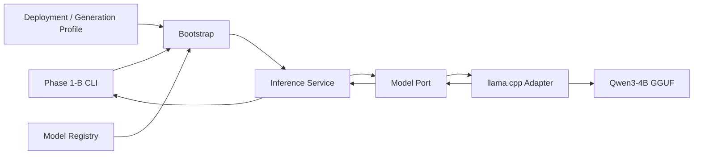

# Phase 1-B Model Runtime Contract詳細設計

- 文書ID: `phase_1b_model_runtime_contract`
- 状態: `current_design_ready_for_review`
- 作成日時: `2026-07-18 22:32:03 JST`
- 更新日時: `2026-07-18 22:32:03 JST`
- 作成担当: 設計者役担当Task
- 対象: Phase 1-B、Inference Module、Model Port、llama.cpp Adapter、Config、CLI
- 正本言語: 日本語
- Documentation Index: [documentation_index_20260718223203.md](../documentation_index_20260718223203.md)
- 上位Architecture: [system_architecture_20260718193435.md](system_architecture_20260718193435.md)
- Directory Architecture: [project_directory_structure_20260718192110.md](project_directory_structure_20260718192110.md)
- Model Strategy: [model_strategy_20260718174637.md](model_strategy_20260718174637.md)
- Phase 1-A Review: [designer_review_phase_1_environment_reproducibility_follow_up_20260718221255.md](../handoffs/designer_review_phase_1_environment_reproducibility_follow_up_20260718221255.md)
- 関連ADR: [adr_0006_model_runtime_port_and_configuration_20260718223203.md](../adr/adr_0006_model_runtime_port_and_configuration_20260718223203.md)
- supersedes: なし（新規Phase 1-B詳細設計系列）

## 1. 結論

Phase 1-Bでは、Phase 1-Aの技術検証用Smoke実装をProduction Contractとして流用せず、Model非依存のInference Moduleと、llama.cpp固有処理を閉じ込めたAdapterを新たに構築する。

Phase 1-Bの目的は、現在のQwen3-4Bを動かすことだけではない。

将来、Model、Backend、Context Size、Generation設定、Hardware、Local／Cloud Profileを交換しても、Application Coreと上位Governanceを変更せずに済む最初の安定境界を作る。

## 2. ユーザー確認済みの初期方針

次の3点をPhase 1-Bの初期方針とする。

```text
Thinking Mode   : Default OFF、設定で切替可能
Context Size    : Default 4,096 tokens、上限として固定しない
Phase 1-B CLI   : 一問一答＋Streaming＋Stop
Multi-Turn      : Phase 2
```

性能関連の値はApplication Coreへハードコードしない。

将来はModel Registry、Deployment Profile、Generation ProfileおよびModel Adapterの交換で性能を引き上げる。

## 3. Scope

### 3.1 Phase 1-Bで実装する

- Model Port
- Model Lifecycle State
- Model Capability
- Model Definition／Runtime Info
- Chat Message Contract
- Generation Parameters
- Generation Request／Result
- Streaming Chunk／Stream Handle
- Stop／Cooperative Cancel
- Finish Reason
- Token Usage／Timing
- Inference Error Contract
- Model Registry Loader
- Deployment／Generation Config Loader
- llama.cpp Production Adapter
- Bootstrap／Dependency Injection
- 一問一答CLI
- Unit／Contract／Integration Test

### 3.2 Phase 1-Bで実装しない

- Multi-Turn Conversation
- Conversation History／Storage
- FastAPI／Web UI
- Runtime Governance本実装
- Audit Log本実装
- Guard Model
- LLM-as-a-Judge
- RAG
- Agent
- Tool Calling実行
- 複数Modelの同時常駐
- Model Router／Governance Router
- Remote Backend／vLLM／MLX／Transformers Adapter

将来機能のためのCapabilityとAdapter追加点は定義するが、空のModule群を大量作成しない。

## 4. Runtime Architecture



依存方向：

```text
Entrypoint
   ↓
Bootstrap
   ↓
Inference Public API／Application
   ↓
Contracts／Domain／Ports
   ↑
llama.cpp Adapter
```

Coreは`llama_cpp`をImportしない。

具体Adapterを選択できるのは`bootstrap/`だけとする。

## 5. Phase 1-Bの配置設計

実装時の候補配置を次とする。

```text
src/margpa_runtime_llm/
├─ modules/
│  └─ inference/
│     ├─ domain/
│     │  ├─ capabilities.py
│     │  ├─ errors.py
│     │  ├─ lifecycle.py
│     │  └─ model_definition.py
│     ├─ contracts/
│     │  ├─ messages.py
│     │  ├─ generation.py
│     │  └─ runtime.py
│     ├─ ports/
│     │  └─ model_port.py
│     ├─ application/
│     │  └─ inference_service.py
│     └─ public.py
│
├─ adapters/
│  └─ model_backends/
│     └─ llama_cpp/
│        ├─ adapter.py
│        ├─ chat_template.py
│        ├─ error_mapping.py
│        └─ stream.py
│
├─ bootstrap/
│  ├─ config_loader.py
│  ├─ model_registry_loader.py
│  └─ phase1_application.py
│
└─ entrypoints/
   └─ cli/
      └─ main.py

config/
├─ models/
│  └─ qwen3_4b_q4_k_m.toml
└─ profiles/
   └─ local_macos_arm64.toml

tests/
├─ unit/inference/
├─ contract/model_port/
└─ integration/llama_cpp/
```

File数は責務分離の目安であり、内容が極端に小さい場合は同一責務内で統合してよい。

## 6. Contract実装方式

### 6.1 基本方式

- Public ContractとConfigはPydantic v2を使用する
- Public Contractは原則Immutableとする
- `extra="forbid"`で未知Fieldを黙って無視しない
- Enumは文字列へ安定Serial化可能な`StrEnum`相当とする
- Portは`typing.Protocol`で定義する
- Backend固有Class、Exception、Dictを公開Contractへ漏らさない
- Collectionは公開後の変更を防ぐ
- Contractには`schema_version`または明示的なVersion管理点を持たせる

PydanticはValidation／Serialization境界として使用し、Application FlowやBusiness RuleをPydanticへ埋め込まない。

## 7. Message Contract

### 7.1 `MessageRole`

```text
system
user
assistant
tool       # 将来予約。Phase 1-BではCapability不足として拒否可能
```

### 7.2 `ChatMessage`

| Field | Type | 必須 | 説明 |
|---|---|---:|---|
| `role` | `MessageRole` | Yes | Message Role |
| `content` | `str` | Yes | Phase 1-BではTextのみ |
| `name` | `Optional[str]` | No | 将来のTool／Agent識別用 |

Phase 1-BではImage、Audio、Tool Call等の複合Contentを扱わない。

空白だけのUser MessageはValidation Errorとする。

## 8. Generation Contract

### 8.1 `ThinkingMode`

```text
disabled       # Phase 1-B Default
enabled
model_default  # 明示時だけ使用。Defaultにはしない
```

### 8.2 `GenerationParameters`

| Field | Type | 初期値 | 備考 |
|---|---|---:|---|
| `max_new_tokens` | `int` | `512` | Configで変更可能 |
| `temperature` | `float` | `0.7` | 非Thinking Profile |
| `top_p` | `float` | `0.8` | 非Thinking Profile |
| `top_k` | `int` | `20` | 非Thinking Profile |
| `min_p` | `float` | `0.0` | 非Thinking Profile |
| `presence_penalty` | `float` | `1.5` | 初期GGUF Profile |
| `frequency_penalty` | `float` | `0.0` | Configで変更可能 |
| `repeat_penalty` | `float` | `1.0` | Configで変更可能 |
| `seed` | `Optional[int]` | `None` | Testでは固定Seedを使用 |
| `stop_sequences` | `tuple[str, ...]` | Empty | 空文字は禁止 |
| `thinking_mode` | `ThinkingMode` | `disabled` | ユーザー確認済み |

Thinking有効時の初期Profile候補：

```text
temperature      : 0.6
top_p            : 0.95
top_k            : 20
min_p            : 0.0
presence_penalty : 1.5
```

非Thinking／ThinkingのSampling値はQwen公式Model Cardを基準とする。

`max_new_tokens=512`はM2 Pro／16GB上で骨格を作るための運用値であり、Model能力の上限ではない。

### 8.3 `GenerationRequest`

| Field | Type | 必須 | 説明 |
|---|---|---:|---|
| `request_id` | `str` | Yes | 呼出側が生成する一意ID |
| `model_key` | `str` | Yes | Registry上のInternal Model Key |
| `messages` | `tuple[ChatMessage, ...]` | Yes | 1件以上 |
| `parameters` | `GenerationParameters` | Yes | 実行時Generation設定 |

Portへ渡した`model_key`と、AdapterへLoad済みのModel Keyが一致しない場合は明示Errorとする。

### 8.4 `FinishReason`

```text
stop
length
cancelled
tool_call
content_filter
unknown
```

Phase 1-Bのllama.cpp Adapterで正常に期待するのは主に`stop`、`length`、`cancelled`である。

Backendが返した未知の終了理由を推測で既知値へ変換しない。`unknown`へMappingし、別FieldにBackend由来のRaw Finish Reasonを保持する。

### 8.5 `TokenUsage`

```text
prompt_tokens
completion_tokens
total_tokens
```

Backendが値を返さない場合は`0`で偽装せず、`None`またはCapability不足として表現する。

### 8.6 `GenerationTiming`

```text
first_content_latency_seconds
total_generation_seconds
tokens_per_second
```

Wall Clock Timestampは将来Audit層が付与する。Latency計測では内部的にMonotonic Clockを使用し、Process間で意味を持たないMonotonic開始値は公開Resultへ保存しない。

### 8.7 `GenerationResult`

| Field | Type | 説明 |
|---|---|---|
| `request_id` | `str` | Requestとの対応 |
| `model_key` | `str` | 実際に使用したModel |
| `content` | `str` | 生成Content |
| `finish_reason` | `FinishReason` | 共通終了理由 |
| `backend_finish_reason` | `Optional[str]` | Backend由来値 |
| `usage` | `Optional[TokenUsage]` | Token使用量 |
| `timing` | `GenerationTiming` | 実測Timing |
| `runtime_info` | `ModelRuntimeReference` | Model／Backend／Load Instance参照 |
| `warnings` | `tuple[InferenceWarning, ...]` | Degrade等の明示情報 |

Native Response ObjectやBackend固有DictをResultへ含めない。

### 8.8 `ModelRuntimeReference`

Generation ResultへFull Runtime Objectを複製せず、次の安定参照だけを含める。

```text
load_instance_id
model_key
backend_key
backend_version
definition_file_sha512
```

`load_instance_id`は、同じModelをReloadした場合も異なる値とし、どのLoad Instanceが回答したかを識別できるようにする。

### 8.9 `InferenceWarning`

Errorにはしないが、呼出側が認識すべき動作差を構造化する。

```text
code
safe_message
capability
details
```

Phase 1-Bで想定する例：

- Thinking制御がHard SwitchではなくSoft Switchになった
- RegistryのOptional CapabilityとRuntime Capabilityが一致しない
- 将来ProfileでOptional扱いにしたCapabilityをBackendから取得できない

Warningを標準出力の自然文だけで消費せず、Contractへ残す。

## 9. Streaming／Stop Contract

### 9.1 `GenerationChunk`

| Field | Type | 説明 |
|---|---|---|
| `request_id` | `str` | Requestとの対応 |
| `sequence` | `int` | 0開始の単調増加番号 |
| `text_delta` | `str` | 新規Text差分 |
| `is_final` | `bool` | 終端Chunkか |
| `finish_reason` | `Optional[FinishReason]` | 終端時のみ設定 |
| `usage` | `Optional[TokenUsage]` | Backendが終端で返す場合 |

### 9.2 `GenerationStream`

`ModelPort.stream()`は裸のBackend Generatorではなく、Model非依存のStream Handleを返す。

最低限の操作：

```text
generation_id
iterate chunks
cancel()
close()
terminal_state
```

契約：

- `cancel()`はIdempotent
- `close()`はIdempotent
- Cancel時はBackend Generatorを閉じる
- CancelをModel Unloadとして扱わない
- Cancel後も同一Model Instanceで次のGenerationを実行可能
- 正常完走時はFinal Chunkを返す
- Consumerが強制Closeした場合、Final Chunkを返せない可能性をTerminal Stateで表現する
- Resource解放はConsumerの責任だけにせず、Context Managerまたは`finally`で保証する

Phase 1-B CLIでは`Ctrl+C`を現在のGenerationのCancelとして扱う。

Process全体の強制終了やNative Thread KillをStopの通常手段にしない。

### 9.3 `GenerationTerminalState`

```text
active
completed
cancelled
closed_by_consumer
failed
```

`close()`と`cancel()`を区別し、Consumerが途中Closeした事実を`cancelled`へ自動変換しない。

Generation失敗時は共通Errorを送出し、Stream Handle側にも`failed`を残す。

## 10. Model Lifecycle

### 10.1 `ModelLifecycleState`

```text
unloaded
loading
loaded
generating
unloading
failed
```

### 10.2 Lifecycle規則

- Port Instanceは同時に1 Modelだけを所有する
- `load()`前のGenerationは禁止
- 同じModelの再Loadは既存Runtime Infoを返すIdempotent動作を許容する
- 別ModelがLoad済みの場合、暗黙Unload／Reloadを行わない
- Model交換は明示的な`unload()`後に行う
- `unload()`はIdempotent
- Phase 1-Bでは同時Generation数を1に制限する
- Generation中の別RequestはQueueせず`model_busy`を返す
- 将来Backendは`max_concurrent_generations` Capabilityで並列数を申告できる

大型Modelを複数常駐させない現在のHardware方針と一致する。

## 11. Model Port

概念Interface：

```python
class ModelPort(Protocol):
    @property
    def state(self) -> ModelLifecycleState: ...

    def load(
        self,
        definition: ModelDefinition,
        config: ModelLoadConfig,
    ) -> ModelRuntimeInfo: ...

    def unload(self) -> None: ...

    def capabilities(self) -> ModelCapabilities: ...

    def generate(self, request: GenerationRequest) -> GenerationResult: ...

    def stream(self, request: GenerationRequest) -> GenerationStream: ...
```

実装時にMethod名やProperty配置は型検証を踏まえて調整可能だが、責務とLifecycle規則は維持する。

PortはModel選択Routing、Conversation保存、Governance、Guardrail、Retry Policyを担当しない。

## 12. Capability Contract

### 12.1 Phase 1-B Required Capability

```text
chat
streaming
cooperative_cancel
stop_sequences
seed
token_usage
model_metadata
chat_template
thinking_control
gpu_offload
```

### 12.2 Optional／Future Capability

```text
grammar
json_schema
logit_bias
token_probabilities
tool_calling
vision
embedding
remote_cancellation
parallel_generation
```

### 12.3 Capability Source

Capabilityを二種類に分ける。

```text
Expected Capability
  └─ Model Registryに記録する期待値

Effective Runtime Capability
  └─ Model＋Backend＋Version＋Load ConfigからAdapterが実行時に申告する値
```

Applicationが判断に使用するのはEffective Runtime Capabilityである。

Registry上の期待値と実際のCapabilityが違う場合はWarningまたはLoad失敗として明示する。

Phase 1-BではRequired Capability不足時にFailする。Adapterが独断でFallback、Degradeまたは無視してはならない。

将来のFallback／Degrade判断はApplication／Governance側で行い、Auditへ記録する。

`ModelCapabilities`はFeature名の集合だけでなく、少なくとも次のLimitを持つ。

```text
features
native_context_limit
loaded_context_size
max_concurrent_generations
supported_message_roles
```

Boolean FeatureだけでContext長やConcurrencyを表現しない。

### 12.4 `ModelRuntimeInfo`

`load()`成功時に、実際に成立したRuntime情報を返す。

```text
load_instance_id
model_key
backend_key／backend_version
model_architecture
format／quantization
artifact_size／artifact_digest
loaded_context_size
effective_capabilities
chat_template_source／chat_template_digest
device／gpu_offload
```

Registryの静的定義をそのまま返さず、Adapterが実際に確認した値をRuntime Infoとする。

`artifact_digest`はPhase 1-BではSHA-512とし、Algorithm名とDigest値を組にして扱う。

## 13. Error Contract

共通Base Errorは次を持つ。

```text
code
safe_message
retryable
request_id
model_key
details
```

Native Exceptionの文字列、Memory Address、User Absolute Path等を、そのままUIへ露出しない。

Phase 1-BのError Code候補：

| Code | 意味 | Retry候補 |
|---|---|---:|
| `invalid_request` | Request Validation失敗 | No |
| `invalid_configuration` | Config不正 | No |
| `invalid_model_definition` | Registry不正 | No |
| `model_not_found` | Artifact不在 | No |
| `model_integrity_mismatch` | Size／Hash不一致 | No |
| `backend_unavailable` | Backend Import／初期化失敗 | 条件次第 |
| `model_load_failed` | Model Load失敗 | 条件次第 |
| `model_not_loaded` | Load前Generation | No |
| `model_already_loaded` | 別ModelがLoad済み | No |
| `model_busy` | 同時Generation制限 | Yes |
| `unsupported_capability` | 必須機能不足 | No |
| `context_limit_exceeded` | Prompt＋出力予約がContext超過 | 条件次第 |
| `generation_failed` | Generation失敗 | 条件次第 |
| `backend_protocol_error` | Backend Response不正 | 条件次第 |
| `model_unload_failed` | Resource解放失敗 | 条件次第 |

User Cancelは通常の終了理由`cancelled`として扱い、原則Errorにしない。

## 14. Context Overflow Policy

Phase 1-Bでは、PromptをAdapterのTokenizer／Chat Templateで事前Tokenizeし、次を検証する。

```text
formatted_prompt_tokens + max_new_tokens <= loaded_context_size
```

超過時：

- Messageを無断削除しない
- 無断要約しない
- `max_new_tokens`を黙って縮小しない
- `context_limit_exceeded`を返す
- Required Token、Available Tokenを安全な詳細情報として返す

Context Selection、要約、履歴圧縮はPhase 2以降の明示Policyとする。

## 15. Model Registry

### 15.1 形式

初期RegistryはTOMLとする。

理由：

- Python標準Library`tomllib`で読める
- 新規YAML Dependencyが不要
- Git差分を確認しやすい
- Human-readable
- Model ArtifactをGitへ含めずMetadataだけ管理できる

### 15.2 Model Definition候補

```toml
schema_version = "1"
model_key = "main.qwen3-4b-q4-k-m"
logical_role = "main"
enabled = true

[source]
provider = "Qwen"
distribution_repository = "Qwen/Qwen3-4B-GGUF"
upstream_model = "Qwen/Qwen3-4B"
# revisionは確認できた場合だけ記録する。推測値を入れない。

[artifact]
relative_path = "main/qwen3-4b/gguf/Qwen3-4B-Q4_K_M.gguf"
file_name = "Qwen3-4B-Q4_K_M.gguf"
format = "gguf"
quantization = "Q4_K_M"
size_bytes = 2497280256
sha512 = "<implementation時に実Artifactから記録>"

[backend]
backend_key = "llama_cpp"
required_version = "0.3.34"

[model]
architecture = "qwen3"
native_context_limit = 32768
chat_template_source = "gguf_metadata"

[verification]
state = "pending_phase_1b_registry_verification"
```

Revision／Commitが不明な場合に推測で埋めない。

その場合もLocal ArtifactのSHA-512、File Size、Distribution Repositoryを記録し、Provenanceが不完全であることをVerification Stateへ残す。

Registry LoaderはModel Definition File自体のRaw Byte列にもSHA-512を適用し、`definition_file_sha512`としてRuntime Referenceへ引き渡す。

### 15.3 Integrity

- Enabled ModelにはSHA-512記録を推奨し、Phase 1-B Main Modelでは実際に記録する
- Load前にFile存在とSizeを検証する
- Hash検証PolicyはConfig化する
- Hash不一致時はLoadしない
- File名からModel ID、Quantization、Backendを推測しない
- User固有絶対PathをRegistryへ保存しない

Model本体はGit管理対象外とする。

## 16. Configuration

### 16.1 分離

```text
Model Registry
  └─ Model Artifact、出自、静的Metadata、Backend Binding

Deployment Profile
  └─ Model Root、Device、Backend Load設定

Generation Profile
  └─ Context、Sampling、出力長、Thinking Mode

CLI Override
  └─ その一回だけの実行値
```

### 16.2 優先順位

低い方から高い方へ：

```text
Built-in Safe Default
    ↓
Model Default
    ↓
Deployment／Generation Profile
    ↓
Environment Variable
    ↓
CLI Explicit Override
```

最終的なEffective Configを構造化して表示・将来Audit可能にする。

### 16.3 Local Profile候補

```toml
schema_version = "1"
profile_key = "local.macos-arm64"
selected_model = "main.qwen3-4b-q4-k-m"

[model_root]
default = "./models"
environment_variable = "MARGPA_MODEL_ROOT"

[load]
context_size = 4096
batch_size = 256
micro_batch_size = 256
threads = 6
threads_batch = 6
gpu_layers = -1
use_mmap = true
use_mlock = false
verbose_backend = false

[generation]
max_new_tokens = 512
temperature = 0.7
top_p = 0.8
top_k = 20
min_p = 0.0
presence_penalty = 1.5
frequency_penalty = 0.0
repeat_penalty = 1.0
thinking_mode = "disabled"
```

### 16.4 `ModelLoadConfig`

Backendへ渡すLoad時設定をGeneration設定から分離する。

```text
context_size
batch_size
micro_batch_size
threads
threads_batch
gpu_layers
use_mmap
use_mlock
verbose_backend
```

Qwen、GGUF、Metal等の固有名をField名へ含めない。

Backendが対応しないLoad設定は黙って無視せず、Validation ErrorまたはCapability Warningとする。

Tracked Configに次を含めない。

- `/Users/...`等のUser固有絶対Path
- Secret
- API Key
- Model本体
- Runtime生成値

## 17. Chat Template／Thinking Control

### 17.1 Chat Template

- GGUF Metadataに埋め込まれたChat Templateを初期正本とする
- Chat Templateが存在しない場合は黙って独自形式へFallbackしない
- 使用TemplateのSourceとHashをRuntime Infoへ記録可能にする
- Message文字列をApplication CoreでQwen形式へ連結しない
- Qwen固有処理はllama.cpp Adapter内へ閉じ込める

### 17.2 Thinking Default OFF

Qwen3はThinking／Non-Thinkingを切り替えられる。Phase 1-Bでは非ThinkingをDefaultとする。

優先する実装：

1. Chat Templateの`enable_thinking=false`相当を使用するHard Switch
2. Backend制約によりHard Switchできない場合だけ、公式の`/no_think` Soft SwitchをAdapter内で使用する
3. Soft Switch使用はEffective Capability／Warningへ記録する

現在固定している`llama-cpp-python 0.3.34`の`create_chat_completion()`は、直接の`chat_template_kwargs`引数を公開していない。

そのため、Hard Switchを行う場合は、Adapter内のChat Handler／Formatter境界へ閉じ込め、Contract TestでVersion固定挙動を検証する。

Private API依存が必要になった場合はAdapter内だけに限定し、Backend Version更新時のRegression Test対象とする。

Model Portは空のThinking Tag等を黙って削除しない。Raw Model Outputと表示用Outputの分離はPhase 2／Audit設計と合わせて確定する。

## 18. llama.cpp Adapter責務

Adapterだけが次を知る。

- `llama_cpp.Llama`
- GGUF Metadata Key
- `n_gpu_layers=-1`
- Chat Completion Request／Response形式
- Native Streaming Generator
- Native Finish Reason
- Native Token Usage
- Native Exception
- Chat Handler／Formatter
- Explicit `close()`／GC補助

Mapping：

```text
ModelDefinition + ModelLoadConfig
    ↓
llama_cpp.Llama初期化
    ↓
ModelRuntimeInfo + Effective Capability

GenerationRequest
    ↓
llama.cpp Request
    ↓
GenerationResult／GenerationChunk
```

AdapterはConversation History、Governance、Guardrail、Retry、UI表示を担当しない。

## 19. Bootstrap／Application Service

### 19.1 Bootstrap

- Profile選択
- Config読込
- Registry読込
- Model Root解決
- Model Definition Validation
- Concrete Adapter生成
- Dependency Injection
- Startup Load／Shutdown Unload

### 19.2 Inference Service

- Request Validation
- Model Key一致確認
- Required Capability確認
- Context Limit事前確認の調整
- Port呼出
- ErrorのApplication向け変換

Inference ServiceはBackend固有Exceptionを捕捉しない。Adapterが共通ErrorへMappingする。

## 20. Phase 1-B CLI

標準Library`argparse`を優先し、CLI Framework Dependencyは追加しない。

概念Command：

```text
margpa-llm generate --prompt "こんにちは"
margpa-llm generate --prompt "短く説明して" --no-stream
margpa-llm generate --prompt "考えて回答して" --thinking
margpa-llm model-info
```

最小機能：

- Profile選択
- Model Key選択
- Prompt引数または標準入力
- Streaming Default ON
- `Ctrl+C` Cancel
- Thinking On／Off Override
- Generation主要値Override
- Model／Backend／Capability表示
- Safe Error表示
- Process Exit Code

Exit Code候補：

```text
0   success
2   argument／configuration error
3   model／backend load error
4   generation error
130 user cancel
```

CLIは複数ターン履歴を保持しない。

## 21. Test Strategy

### 21.1 Unit Test

- Contract Validation
- Unknown Field拒否
- Generation Parameter範囲
- Finish Reason Mapping
- Capability不足
- Lifecycle State Transition
- Model Key不一致
- Context Overflow
- Config優先順位
- Registry Validation
- Error Safe Message

### 21.2 Contract Test

Fake Model Adapterを使用し、同一Model Port Contractを検証する。

- Load／Unload Idempotency
- Load前Generation拒否
- Streaming Chunk Sequence
- Final Chunk
- Cancel Idempotency
- Cancel後の再Generation
- Model Busy
- Unknown Backend Finish Reason
- Backend固有Object非露出

将来MLX／vLLM Adapterも同じContract Suiteを通す。

### 21.3 Integration Test

- llama.cpp Adapter Import／Load
- Qwen3 Metadata
- Embedded Chat Template
- Thinking Default OFF
- GPU Offload／MTL
- Generation
- Streaming／Cancel／Post-cancel Generation
- Stop Sequence
- Token Usage／Timing
- Explicit Unload

実Model Testは`model_smoke`等のOpt-in Markerでのみ実行し、暗黙Downloadしない。

### 21.4 CLI Acceptance

- Local Profileから起動できる
- Qwen3-4BをLoadできる
- 日本語PromptへStreaming回答できる
- `Ctrl+C`で安全に停止できる
- Stop後もProcess内で再GenerationできるContractが成立する
- Generation Config Overrideが反映される
- Missing Model時に安全で明確なErrorを返す
- Source上でCoreから`llama_cpp`をImportしていない

## 22. Phase 1-B Acceptance Criteria

次をすべて満たしたときPhase 1-Bを完了とする。

```text
Model-independent Contract        : Pass
Model Port Protocol               : Pass
llama.cpp Adapter isolation       : Pass
Registry／Config Validation       : Pass
Qwen3-4B Load／Unload             : Pass
Default Context 4,096             : Pass
Thinking Default OFF             : Pass
One-shot Generation              : Pass
Streaming                        : Pass
Cooperative Cancel               : Pass
Post-cancel Generation           : Pass
Finish Reason Mapping            : Pass
Token Usage／Timing              : Pass
Capability Validation            : Pass
Safe Error Contract              : Pass
Unit／Contract／Integration Test  : Pass
Ruff／mypy --strict              : Pass
Modelの暗黙Downloadなし          : Pass
Phase 2以降への越境なし          : Pass
```

## 23. Performance／拡張方針

初期性能を固定Architectureへ変えない。

将来の性能向上経路：

```text
Model交換
Quantization交換
Context Size変更
Generation Profile変更
Backend交換
Hardware交換
Local → Cloud Profile切替
Single Model → Router追加
```

Application Coreはこれらの変更を知らず、Model Port Contractだけに依存する。

## 24. Known Non-blocking Items

- 通常Setup時に`llama-cpp-python`を毎回Native再Buildする
- Qwen3 Soft Switchでは空Thinking Tagが残る場合がある
- Distribution Revision／Commitは、現在のLocal Artifactから推測しない
- Raw Model OutputとDisplay Outputの分離はPhase 2／Audit設計で確定する
- Guard／Judge／Tool Calling CapabilityはPhase 1-Bで実行しない

## 25. Implementation Authorization Boundary

この文書はPhase 1-Bの設計案を定義する。

Source実装、Config作成、Model Hash計算、CLI追加、Dependency変更を自動的に解禁するものではない。

設計者役はユーザー確認後、実装担当向けHandoffを新Timestampで作成する。

実装担当は、そのHandoffとユーザーが明示的に許可した範囲だけを実装する。

## 26. 参照

- [Qwen3-4B-GGUF公式Model Card](https://huggingface.co/Qwen/Qwen3-4B-GGUF)
- [Qwen公式Quickstart](https://qwen.readthedocs.io/en/stable/getting_started/quickstart.html)
