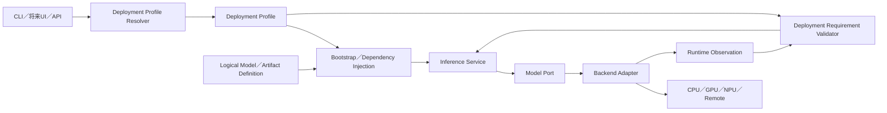
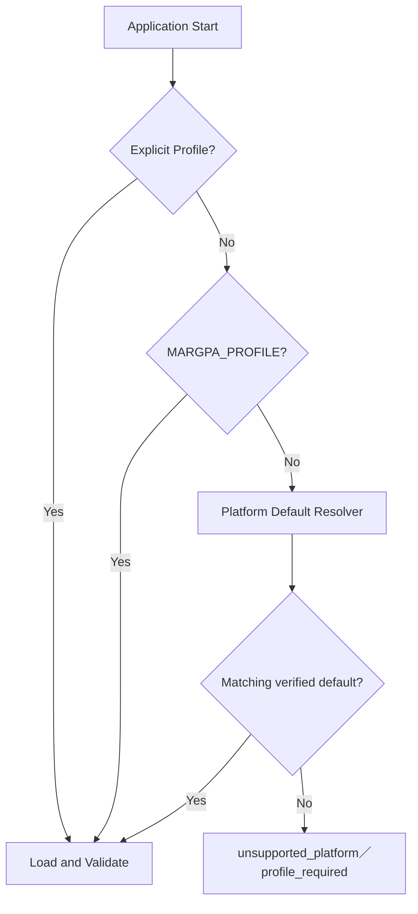

# Phase 1-C Deployment／Platform／Acceleration Abstraction Architecture

- 文書ID: `phase_1c_deployment_platform_acceleration_architecture`
- 状態: `current_approved_design`
- 作成日時: `2026-07-19 01:31:09 JST`
- 更新日時: `2026-07-19 01:31:09 JST`
- Snapshot: `20260719013109`
- 作成担当: 設計者役担当Task
- 対象: Phase 1-C、Application Bootstrap、Deployment Profile、Runtime Observation
- 正本言語: 日本語
- 要件: [phase_1c_deployment_platform_acceleration_requirements_20260719013109.md](../requirements/phase_1c_deployment_platform_acceleration_requirements_20260719013109.md)
- ADR: [adr_0007_deployment_platform_acceleration_abstraction_20260719013109.md](../adr/adr_0007_deployment_platform_acceleration_abstraction_20260719013109.md)
- Phase 1-B設計: [phase_1b_model_runtime_contract_20260718223203.md](phase_1b_model_runtime_contract_20260718223203.md)
- supersedes: なし（新規Phase 1-C Architecture系列）

## 1. Architecture Goal

Application Coreが、macOS、Windows、Linux、CPU、GPU、NPU、Local、Home ServerまたはCloudの具体名を判断しない構造を作る。



## 2. 分離する責務

### Model Definition

ModelおよびArtifactに固有の事実を持つ。

- Logical Model Key
- Provider／Repository
- Artifact Path／Format／Quantization
- Artifact Size／Digest
- Model Architecture
- Native Context Limit
- Chat Template
- Modelが期待する機能

特定MachineでGPUを必須とするかは持たない。

### Deployment Profile

どこで、どのRuntimeを、どの条件で使用するかを持つ。

- Host Platform
- Compute Target
- Backend Adapter
- Backend Build Variant
- Load Configuration
- Required Runtime Capability
- Model Root
- Verification State

### Backend Adapter

Backend固有処理を持つ。

- Native Model Load
- Device Enumeration
- GPU Offload
- Chat Template
- Generation
- Streaming
- Cancel
- Backend Error Mapping
- Runtime Observation

### Requirement Validator

ProfileのRequired StateとAdapterのDetected Stateを比較する。

Application CoreがVendor別条件分岐を持たない。

## 3. Identifier Strategy

次の識別子は、正規化したLowercase String Keyを基本とする。

```text
operating_system_key
architecture_key
execution_environment_key
compute_kind_key
vendor_key
acceleration_api_key
backend_key
build_variant_key
artifact_variant_key
topology_key
```

例：

```text
macos
windows
linux
arm64
x86_64
apple
nvidia
amd
metal
cuda
rocm
vulkan
llama_cpp
gguf_q4_k_m
```

既知の基本値にはConstantまたはValue Objectを使用してよい。

ただし、全Vendorと全AcceleratorをSource Code上の閉じたEnumへ固定しない。未知のKeyはRegistry／Definition追加で表現可能にする。

形式Validation、必須Fieldおよび参照整合は厳格に行う。

## 4. Candidate Contract

Phase 1-Cの最小候補Contractを示す。Class名は実装時に同一責務内で調整可能だが、意味境界は維持する。

### `HostPlatformDefinition`

```text
operating_system_key
architecture_key
execution_environment_key
os_version_constraint        optional
distribution_key             optional
```

### `ComputeTargetDefinition`

```text
compute_kind_key             cpu／gpu／npu／remote等
vendor_key                   optional
acceleration_api_key
memory_topology_key          optional
device_selector              autoまたは明示ID
offload_policy_key
```

### `BackendRuntimeDefinition`

```text
backend_key
required_version
build_variant_key
execution_mode_key           in_process／local_service／remote_api
```

### `DeploymentRequirements`

```text
required_capabilities
required_device_kind         optional
required_acceleration_api    optional
fallback_policy              deny／warn／explicit_fallback
```

Phase 1-CのDefaultは`deny`とする。

### `RuntimeObservation`

```text
actual_os
actual_architecture
backend_key
backend_version
build_variant_key            observedまたはdeclared
device_kind
device_name                  optional
device_id                    optional
acceleration_api
gpu_offload
detected_capabilities
observation_warnings
```

観測値と設定値を同じFieldで上書きしない。

## 5. Profile Concept

### 現在のMac Profile概念形

```toml
schema_version = "2"
profile_key = "local.macos-arm64.metal"
selected_model = "main.qwen3-4b-q4-k-m"
verification_state = "native_verified"

[host]
operating_system_key = "macos"
architecture_key = "arm64"
execution_environment_key = "native"

[compute]
compute_kind_key = "gpu"
vendor_key = "apple"
acceleration_api_key = "metal"
memory_topology_key = "unified"
device_selector = "auto"
offload_policy_key = "full_or_backend_auto"

[backend_runtime]
backend_key = "llama_cpp"
required_version = "0.3.34"
build_variant_key = "metal"
execution_mode_key = "in_process"

[runtime_requirements]
required_capabilities = ["gpu_offload"]
fallback_policy = "deny"

[model_root]
default = "./models"
environment_variable = "MARGPA_MODEL_ROOT"
```

既存`profile_key`との互換性を維持する必要がある場合、Key変更は必須としない。Schema意味の追加を優先する。

### 将来Windows CPU Profile概念形

```toml
profile_key = "local.windows-x86_64.cpu"
verification_state = "defined"

[host]
operating_system_key = "windows"
architecture_key = "x86_64"
execution_environment_key = "native"

[compute]
compute_kind_key = "cpu"
acceleration_api_key = "cpu_native"
device_selector = "auto"
offload_policy_key = "disabled"

[backend_runtime]
backend_key = "llama_cpp"
build_variant_key = "cpu"
execution_mode_key = "in_process"

[runtime_requirements]
required_capabilities = []
fallback_policy = "deny"

[load]
gpu_layers = 0
```

このProfileはPhase 1-Cでは作成・検証しない。

### 将来Home Server CUDA Profile概念形

```toml
profile_key = "home-server.linux-x86_64.cuda"
verification_state = "defined"

[host]
operating_system_key = "linux"
architecture_key = "x86_64"
execution_environment_key = "native"

[compute]
compute_kind_key = "gpu"
vendor_key = "nvidia"
acceleration_api_key = "cuda"
memory_topology_key = "discrete"
device_selector = "auto"
offload_policy_key = "full_or_profile_limit"

[backend_runtime]
backend_key = "llama_cpp"
build_variant_key = "cuda"
execution_mode_key = "local_service"

[runtime_requirements]
required_capabilities = ["gpu_offload"]
fallback_policy = "deny"
```

Hardware決定後に実Profileを作成する。

## 6. Capability Resolution

Phase 1-Bの問題点：

```text
PHASE1B_REQUIRED_CAPABILITIES
  └─ gpu_offloadを含む

Model Definition
  └─ gpu_offloadを必須指定
```

これはCurrent Mac Deploymentの条件をModel固有事実へ混入させている。

Phase 1-Cでは次へ変更する。

```text
Model Required Capability
  chat
  streaming
  cooperative_cancel
  stop_sequences
  seed
  token_usage
  model_metadata
  chat_template
  thinking_control

Model Optional Capability
  gpu_offload

macOS Metal Deployment Required Capability
  gpu_offload
```

Validation Flow：

```text
1. Model Definition Validation
2. Backend Load
3. Runtime Capability Detection
4. Model Required Capability Validation
5. Deployment Required Capability Validation
6. Runtime Ready
```

途中でFailした場合はResourceを解放し、Lifecycle StateとError Contractを維持する。

## 7. Platform Normalization

OS Libraryの生値をCoreへ拡散させない。

候補正規化：

```text
platform.system() == Darwin  → macos
platform.system() == Windows → windows
platform.system() == Linux   → linux

AMD64／x86_64 → x86_64
arm64／aarch64 → arm64
```

未知値をmacOS、WindowsまたはLinuxへ推測変換しない。

Platform DetectionはBootstrapまたはShared Infrastructure境界へ閉じ込め、Inference Domainが`platform` Moduleへ直接依存しない。

## 8. Profile Resolution



Platform Default ResolverをBackend Adapterへ入れない。

将来複数の同一Platform Profileが存在する場合、Hardware性能だけで勝手に選択しない。Default指定または明示Profileを使用する。

## 9. Backend／Device Inventory

本Architectureが将来表現すべき主要候補：

| Device／Vendor | Acceleration候補 | 主なBackend候補 |
|---|---|---|
| CPU／Intel・AMD | Native、BLAS、oneDNN、ZenDNN | llama.cpp、Transformers、vLLM CPU、ONNX Runtime |
| CPU／ARM | NEON、KleidiAI | llama.cpp、Transformers、vLLM CPU |
| Apple GPU | Metal、MPS | llama.cpp、MLX、PyTorch MPS |
| NVIDIA GPU | CUDA、TensorRT、Vulkan | llama.cpp、Transformers、vLLM、TensorRT-LLM、ONNX Runtime |
| AMD GPU | HIP／ROCm、Vulkan、MIGraphX | llama.cpp、Transformers、vLLM、ONNX Runtime |
| Intel GPU | SYCL／XPU、Vulkan、OpenVINO | llama.cpp、Transformers、vLLM、OpenVINO |
| Windows共通GPU | DirectML／WinML | ONNX Runtime等の将来Adapter |
| Apple Neural Engine | Core ML | Core ML将来Adapter |
| Intel NPU | OpenVINO | OpenVINO将来Adapter |
| Qualcomm | Hexagon、Adreno、Vulkan、OpenCL | llama.cpp／ONNX系の将来Adapter |
| Huawei Ascend | CANN | llama.cpp／vLLM Plugin等 |
| Moore Threads | MUSA | llama.cpp等 |
| Intel Gaudi | HPU Runtime | vLLM Plugin等 |
| Google TPU | TPU Runtime | vLLM TPU、JAX／PyTorch XLA |
| AWS Inferentia／Trainium | Neuron | vLLM／Neuron Runtime |
| Browser | WASM、WebGPU | WebLLM／llama.cpp WebGPU等 |
| Remote | HTTP／OpenAI-compatible | Remote Model Adapter |

Inventoryは現在の実装済み一覧ではない。

## 10. Memory／Distribution Topology

Profileが将来表現可能であるべき構成：

- CPU RAMのみ
- Unified Memory
- Discrete VRAM
- CPU＋GPU Partial Offload
- Single GPU
- Homogeneous Multi-GPU
- Heterogeneous Multi-GPU
- Layer Split
- Tensor Split
- Row Split
- NUMA
- Remote Device
- Multi-Node RPC
- Main／Guard／JudgeのDevice分離

Phase 1-Cでは実行制御を実装しない。識別子と将来Hookを妨げない。

## 11. Logical ModelとArtifact Variant

将来構造：

```text
Logical Model: qwen3-4b
  ├─ Artifact: gguf-q4-k-m
  │    └─ llama_cpp
  ├─ Artifact: safetensors-bf16
  │    ├─ transformers
  │    └─ vllm
  ├─ Artifact: mlx-4bit
  │    └─ mlx
  └─ Artifact: onnx-int8
       └─ onnx_runtime
```

Phase 1-CではModel Registryを全面再設計しない。

現在のModel Definitionが将来Artifact Variant Registryへ発展できるよう、Deployment固有条件を追加しないことを必須とする。

## 12. Candidate File Impact

実装担当が変更を検討する候補：

```text
src/margpa_runtime_llm/
├─ bootstrap/
│  ├─ config_loader.py
│  ├─ phase1_application.py
│  └─ profile_resolver.py                 # 候補
├─ modules/inference/
│  ├─ contracts/runtime.py
│  └─ domain/capabilities.py
└─ shared/
   └─ platform/                           # 必要な場合のみ

config/profiles/
└─ local_macos_arm64.toml                 # Schema Migration候補

config/models/
└─ qwen3_4b_q4_k_m.toml                   # gpu_offload分類変更

tests/
├─ unit/
├─ contract/
└─ integration/
```

極端に小さい責務のFileを量産しない。

## 13. Test Architecture

### Unit

- Platform生値の正規化
- 未知Platform拒否
- Profile Validation
- Profile Resolution優先順位
- Deployment Requirement比較
- CPU Profile概念上はGPUを要求しない
- Mac Metal ProfileはGPU Offloadを要求する

### Contract

- Required／Detected分離
- 不足Capabilityの明示Error
- 未知Keyを形式上正しく保持可能
- Backend固有型をPublic Contractへ漏らさない

### Regression

- Current Mac Profile Parse
- Model Registry Parse
- CLI Default
- `model-info`
- Generation／Streaming／Cancel
- Metal Model Smoke

### Native Verification

Phase 1-CではMacだけを実行対象とする。

Windows／Linux／CUDA等は実機または対応CIが用意された後に専用Evidenceを追加する。

## 14. Migration Sequence

1. 新しいDeployment Requirement Contractを追加する
2. 既存Mac Profileを新Contractへ適合させる
3. `gpu_offload`をModel必須からDeployment必須へ移す
4. BootstrapでDeployment Requirementを検証する
5. Profile Resolver境界を追加する
6. Runtime Observationを必要最小限正規化する
7. Unit／Contract Testを追加する
8. 既存Static／Default／Metal Gateを実行する
9. 実装担当StatusをAppend-Onlyで作成する

Migration中にCurrent Mac ProfileのFail Closed性を緩和しない。

## 15. Scope Control

Phase 1-Cへ次を混在させない。

- Response Language Policy
- Thinking表示／非表示
- Multi-Turn
- Web UI
- Governance本実装
- Audit本実装
- Windows Setup
- CUDA／ROCm／Vulkan Build
- Remote API実装

Response LanguageとThinking Outputは、次の独立設計を参照する。

- [response_language_and_thinking_output_policy_20260719013109.md](response_language_and_thinking_output_policy_20260719013109.md)

## 16. Known Risks

- Backend System Info文字列によるDevice判定はVersion差に弱い
- Build Variantは設定事実と実Runtime観測を分離する必要がある
- 同一Processに複数BackendをLoadする将来構成はDependency Conflictを生じ得る
- Platform Keyを閉じたEnumにすると新Hardware追加のたびにCore変更が必要になる
- 逆に自由文字列だけでは誤記を検出できないためDefinition Validationが必要になる
- Windows／Linux未検証ProfileをCurrentとして配布するとSupport範囲を誤認させる
- Logical ModelとArtifact Variantの全面分離は別Phaseで追加作業が必要になる

## 17. Architecture Decision Summary

```text
今作る
  Deployment／Platform／Accelerationの交換境界
  Model CapabilityとDeployment Requirementの分離
  Current Mac Profileの厳格なMigration

今作らない
  全Platformの実装
  未所有Hardware向けBuild
  未検証Profile
```

この境界により、Phase 2以降を現在のMacで進めた後でも、Windows、Home ServerまたはCloudの追加をApplication Coreの大規模変更なしに行える状態を目標とする。

