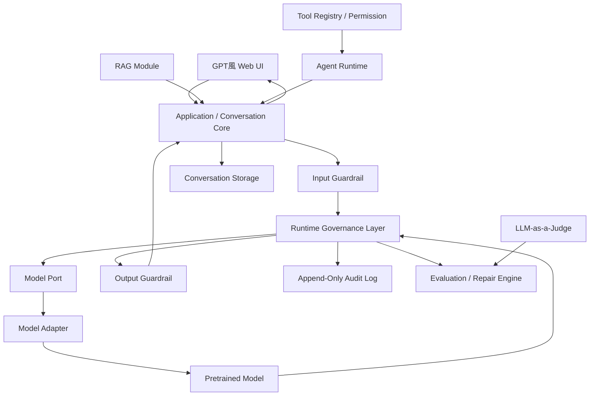

# MARGPA Runtime LLM システムアーキテクチャ

- 文書ID: `system_architecture`
- 状態: `current`
- 作成日時: `2026-07-18 17:46:37 JST`
- 更新日時: `2026-07-18 17:46:37 JST`
- 対象: システム全体
- 正本言語: 日本語
- 上位要件: [project_requirements_20260718174637.md](../requirements/project_requirements_20260718174637.md)

## 1. Architecture Goal

次を満たすModular Monolithを構築する。

- Model交換可能
- Backend交換可能
- Governance Definition交換可能
- Storage交換可能
- UI交換可能
- Local／Cloud／Hybrid対応
- Module単位でTest可能
- Framework固有処理を境界へ隔離
- 将来のRAG、Agent、Judgeを追加可能

## 2. 全体概念図



## 3. 最上位境界

### 3.1 Interface Layer

責務：

- Web UI
- HTTP API
- Streaming接続
- Request／Response変換
- UI向けError表現

禁止：

- Model固有処理
- Governance判定Logic
- Storage固有Query

### 3.2 Application Layer

責務：

- Conversation Use Case
- Generate Answer
- Stop Generation
- Regenerate
- Session管理
- History再開
- Module Orchestration
- Transaction相当のTurn管理

### 3.3 Domain／Core Layer

責務：

- Conversation Entity
- Message／Turn／Session
- Governance State
- Evaluation Result
- Permission Decision
- Model Capability
- Domain Rule

Framework、Filesystem、HTTP、Databaseへ直接依存しない。

### 3.4 Port Layer

候補Port：

- Model Port
- Governance Definition Port
- Audit Log Port
- Conversation Storage Port
- Guardrail Port
- Judge Port
- Retrieval Port
- Tool Port
- Clock Port
- ID Generator Port

### 3.5 Adapter Layer

候補Adapter：

- llama.cpp Adapter
- llama-cpp-python Adapter
- MLX Adapter
- Transformers Adapter
- vLLM Adapter
- JSON／JSONL Storage Adapter
- SQLite Adapter
- PostgreSQL Adapter
- Local File RAG Adapter
- Remote API Adapter

## 4. 依存方向

```text
Interface
    ↓
Application
    ↓
Domain / Core
    ↑
Ports
    ↑
Adapters
```

CoreがAdapterを直接Importしないようにする。

依存性注入により、起動時にDeployment Profileに応じたAdapterを接続する。

## 5. Model実行Flow

```text
User Input
    ↓
Input Guardrail
    ↓
Context Selection
    ↓
Governance Plan生成
    ↓
Prompt / Message構築
    ↓
Generation Config決定
    ↓
Model Port
    ↓
Model Adapter
    ↓
Streaming Output
    ↓
Runtime監視
    ↓
Output Guardrail
    ↓
Evaluation / Repair
    ↓
Turn確定
    ↓
Audit Event追記
```

## 6. Model Port

Model固有処理はAdapterへ閉じ込める。

- Load／Unload
- Tokenizer
- Chat Template
- Message変換
- Streaming
- Stop
- Seed
- Grammar
- JSON Schema
- Logit Bias
- Token Probability
- Context Limit
- Tool Calling
- Device選択
- Quantization固有処理
- Backend固有Error
- Token Count
- Timing

Model AdapterはCapabilityを申告する。

Capability不足時は次のいずれかを明示的に選択する。

- Fallback
- Degrade
- Warning
- Execution Refusal
- Audit Log記録

## 7. Deployment Profile

### 7.1 Local Profile

```text
Device       : Apple Silicon / Metal / MPS
Model        : Local GGUF等
Backend      : llama.cpp系が有力
Storage      : JSON / JSONL
Model Root   : Local設定
```

### 7.2 Cloud Profile

```text
Device       : CUDA GPU
Backend      : vLLM等
Storage      : PostgreSQL / Object Storage等
Model Root   : Cloud StorageまたはServer Path
```

### 7.3 Hybrid Profile

```text
UI/Application: Local
Inference     : Remote
Storage       : LocalまたはCloud
```

## 8. 基本Chat機能

- `system / user / assistant`形式
- Multi-Turn
- GPT風画面
- Streaming
- New Chat
- History
- Resume
- Stop
- Regenerate
- Temperature
- Max New Tokens
- Generation Config
- Error Handling
- Latency
- Token Count
- 使用Model表示
- Backend表示
- Governance Profile表示
- Governance State表示
- Guard State表示

Image入力は初期対象外。

## 9. Storage Boundary

初期候補：

- JSON
- JSONL
- Append-Only Event Log

SQLiteはHook扱いとする。

有力な役割分担：

```text
JSON / JSONL : Audit原本
SQLite       : Index、検索、管理
```

CloudではPostgreSQL、Object Storage等を候補とする。

## 10. UI候補

### Streamlit

- 最短で構築可能
- Python中心
- UIとBackendの分離が弱くなる可能性

### FastAPI＋Vanilla JavaScript

- 境界が明確
- 依存が比較的軽い
- 将来Frontendを交換しやすい

### FastAPI＋React／Next.js

- UI完成度を高くできる
- 実装量と依存が増える
- MVPには過剰になる可能性

UI技術は未決定。

## 11. 技術候補

確定：

- Python
- Hugging Face由来Model
- Modular Monolith
- Port／Adapter

有力・暫定：

- llama.cpp
- llama-cpp-python
- MLX
- Transformers／PyTorch
- LangChain
- LangGraph
- FastAPI
- Streamlit

将来：

- vLLM
- SQLite
- PostgreSQL
- Docker
- AWS
- Azure

## 12. Docker

初期版では使用しない。

理由：

- Metal／MPS利用が複雑になる可能性
- Docker DesktopはLinux VMを利用する
- 初期Scopeを増やしたくない
- macOS Native実行が素直
- ユーザーがDocker未経験

将来、API、DB、RAG、Cloud Deployment等で必要性を再評価する。

## 13. Source Directory構成

Project全体のDirectory構成は次の設計議題であり、まだ確定していない。

概念候補：

```text
margpa-runtime-llm/
├─ docs/
├─ models -> External Model Root
├─ src/
├─ tests/
├─ config/
├─ data/
├─ logs/
└─ scripts/
```

今後、Domain、Application、Ports、Adapters、Governance、Guardrail、Audit、API、UI、RAG、Agentの境界を確定する。

## 14. Architecture上の禁止事項

- CoreからFilesystemを直接操作しない
- Coreから特定Backendを直接Importしない
- Model名をBusiness Logicへハードコードしない
- User固有PathをSourceへハードコードしない
- Guard判定をModel出力だけで最終決定しない
- Tool PermissionをLLMへ委ねない
- Audit Eventを後から黙って上書きしない
- 16個のGDをすべてPromptへ投入しない

## 15. 関連文書

- [model_strategy_20260718174637.md](model_strategy_20260718174637.md)
- [runtime_governance_20260718174637.md](../governance/runtime_governance_20260718174637.md)
- [audit_evaluation_security_20260718174637.md](../governance/audit_evaluation_security_20260718174637.md)
- [implementation_roadmap_20260718174637.md](implementation_roadmap_20260718174637.md)
